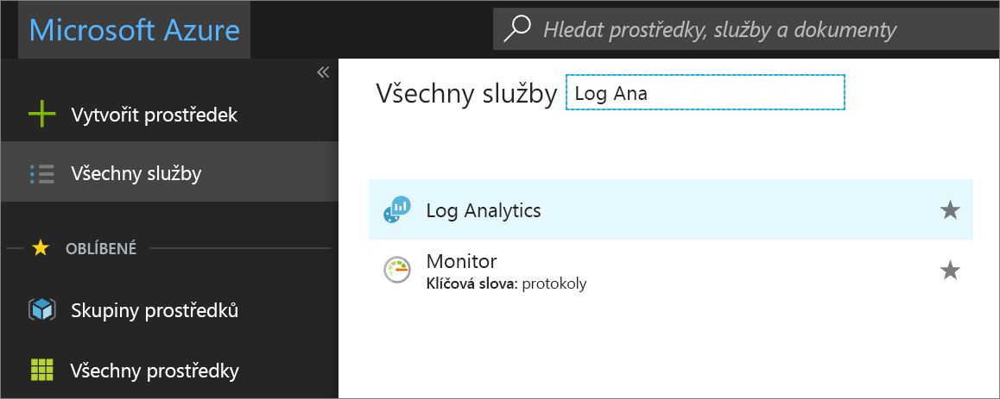
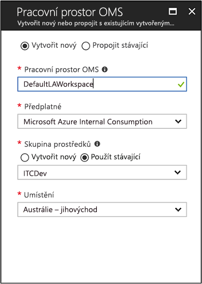

# Vytvoření pracovního prostoru Log Analytics na portálu Azure portal
Na webu Azure Portal, které můžete nastavit pracovní prostor Log Analytics, které je jedinečné prostředí Log Analytics s vlastním úložištěm dat, zdroje dat a řešení.  Podle kroků popsaných v tomto článku jsou požadovány, pokud máte v úmyslu na shromažďování dat z těchto zdrojů:

* Prostředky ve vašem předplatném Azure
* Místní služba System Center Operations Manager monitorovat počítače
* Kolekce zařízení ze System Center Configuration Manager 
* Diagnostika nebo protokolování dat z úložiště Azure

U jiných zdrojů, jako jsou virtuální počítače Azure a Windows nebo virtuální počítače s Linuxem ve vašem prostředí naleznete v následujících tématech:

*  [Shromažďování dat z virtuálních počítačů Azure](log-analytics-quick-collect-azurevm.md) 
*  [Shromažďování dat z počítače s Linuxem hybridní](log-analytics-quick-collect-linux-computer.md)
*  [Shromažďování dat z počítače Windows hybridní](log-analytics-quick-collect-windows-computer.md)

Pokud ještě nemáte předplatné Azure, vytvořte si [bezplatný účet](https://azure.microsoft.com/free/?WT.mc_id=A261C142F) před tím, než začnete.

## Přihlášení k webu Azure Portal
Přihlaste se k webu Azure Portal na adrese [https://portal.azure.com](https://portal.azure.com). 

## Vytvoření pracovního prostoru
1. Na webu Azure Portal klikněte na **Všechny služby**. V seznamu prostředků zadejte **Log Analytics**. Seznam se průběžně filtruje podle zadávaného textu. Vyberte **Log Analytics**.

    
  
2. Klikněte na **Vytvořit** a podle potřeby změňte hodnoty následujících položek:

  * Zadejte název nového **pracovního prostoru OMS**, například *DefaultLAWorkspace*. 
  * Vyberte **předplatné**, které má být cílem propojení, výběrem z rozevíracího seznamu, pokud výchozí vybrané předplatné není vhodné.
  * Pro **skupiny prostředků**, zvolte možnost používat existující prostředek již skupinu nastavení nebo vytvořte novou.  
  * Vyberte dostupný **umístění**.  Další informace najdete v tématu který [Log Analytics je dostupná v oblastech](https://azure.microsoft.com/regions/services/).
  * Pokud vytváříte pracovní prostor v novém předplatném vytvořeném po 2. dubnu 2018, automaticky se použije cenový plán *podle počtu GB* a možnost vybrat cenovou úroveň nebude dostupná.  Pokud vytváříte pracovní prostor pro existující předplatné vytvořené před 2. dubnem nebo pro předplatné, které se vázalo na existující registraci smlouvy Enterprise (EA), vyberte upřednostňovanou cenovou úroveň.  Další informace o jednotlivých úrovních najdete v tématu [podrobnosti o cenách služby Log Analytics](https://azure.microsoft.com/pricing/details/log-analytics/).

          

3. Po zadání požadovaných informací v podokně **Pracovní prostor OMS** klikněte na **OK**.  

Během ověřování informací a vytváření pracovního prostoru můžete průběh zpracování sledovat prostřednictvím položky nabídky **Oznámení**. 

## Další postup
Teď, když máte k dispozici pracovní prostor, konfigurace shromažďování dat monitorování telemetrických dat a spustit prohledávání protokolů pro analýzu těchto dat přidat řešení správy, které poskytují další data a analytické přehledy. 

* Pokud chcete povolit shromažďování dat z prostředků Azure pomocí diagnostiky Azure nebo do úložiště Azure, najdete v článku [metriky pro použití v Log Analytics a Azure shromažďovat protokoly služby](log-analytics-azure-storage.md).  
* [Přidat System Center Operations Manager jako zdroj dat](log-analytics-om-agents.md) shromažďovat data z agenty posílající sestavy skupině pro správu nástroje Operations Manager a uloží je v pracovním prostoru Log Analytics. 
* Připojit [nástroje Configuration Manager](log-analytics-sccm.md) importovat počítače, které jsou členy kolekce v hierarchii.  
* Zkontrolujte [řešení pro správu](log-analytics-add-solutions.md) k dispozici a jak přidat nebo odebrat některé řešení z pracovního prostoru.
