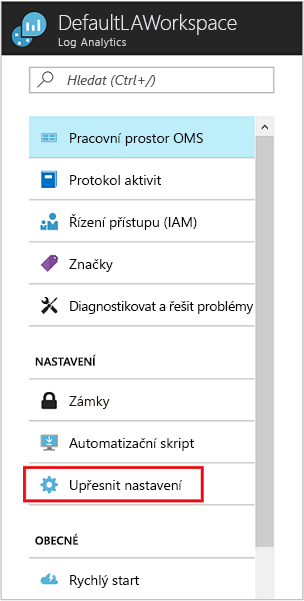

# Připojení k analýze protokolů nástroje Configuration Manager
Můžete se připojit prostředí System Center Configuration Manager k analýze protokolů Azure na synchronizaci zařízení shromažďování dat a odkazovat na těchto kolekcí v analýzy protokolů a automatizace Azure.  

## Požadavky

Analýzy protokolů podporuje aktuální větve System Center Configuration Manager verze 1606 a vyšší.  

## Přehled konfigurace
Následující kroky shrnují postup konfigurace integrace nástroje Configuration Manager se analýzy protokolů.  

1. Na portálu Azure zaregistrujte nástroje Configuration Manager jako webovou aplikaci nebo webové rozhraní API app a ujistěte se, že máte ID klienta a tajný klíč klienta z registraci ze služby Azure Active Directory. V tématu [použití portálu k vytvoření služby Active Directory objekt zabezpečení aplikací a služeb, který mají přístup k prostředkům](../azure-resource-manager/resource-group-create-service-principal-portal.md) podrobné informace o tom, jak provést tento krok.
2. Na portálu Azure [udělit nástroje Configuration Manager (registrovaný webové aplikace) s oprávněním pro přístup k analýze protokolů](#grant-configuration-manager-with-permissions-to-log-analytics).
3. V nástroji Configuration Manager [přidat připojení pomocí Průvodce přidáním připojení OMS](#add-an-oms-connection-to-configuration-manager).
4. V nástroji Configuration Manager [aktualizujte vlastnosti připojení](#update-oms-connection-properties) Pokud tajný klíč heslo nebo klienta, kdy vyprší platnost nebo dojde ke ztrátě.
5. [Stáhněte a nainstalujte agenta Microsoft Monitoring Agent](#download-and-install-the-agent) v počítači se službou roli systému bodu lokality nástroje Configuration Manager service připojení. Agent odesílá data nástroje Configuration Manager do pracovního prostoru analýzy protokolů.
6. V analýzy protokolů [importovat kolekce z nástroje Configuration Manager](#import-collections) jako skupiny počítačů.
7. V analýzy protokolů zobrazení dat z nástroje Configuration Manager jako [skupiny počítačů](log-analytics-computer-groups.md).

Další informace o připojení nástroje Configuration Manager k OMS na [synchronizovat data z nástroje Configuration Manager do služby Microsoft Operations Management Suite](https://technet.microsoft.com/library/mt757374.aspx).

## Udělení Configuration Manager s oprávněními k analýze protokolů
V následujícím postupu udělíte *Přispěvatel* role v pracovní prostor analýzy protokolů v aplikaci AD a instanční objekt jste předtím vytvořili pro nástroj Configuration Manager.  Pokud již nemáte pracovní prostor, přečtěte si téma [vytvořit pracovní prostor v Azure Log Analytics](log-analytics-quick-create-workspace.md) než budete pokračovat.  To umožňuje nástroje Configuration Manager k ověření a připojení do pracovního prostoru analýzy protokolů.  

> [!NOTE]
> Musíte zadat oprávnění v analýzy protokolů pro nástroj Configuration Manager. Jinak zobrazí chybová zpráva při použití Průvodce konfigurací služby v nástroji Configuration Manager.
>

1. Na portálu Azure klikněte na tlačítko **všechny služby** najít v levém horním rohu. V seznamu prostředků zadejte **Log Analytics**. Seznam se průběžně filtruje podle zadávaného textu. Vyberte **Log Analytics**.       
2. V seznamu analýzy protokolů pracovních prostorů vyberte Upravit v pracovním prostoru.
3. V levém podokně vyberte **řízení přístupu (IAM)**.
4. Na stránce řízení přístupu, klikněte na tlačítko **přidat** a **přidat oprávnění** podokně se zobrazí.
5. V **přidat oprávnění** podokně v části **Role** rozevíracího seznamu vyberte **Přispěvatel** role.  
6. V části **přiřadit přístup** rozevíracího seznamu vyberte aplikace nástroje Configuration Manager, který je vytvořený ve službě AD a pak klikněte na tlačítko **OK**.  

## Stáhněte a nainstalujte agenta
Přečtěte si článek [počítače se systémem Windows se připojit ke službě Analýza protokolů v Azure](log-analytics-agent-windows.md) pochopit dostupné metody pro instalaci agenta Microsoft Monitoring Agent na počítači, který hostuje službu Configuration Manager role systému lokality spojovacího bodu.  

## Přidat připojení k OMS nástroje Configuration Manager
Chcete-li přidat připojení k OMS, musí mít prostředí nástroje Configuration Manager [spojovací bod služby](https://technet.microsoft.com/library/mt627781.aspx) konfigurován pro online režim.

1. V **správy** prostoru nástroje Configuration Manager, vyberte **OMS konektor**. Tím se otevře **Průvodce přidáním připojení OMS**. Vyberte **Next** (Další).
2. Na **Obecné** obrazovky, potvrďte, že jste dokončili následující akce a mít podrobnosti pro každou položku a pak vyberte **Další**.

   1. Na webu Azure portal jste registrováni nástroje Configuration Manager jako webovou aplikaci nebo webové rozhraní API aplikaci a že máte [ID klienta z registrace](../active-directory/active-directory-integrating-applications.md).
   2. Na portálu Azure jste vytvořili tajný klíč aplikace pro aplikaci registrovanou v Azure Active Directory.  
   3. Na webu Azure portal jste zadali registrované webové aplikace s oprávněním pro přístup k OMS.  
      
3. Na **Azure Active Directory** obrazovky, konfigurace nastavení připojení k analýze protokolů tím, že poskytuje vaší **klienta**, **ID klienta**, a **klienta Tajný klíč**, pak vyberte **Další**.  
   
4. Pokud můžete provést všechny postupy úspěšně, pak informace na **konfigurace připojení OMS** obrazovky se automaticky zobrazí na této stránce. Informace o nastavení připojení, které by se měla objevit pro vaše **předplatného Azure**, **skupina prostředků Azure**, a **pracovní prostor služby Operations Management Suite**.  
   
5. Průvodce se připojí ke službě Analýza protokolů pomocí informace, které jste vstup. Vyberte kolekce zařízení, které chcete synchronizovat se službou a pak klikněte na tlačítko **přidat**.  
   
6. Ověřte nastavení připojení v **Souhrn** obrazovky a pak vyberte **Další**. **Průběh** obrazovky ukazuje stav připojení a pak by měl **Complete**.

> [!NOTE]
> Je nutné připojit lokalitu nejvyšší úrovně v hierarchii k analýze protokolů. Pokud připojení k analýze protokolů samostatnou primární lokalitou a poté přidejte lokalitu centrální správy pro vaše prostředí, budete muset odstranit a znovu vytvořte připojení v rámci nové hierarchie.
>
>

Po propojení nástroje Configuration Manager k analýze protokolů, můžete přidat nebo odebrat kolekce a zobrazit vlastnosti připojení.

## Aktualizovat vlastnosti připojení analýzy protokolů
Pokud heslo nebo klienta tajný klíč někdy vyprší platnost nebo dojde ke ztrátě, budete muset ručně aktualizovat vlastnosti připojení analýzy protokolů.

1. V nástroji Configuration Manager přejděte na **cloudové služby**, pak vyberte **OMS konektor** otevřete **vlastnosti připojení OMS** stránky.
2. Na této stránce, klikněte na tlačítko **Azure Active Directory** zobrazíte vaše **klienta**, **ID klienta**, **klienta tajný klíč vypršení platnosti**. **Ověřte** vaše **tajný klíč klienta** Pokud vypršela platnost.

## Importovat kolekce
Po připojení k OMS přidán do nástroje Configuration Manager a nainstalovali agenta na počítači se systémem připojení nástroje Configuration Manager služby role systému lokality bodu, dalším krokem je importovat z nástroje Configuration Manager v analýzy protokolů jako kolekce skupiny počítačů.

Po dokončení počáteční konfigurace pro import kolekce zařízení z vaší hierarchii, informace o členství v kolekci je načíst každé 3 hodiny zachovat aktuální členství. Můžete to kdykoli zakázat.

1. Na portálu Azure klikněte na tlačítko **všechny služby** najít v levém horním rohu. V seznamu prostředků zadejte **Log Analytics**. Seznam se průběžně filtruje podle zadávaného textu. Vyberte **Log Analytics**.
2. V seznamu analýzy protokolů pracovních prostorů vyberte pracovní prostor, který není zaregistrována nástroje Configuration Manager.  
3. Vyberte **Upřesňující nastavení**.       
4. Vyberte **skupiny počítačů** a pak vyberte **SCCM**.  
5. Vyberte **členství v kolekcích Import Configuration Manager** a pak klikněte na **Uložit**.  
   

## Zobrazení dat z nástroje Configuration Manager
Po připojení k OMS přidán do nástroje Configuration Manager a nainstalovali agenta na počítači se systémem roli systému bodu lokality nástroje Configuration Manager service připojení, je odeslána data od agenta k analýze protokolů. Vaše kolekce nástroje Configuration Manager v analýzy protokolů se zobrazí jako [skupiny počítačů](log-analytics-computer-groups.md). Můžete zobrazit skupiny z **nástroje Configuration Manager** v části **Settings\Computer skupiny**.

Po importu kolekce, uvidíte, kolik počítačů s členství v kolekcích byly zjištěny. Rovněž uvidíte počet kolekcí, které byly naimportovány.

Po kliknutí na tlačítko buď jednu, otevře se hledání zobrazí všechny skupiny pro importované nebo všechny počítače, které patří ke každé skupině. Pomocí [hledání protokolů](log-analytics-log-searches.md), můžete spustit podrobné analýzy dat nástroje Configuration Manager.

## Další postup
* Použití [hledání protokolů](log-analytics-log-searches.md) Chcete-li zobrazit podrobné informace o data nástroje Configuration Manager.
