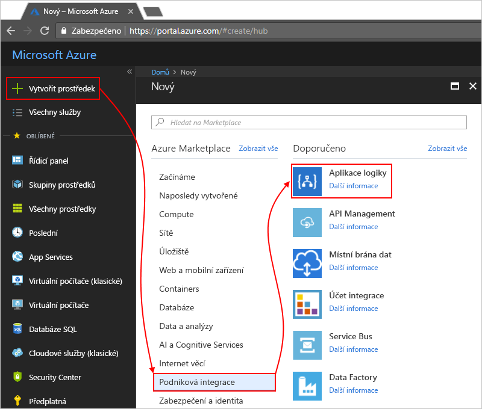

# Monitorování logic apps s využitím Azure Log Analytics

Chcete-li sledovat a získat bohatší ladění podrobné informace o logic apps, zapněte [Azure Log Analytics](../log-analytics/log-analytics-overview.md) při vytváření aplikace logiky. Log Analytics poskytuje diagnostické protokolování a monitorování pro aplikace logiky při instalaci řešení Správa služby Logic Apps na webu Azure Portal. Toto řešení také poskytuje souhrnné informace pro vaši aplikaci logiky se spouští s konkrétní podrobnosti, jako je například stav, čas spuštění, opakovaným odesláním stav a ID korelace. Tento článek ukazuje, jak zapnout v Log Analytics, můžete zobrazit události modulu runtime a dat o vaší aplikace logiky spouští.

Chcete-li na Azure Log Analytics pro existující logic apps, postupujte podle těchto kroků [zapněte protokolování diagnostiky a odesílání dat získaných za běhu aplikace logiky do Log Analytics](../logic-apps/logic-apps-monitor-your-logic-apps.md#azure-diagnostics).

> [!NOTE]
> Tato stránka výše popsaný postup, jak k provádění těchto úkolů se Microsoft Operations Management Suite (OMS), což je [vyřazení z provozu v lednu 2019](../azure-monitor/platform/oms-portal-transition.md), nahradí tyto kroky místo toho pomocí služby Azure Log Analytics. 

## Požadavky

Než začnete, musíte pracovnímu prostoru Log Analytics. Přečtěte si [jak vytvořit pracovní prostor Log Analytics](../azure-monitor/learn/quick-create-workspace.md). 

## Zapnutí protokolování diagnostiky vytváření aplikací logiky

1. V [webu Azure portal](https://portal.azure.com), vytvořit aplikaci logiky. Zvolte **vytvořit prostředek** > **integrace** > **aplikace logiky**.

   

1. V části **vytvořit aplikaci logiky**, jak je znázorněno provádět tyto úlohy:

   1. Zadejte název pro svou aplikaci logiky a vyberte své předplatné Azure. 

   1. Vytvořte nebo vyberte skupinu prostředků Azure.

   1. Nastavte **Log Analytics** k **na**. 

   1. Ze seznamu seznamu pracovního prostoru Log Analytics vyberte pracovní prostor, ve které chcete odesílat data pro vaše aplikace logiky spouští. 

      

      Po dokončení tohoto kroku, Azure vytvoří aplikaci logiky, která je teď spojený s pracovního prostoru Log Analytics. 
      Tento krok navíc také automaticky nainstaluje řešení Správa služby Logic Apps ve vašem pracovním prostoru.

   1. Jakmile budete hotoví, vyberte **Vytvořit**.

1. Chcete-li zobrazit vaše aplikace logiky spouští, [pokračovat tímto postupem](#view-logic-app-runs-oms).

## Nainstalujte řešení Správa služby Logic Apps

Pokud již zapne Log Analytics, pokud jste vytvořili aplikaci logiky, tento krok přeskočit. Již máte nainstalované řešení Správa služby Logic Apps.

1. Na webu [Azure Portal](https://portal.azure.com) vyberte **Všechny služby**. Do vyhledávacího pole vyhledejte "log analytics" a vyberte **Log Analytics**.

   

1. V části **Log Analytics**vyhledejte a vyberte pracovní prostor Log Analytics. 

   

1. V části **Začínáme se službou Log Analytics** > **konfigurovat řešení monitorování**, zvolte **zobrazení řešení**.

   

1. Na stránce s přehledem, zvolte **přidat**, které se otevře **řešení pro správu** seznamu. V tomto seznamu, vyberte **Správa služby Logic Apps**. 

   

   Pokud nemůžete najít řešení, v dolní části seznamu, zvolte **načíst další** až se zobrazí řešení.

1. Zvolte **vytvořit**, zkontrolujte pracovní prostor Log Analytics, ve které chcete řešení nainstalovat a klikněte na tlačítko **vytvořit** znovu.   

   

   Pokud už nechcete používat existujícího pracovního prostoru, můžete také vytvořit nový pracovní prostor v tuto chvíli.

   Až to uděláte, se zobrazí na stránce Přehled řešení Správa služby Logic Apps. 

## Informace o spuštění aplikace logiky zobrazení

Po spuštění aplikace logiky můžete zobrazit stav a počet těchto spuštění na **Správa služby Logic Apps** dlaždici. 

1. Přejděte do pracovního prostoru Log Analytics a otevřete stránku přehledu. Zvolte **Správa služby Logic Apps**. 

   

   Tady spuštěních aplikací logiky se seskupují podle názvu nebo podle stavu spuštění. 
   Tato stránka také zobrazuje podrobnosti o neúspěšných akcí nebo triggerů pro spuštění aplikace logiky.

   
   
1. Pokud chcete zobrazit všechna spuštění pro aplikaci logiky specifické nebo stav, vyberte řádek pro aplikaci logiky nebo ve stavu.

   Tady je příklad, který zobrazuje všechna spuštění aplikace logiky specifické pro:

   

   Stránka má tyto rozšířené možnosti:

   * **Sledované vlastnosti:**

     Tento sloupec zobrazuje sledované vlastnosti, které jsou seskupeny podle akce pro aplikaci logiky. Chcete-li zobrazit sledované vlastnosti, zvolte **zobrazení**. 
     K vyhledání sledované vlastnosti, použijte filtr sloupce.
   
     

     Všechny nově přidané sledované vlastnosti může trvat 10 až 15 minut, než se zobrazují první. Přečtěte si [přidání sledované vlastnosti aplikace logiky](logic-apps-monitor-your-logic-apps.md#azure-diagnostics-event-settings-and-details).

   * **Odešlete:** jeden nebo více spuštění aplikace logiky, které selhaly, byly úspěšné, neúspěšné nebo jsou stále běží. Zaškrtněte políčka pro spuštění, které chcete znovu odeslat a zvolte **znovu odeslat**. 

     

1. Chcete-li filtrovat výsledky, můžete provést filtrování na straně klienta i stranu serveru.

   * **Filtrování na straně klienta**: pro každý sloupec, vyberte filtry, které potřebujete, třeba:

     

   * **Filtrování na straně serveru**: K výběru konkrétního časového okna nebo omezit počet spuštění, které se zobrazí, pomocí ovládacího prvku oboru v horní části stránky. Ve výchozím nastavení se zobrazí pouze 1 000 záznamů najednou.
   
     
 
1. Chcete-li zobrazit všechny akce a jejich podrobnosti pro konkrétní spuštění, vyberte řádek pro běh aplikace logiky.

   Tady je příklad, který zobrazuje všechny akce pro běh aplikace logiky konkrétní:

   
   
1. Na libovolné stránce výsledky k zobrazení dotazu za výsledky nebo všechny výsledky, zvolte **najdete v článku všechny**, který otevře stránku prohledávání protokolů.
   
   
   
   Na stránce prohledávání protokolů

   * Chcete-li zobrazit výsledky dotazu v tabulce, zvolte **tabulky**.

   * Chcete-li změnit dotaz, můžete upravit řetězec dotazu na panelu hledání. 
   Pro vyšší výkon zvolte **Advanced Analytics**.

     
     
     Na stránce Azure Log Analytics můžete aktualizovat dotazy a zobrazit výsledky z tabulky. Tento dotaz používá [Kusto dotazovací jazyk](https://aka.ms/LogAnalyticsLanguageReference), který můžete upravit, pokud chcete zobrazit odlišné výsledky. 

     

## Další postup

* [Monitorování zpráv B2B](../logic-apps/logic-apps-monitor-b2b-message.md)