# Rychlý start: Vytvoření a automatizace úloh, procesů a pracovních postupů pomocí Azure Logic Apps – Visual Studio

Pomocí [Azure Logic Apps](../logic-apps/logic-apps-overview.md) a sady Visual Studio můžete vytvářet pracovní postupy automatizující úlohy a procesy pro integraci aplikací, dat, systémů a služeb napříč podniky a organizacemi. Tento rychlý start ukazuje, jak můžete navrhovat a sestavovat tyto pracovní postupy vytvářením aplikací logiky v sadě Visual Studio a nasazováním těchto aplikací do <a href="https://docs.microsoft.com/azure/guides/developer/azure-developer-guide" target="_blank">Azure</a> v cloudu. A přestože můžete tyto úlohy provádět na webu <a href="https://portal.azure.com" target="_blank">Azure Portal</a>, sada Visual Studio umožňuje přidávat aplikace logiky do správy zdrojového kódu, publikovat různé verze a vytvářet šablony Azure Resource Manageru pro různá prostředí nasazení. 

Pokud s Azure Logic Apps teprve začínáte a zajímají vás pouze základní koncepty, vyzkoušejte [rychlý start k vytvoření aplikace logiky na webu Azure Portal](../logic-apps/quickstart-create-first-logic-app-workflow.md). Návrhář aplikace logiky na webu Azure Portal i v sadě Visual Studio funguje podobně. 

Tady vytvoříte stejnou aplikaci logiky jako v rychlém startu pro Azure Portal, ale pomocí sady Visual Studio. Tato aplikace logiky monitoruje informační kanál RSS webu a za každou novou položku publikovanou na webu odešle e-mail. Jakmile budete hotovi, vaše aplikace logiky bude vypadat jako tento pracovní postup vysoké úrovně:

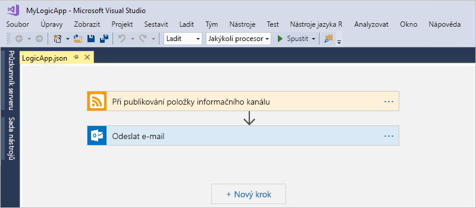

Než začnete, ujistěte se, že máte tyto položky:

* Pokud nemáte předplatné Azure, <a href="https://azure.microsoft.com/free/" target="_blank">zaregistrujte si bezplatný účet Azure</a>.

* Pokud je ještě nemáte, stáhněte a nainstalujte tyto nástroje: 

  * <a href="https://www.visualstudio.com/downloads" target="_blank">Visual Studio 2017 nebo Visual Studio 2015 – edice Community nebo vyšší</a>. 
  V tomto kurzu se používá sada Visual Studio Community 2017, která je zdarma.

  * <a href="https://azure.microsoft.com/downloads/" target="_blank">Microsoft Azure SDK pro .NET (verze 2.9.1 nebo novější)</a> a <a href="https://github.com/Azure/azure-powershell#installation" target="_blank">Azure PowerShell</a>. 
  Další informace o sadě <a href="https://docs.microsoft.com/dotnet/azure/dotnet-tools?view=azure-dotnet">Azure SDK pro .NET</a>.

  * <a href="https://marketplace.visualstudio.com/items?itemName=VinaySinghMSFT.AzureLogicAppsToolsforVisualStudio-18551" target="_blank">Azure Logic Apps Tools pro Visual Studio 2017</a> nebo <a href="https://marketplace.visualstudio.com/items?itemName=VinaySinghMSFT.AzureLogicAppsToolsforVisualStudio" target="_blank">verze pro Visual Studio 2015</a>
  
    Azure Logic Apps Tools můžete stáhnout a nainstalovat přímo z Visual Studio Marketplace nebo si můžete přečíst, <a href="https://docs.microsoft.com/visualstudio/ide/finding-and-using-visual-studio-extensions" target="_blank">jak toto rozšíření nainstalovat v rámci sady Visual Studio</a>. 
    Po dokončení instalace nezapomeňte sadu Visual Studio restartovat.

* E-mailový účet podporovaný v Logic Apps, jako je Office 365 Outlook, Outlook.com nebo Gmail. Pokud máte jiného poskytovatele, <a href="https://docs.microsoft.com/connectors/" target="_blank">tady se podívejte na seznam konektorů</a>. Tato aplikace logiky používá Office 365 Outlook. Pokud použijete jiného poskytovatele, celkový postup bude stejný, ale vaše uživatelské rozhraní se může mírně lišit.

* Přístup k webu při používání vloženého Návrháře aplikace logiky

  Návrhář k vytváření prostředků v Azure a ke čtení vlastností a dat z konektorů ve vaší aplikaci logiky vyžaduje připojení k internetu. 
  Pokud například použijete konektor Dynamics CRM Online, návrhář zkontroluje ve vaší instanci CRM dostupné výchozí a vlastní vlastnosti.

## Vytvoření projektu skupiny prostředků Azure

Začněte vytvořením [projektu skupiny prostředků Azure](../azure-resource-manager/vs-azure-tools-resource-groups-deployment-projects-create-deploy.md). Další informace o [skupinách prostředků a prostředcích Azure](../azure-resource-manager/resource-group-overview.md).

1. Spusťte sadu Visual Studio a přihlaste se pomocí svého účtu Azure.

2. V nabídce **Soubor** vyberte **Nový** > **Projekt**. (Klávesová zkratka: Ctrl + Shift + N)

   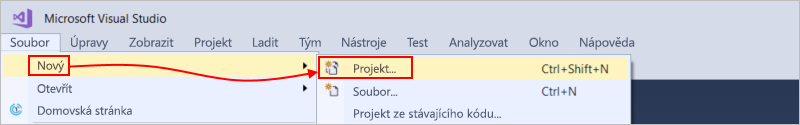

3. V části **Nainstalováno**, vyberte **Visual C#** nebo **Visual Basic**. Vyberte **Cloud** > **Skupina prostředků Azure**. Pojmenujte svůj projekt, například:

   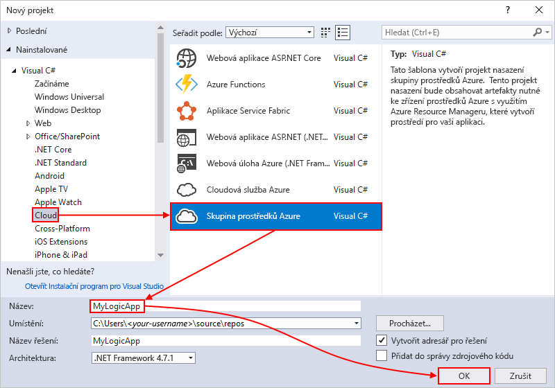

4. Vyberte šablonu **Aplikace logiky**. 

   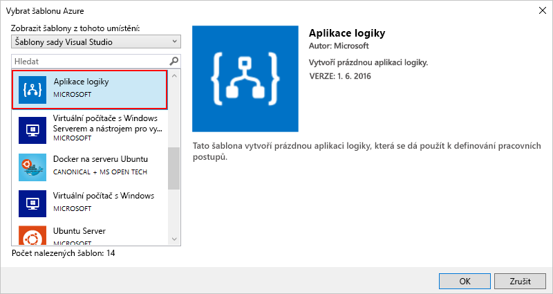

   Jakmile sada Visual Studio vytvoří projekt, otevře se Průzkumník řešení, ve kterém se zobrazí vaše řešení. 

   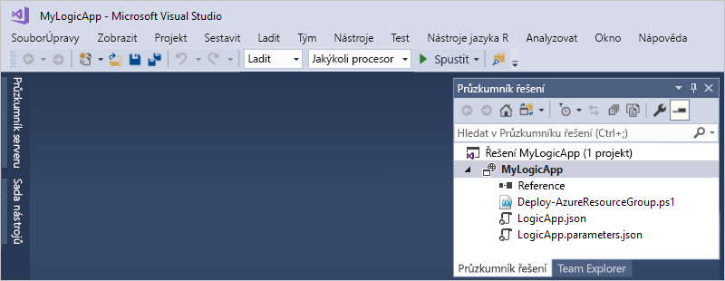

   Soubor **LogicApp.json** ve vašem řešení nejen že obsahuje definici vaší aplikace logiky, ale představuje také šablonu Azure Resource Manageru, kterou můžete nastavit pro nasazení.

## Vytvoření prázdné aplikace logiky

Po vytvoření projektu skupiny prostředků Azure vytvořte a sestavte svou aplikaci logiky ze šablony **Prázdná aplikace logiky**.

1. V Průzkumníku řešení otevřete místní nabídku pro soubor **LogicApp.json**. Vyberte **Otevřít pomocí Návrháře aplikace logiky**. (Klávesová zkratka: Ctrl + L)

   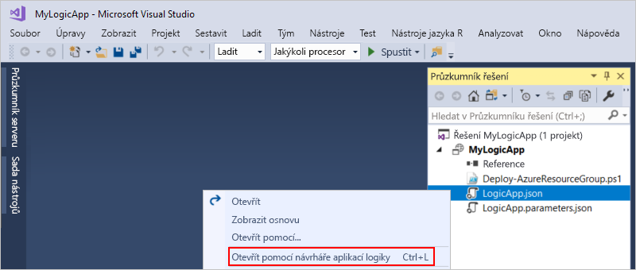

2. V rozevíracím seznamu **Předplatné** vyberte předplatné Azure, které chcete použít. V rozevíracím seznamu **Skupina prostředků** vyberte **Vytvořit novou...**, čímž se vytvoří nová skupina prostředků Azure. 

   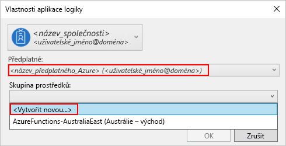

   Sada Visual Studio potřebuje vaše předplatné Azure a skupinu prostředků k vytvoření a nasazení prostředků přidružených k vaší aplikaci logiky a připojením. 

   | Nastavení | Příklad hodnoty | Popis | 
   | ------- | ------------- | ----------- | 
   | Výpis profilu uživatele | Contoso   jamalhartnett@contoso.com | Ve výchozím nastavení se jedná o účet, který jste použili k přihlášení | 
   | **Předplatné** | Průběžné platby   (jamalhartnett@contoso.com) | Název vašeho předplatného Azure a přidruženého účtu |
   | **Skupina prostředků** | MyLogicApp-RG   (USA – západ) | Skupina prostředků Azure a umístění pro ukládání a nasazování prostředků pro vaši aplikaci logiky | 
   | **Umístění** | MyLogicApp-RG2   (USA – západ) | Jiné umístění, pokud nechcete použít umístění skupiny prostředků |
   ||||

3. Otevře se Návrhář pro Logic Apps se zobrazenou stránkou s úvodním videem a běžně používanými triggery. Posuňte se za video a triggery. V části **Šablony** vyberte **Prázdná aplikace logiky**.

   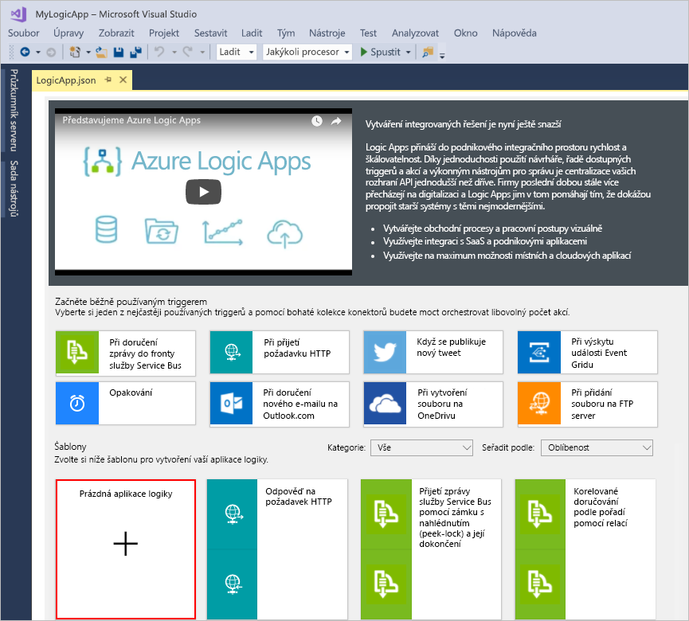

## Sestavení pracovního postupu aplikace logiky

Dále přidejte [trigger](../logic-apps/logic-apps-overview.md#logic-app-concepts), který se aktivuje, když se v informačním kanálu RSS objeví nová položka. Každá aplikace logiky se musí spouštět triggerem, který se aktivuje při splnění určitých kritérií. Pokaždé, když se trigger aktivuje, vytvoří modul Logic Apps instanci aplikace logiky pro spuštění vašeho pracovního postupu.

1. V Návrháři aplikace logiky zadejte do vyhledávacího pole „rss“. Vyberte trigger **Při publikování položky informačního kanálu**.

   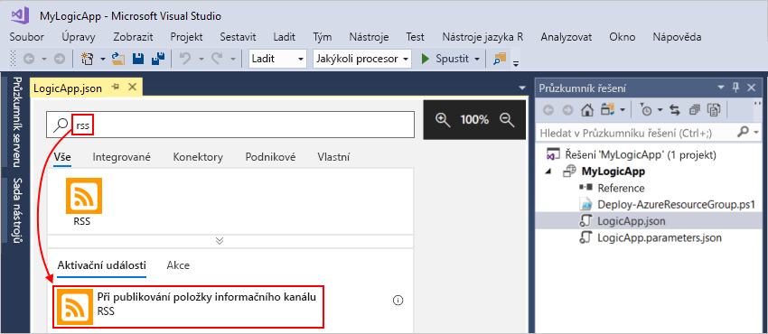

   Trigger se teď zobrazí v návrháři:

   

2. Dokončete sestavování aplikace logiky podle kroků pracovního postupu v [rychlém startu pro Azure Portal](../logic-apps/quickstart-create-first-logic-app-workflow.md#add-rss-trigger) a pak se vraťte k tomuto článku.

   Jakmile budete hotovi, vaše aplikace logiky bude vypadat jako v tomto příkladu: 

   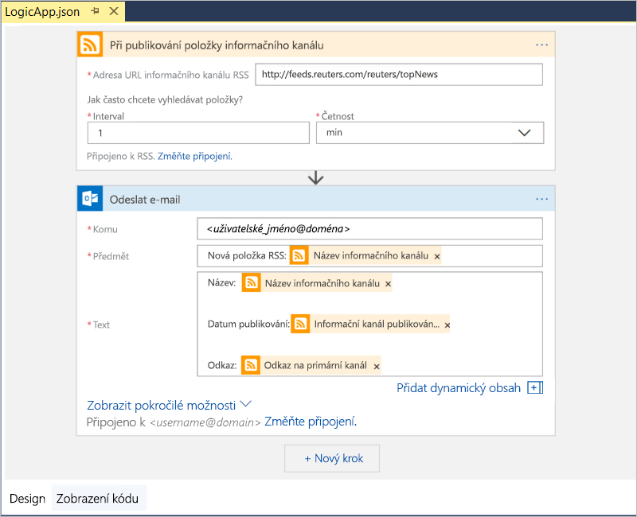

3. Pokud chcete svou aplikaci logiky uložit, uložte řešení sady Visual Studio. (Klávesová zkratka: Ctrl + S)

Teď svou aplikaci logiky nasaďte do Azure, abyste ji mohli otestovat.

## Nasazení aplikace logiky do Azure

Před spuštěním aplikace logiky ji nasaďte ze sady Visual Studio do Azure, což zabere jenom několik kroků.

1. V Průzkumníku řešení v místní nabídce vašeho projektu vyberte **Nasadit** > **Nový**. Pokud se zobrazí výzva, přihlaste se pomocí svého účtu Azure.

   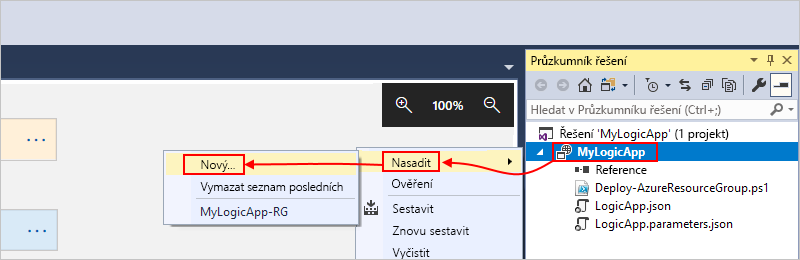

2. Pro toto nasazení ponechte výchozí předplatné Azure, skupinu prostředků a další výchozí nastavení. Jakmile budete připraveni, zvolte **Nasadit**. 

   

3. Pokud se zobrazí okno **Upravit parametry**, zadejte název prostředku aplikace logiky, který se má při nasazení použít, a pak nastavení uložte, například:

   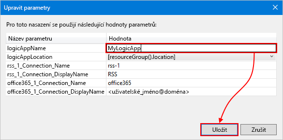

   Po zahájení nasazování se v okně **Výstup** sady Visual Studio zobrazí stav nasazení vaší aplikace. 
   Pokud se stav nezobrazí, otevřete seznam **Zobrazit výstup z** a vyberte svou skupinu prostředků Azure.

   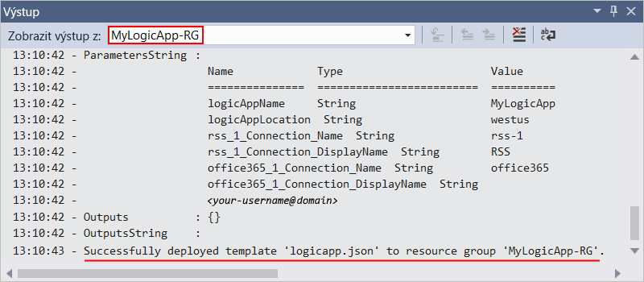

   Po dokončení nasazení bude vaše aplikace logiky spuštěná na webu Azure Portal a kontrolovat informační kanál RSS podle zadaného plánu (každou minutu). 
   Pokud informační kanál RSS obsahuje nové položky, aplikace logiky za každou novou položku odešle e-mail. 
   Jinak vaše aplikace logiky s další kontrolou počká na další interval. 

   Například tady jsou ukázkové e-maily, které tato aplikace logiky odesílá. 
   Pokud neobdržíte žádné e-maily, zkontrolujte složku s nevyžádanými e-maily. 

   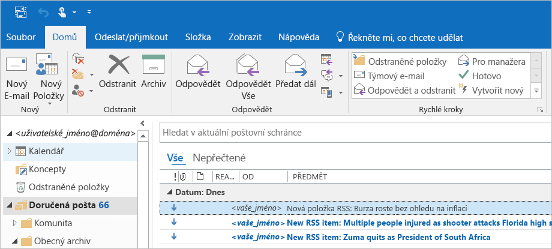

   Technicky vzato, když trigger zkontroluje informační kanál RSS a najde nové položky, aktivuje se a modul Logic Apps vytvoří instanci pracovního postupu vaší aplikace logiky, která provede akce v tomto pracovním postupu.
   Pokud trigger nenajde nové položky, neaktivuje se a přeskočí vytvoření instance pracovního postupu.

Blahopřejeme, právě jste pomocí sady Visual Studio úspěšně sestavili a nasadili svou aplikaci logiky. Informace o správě aplikace logiky a kontrole historie jejího spuštění najdete v tématu [Správa aplikací logiky s využitím sady Visual Studio](../logic-apps/manage-logic-apps-with-visual-studio.md).

## Vyčištění prostředků

Pokud už je nepotřebujete, odstraňte skupinu prostředků, která obsahuje vaši aplikaci logiky, a všechny související prostředky.

1. Přihlaste se k webu <a href="https://portal.azure.com" target="_blank">Azure Portal</a> pomocí stejného účtu, který jste použili k vytvoření své aplikace logiky. 

2. V hlavní nabídce Azure vyberte **Skupiny prostředků**.
Vyberte skupinu prostředků pro vaši aplikaci logiky a pak vyberte **Přehled**.

3. Na stránce **Přehled** zvolte **Odstranit skupinu prostředků**. Pro ověření zadejte název skupiny prostředků a zvolte **Odstranit**.

   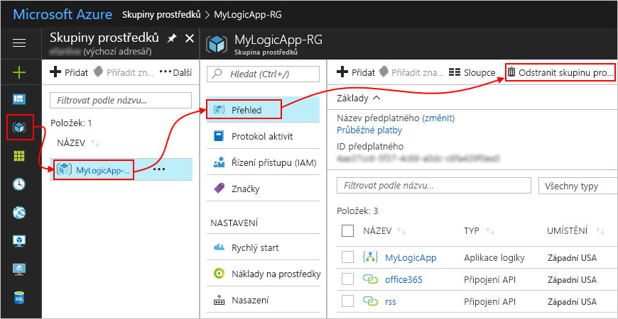

4. Odstraňte řešení sady Visual Studio ze svého místního počítače.

## Získat podporu

* Pokud máte dotazy, navštivte <a href="https://social.msdn.microsoft.com/Forums/en-US/home?forum=azurelogicapps" target="_blank">fórum Azure Logic Apps</a>.
* Pokud chcete zanechat své nápady na funkce nebo hlasovat, navštivte <a href="http://aka.ms/logicapps-wish" target="_blank">web zpětné vazby od uživatelů Logic Apps</a>.

## Další kroky

V tomto článku jste pomocí sady Visual Studio sestavili, nasadili a spustili aplikaci logiky. Další informace o správě a provádění pokročilého nasazení aplikací logiky pomocí sady Visual Studio najdete v těchto článcích:

> [!div class="nextstepaction"]
> * [Správa aplikací logiky s využitím sady Visual Studio](../logic-apps/manage-logic-apps-with-visual-studio.md)
> * [Vytvoření šablon nasazení pro aplikace logiky pomocí sady Visual Studio](../logic-apps/logic-apps-create-deploy-template.md)
