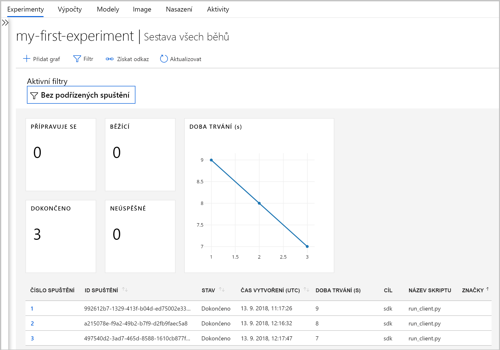

# <a name="what-happened-to-azure-machine-learning-workbench"></a>Co se stalo s aplikací Azure Machine Learning Workbench?

Aplikaci Azure Machine Learning Workbench a některé počáteční funkce byly zastaralé a ve verzi. září 2018 aby způsob, jak zdokonalené [architektura](concept-azure-machine-learning-architecture.md). 

Pro zlepšení možností verze obsahuje mnoho významných aktualizací výzvě zpětné vazby od zákazníků. Základní funkce z dostupných spuštění experimentu do modelu nasazení se nezměnil. Teď, můžete ale použít robustní <a href="https://aka.ms/aml-sdk" target="_blank">SDK</a> a [rozhraní příkazového řádku Azure](reference-azure-machine-learning-cli.md) k provedení strojového učení úkoly a kanály.  

Většina artefakty, které byly vytvořeny ve starší verzi služby Azure Machine Learning jsou uloženy ve vlastní místní nebo cloudové úložiště. Tyto artefakty se vám nikdy neztratí.

V tomto článku se dozvíte o co se změnilo, a o jejím dopadu na vaše existující dílo aplikaci Azure Machine Learning Workbench a jeho rozhraní API.

>[!Warning]
>Tento článek není pro uživatele Azure Machine Learning Studio. Je pro zákazníky služby Azure Machine Learning, kteří mají nainstalované aplikace Workbench (preview) a/nebo mají experimentování a ve verzi preview účty správy modelů.


## <a name="what-changed"></a>Co se změnilo?

Nejnovější verze služby Azure Machine Learning obsahuje následující funkce:
+ A [zjednodušené prostředků Azure modelu](concept-azure-machine-learning-architecture.md).
+ A [nové uživatelské rozhraní portálu](how-to-track-experiments.md) ke správě své experimenty a cílových výpočetních prostředí.
+ Nové a další komplexní Python <a href="https://aka.ms/aml-sdk" target="_blank">SDK</a>.
+ Nové rozšířit [rozšíření rozhraní příkazového řádku Azure](reference-azure-machine-learning-cli.md) pro machine learning.

[Architektura](concept-azure-machine-learning-architecture.md) byla přepracována pro snadné použití. Místo několika prostředků a účtů Azure potřebujete jenom [pracovní prostor služby Azure Machine Learning](concept-azure-machine-learning-architecture.md#workspace). Pracovní prostory můžete vytvářet rychle na webu [Azure Portal](quickstart-get-started.md). Použití pracovního prostoru, více mohou uživatelé ukládat školení a nasazení výpočetního cíle, model experimenty, Image Dockeru, nasazených modelů a tak dále.

I když existují nové vylepšené rozhraní příkazového řádku a sady SDK klienty v aktuální verzi, samotná aplikace klasické pracovní plochy aplikace workbench je vyřazený. Je možné spravovat experimenty [řídicího panelu pracovního prostoru na webu Azure portal](how-to-track-experiments.md#view-the-experiment-in-the-azure-portal). Řídicí panel můžete použít k zobrazení historie experimentu, ke správě výpočetních cílů připojených k pracovnímu prostoru, ke správě modelů a imagí Dockeru, a dokonce i k nasazení webových služeb.

<a name="timeline"></a>

## <a name="support-timeline"></a>Časový plán podpory

9. ledna 2019 podpora pro Machine Learning Workbench, experimentování ve službě Azure Machine Learning a účty správy modelů a jejich přidružené sady SDK a rozhraní příkazového řádku byla ukončena. 

Všechny nejnovější funkce jsou dostupné prostřednictvím tohoto <a href="https://aka.ms/aml-sdk" target="_blank">SDK</a>, [rozhraní příkazového řádku](reference-azure-machine-learning-cli.md)a [portál](quickstart-get-started.md).

## <a name="what-about-run-histories"></a>Co se stane s historií spuštění?

Starší historie spuštění už nejsou dostupné, jak můžete pořád vidět vašich spuštění v nejnovější verzi. 

Historie spuštění se teď nazývají **experimenty**. Můžete shromažďovat váš model experimenty a prozkoumat pomocí sady SDK, rozhraní příkazového řádku nebo na webu Azure portal.

Řídicí panel pracovního prostoru na portálu je podporovaná jenom prohlížeče Microsoft Edge, Chrome a Firefox:

[ ] (. / media/overview-what-happened-to-workbench/image001.png#lightbox)

Začněte trénování modelů a sledování historie spuštění pomocí nového rozhraní příkazového řádku a sady SDK. Zjistíte, jak se [kurz: trénování modelů pomocí služby Azure Machine Learning](tutorial-train-models-with-aml.md).

## <a name="can-i-still-prep-data"></a>Můžu dál připravovat data?

Existující soubory přípravy dat nejsou přenosné na nejnovější verzi, protože už nemáme Machine Learning Workbench. Ale stále můžete připravit všechny velikost datové sady pro modelování.   

S datovými sadami libovolné velikosti, můžete použít [sady SDK služby Azure Machine Learning Data Prep](http://aka.ms/data-prep-sdk) k rychlé přípravě vaše data před modelování napsáním kódu v Pythonu. 

Můžete postupovat podle [v tomto kurzu](tutorial-data-prep.md) Další informace o tom, jak pomocí Azure Machine Learning Data Prep SDK.

## <a name="will-projects-persist"></a>Vydrží mi moje projekty?

Neztratíte žádný kód ani práci. Ve starší verzi jsou projekty cloudové entity s místním adresářem. V nejnovější verzi připojíte místní adresáře do služby Azure Machine Learning Workspace s použitím místní konfigurační soubor. Najdete v článku [diagram architektury nejnovější](concept-azure-machine-learning-architecture.md).

Velká část obsahu projektu se již v místním počítači. Proto stačí na něj odkazovat ve vašem kódu pro připojení k vašemu pracovnímu prostoru a vytvoření konfiguračního souboru v tomto adresáři. Dál používat místní adresář obsahující soubory a skripty, zadejte název adresáře ["experiment.submit"](https://docs.microsoft.com/python/api/azureml-core/azureml.core.experiment.experiment?view=azure-ml-py) Python příkaz nebo pomocí příkazu az ml projektu připojení rozhraní příkazového řádku.  Příklad:
```python
run = exp.submit(source_directory = script_folder, script = 'train.py', run_config = run_config_system_managed)
```

Zjistěte, jak začít pracovat [Python s hlavním SDK](quickstart-create-workspace-with-python.md) nebo pomocí [webu Azure portal](quickstart-get-started.md).

## <a name="what-about-my-registered-models-and-images"></a>Jak Moje registrované modely a Image?
 
Modely, které jste zaregistrovali v registru starý model se musí migrovat na nový pracovní prostor, pokud chcete dál používat. K migraci vašich modelů, stáhněte modely a znovu je zaregistrovat v nový pracovní prostor. 

Image vytvořené ve starém registru imagí je potřeba znovu vytvořit v novém pracovním prostoru, abyste je mohli dál používat. Tyto Image můžete znovu vytvořit pomocí následujících [konfigurace a vytvoření bitové kopie](how-to-deploy-and-where.md#configureimage) oddíly. 

## <a name="what-about-deployed-web-services"></a>Co se stane s nasazenými webovými službami?

Nyní pro starému rozhraní příkazového řádku, které podporují skončila, jste už znovu nasadit modely nebo Správa webových služeb, které jste původně nasadili s vaším účtem správy modelů ve službě. Tyto webové služby však bude i nadále fungovat tak dlouho, dokud je Azure Container Service (ACS) stále podporovány.

V nejnovější verzi jsou nasazení modelů jako webové služby do clusteru Azure Container Instances (ACI) nebo Azure Kubernetes Service (AKS). Můžete také nasadit do FPGA a Azure IoT Edge. 

Další informace najdete v těchto článcích:
+ [Kde a jak nasazovat modely](how-to-deploy-and-where.md)
+ [Kurz: Nasazujte modely pomocí služby Azure Machine Learning](tutorial-deploy-models-with-aml.md)

## <a name="what-about-the-old-sdk-and-cli"></a>Co staré SDK a rozhraní příkazového řádku?

Ano, budou dál fungovat až do ledna. Viz předchozí [časová osa](#timeline). Doporučujeme spouštět vytváření nových experimentů a modelů s nejnovější SDK nebo rozhraní příkazového řádku.

Když použijete sadu SDK pro Python v nejnovější verzi, můžete pracovat se službou Azure Machine Learning v jakémkoli prostředí Pythonu. Přečtěte si, jak nainstalovat nejnovější sadu <a href="https://aka.ms/aml-sdk" target="_blank">SDK</a>. Můžete také použít aktualizovaná [rozšíření rozhraní příkazového řádku pro Azure Machine Learning](reference-azure-machine-learning-cli.md) s bohatou sadu `az ml` příkazy pro interakci se službou v jakémkoli příkazového řádku prostředí, včetně Azure Cloud Shell.

## <a name="what-about-visual-studio-code-tools-for-ai"></a>Jak Visual Studio Code Tools pro AI?

V této nejnovější verzi rozšíření se přejmenoval na Azure Machine Learning pro Visual Studio Code a má se rozšířit a vylepšení pro práci s předchozím nové funkce.

[ ] (. / media/overview-what-happened-to-workbench/vscode-big.png#lightbox)

## <a name="what-about-domain-packages"></a>Co se stane s doménovými balíčky?

Balíčky domény pro počítačové zpracování obrazu, analýzu textu a předvídání nelze použít s nejnovější verzí služby Azure Machine Learning. Ale můžete pořád vytvářet a trénování pro počítačové zpracování obrazu, textu a předvídání modely s nejnovější Python Azure Machine Learning <a href="https://aka.ms/aml-sdk" target="_blank">SDK</a>. Zjistěte, jak migrovat existující modely sestavené pomocí pro počítačové zpracování obrazu, analýzu textu a předvídání balíčky, obraťte se na [ AML-Packages@microsoft.com ](mailto:AML-Packages@microsoft.com).

## <a name="next-steps"></a>Další postup

Další informace o [nejnovější architektura pro službu Azure Machine Learning](concept-azure-machine-learning-architecture.md). 

Přehled služby najdete v článku [co je služba Azure Machine Learning?](overview-what-is-azure-ml.md)

Rychlý start ukazuje, jak vytvořit pracovní prostor, vytvoření projektu, spusťte skript a prozkoumejte historii spuštění tohoto skriptu s nejnovější verzí služby Azure Machine Learning, vyzkoušejte [Začínáme se službou Azure Machine Learning](quickstart-get-started.md).

Podrobnější poznatky o tomto pracovním postupu, postupujte [komplexně kurzu](tutorial-train-models-with-aml.md) , který obsahuje podrobné návody k trénování a nasazení modelů pomocí služby Azure Machine Learning. 
