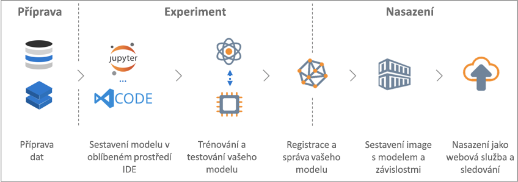

# Co je služba Azure Machine Learning (Preview)?

Azure Machine Learning (Preview) je cloudová služba, kterou můžete použít k vývoji a nasazování modelů strojového učení. Pomocí služby Azure Machine Learning můžete své modely sledovat při vytváření, trénování, nasazování a správě, a to vše v rozsáhlém měřítku, které poskytuje cloud.

## Co je strojové učení?

Strojové učení je technika datové vědy, která umožňuje počítačům s využitím existujících dat předvídat budoucí chování, výsledky a trendy. Pomocí strojového učení se počítače můžou učit, aniž by byly explicitně naprogramované.

Díky předpovědím neboli predikcím ze strojového učení můžou být aplikace a zařízení chytřejší. Například při online nakupování je díky strojovému učení možné na základě již pořízeného zboží doporučit produkty, které by se vám mohly líbit. Nebo při protažení platební karty čtečkou porovnává strojové učení danou transakci s databází, a pomáhá tak odhalovat podvody. A takový robotický vysavač na základě strojového učení zjišťuje, jestli už v místnosti dostatečně uklidil.

## Co je služba Azure Machine Learning?

Služba Azure Machine Learning poskytuje cloudové prostředí, které můžete použít k vývoji, trénování, testování, nasazení, správě a sledování modelů strojového učení.

[  ] (./media/overview-what-is-azure-ml/aml.png#lightbox)

Služba Azure Machine Learning plně podporuje technologie Open Source, takže s komponentami strojového učení můžete používat desítky tisíc volně dostupných balíčků Pythonu, například TensorFlow a scikit-learn.
Plnohodnotné nástroje jako [poznámkové bloky Jupyter](http://jupyter.org) nebo [Visual Studio Code Tools for AI](https://visualstudio.microsoft.com/downloads/ai-tools-vscode/) usnadňují interaktivní zkoumání dat, jejich transformaci a následný vývoj a testování modelů.
Služba Azure Machine Learning obsahuje rovněž funkce, které [automatizují generování a optimalizaci modelů](tutorial-auto-train-models.md) a pomáhají vám tak snadno a efektivně vytvářet přesné modely.

Služba Azure Machine Learning umožňuje spustit trénink na místním počítači a následně horizontálně navýšit kapacitu do cloudu. Nativní podpora [Azure Batch AI](https://azure.microsoft.com/services/batch-ai/) a [pokročilé služby optimalizace hyperparametrů](how-to-tune-hyperparameters.md) vám díky výkonu cloudu umožní rychleji vytvářet lepší modely. 

Až budete mít správný model, jednoduše ho nasadíte do kontejneru, jako je Docker. To znamená, že nasazení do [Azure Container Instances](how-to-deploy-to-aci.md) nebo [Azure Kubernetes Service](how-to-deploy-to-aks.md) je snadné. Můžete ale také použít kontejner ve svých vlastních nasazeních, ať už místních nebo cloudových.
Během experimentování při hledání nejlepšího řešení můžete nasazené modely spravovat a sledovat různé běhy.

[!INCLUDE [aml-preview-note](../../../includes/aml-preview-note.md)]

## Co můžu se službou Azure Machine Learning dělat?

Služba Azure Machine Learning za vás dokáže automaticky vygenerovat a optimalizovat model.
Příklad najdete v článku s [kurzem pro automatické trénování modelu klasifikace pomocí automatizovaného strojového učení Azure](tutorial-auto-train-models.md).

Nebo s využitím sady Azure Machine Learning <a href="http://aka.ms/aml-sdk" target="_blank">SDK</a> pro Python v kombinaci s Open Source balíčky Pythonu si můžete v pracovním prostoru Azure Machine Learning sami sestavit a vytrénovat vysoce přesné modely strojového a hloubkového učení.
Na výběr máte celou řadu komponent strojového učení dostupných v Open Source balíčcích Pythonu, například:

- <a href="http://scikit-learn.org/stable/" target="_blank">Scikit-learn</a>
- <a href="https://www.tensorflow.org" target="_blank">Tensorflow</a>
- <a href="https://pytorch.org" target="_blank">PyTorch</a>
- <a href="https://www.microsoft.com/cognitive-toolkit/" target="_blank">CNTK</a>
- <a href="http://mxnet.io" target="_blank">MXNet</a>

Až budete mít model, můžete ho použít k vytvoření kontejneru (jako je Docker), který lze nasadit místně pro účely testování a následně ve formě produkční webové služby do [Azure Container Instances](how-to-deploy-to-aci.md) nebo [Azure Kubernetes Service](how-to-deploy-to-aks.md).

Nasazené modely pak můžete spravovat přes [Azure Portal](https://portal.azure.com/) nebo [rozšíření rozhraní příkazového řádku pro Azure Machine Learning](https://review.docs.microsoft.com/azure/machine-learning/service/reference-azure-machine-learning-cli).
Během sledování experimentů s modelem můžete vyhodnotit jeho metriky, znovu ho vytrénovat a opětovně nasadit nové verze.

Pokud chcete službu Azure Machine Learning začít používat, podívejte se na [Další kroky](#next-steps) níže.

## Jak se služba Azure Machine Learning liší od Studia?

Azure Machine Learning Studio je vizuální, myší ovládaný pracovní prostor umožňující spolupráci, ve kterém můžete sestavovat, testovat a nasazovat řešení strojového učení bez nutnosti psaní kódu. Používá předpřipravené a předkonfigurované algoritmy strojového učení a moduly pro zpracování dat.

Machine Learning Studio použijte, pokud chcete rychle a snadno experimentovat s modely strojového učení a předdefinované algoritmy strojového učení jsou pro vaše řešení dostačující.

Službu Machine Learning použijte, pokud pracujete v prostředí Python, chcete mít větší kontrolu nad algoritmy strojového učení nebo chcete použít Open Source knihovny strojového učení.

> [!NOTE]
> Modely vytvořené v Azure Machine Learning Studiu nelze nasadit ani spravovat službou Azure Machine Learning.

## Bezplatná zkušební verze
Pokud nejste předplatitel, můžete si [zdarma otevřít účet Azure](https://azure.microsoft.com/pricing/free-trial/?WT.mc_id=A261C142F). Získáte kredity, které můžete využít na služby Azure. Po jejich vyčerpání si můžete účet ponechat a používat [bezplatné služby Azure](https://azure.microsoft.com/free/). Nikdy vám nebudeme účtovat žádné poplatky, pokud si sami nezměníte nastavení a nezačnete používat placené služby. Jako druhou možnost si můžete [aktivovat výhody pro předplatitele MSDN](https://azure.microsoft.com/pricing/member-offers/msdn-benefits-details/?WT.mc_id=A261C142F): Vaše předplatné MSDN vám každý měsíc dává kredity, které můžete použít k placení za služby Azure.

## Další kroky

- Vytvořte pracovní prostor strojového učení pomocí článku, ve kterém zjistíte, [jak začít pomocí webu Azure Portal](quickstart-get-started.md).
 
- Projděte kompletní kurz věnovaný [trénování modelu klasifikace obrázků pomocí Azure Machine Learning](tutorial-train-models-with-aml.md), kde se naučíte, jak trénovat a nasazovat modely pomocí služby Azure Machine Learning.

- Informace o tom, jak může Azure Machine Learning automaticky vygenerovat a optimalizovat váš model, najdete v [kurzu věnovanému automatickému trénování modelu klasifikace pomocí automatizovaného strojového učení Azure](tutorial-auto-train-models.md).

- Podrobný technický rozbor této služby najdete v článku o [architektuře a konceptech služby Azure Machine Learning](concept-azure-machine-learning-architecture.md).

- Ještě více informací k této problematice najdete v článku o [dalších produktech strojového učení od Microsoftu](./overview-more-machine-learning.md).

<!-- 

An intro to AML or an end-to-end quickstart video could go here.

In this 9-minute video, learn how you can benefit your app. You'll learn about key features and what a typical workflow looks like. 

>[!VIDEO https://channel9.msdn.com/Events/Connect/2016/138/player]
 
+ 0-3 minutes covers key features and use-cases.
+ 3-4 minutes covers service provisioning. 
+ 4-6 minutes covers Import Data wizard used to create an index using the built-in real estate dataset.

-->
