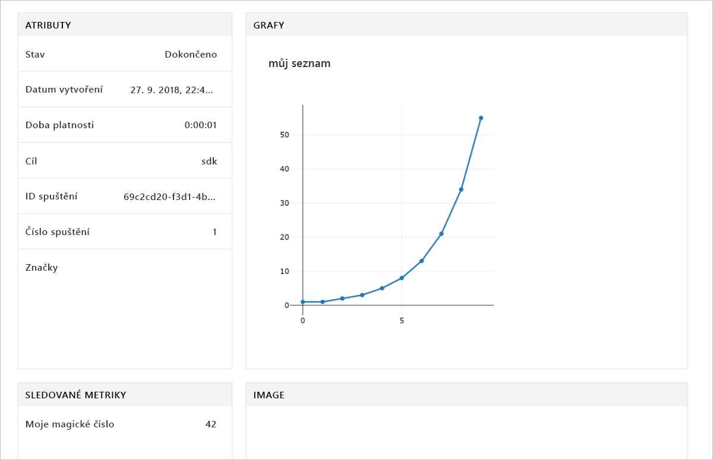

# <a name="quickstart-use-the-python-sdk-to-get-started-with-azure-machine-learning"></a>Rychlý start: Začínáme s Azure Machine Learning pomocí sady Python SDK

V tomto rychlém startu jste pomocí sady SDK Azure Machine Learning pro Python a potom pomocí služby Azure Machine Learning [pracovní prostor](concept-azure-machine-learning-architecture.md). Tento pracovní prostor je základním blokem v cloudu, který můžete využít k experimentování, trénování a nasazování modelů strojového učení pomocí služby Machine Learning. Začnete tím, že nakonfigurujete vlastní prostředí Pythonu a server poznámkového bloku Jupyter. Pokud chcete spustit v žádné instalaci, naleznete v tématu [rychlý start: Začínáme s Azure Machine Learning pomocí webu Azure portal](quickstart-get-started.md).

> [!VIDEO https://www.microsoft.com/en-us/videoplayer/embed/RE2G9N6]

V tomto kurzu nainstalujte si SDK pro Python a dokončení těchto úloh:

* Vytvořit pracovní prostor ve vašem předplatném Azure.
* Vytvořit pro tento pracovní prostor konfigurační soubor pro pozdější použití v jiných poznámkových blocích a skriptech.
* Napsat kód, který protokoluje hodnoty v pracovním prostoru.
* Zobrazit zaprotokolované hodnoty z vašeho pracovního prostoru.

V tomto rychlém startu vytvoříte pracovní prostor a konfigurační soubor. Tyto prostředky můžete použít jako nezbytné předpoklady pro další kurzy Machine Learning a články s postupy. Stejně jako u jiných služeb Azure, existují omezení a kvóty, které jsou spojeny s Machine Learning. [Další informace o kvótách a tom, jak požádat o další](how-to-manage-quotas.md).

Do vašeho pracovního prostoru se automaticky přidají následující prostředky Azure, pokud jsou regionálně dostupné:
 
- [Azure Container Registry](https://azure.microsoft.com/services/container-registry/)
- [Azure Storage](https://azure.microsoft.com/services/storage/)
- [Azure Application Insights](https://azure.microsoft.com/services/application-insights/) 
- [Azure Key Vault](https://azure.microsoft.com/services/key-vault/)

Pokud nemáte předplatné Azure, vytvořte si bezplatný účet, před zahájením. Zkuste [bezplatné nebo placené verzi aplikace služby Azure Machine Learning](http://aka.ms/AMLFree) ještě dnes.

## <a name="install-the-sdk"></a>Instalace sady SDK

> [!IMPORTANT]
> Tuto část přeskočte, pokud použijete virtuální počítač pro datové vědy vytvořený po 27. září 2018.
> Virtuální počítače pro datové vědy vytvořené po tomto datu režimu s využitím Python SDK, včetně.

Kód v tomto článku vyžaduje Azure Machine Learning v sadě SDK verze 1.0.2 nebo novější.

Před instalací sady SDK doporučujeme vytvořit izolované prostředí Pythonu. I když tento rychlý start používá aplikaci [Miniconda](https://conda.io/docs/user-guide/install/index.html), můžete také použít plnou nainstalovanou aplikaci [Anaconda](https://www.anaconda.com/) nebo [Python virtualenv](https://virtualenv.pypa.io/en/stable/).

### <a name="install-miniconda"></a>Instalace aplikace Miniconda


[Stáhněte](https://conda.io/miniconda.html) a nainstalujte aplikaci Miniconda. Vyberte Python verze 3.7 nebo novější. Nevybírejte Python verze 2.x.

### <a name="create-an-isolated-python-environment"></a>Vytvoření izolovaného prostředí Pythonu 

Otevřete okno příkazového řádku. Pak vytvořte nové prostředí conda s názvem **myenv** pomocí Pythonu 3.6.

```shell
conda create -n myenv -y Python=3.6
```

Aktivujte prostředí:

```shell
conda activate myenv
```

### <a name="install-the-sdk"></a>Instalace sady SDK

Nainstalujte sadu SDK do aktivovaných prostředí Conda. Tento kód nainstaluje základní komponenty sady SDK služby Machine Learning. Nainstaluje taky aplikace Jupyter Notebook server v prostředí conda. Instalace trvá několik minut na dokončení závislosti na konfiguraci vašeho počítače.

```sh
# Install Jupyter
conda install nb_conda

# Install the base SDK and Jupyter Notebook
pip install azureml-sdk[notebooks]
```

Další klíčová slova můžete také použít k instalaci dalších součástí sady SDK.

```sh
# Install the base SDK and auto ml components
pip install azureml-sdk[automl]

# Install the base SDK and the model explainability component
pip install azureml-sdk[explain]

# Install the base SDK and experimental components
pip install azureml-sdk[contrib]
```

V prostředí Azure Databricks pomocí následujícího příkazu nainstalujte místo toho:

```
# Install the base SDK and automl components in the Azure Databricks environment.
# For more information, see https://github.com/Azure/MachineLearningNotebooks/tree/master/databricks.
pip install azureml-sdk[databricks]
```


## <a name="create-a-workspace"></a>Vytvoření pracovního prostoru

Chcete-li spustit Poznámkový blok Jupyter, zadejte tento příkaz:

```shell
jupyter notebook
```

V okně prohlížeče se vytvoření nového poznámkového bloku pomocí výchozí **Python 3** jádra. 

Pokud chcete zobrazit verzi sady SDK, zadejte následující kód Pythonu do buňky v poznámkovém bloku a spusťte ho.

[!code-python[](~/aml-sdk-samples/ignore/doc-qa/quickstart-create-workspace-with-python/quickstart.py?name=import)]

Vytvořte novou skupinu prostředků Azure.

Najít hodnotu `<azure-subscription-id>` parametr [seznam předplatných na webu Azure Portal](https://ms.portal.azure.com/#blade/Microsoft_Azure_Billing/SubscriptionsBlade). Použijte libovolné předplatné, ve kterém máte roli vlastníka nebo přispěvatele.

```python
from azureml.core import Workspace
ws = Workspace.create(name='myworkspace',
                      subscription_id='<azure-subscription-id>',    
                      resource_group='myresourcegroup',
                      create_resource_group=True,
                      location='eastus2' # Or other supported Azure region  
                     )
```

Při spouštění kódu vám může zobrazit výzva k přihlášení ke svému účtu Azure. Jakmile se přihlásíte, ověřovací token se uloží do místní mezipaměti.

Pokud chcete zobrazit pracovní prostor podrobnosti, jako je například přidruženého úložiště, container registry a služby key vault, zadejte následující kód:

[!code-python[](~/aml-sdk-samples/ignore/doc-qa/quickstart-create-workspace-with-python/quickstart.py?name=getDetails)]


## <a name="write-a-configuration-file"></a>Zapsání konfiguračního souboru

Uložte podrobnosti pracovního prostoru v konfiguračním souboru v aktuálním adresáři. Soubor **aml_config\config.json**.  

Konfigurační soubor pracovního prostoru usnadňuje později načíst tato stejného pracovního prostoru. Můžete načíst pracovní prostor s jinými poznámkových bloků a skriptů ve stejném adresáři nebo podadresáře. 

[!code-python[](~/aml-sdk-samples/ignore/doc-qa/quickstart-create-workspace-with-python/quickstart.py?name=writeConfig)]


Volání rozhraní API `write_config()` vytvoří konfigurační soubor v aktuálním adresáři. Souboru config.json obsahuje následující skript:

```json
{
    "subscription_id": "<azure-subscription-id>",
    "resource_group": "myresourcegroup",
    "workspace_name": "myworkspace"
}
```

## <a name="use-the-workspace"></a>Použití pracovního prostoru

Napište kód, který používá základní rozhraní API sady SDK ke sledování experimentálních spuštění.

[!code-python[](~/aml-sdk-samples/ignore/doc-qa/quickstart-create-workspace-with-python/quickstart.py?name=useWs)]


## <a name="view-logged-results"></a>Zobrazení zaprotokolovaných výsledků
Po dokončení spuštění můžete experimentální spuštění zobrazit na webu Azure Portal. Použijte následující kód k vytištění adresu URL, která přejde na výsledcích posledního spuštění:

```python
print(run.get_portal_url())
```

Pokud chcete zobrazit zaprotokolované hodnoty na webu Azure Portal v prohlížeči, použijte odkaz.



## <a name="clean-up-resources"></a>Vyčištění prostředků 

> [!IMPORTANT]
> Prostředky, které jste vytvořili může sloužit jako požadavky na další kurzy Machine Learning a články s postupy.

Pokud nemáte v úmyslu používat prostředky, které jste vytvořili v rámci tohoto rychlého startu, odstraňte je proto nebudou účtovat žádné poplatky.

[!code-python[](~/aml-sdk-samples/ignore/doc-qa/quickstart-create-workspace-with-python/quickstart.py?name=delete)]


## <a name="next-steps"></a>Další postup

V tomto rychlém startu jste vytvořili prostředky k experimentování a nasazování modelů. Spuštění kódu v poznámkovém bloku a prozkoumali historii spuštění pro kód ve vašem pracovním prostoru v cloudu.

Použití kódu kurzy Machine Learning, potřebujete pár dalších balíčků ve vašem prostředí.

1. Zavřete poznámkový blok v prohlížeči.
1. V okně příkazového řádku zadejte Ctrl + C zastavte aplikace Jupyter Notebook server.
1. Instalace dalších balíčků:

    ```shell
    conda install -y cython matplotlib scikit-learn pandas numpy
    pip install azureml-sdk[automl]
    ```


Po instalaci balíčků, pokračujte v kurzech pro trénování a nasadit model. 

> [!div class="nextstepaction"]
> [Kurz: Trénování modelu klasifikace obrázků](tutorial-train-models-with-aml.md)

Můžete prozkoumat také [pokročilejší příklady na GitHubu](https://aka.ms/aml-notebooks).
