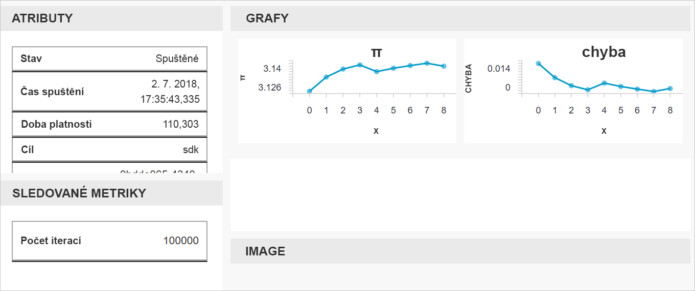

# <a name="quickstart-get-started-with-azure-machine-learning-using-the-cli-extension"></a>Rychlý start: Začínáme se službou Azure Machine Learning s použitím rozšíření pro rozhraní CLI

V tomto rychlém startu se dozvíte, jak začít se [službou Azure Machine Learning](overview-what-is-azure-ml.md) (Preview) pomocí rozšíření rozhraní CLI pro strojové učení.

Pomocí rozhraní CLI se naučíte:

1. Vytvořit pracovní prostor ve vašem předplatném Azure. Pracovní prostor využívá jeden nebo více uživatelů k ukládání výpočetních prostředků, modelů, nasazení a historií spuštění v cloudu.
1. Připojit projekt k vašemu pracovnímu prostoru.   Projekt je místní složka, která obsahuje skripty a konfiguračních souborů potřebné k řešení problému strojového učení.  
1. Spustit v projektu skript Pythonu, který bude protokolovat určité hodnoty napříč více iteracemi
1. Zobrazit zaprotokolované hodnoty v historii spuštění pracovního prostoru

> [!NOTE]
> Abychom vám usnadnili práci, jsou do pracovního prostoru automaticky přidané tyto prostředky Azure, pokud jsou regionálně dostupné: [registr kontejneru](https://azure.microsoft.com/services/container-registry/), [úložiště](https://azure.microsoft.com/services/storage/), [Application Insights](https://azure.microsoft.com/services/application-insights/) a [trezor klíčů](https://azure.microsoft.com/services/key-vault/).

Prostředky, které vytvoříte, je možné použít i ke splnění požadavků v dalších kurzech a článcích s návody pro službu Azure Machine Learning.

Toto rozhraní CLI bylo sestaveno s použitím sady <a href="http://aka.ms/aml-sdk" target="_blank">SDK</a> na bázi Pythonu pro službu Azure Machine Learning.

## <a name="prerequisites"></a>Požadavky

Před zahájením kroků v tomto rychlém startu se ujistěte, že splňujete následující požadavky:

+ Předplatné Azure. Pokud ještě nemáte předplatné Azure, vytvořte si [bezplatný účet](https://azure.microsoft.com/free/?WT.mc_id=A261C142F) před tím, než začnete.
+ Nainstalovaný jazyk [Python 3.5 nebo vyšší verze](https://www.python.org/)
+ Nainstalované rozhraní [Azure CLI](https://docs.microsoft.com/cli/azure/install-azure-cli?view=azure-cli-latest)

## <a name="install-the-cli-extension"></a>Instalace rozšíření pro rozhraní CLI

V počítači otevřete editor příkazového řádku a nainstalujte [rozšíření pro strojové učení do rozhraní Azure CLI](reference-azure-machine-learning-cli.md).  Instalace může trvat několik minut.

```azurecli
az extension add azureml-sdk
```

## <a name="install-the-sdk"></a>Instalace sady SDK

[!INCLUDE [aml-install-sdk](../../../includes/aml-install-sdk.md)]

## <a name="create-a-resource-group"></a>Vytvoření skupiny prostředků

Skupina prostředků je kontejner, který obsahuje související prostředky pro řešení Azure. Pomocí Azure CLI se přihlaste k Azure, určete předplatné a vytvořte skupinu prostředků.

V okně příkazového řádku se přihlaste pomocí příkazu Azure CLI `az login`. Postupujte podle pokynů pro interaktivní přihlášení:
    
   ```azurecli
   az login
   ```

Zobrazte si seznam dostupných předplatných Azure a určete, které chcete použít:
   ```azurecli
   az account list --output table
   az account set --subscription <your-subscription-id>
   az account show
   ```
   kde \<your-subscription-id\> je hodnota ID předplatného, které chcete použít. Závorky nezadávejte.

Vytvořte skupinu prostředků pro uložení pracovního prostoru.
V tomto rychlém startu:
   + Název skupiny prostředků je `docs-aml`.
   + Oblast je `eastus2`. 

   ```azurecli
   az group create -n docs-aml -l eastus2
   ```

## <a name="create-a-workspace-and-a-project-folder"></a>Vytvoření pracovního prostoru a složky projektu

V okně příkazového řádku vytvořte pracovní prostor Azure Machine Learning v rámci skupiny prostředků.


   V tomto rychlém startu:
   + Název pracovního prostoru je `docs-ws`.
   + Název skupiny prostředků je `docs-aml`

   ```azurecli
   az ml workspace create -n docs-ws -g docs-aml
   ```

V okně příkazového řádku vytvořte pro svůj projekt Azure Machine Learning složku na místním počítači.

   ```
   mkdir docs-prj
   cd docs-prj
   ```

## <a name="create-a-python-script"></a>Vytvoření skriptu Pythonu

[!INCLUDE [aml-create-script-pi](../../../includes/aml-create-script-pi.md)]

## <a name="run-the-script"></a>Spuštění skriptu

Připojte složku jako projekt do pracovního prostoru. Argument `--history` určuje název souboru historie spuštění, ve kterém se zaznamenávají metriky pro každé spuštění.

   ```azurecli
   az ml project attach --history my_history -w docs-ws -g docs-aml
   ```

Spusťte skript na místním počítači.

   ```azurecli
   az ml run submit -c local pi.py
   ```

   Tento příkaz spustí kód a vypíše webový odkaz do vaší konzoly. Odkaz zkopírujte a vložte do webového prohlížeče.

Ve webovém prohlížeči navštivte danou adresu URL. Zobrazí se webový portál s výsledky spuštění. Můžete si prohlédnout výsledky tohoto spuštění nebo předchozích spuštění, pokud jsou k dispozici.

Řídicí panel portálu je podporovaný jenom v prohlížečích Edge, Chrome a Firefox.

   

## <a name="clean-up-resources"></a>Vyčištění prostředků

[!INCLUDE [aml-delete-resource-group](../../../includes/aml-delete-resource-group.md)]

## <a name="next-steps"></a>Další kroky
Teď máte vytvořené prostředky potřebné k tomu, abyste mohli začít experimentovat a nasazovat modely. Vytvořili jste projekt, spustili skript a prozkoumali historii spuštění tohoto skriptu.

Pokud si chcete tento pracovní postup vyzkoušet do hloubky, postupujte podle kurzu ke službě Azure Machine Learning, který se zaměřuje na sestavení, vytrénování a nasazení modelu.

> [!div class="nextstepaction"]
> [Kurz: Sestavení, vytrénování a nasazení](tutorial-train-models-with-aml.md)