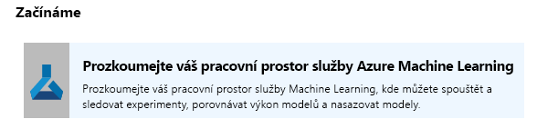
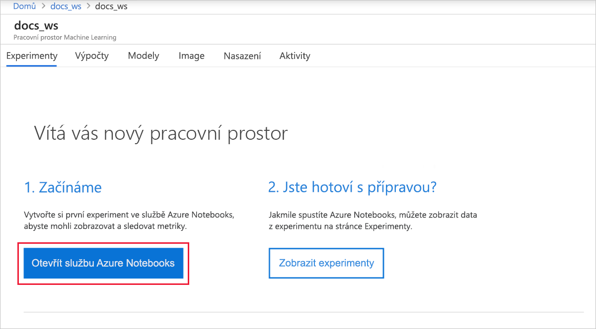
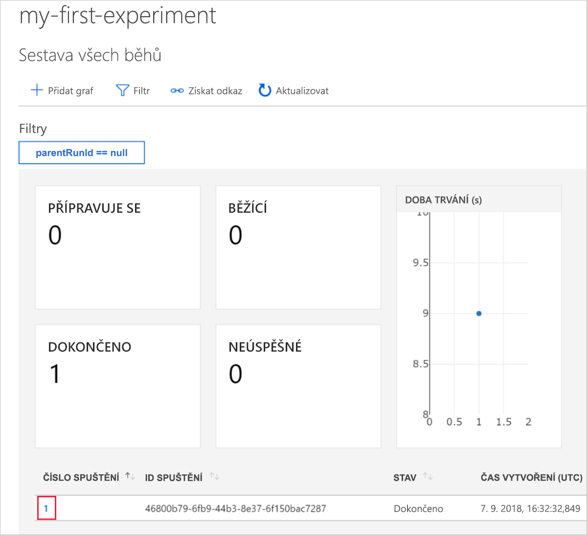
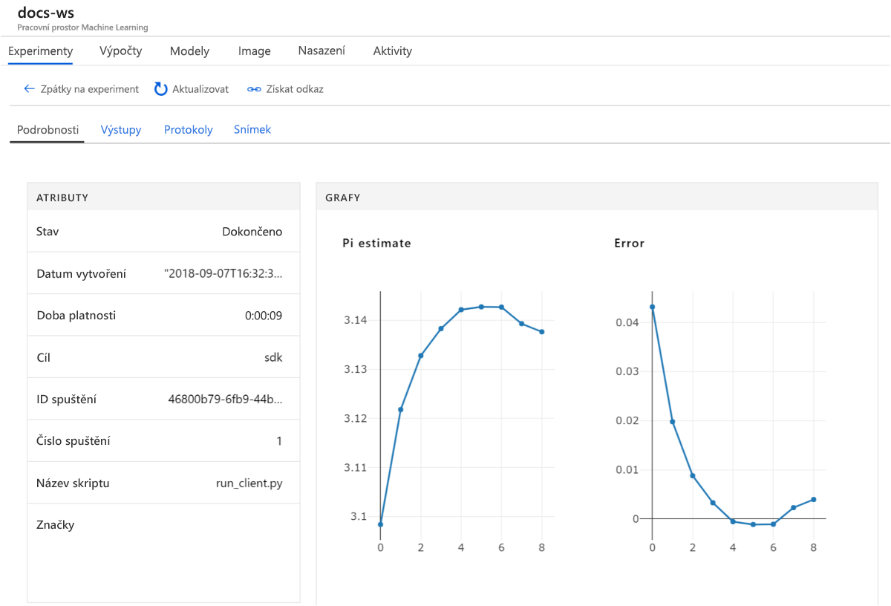

# Rychlý start: Začínáme s Azure Machine Learning pomocí webu Azure portal

V tomto rychlém startu pomocí webu Azure Portal vytvoříte pracovní prostor služby Azure Machine Learning. Tento pracovní prostor je základním blokem v cloudu, který můžete využít k experimentování, trénování a nasazování modelů strojového učení pomocí služby Machine Learning. V tomto rychlém startu se používají cloudové prostředky a nevyžaduje se žádná instalace. Místo toho nakonfigurovat svůj vlastní server poznámkového bloku Jupyter, najdete v části [rychlý start: Začínáme s Azure Machine Learning pomocí Pythonu](quickstart-create-workspace-with-python.md).

> [!VIDEO https://www.microsoft.com/en-us/videoplayer/embed/RE2F9Ad]

V tomto rychlém startu:

* Vytvořit pracovní prostor ve vašem předplatném Azure.
* Vyzkoušíte ho pomocí Pythonu v poznámkovém bloku Azure a budete protokolovat hodnoty napříč několika iteracemi.
* Zobrazíte zaprotokolované hodnoty ve vašem pracovním prostoru.

Do vašeho pracovního prostoru se automaticky přidají následující prostředky Azure, pokud jsou regionálně dostupné:

  - [Azure Container Registry](https://azure.microsoft.com/services/container-registry/)
  - [Azure Storage](https://azure.microsoft.com/services/storage/)
  - [Azure Application Insights](https://azure.microsoft.com/services/application-insights/) 
  - [Azure Key Vault](https://azure.microsoft.com/services/key-vault/)

Prostředky, které vytvoříte, je možné použít i ke splnění požadavků v dalších kurzech a článcích s návody pro službu Machine Learning. S ostatními službami Azure, jsou výpočetní omezení určitých prostředků pomocí služby Machine Learning, například velikost clusteru. Další informace o [výchozí omezení a o tom, aby vám zvýšila kvótu](how-to-manage-quotas.md).

Pokud nemáte předplatné Azure, vytvořte si bezplatný účet, před zahájením. Zkuste [bezplatné nebo placené verzi aplikace služby Azure Machine Learning](http://aka.ms/AMLFree) ještě dnes.

## Vytvoření pracovního prostoru 

[!INCLUDE [aml-create-portal](../../../includes/aml-create-in-portal.md)]

Na stránce pracovního prostoru vyberte `Explore your Azure Machine Learning service workspace`.

 

## Použití pracovního prostoru

Teď zjistíte, jak vám pracovní prostor pomůže spravovat vaše skripty strojového učení. V této části:

* Otevřete poznámkový blok ve službě Azure Notebooks.
* Spustíte kód, který vytvoří zaprotokolované hodnoty.
* Zobrazíte zaprotokolované hodnoty ve vašem pracovním prostoru.

Tento příklad ukazuje, jak vám pracovní prostor může pomoct udržovat si přehled o informacích generovaných ve skriptu. 

### Otevření poznámkového bloku 

Azure Notebooks nabízí bezplatnou cloudovou platformu pro poznámkové bloky Jupyter, které jsou předem nakonfigurované vším, co potřebujete ke spuštění služby Machine Learning.  

Vyberte `Open Azure Notebooks` a vyzkoušejte první experiment.

 

Vaše organizace může před přihlášením vyžadovat [souhlas správce](https://notebooks.azure.com/help/signing-up/work-or-school-account/admin-consent).

Po přihlášení se otevře nová karta a zobrazí se výzva `Clone Library`. Vyberte `Clone`.

### Spuštění poznámkového bloku

Spolu se dvěma poznámkovými bloky uvidíte soubor `config.json`. Tento konfigurační soubor obsahuje informace o vytvořeném pracovním prostoru.  

Výběrem souboru `01.run-experiment.ipynb` otevřete poznámkový blok.

Jednotlivé buňky můžete spustit pomocí `Shift`+`Enter`. Nebo vyberte `Cells` > `Run All` a spusťte celý poznámkový blok. Když se vedle buňky zobrazí hvězdička [*], znamená to, že je spuštěná. Po dokončení kódu v této buňce se zobrazí číslo. 

Po spuštění všech buněk v poznámkovém bloku můžete zobrazit zaprotokolované hodnoty ve vašem pracovním prostoru.

## Zobrazení zaprotokolovaných hodnot

Po spuštění všech buněk v poznámkovém bloku se vraťte na stránku portálu.  

Vyberte `View Experiments`.

Zavře automaticky otevírané okno `Reports`.

Vyberte `my-first-experiment`.

Prohlédněte si informace o spuštění, které jste právě provedli. Posuňte se dolů na stránce a najděte tabulku spuštění. Vyberte odkaz s číslem spuštění.

 

Zobrazí se diagramy, které se automaticky vytvořily ze zaprotokolovaných hodnot. Při každém zaprotokolování více hodnot se stejným parametrem názvu se pro vás automaticky vygeneruje diagram.

   

Vzhledem k tomu, že kód pro odhad čísla pí používá náhodné hodnoty, ve vašich diagramech se zobrazí jiné hodnoty.  

## Vyčištění prostředků 

[!INCLUDE [aml-delete-resource-group](../../../includes/aml-delete-resource-group.md)]

Můžete také zachovat skupinu prostředků, ale odstranit jeden pracovní prostor. Zobrazte vlastnosti pracovního prostoru a vyberte **Odstranit**.

## Další postup

Vytvořili jste prostředky potřebné k experimentování s modely a jejich nasazení. Také jste spustili kód v poznámkovém bloku. Kromě toho jste prozkoumali historii spuštění z tohoto kódu ve vašem pracovním prostoru v cloudu.

Podrobný pracovní postup najdete v kurzech pro Machine Learning věnovaných trénování a nasazení modelu.  

> [!div class="nextstepaction"]
> [Kurz: Trénování modelu klasifikace obrázků](tutorial-train-models-with-aml.md)
