# <a name="quickstart-install-and-get-started-with-azure-machine-learning-services"></a>Rychlý start: Instalace služeb Azure Machine Learning a začátek práce s nimi
Služby Azure Machine Learning (Preview) představují komplexní integrované řešení pro datové vědy a pokročilé analýzy. Pomáhá profesionálním datovým vědcům připravovat data, vyvíjet experimenty a nasazovat modely na úrovni cloudu.

V tomto rychlém startu se naučíte:

* Vytvoření účtů služeb pro služby Azure Machine Learning
* Instalace a přihlášení do aplikace Azure Machine Learning Workbench
* Vytvoření projektu v aplikaci Workbench
* Spuštění skriptu v tomto projektu  
* Přístup k rozhraní příkazového řádku


Jako součást portfolia Microsoft Azure vyžadují služby Azure Machine Learning předplatné Azure. Pokud ještě nemáte předplatné Azure, vytvořte si [bezplatný účet](https://azure.microsoft.com/free/?WT.mc_id=A261C142F) před tím, než začnete.

Kromě toho musíte mít odpovídající oprávnění k vytváření prostředků, jako jsou skupiny prostředků, virtuální počítače atd. 

<a name="prerequisites"></a>Aplikaci Azure Machine Learning Workbench můžete nainstalovat v následujících operačních systémech:
- Windows 10 nebo Windows Server 2016
- macOS Sierra nebo High Sierra

## <a name="create-azure-machine-learning-services-accounts"></a>Vytvoření účtů služeb Azure Machine Learning
Ke zřízení účtů služeb Azure Machine Learning použijte web Azure Portal: 
1. Přihlaste se k webu [Azure Portal](https://portal.azure.com/) pomocí přihlašovacích údajů předplatného Azure, které budete používat. Pokud ještě nemáte předplatné Azure, vytvořte si teď [bezplatný účet](https://azure.microsoft.com/free/?WT.mc_id=A261C142F). 

   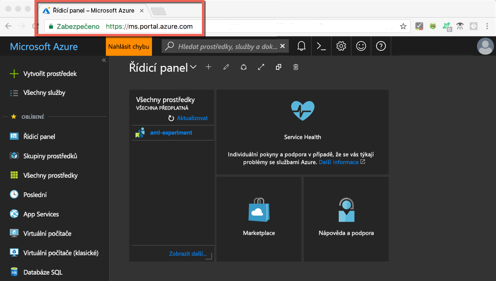

1. Vyberte tlačítko **Vytvořit prostředek** (+) v levém horním rohu portálu.

   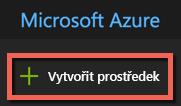

1. Do panelu vyhledávání zadejte **Machine Learning**. Vyberte výsledek hledání s názvem **Experimentování ve službě Machine Learning**. 

   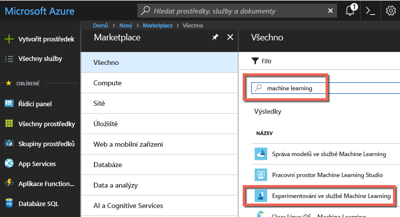

1. V podokně **Experimentování ve službě Machine Learning** se posuňte dolů, vyberte **Vytvořit** a začněte definovat svůj účet Experimentování.  

   

1. V podokně **Experimentování v ML** nakonfigurujte svůj účet Experimentování ve službě Machine Learning. 

   Nastavení|Navrhovaná hodnota pro tento kurz|Popis
   ---|---|---
   Název účtu služby Experimentování | _Jedinečný název_ |Zadejte jedinečný název, který identifikuje váš účet. Můžete použít své jméno nebo třeba název oddělení nebo projektu, který experiment nejlépe identifikuje. Název musí mít délku od 2 do 32 znaků. Může obsahovat jenom alfanumerické znaky a znak spojovníku (-). 
   Předplatné | _Vaše předplatné_ |Zvolte předplatné Azure, které chcete pro experiment použít. Pokud máte více předplatných, zvolte odpovídající předplatné, ve kterém se prostředek účtuje.
   Skupina prostředků | _Vaše skupina prostředků_ | Použijte existující skupinu prostředků ve vašem předplatném nebo zadejte název a vytvořte pro tento účet Experimentování novou skupinu prostředků. 
   Umístění | _Oblast nejbližší vašim uživatelům_ | Zvolte umístění co nejblíže vašim uživatelům a datovým prostředkům.
   Počet licencí | 2 | Zadejte počet licencí. Informace o tom, jak [licence ovlivňují ceny](https://azure.microsoft.com/pricing/details/machine-learning/).<br/><br/>Pro účely tohoto rychlého startu potřebujete jenom dvě licence. Licence je možné podle potřeby přidávat nebo odebírat na webu Azure Portal.
   Účet úložiště | _Jedinečný název_ | Vyberte **Vytvořit nový** a zadejte název pro vytvoření [účtu úložiště Azure](https://docs.microsoft.com/azure/storage/common/storage-quickstart-create-account?tabs=portal). Název musí být dlouhý 3 až 24 znaků a může obsahovat pouze alfanumerické znaky. Případně vyberte **Použít existující** a z rozevíracího seznamu vyberte existující účet úložiště. Účet úložiště je povinný a slouží k ukládání artefaktů projektu a dat historie spuštění. 
   Účet aplikace Workspace pro experimentování | IrisGarden<br/>(název používaný v kurzech) | Zadejte název pracovního prostoru pro tento účet. Název musí mít délku od 2 do 32 znaků. Může obsahovat jenom alfanumerické znaky a znak spojovníku (-). Tento pracovní prostor obsahuje nástroje potřebné k vytváření, správě a publikování experimentů.
   Přiřazení vlastníka pracovního prostoru | _Váš účet_ | Jako vlastníka pracovního prostoru vyberte svůj vlastní účet.
   Vytvoření účtu služby Správa modelů | **zaškrtnutí** |Vytvořte účet služby Správa modelů už teď, aby byl tento prostředek k dispozici, až budete chtít nasadit a spravovat své modely jako webové služby fungující v reálném čase. <br/><br/>I když je to volitelné, doporučujeme vytvořit účet služby Správa modelů zároveň s účtem Experimentování.
   Název účtu | _Jedinečný název_ | Vyberte jedinečný název, který identifikuje váš účet služby Správa modelů. Můžete použít své jméno nebo třeba název oddělení nebo projektu, který experiment nejlépe identifikuje. Název musí mít délku od 2 do 32 znaků. Může obsahovat jenom alfanumerické znaky a znak spojovníku (-). 
   Cenová úroveň služby Správa modelů | **DEVTEST** | Vyberte **Není vybraná žádná cenová úroveň** a určete cenovou úroveň svého nového účtu služby Správa modelů. Z důvodu úspory nákladů vyberte cenovou úroveň **DEVTEST**, pokud je ve vašem předplatném dostupná (omezená dostupnost). Jinak vyberte cenovou úroveň S1. Kliknutím na možnost **Vybrat** uložte volbu cenové úrovně. 
   Připnutí na řídicí panel | _zaškrtnutí_ | Výběrem možnosti **Připnout na řídicí panel** povolíte snadné sledování vašeho účtu služby Experimentování ve službě Machine Learning na úvodní stránce řídicího panelu na webu Azure Portal.

   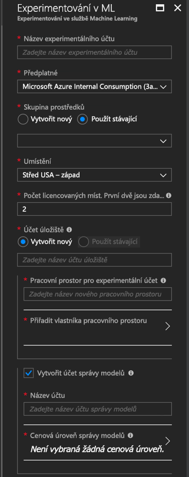

5. Vyberte **Vytvořit** a zahajte proces vytváření účtu Experimentování společně s účtem služby Správa modelů.

   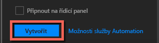

   Vytvoření účtu může chvíli trvat. Stav procesu nasazení můžete zkontrolovat kliknutím na ikonu Upozornění (zvonek) na panelu nástrojů webu Azure Portal.
   
   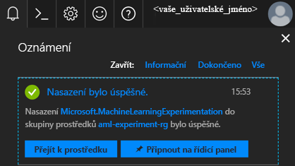


## <a name="install-and-log-in-to-workbench"></a>Instalace a přihlášení do aplikace Workbench

Aplikace Azure Machine Learning Workbench je dostupná pro Windows nebo macOS. Viz seznam [podporovaných platforem](#prerequisites).

>[!WARNING]
>Dokončení instalace může trvat přibližně 30 minut. 

1. Stáhněte a spusťte nejnovější instalační program aplikace Workbench. 
   >[!IMPORTANT]
   >Stáhněte celý instalační program na disk a spusťte jej. Nespouštějte jej přímo z widgetu stahování v prohlížeči.

   **Ve Windows:** 

   &nbsp;&nbsp;&nbsp;&nbsp;A. Stáhněte soubor [AmlWorkbenchSetup.msi](https://aka.ms/azureml-wb-msi).  <br/>
   &nbsp;&nbsp;&nbsp;&nbsp;B. Dvakrát klikněte na stažený instalační program v Průzkumníku souborů.

   **V systému macOS:** 

   &nbsp;&nbsp;&nbsp;&nbsp;A. Stáhněte soubor [AmlWorkbench.dmg](https://aka.ms/azureml-wb-dmg). <br/>
   &nbsp;&nbsp;&nbsp;&nbsp;B. Dvakrát klikněte na stažený instalační program ve Finderu.<br/><br/>

1. Až do konce postupujte podle pokynů na obrazovce instalačního programu. 

   **Dokončení instalace může trvat přibližně 30 minut.**  
   
   | |Cesta k instalaci aplikaci Azure Machine Learning Workbench|
   |--------|------------------------------------------------|
   |Windows|C:\Users\\<uživatel\>\AppData\Local\AmlWorkbench|
   |macOS|/Applications/Azure ML Workbench.app|

   Instalační program stáhne a nastaví všechny potřebné závislosti, jako je Python, Miniconda a další související knihovny. Tato instalace zahrnuje také nástroj příkazového řádku pro více platforem neboli Azure CLI.

1. Spusťte aplikaci Workbench výběrem tlačítka **Spustit aplikaci Workbench** na poslední obrazovce instalačního programu. 

   Pokud jste instalační program zavřeli:
   + Ve Windows ji spustíte pomocí zástupce **Machine Learning Workbench** na ploše. 
   + V systému macOS vyberte **Azure ML Workbench** na hlavním panelu.

1. Na první obrazovce vyberte **Přihlásit se účtem Microsoft** a proveďte ověření v aplikaci Azure Machine Learning Workbench. Použijte stejné přihlašovací údaje, jako jste použili na webu Azure Portal k vytvoření účtů Experimentování a služby Správa modelů. 

   Jakmile budete přihlášeni, aplikace Workbench použije první účet Experimentování, který najde ve vašich předplatných Azure, a zobrazí všechny pracovní prostory a projekty přidružené k tomuto účtu. 

   >[!TIP]
   > Pomocí ikony v levém dolním rohu okna aplikace Workbench můžete přepnout na jiný účet Experimentování.

## <a name="create-a-project-in-workbench"></a>Vytvoření projektu v aplikaci Workbench

Ve službě Azure Machine Learning je projekt logickým kontejnerem pro veškerou práci prováděnou za účelem vyřešení problému. Mapuje se na jedinou složku na místním disku, do které můžete přidat jakékoli soubory nebo podsložky. 

Tady vytváříme nový projekt aplikace Workbench pomocí šablony, která zahrnuje [datovou sadu Iris](https://en.wikipedia.org/wiki/Iris_flower_data_set). V kurzech, které následují po tomto rychlém startu, na těchto datech závisí sestavení modelu pro předpověď typu dat Iris na základě některých fyzických charakteristik.  

1. V otevřené aplikaci Azure Machine Learning Workbench vyberte symbol plus (+) v podokně **PROJEKTY** a zvolte **Nový projekt**.  

   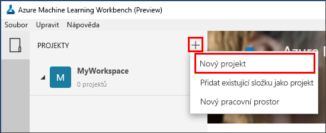

1. Vyplňte pole formuláře a výběrem tlačítka **Vytvořit** v aplikaci Workbench vytvořte nový projekt.

   Pole|Navrhovaná hodnota pro tento kurz|Popis
   ---|---|---
   Název projektu | myIris |Zadejte jedinečný název, který identifikuje váš účet. Můžete použít své jméno nebo třeba název oddělení nebo projektu, který experiment nejlépe identifikuje. Název musí mít délku od 2 do 32 znaků. Může obsahovat jenom alfanumerické znaky a znak spojovníku (-). 
   Adresář projektu | c:\Temp\ | Zadejte adresář, ve kterém se projekt vytvoří.
   Popis projektu | _ponechte prázdné_ | Volitelné pole, které je užitečné pro popis projektů.
   Adresa URL úložiště GIT Visualstudio.com |_ponechte prázdné_ | Volitelné pole. Projekt je volitelně možné přidružit k úložišti Git ve Visual Studio Team Services, které umožňuje správu zdrojového kódu a spolupráci. [Tady najdete potřebné informace.](../desktop-workbench/using-git-ml-project.md#step-3-set-up-a-machine-learning-project-and-git-repo) 
   Vybraný pracovní prostor | IrisGarden (pokud existuje) | Zvolte pracovní prostor, který jste vytvořili pro svůj účet Experimentování na webu Azure Portal. <br/>Pokud jste postupovali podle tohoto rychlého startu, měli byste mít pracovní prostor IrisGarden. Pokud ne, vyberte pracovní prostor, který jste vytvořili při vytváření účtu Experimentování, nebo jakýkoli jiný, který chcete použít.
   Šablona projektu | Klasifikace Iris | Šablony obsahují skripty a data, pomocí kterých můžete produkt zkoumat. Tato šablona obsahuje skripty a data, které potřebujete pro tento rychlý start a další kurzy na tomto webu dokumentace. 

   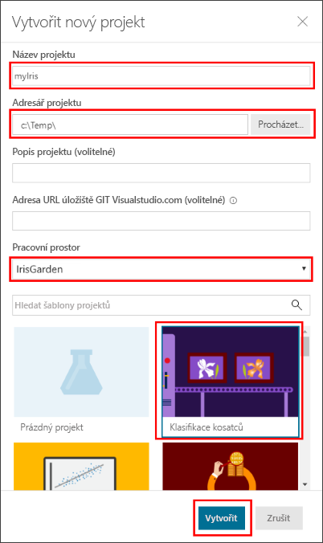
 
 Vytvoří se nový projekt a otevře se řídicí panel projektu s tímto projektem. Teď můžete prozkoumat domovskou stránku projektu, zdroje dat, poznámkové bloky a soubory zdrojového kódu. 

>[!TIP]
>Aplikaci Workbench můžete nakonfigurovat pro práci s integrovaným vývojovým prostředím (IDE) pro Python a získat tak pohodlné vývojové prostředí pro datové vědy. Pak můžete se svým projektem pracovat v integrovaném vývojovém prostředí. [Zjistěte jak](../desktop-workbench/how-to-configure-your-ide.md). 

## <a name="run-a-python-script"></a>Spuštění skriptu v jazyce Python

Teď můžete na svém počítači spustit skript **iris_sklearn.py**. Tento skript je standardní součástí šablony projektu **Klasifikace Iris**. Skript sestaví model [logistické regrese](https://en.wikipedia.org/wiki/Logistic_regression) s využitím oblíbené knihovny [scikit-learn](http://scikit-learn.org/stable/index.html) jazyka Python.

1. Na příkazovém řádku v horní části stránky **Řídicí panel projektu** vyberte cíl spuštění **local** (místní) a skript ke spuštění **iris_sklearn.py**. Ve výchozím nastavení jsou tyto hodnoty předem vybrané. 

   Součástí ukázky jsou i další soubory, které si můžete prohlédnout později, v tomto rychlém startu nás však zajímá pouze soubor **iris_sklearn.py**. 

   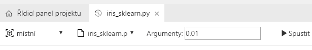

1. Do textového pole **Argumenty** zadejte **0.01**. Toto číslo odpovídá míře regularizace a ve skriptu se používá ke konfiguraci modelu logistické regrese. 

1. Vyberte **Spustit** a spusťte provádění skriptu na svém počítači. Úloha **iris_sklearn.py** se okamžitě zobrazí na panelu **Úlohy** na pravé straně, takže můžete monitorovat provádění skriptu.

   Blahopřejeme! Úspěšně jste spustili skript Pythonu v aplikaci Azure Machine Learning Workbench.

1. Několikrát zopakujte kroky 2 až 3 s použitím jiných hodnot argumentů v rozsahu **0.001** až **10** (použijte například násobky 10). Každé spuštění se zobrazí v podokně **Úlohy**.

1. Prozkoumejte historii spuštění výběrem zobrazení **Spuštění** a pak v seznamu Spuštění vyberte **iris_sklearn.py**. 

   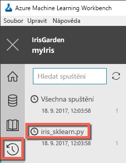

   Toto zobrazení obsahuje každé spuštění souboru **iris_sklearn.py**. Řídicí panel historie spuštění také obsahuje hlavní metriky, sadu výchozích grafů a seznam metrik pro každé spuštění. 

1. Pomocí ikon ozubeného kola a filtru si toto zobrazení můžete přizpůsobit řazením, filtrováním a úpravou konfigurací.

   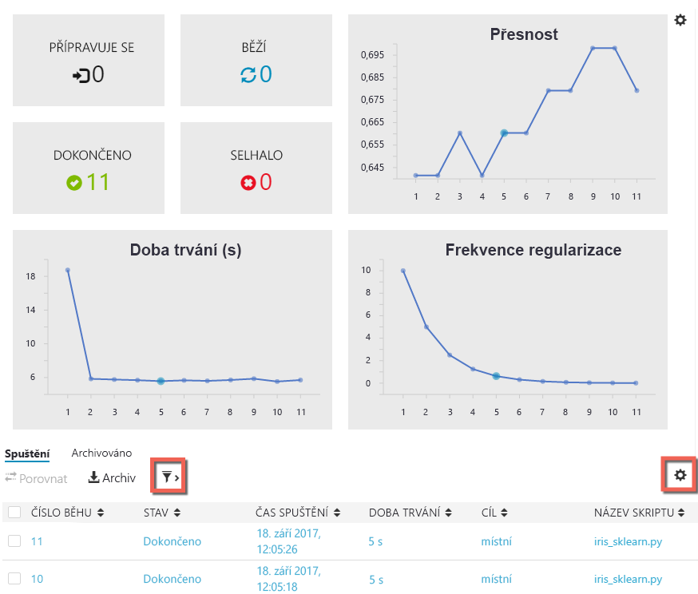

3. Výběrem dokončeného spuštění v podokně Úlohy můžete zobrazit podrobný přehled tohoto konkrétního spuštění. Podrobnosti zahrnují další metriky, vytvořené soubory a další potenciálně užitečné protokoly.

## <a name="start-the-cli"></a>Spuštění rozhraní příkazového řádku

Nainstalované je také rozhraní příkazového řádku služby Azure Machine Learning. Toto rozhraní příkazového řádku umožňuje přístup ke službám Azure Machine Learning a práci s nimi pomocí příkazů `az` a provádění veškerých úloh nezbytných pro komplexní pracovní postup datových věd. [Další informace](../desktop-workbench/tutorial-iris-azure-cli.md)

Rozhraní příkazového řádku služby Azure Machine Learning můžete spustit z panelu nástrojů aplikace Workbench přes **Soubor → Otevřít příkazový řádek**.

Nápovědu k příkazům v rozhraní příkazového řádku služby Azure Machine Learning získáte pomocí argumentu --help.

```az ml --help```

## <a name="clean-up-resources"></a>Vyčištění prostředků

[!INCLUDE [aml-delete-resource-group](../../../includes/aml-delete-resource-group.md)]

## <a name="next-steps"></a>Další kroky
Právě jste vytvořili potřebné účty služby Azure Machine Learning a nainstalovali jste aplikaci Azure Machine Learning Workbench. Také jste vytvořili projekt, spustili skript a prozkoumali historii spuštění tohoto skriptu.

Podrobnější poznatky o tomto pracovním postupu, včetně postupu nasazení modelu Iris jako webové služby, najdete v kurzu *Klasifikace Iris* na pokračování. Tento kurz obsahuje podrobné postupy pro [přípravu dat](../desktop-workbench/tutorial-classifying-iris-part-1.md), [experimentování](../desktop-workbench/tutorial-classifying-iris-part-2.md) a [správu modelů](../desktop-workbench/tutorial-classifying-iris-part-3.md). 

> [!div class="nextstepaction"]
> [Kurz: Klasifikace Iris (Část 1)](../desktop-workbench/tutorial-classifying-iris-part-1.md)

>[!NOTE]
> Přestože jste vytvořili účet služby Správa modelů, vaše prostředí ještě není nastavené pro nasazování webových služeb. Zjistěte, jak nastavit [prostředí pro nasazení](../desktop-workbench/deployment-setup-configuration.md).
