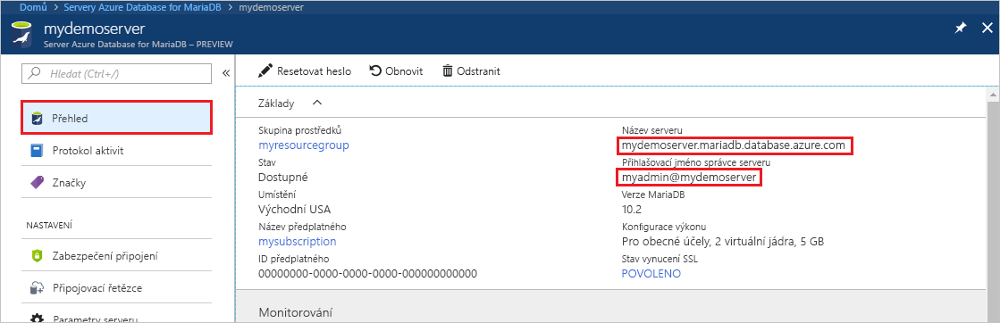
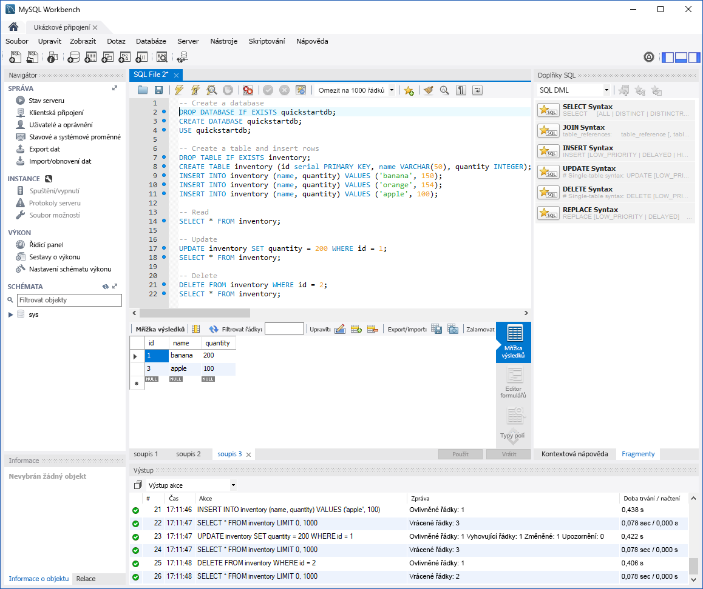

# <a name="azure-database-for-mariadb-use-mysql-workbench-to-connect-and-query-data"></a>Azure Database for MariaDB: Připojení a dotazování dat pomocí aplikace MySQL Workbench
Tento rychlý start ukazuje, jak se připojit ke službě Azure Database for MariaDB pomocí aplikace MySQL Workbench. 

## <a name="prerequisites"></a>Požadavky
Tento rychlý start jako výchozí bod využívá prostředky vytvořené v některém z těchto průvodců:
- [Vytvoření serveru Azure Database for MariaDB pomocí webu Azure Portal](./quickstart-create-mariadb-server-database-using-azure-portal.md)
- [Vytvoření serveru Azure Database for MariaDB pomocí Azure CLI](./quickstart-create-mariadb-server-database-using-azure-cli.md)

## <a name="install-mysql-workbench"></a>Instalace aplikace MySQL Workbench
Stáhněte aplikaci MySQL Workbench z [webu MySQL](https://dev.mysql.com/downloads/workbench/) a nainstalujte ji na svém počítači.

## <a name="get-connection-information"></a>Získání informací o připojení
Získejte informace potřebné pro připojení ke službě Azure Database for MariaDB. Potřebujete plně kvalifikovaný název serveru a přihlašovací údaje.

1. Přihlaste se k webu [Azure Portal](https://portal.azure.com/).

2. V nabídce vlevo na webu Azure Portal klikněte na **Všechny prostředky** a vyhledejte vytvořený server (například **mydemoserver**).

3. Klikněte na název serveru.

4. Na panelu **Přehled** serveru si poznamenejte **Název serveru** a **Přihlašovací jméno správce serveru**. Pokud zapomenete své heslo, můžete ho na tomto panelu také resetovat.
 

## <a name="connect-to-server-using-mysql-workbench"></a>Připojení k serveru pomocí aplikace MySQL Workbench 
K serveru Azure Database for MariaDB se pomocí aplikace MySQL Workbench připojíte takto:

1.  Spusťte na svém počítači aplikaci MySQL Workbench. 

2.  V dialogovém okně pro **nastavení nového připojení** zadejte na kartě **Parametry** následující informace:

    

    | **Nastavení** | **Navrhovaná hodnota** | **Popis pole** |
    |---|---|---|
    |   Název připojení | Ukázkové připojení | Zadejte popisek pro toto připojení. |
    | Způsob připojení | Standard (TCP/IP) | Standard (TCP/IP) je dostačující. |
    | Název hostitele | *název serveru* | Zadejte hodnotu názvu serveru, kterou jste použili dříve při vytváření služby Azure Database for MariaDB. Server v našem příkladu je mydemoserver.mariadb.database.azure.com. Použijte plně kvalifikovaný název domény (\*.mariadb.database.azure.com), jak je znázorněno v příkladu. Pokud si název vašeho serveru nepamatujete, získejte informace o připojení pomocí postupu v předchozí části.  |
    | Port | 3306 | Při připojování ke službě Azure Database for MariaDB vždy používejte port 3306. |
    | Uživatelské jméno |  *přihlašovací jméno správce serveru* | Zadejte přihlašovací uživatelské jméno správce serveru, které jste zadali dříve při vytváření služby Azure Database for MariaDB. Uživatelské jméno v našem příkladu je myadmin@mydemoserver. Pokud si uživatelské jméno nepamatujete, získejte informace o připojení pomocí postupu v předchozí části. Formát je *username@servername*.
    | Heslo | vaše heslo | Kliknutím na tlačítko **Uložit v trezoru...** heslo uložte. |

3.   Pokud chcete otestovat, jestli jsou všechny parametry správně nakonfigurované, klikněte na **Test připojení**. 

4.   Kliknutím na **OK** uložte připojení. 

5.   Ve výpisu **připojení k MySQL** klikněte na dlaždici odpovídající vašemu serveru a počkejte na navázání připojení.

        Otevře se nová karta SQL s prázdným editorem, do kterého můžete zadávat dotazy.
    
        > [!NOTE]
        > Ve výchozím nastavení se na serveru Azure Database for MariaDB vyžaduje a vynucuje zabezpečení připojení protokolem SSL. Přestože aplikace MySQL Workbench obvykle pro připojení k serveru nevyžaduje žádnou další konfiguraci s certifikáty SSL, doporučujeme vytvořit vazbu certifikace SSL CA s aplikací MySQL Workbench. Pokud potřebujete SSL zakázat, přejděte na web Azure Portal, klikněte na stránku Zabezpečení připojení a deaktivujte přepínací tlačítko Vynutit připojení SSL.

## <a name="create-table-insert-read-update-and-delete-data"></a>Vytvoření tabulky, vložení, čtení, aktualizace a odstranění dat
1. Pro ilustraci nějakých ukázkových dat zkopírujte vzorový kód SQL a vložte ho do prázdné karty SQL.

    Tento kód vytvoří prázdnou databázi quickstartdb a pak vytvoří ukázkovou tabulku inventory. Vloží několik řádků a ty pak načte. Pomocí příkazu UPDATE data změní a znovu načte řádky. Nakonec jeden řádek odstraní a znovu načte řádky.
    
    ```sql
    -- Create a database
    -- DROP DATABASE IF EXISTS quickstartdb;
    CREATE DATABASE quickstartdb;
    USE quickstartdb;
    
    -- Create a table and insert rows
    DROP TABLE IF EXISTS inventory;
    CREATE TABLE inventory (id serial PRIMARY KEY, name VARCHAR(50), quantity INTEGER);
    INSERT INTO inventory (name, quantity) VALUES ('banana', 150);
    INSERT INTO inventory (name, quantity) VALUES ('orange', 154);
    INSERT INTO inventory (name, quantity) VALUES ('apple', 100);
    
    -- Read
    SELECT * FROM inventory;
    
    -- Update
    UPDATE inventory SET quantity = 200 WHERE id = 1;
    SELECT * FROM inventory;
    
    -- Delete
    DELETE FROM inventory WHERE id = 2;
    SELECT * FROM inventory;
    ```

    Snímek obrazovky ukazuje příklad kódu SQL v aplikaci MySQL Workbench a výstup po jeho spuštění.
    
    

2. Pokud chcete spustit ukázkový kód SQL, klikněte na ikonu blesku na panelu nástrojů karty **Soubor SQL**.
3. Všimněte si výsledků na třech kartách v části **Mřížka výsledků** uprostřed stránky. 
4. Všimněte si seznamu **Výstup** v dolní části stránky. V něm se zobrazí stavy jednotlivých příkazů. 

Nyní jste se připojili ke službě Azure Database for MariaDB pomocí aplikace MySQL Workbench a s využitím jazyka SQL jste se dotázali na data.

<!--
## Next steps
> [!div class="nextstepaction"]
> [Migrate your database using Export and Import](./concepts-migrate-import-export.md)
-->