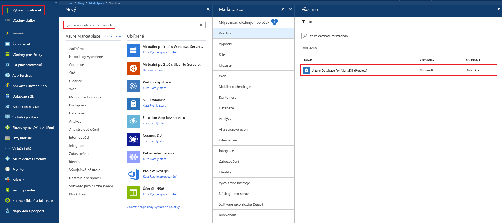
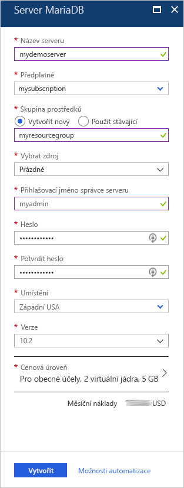
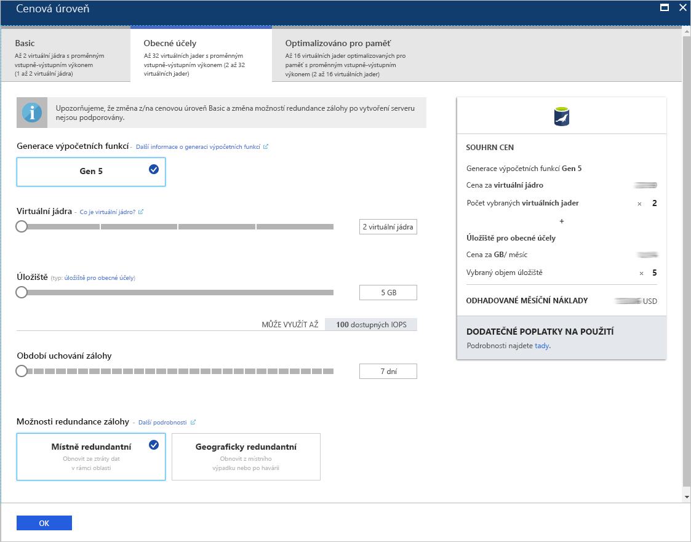
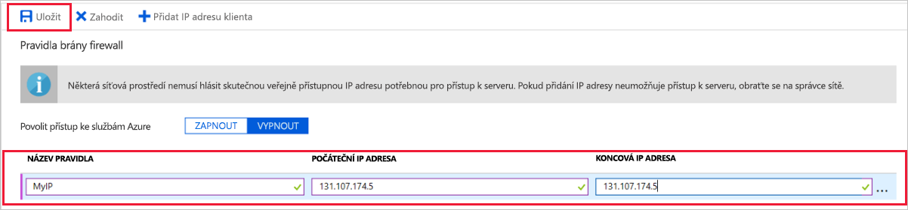
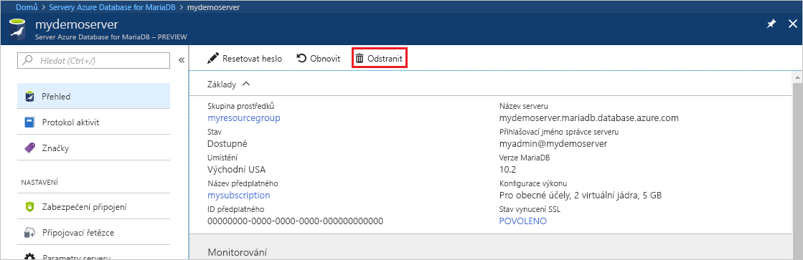

# <a name="create-an-azure-database-for-mariadb-server-by-using-the-azure-portal"></a>Vytvoření serveru Azure Database for MariaDB pomocí webu Azure Portal

Azure Database for MariaDB je spravovaná služba, pomocí které můžete provozovat, spravovat a škálovat vysoce dostupné databáze MariaDB v cloudu. V tomto rychlém startu se dozvíte, jak přibližně během pěti minut vytvořit server Azure Database for MariaDB pomocí webu Azure Portal.  

Pokud ještě nemáte předplatné Azure, vytvořte si [bezplatný účet Azure](https://azure.microsoft.com/free/) před tím, než začnete.

## <a name="sign-in-to-the-azure-portal"></a>Přihlášení k webu Azure Portal

Ve webovém prohlížeči přejděte na web [Azure Portal](https://portal.azure.com/). Zadejte přihlašovací údaje pro přihlášení k portálu. Výchozím zobrazením je váš řídicí panel služby.

## <a name="create-an-azure-database-for-mariadb-server"></a>Vytvoření serveru Azure Database for MariaDB

Server Azure Database for MariaDB vytvoříte s definovanou sadou [výpočetních prostředků a prostředků úložiště](concepts-pricing-tiers.md). Server vytvoříte v rámci [skupiny prostředků Azure](../azure-resource-manager/resource-group-overview.md).

Vytvoření serveru Azure Database for MariaDB:

1. Vyberte tlačítko **Vytvořit prostředek** (+) v levém horním rohu portálu.

2. Zadáním **Azure Database for MariaDB** do vyhledávacího pole službu vyhledejte.

   

3. Zadejte nebo vyberte následující podrobnosti o serveru:
   
   

    Nastavení | Navrhovaná hodnota | Popis
    ---|---|---
    Název serveru | *Jedinečný název serveru* | Zvolte jedinečný název, který identifikuje váš server Azure Database for MariaDB. Například **mydemoserver**. K zadanému názvu serveru se připojí název domény *.mariadb.database.azure.com*. Název serveru může obsahovat pouze malá písmena, číslice a znak spojovníku (-). Musí mít 3 až 63 znaků.
    Předplatné | *Vaše předplatné* | Vyberte předplatné Azure, které chcete použít pro váš server. Pokud máte více předplatných, zvolte předplatné, ve kterém se vám prostředek účtuje.
    Skupina prostředků | **myresourcegroup** | Zadejte název nové skupiny prostředků nebo vyberte existující skupinu prostředků. 
    Výběr zdroje | **Prázdné** | Vyberte **Prázdné** a vytvořte nový server od začátku. (Pokud vytváříte server z geografické zálohy existujícího serveru Azure Database for MariaDB, vyberte **Záloha**.)
    Přihlašovací jméno správce serveru | **myadmin** | Přihlašovací účet, který budete používat při připojování k serveru. Přihlašovací jméno správce nemůže být **azure_superuser**, **admin**, **administrator**, **root**, **guest** ani **public**.
    Heslo | *Nějaké si zvolte* | Zadejte nové heslo pro účet správce serveru. Musí mít 8 až 128 znaků. Heslo musí obsahovat znaky ze tří z následujících kategorií: Velká písmena anglické abecedy, malá písmena, číslice (0 – 9) a jiné než alfanumerické znaky (!, $, #, % a tak dále).
    Potvrzení hesla | *Nějaké si zvolte*| Potvrďte heslo účtu správce.
    Umístění | *Oblast nejbližší vašim uživatelům*| Vyberte umístění co nejblíže vašim uživatelům nebo vašim dalším aplikacím Azure.
    Verze | *Nejnovější verze*| Nejnovější verze (pokud nemáte specifické požadavky vyžadující použití jiné verze).
    Cenová úroveň | Viz popis. | Konfigurace výpočtů, úložiště a zálohování pro nový server. Vyberte **Cenová úroveň** > **Pro obecné účely**. U následujících nastavení ponechte výchozí hodnoty:<br><ul><li>**Výpočetní generace** (Gen 5)</li><li>**Virtuální jádra** (2 virtuální jádra)</li><li>**Úložiště** (5 GB)</li><li>**Období uchování zálohy** (7 dnů)</li></ul><br>Pokud chcete povolit zálohování serveru v geograficky redundantním úložišti, v části **Možnosti redundance zálohy** vyberte **Geograficky redundantní**. <br><br>Vyberte **OK** a uložte tento výběr cenové úrovně. Další snímek zachycuje tyto výběry.
  
    > [!IMPORTANT]
    > Zde zadané přihlašovací jméno a heslo správce serveru se vyžadují pro přihlášení k serveru a jeho databázím dále v tomto rychlém startu. Tyto informace si zapamatujte nebo poznamenejte pro pozdější použití.
    > 

   

4.  Vyberte **Vytvořit**, aby se server zřídil. Zřizování může trvat až 20 minut.
   
5.  Pokud chcete monitorovat proces nasazení, vyberte na panelu nástrojů **Oznámení** (ikona zvonku).
   
Ve výchozím nastavení se v rámci vašeho serveru vytvoří následující databáze: **information_schema**, **mysql**, **performance_schema** a **sys**.


## <a name="configure-firewall-rule"></a>Konfigurace pravidla brány firewall na úrovni serveru

Služba Azure Database for MariaDB vytváří bránu firewall na úrovni serveru. Brána firewall brání externím aplikacím a nástrojům v připojení k serveru a kterékoli databázi na serveru, pokud není vytvořené pravidlo brány firewall k otevření brány firewall pro konkrétní IP adresy. 

Vytvoření pravidla brány firewall na úrovni serveru:

1.   Po dokončení nasazení přejděte ke svému serveru. V případě potřeby ho můžete vyhledat. V nabídce vlevo vyberte například **Všechny prostředky**. Pak zadejte název serveru. Například nově vytvořený server vyhledáte zadáním**mydemoserver**. Vyberte název serveru ze seznamu výsledků hledání. Otevře se stránka **Přehled** vašeho serveru. Na této stránce můžete měnit další nastavení.

2. Na stránce přehledu serveru vyberte **Zabezpečení připojení**.

3.  V části **Pravidla brány firewall** vyberte prázdné textové pole ve sloupci **Název pravidla** a začněte vytvářet pravidlo brány firewall. Určete přesný rozsah IP adres klientů, kteří se budou připojovat k tomuto serveru.
   
   

4. Na horním panelu nástrojů na stránce **Zabezpečení připojení** vyberte **Uložit**. Než budete pokračovat, počkejte na zobrazení oznámení o úspěšném dokončení aktualizace. 

   > [!NOTE]
   > Připojení ke službě Azure Database for MariaDB komunikují přes port 3306. Pokud se pokoušíte připojit z podnikové sítě, odchozí provoz přes port 3306 nemusí být povolený. V takovém případě musí vaše IT oddělení otevřít port 3306, abyste se mohli k serveru připojit.
   > 

## <a name="get-connection-information"></a>Získání informací o připojení

Pokud se chcete připojit ke svému databázovému serveru, potřebujete úplný název serveru a přihlašovací údaje správce. Tyto hodnoty jste si pravděpodobně poznamenali v dřívější části tohoto článku. Pokud ne, můžete název serveru a přihlašovací údaje snadno vyhledat na stránce **Přehled** nebo **Vlastnosti** serveru na webu Azure Portal:

1. Přejděte na stránku **Přehled** vašeho serveru. Poznamenejte si hodnoty **Název serveru** a **Přihlašovací jméno správce serveru**. 

2. Pokud chcete tyto hodnoty zkopírovat, umístěte kurzor na pole, které chcete zkopírovat. Napravo od textu se zobrazí ikona kopírování. Podle potřeby hodnoty zkopírujte výběrem ikony kopírování.

V našem příkladu je název serveru **mydemoserver.mariadb.database.azure.com** a přihlašovací jméno správce serveru je **myadmin@mydemoserver**.

## <a name="connect-to-azure-database-for-mariadb-by-using-the-mysql-command-line"></a>Připojení ke službě Azure Database for MariaDB pomocí příkazového řádku mysql

Pro připojení k serveru Azure Database for MariaDB můžete použít řadu aplikací.

Nejprve si ukážeme, jak se k serveru připojit pomocí nástroje pro příkazový řádek [mysql](https://dev.mysql.com/doc/refman/5.7/en/mysql.html). Můžete použít také webový prohlížeč a Azure Cloud Shell, a to bez instalace softwaru. Pokud máte nástroj mysql nainstalovaný místně, můžete se připojit i z něj.

1. Spusťte Azure Cloud Shell pomocí ikony terminálu (**>_**) na pravém horním panelu nástrojů na webu Azure Portal.


2.  Ve vašem prohlížeči se otevře Azure Cloud Shell. Ve službě Cloud Shell můžete používat příkazy prostředí Bash.

   

3. V příkazovém řádku služby Cloud Shell se zadáním příkazového řádku mysql připojte k serveru Azure Database for MariaDB.

    Pokud se chcete připojit k serveru Azure Database for MariaDB pomocí nástroje mysql, použijte následující formát:

    ```bash
    mysql --host <fully qualified server name> --user <server admin login name>@<server name> -p
    ```

    Například následující příkaz se připojí k našemu ukázkovému serveru:

    ```azurecli-interactive
    mysql --host mydemoserver.mariadb.database.azure.com --user myadmin@mydemoserver -p
    ```

    Parametr mysql |Navrhovaná hodnota|Popis
    ---|---|---
    --host | *název serveru* | Hodnota názvu serveru, kterou jste použili při vytváření serveru Azure Database for MariaDB. Server v našem příkladu je **mydemoserver.mariadb.database.azure.com**. Použijte plně kvalifikovaný název domény (**\*.mariadb.database.azure.com**), jak je znázorněno v příkladu. Pokud si název vašeho serveru nepamatujete, získejte informace o připojení pomocí postupu v předchozí části.
    --user | *přihlašovací jméno správce serveru* |Přihlašovací uživatelské jméno správce serveru, které jste použili při vytváření serveru Azure Database for MariaDB. Pokud si uživatelské jméno nepamatujete, získejte informace o připojení pomocí postupu v předchozí části. Formát je *username@servername*.
    -p | *Vaše heslo*<br>(počkejte na zobrazení výzvy) |Po zobrazení výzvy zadejte heslo, které jste použili při vytváření serveru. Při zadávání hesla se na příkazovém řádku Bash zadávané znaky nezobrazí. Po zadání hesla stiskněte Enter.

   Jakmile se nástroj mysl připojí, zobrazí se příkazový řádek `mysql>`. Na tomto příkazovém řádku můžete zadávat příkazy. 

   Tady je příklad výstupu mysql:

    ```bash
    Welcome to the MySQL monitor.  Commands end with ; or \g.
    Your MySQL connection id is 65505
    Server version: 5.6.39.0 MariaDB Server
    
    Copyright (c) 2000, 2017, Oracle and/or its affiliates. All rights reserved.
    
    Oracle is a registered trademark of Oracle Corporation and/or its
    affiliates. Other names may be trademarks of their respective
    owners.

    Type 'help;' or '\h' for help. Type '\c' to clear the current input statement.
    
    mysql>
    ```
    
    > [!TIP]
    > Pokud brána firewall není nakonfigurovaná k povolení IP adresy služby Azure Cloud Shell, dojde k následující chybě:
    >
    >   CHYBA 2003 (28000): Klient s IP adresou 123.456.789.0 nepovoluje přístup k serveru.
    >
    > Pokud chcete chybu vyřešit, zajistěte,aby konfigurace serveru odpovídala postupu popsanému v části [Konfigurace pravidla brány firewall na úrovni serveru](#configure-firewall-rule).

4. Pokud chcete ověřit připojení, na příkazovém řádku `mysql>` zadejte**status** a zkontrolujte stav serveru.

    ```sql
    status
    ```

   > [!TIP]
   > Další příkazy najdete v [Referenční příručce k MySQL 5.7 – v kapitole 4.5.1](https://dev.mysql.com/doc/refman/5.7/en/mysql.html).

5.  Zadáním následujícího příkazu na příkazovém řádku `mysql>` vytvořte prázdnou databázi:

    ```sql
    CREATE DATABASE quickstartdb;
    ```
    Dokončení příkazu může trvat několik minut. 

    Na serveru Azure Database for MariaDB můžete vytvořit jednu nebo několik databází. Pro každý server můžete vytvořit jednu databázi, která bude využívat všechny prostředky, nebo několik databází, které budou prostředky sdílet. Neexistuje žádné omezení počtu databází, které můžete vytvořit, ale více databází sdílí stejné prostředky serveru. 

6. Pokud chcete zobrazit seznam databází, na příkazovém řádku `mysql>` zadejte následující příkaz:

    ```sql
    SHOW DATABASES;
    ```

7.  Zadejte **\q** a stisknutím klávesy Enter ukončete nástroj mysql. Pak můžete zavřít Azure Cloud Shell.

Připojili jste se k serveru Azure Database for MariaDB a vytvořili jste prázdnou uživatelskou databázi. V další části se ke stejnému serveru připojíte pomocí dalšího běžného nástroje MySQL Workbench.

## <a name="connect-to-the-server-by-using-mysql-workbench"></a>Připojení k serveru pomocí aplikace MySQL Workbench

Připojení k serveru pomocí aplikace MySQL Workbench:

1. Na klientském počítači otevřete MySQL Workbench. MySQL Workbench můžete stáhnout a nainstalovat ze [stránky pro stažení aplikace MySQL Workbench](https://dev.mysql.com/downloads/workbench/).

2. Pokud chcete vytvořit nové připojení, vyberte ikonu se symbolem plus (**+**) vedle záhlaví **Připojení k MySQL**.

3. V dialogovém okně pro **nastavení nového připojení** zadejte na kartě **Parametry** informace o připojení k vašemu serveru. Jako příklad jsou zobrazeny zástupné hodnoty. **Název hostitele**, **Uživatelské jméno** a **Heslo** nahraďte vlastními hodnotami.

   

    |Nastavení |Navrhovaná hodnota|Popis pole|
    |---|---|---|
     Název připojení | **Ukázkové připojení** | Popisek pro toto připojení. |
    Způsob připojení | **Standard (TCP/IP)** | Standard (TCP/IP) je dostačující. |
    Název hostitele | *název serveru* | Hodnota názvu serveru, kterou jste použili při vytváření serveru Azure Database for MariaDB. Server v našem příkladu je **mydemoserver.mariadb.database.azure.com**. Použijte plně kvalifikovaný název domény (**\*.mariadb.database.azure.com**), jak je znázorněno v příkladu. Pokud si název vašeho serveru nepamatujete, získejte informace o připojení tím, že dokončíte dřívější kroky v tomto článku.|
     Port | 3306 | Port, který se má použít při připojování k serveru Azure Database for MariaDB. |
    Uživatelské jméno |  *přihlašovací jméno správce serveru* | Přihlašovací údaje správce serveru, které jste použili při vytváření serveru Azure Database for MariaDB. Uživatelské jméno v našem příkladu je **myadmin@mydemoserver**. Pokud si uživatelské jméno nepamatujete, získejte informace o připojení tím, že dokončíte dřívější kroky v tomto článku. Formát je *username@servername*.
    Heslo | *Vaše heslo* | Výběrem možnosti **Uložit v trezoru** heslo uložte. |

4. Pokud chcete zkontrolovat, jestli jsou všechny parametry správně nakonfigurované, vyberte **Test připojení**. Potom vyberte **OK** a uložte připojení. 

    > [!NOTE]
    > Ve výchozím nastavení se na vašem serveru vynucuje SSL. Pro úspěšné připojení je tak potřeba další konfigurace. Další informace najdete v článku o [konfiguraci připojení SSL v aplikaci pro zabezpečené připojení k Azure Database for MariaDB](./howto-configure-ssl.md). Pokud chcete pro účely tohoto rychlého startu SSL zakázat, v nabídce na stránce přehledu serveru na webu Azure Portal vyberte **Zabezpečení připojení**. V části **Vynutit připojení SSL** vyberte **Zakázáno**.
    >

## <a name="clean-up-resources"></a>Vyčištění prostředků

Prostředky, které jste vytvořili v rámci tohoto rychlého startu, můžete vyčistit dvěma způsoby. Můžete odstranit [skupinu prostředků Azure](../azure-resource-manager/resource-group-overview.md). Tím se odstraní všechny prostředky v dané skupině prostředků. Pokud chcete ostatní prostředky zachovat beze změny, odstraňte pouze příslušný prostředek serveru.

> [!TIP]
> Další rychlé starty v této kolekci jsou postavené na tomto rychlém startu. Pokud chcete pokračovat v práci s dalšími rychlými starty pro Azure Database for MariaDB, neodstraňujte prostředky, které jste vytvořili v rámci tohoto rychlého startu. Pokud pokračovat nechcete, pomocí následujících kroků odstraňte všechny prostředky, které jste v tomto rychlém startu vytvořili.
>

Odstranění celé skupiny prostředků, včetně nově vytvořeného serveru:

1.  Na webu Azure Portal vyhledejte svou skupinu prostředků. V nabídce vlevo vyberte **Skupiny prostředků** a pak vyberte název vaší skupiny prostředků (v našem příkladu je to **myresourcegroup**).

2.  Na stránce skupiny prostředků vyberte **Odstranit**. Pak odstranění potvrďte zadáním názvu vaší skupiny prostředků (v našem příkladu je to **myresourcegroup**). Vyberte **Odstranit**.

Odstranění pouze nově vytvořeného serveru:

1.  Na webu Azure Portal vyhledejte váš server, pokud ho ještě nemáte otevřený. V nabídce vlevo vyberte **Všechny prostředky**. Pak vyhledejte server, který jste vytvořili.

2.  Na stránce **Přehled** vyberte **Odstranit**. 

   

3.  Potvrďte název serveru, který chcete odstranit. Zobrazte databáze na tomto serveru, které odstranění ovlivní. Potvrďte odstranění zadáním názvu vašeho serveru (v našem příkladě je to**mydemoserver**). Vyberte **Odstranit**.

## <a name="next-steps"></a>Další postup

- [Návrh první databáze Azure Database for MariaDB](./tutorial-design-database-using-portal.md)
