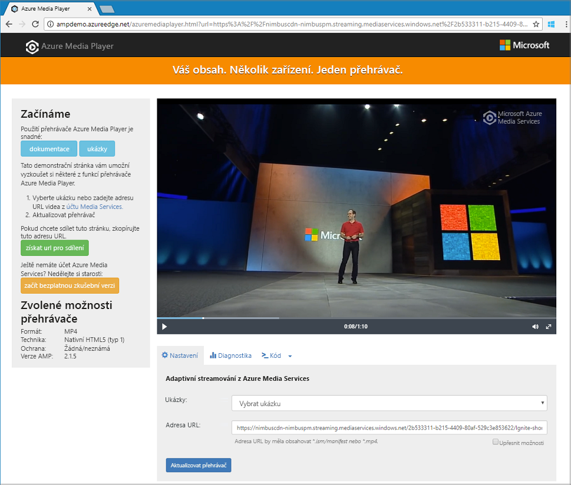

# <a name="quickstart-stream-video-files---net"></a>Rychlý start: Streamování videosouborů – .NET

> [!NOTE]
> Nejnovější verze služby Azure Media Services je ve verzi Preview a může být označována jako v3. Pokud chcete začít používat rozhraní API v3, měli byste vytvořit nový účet služby Media Services, jak je popsáno v tomto rychlém startu. 

Tento rychlý start předvádí, jak je jednoduché začít se streamováním videí pomocí služby Azure Media Services v široké škále prohlížečů a zařízení. Ukázka v tomto tématu kóduje obsah, který zpřístupníte prostřednictvím adresy URL protokolu HTTPS. 

Na konci rychlého startu budete schopni streamovat video.  



[!INCLUDE [quickstarts-free-trial-note](../../../includes/quickstarts-free-trial-note.md)]

## <a name="prerequisites"></a>Požadavky

Pokud nemáte nainstalovanou sadu Visual Studio, můžete získat sadu [Visual Studio Community 2017](https://www.visualstudio.com/thank-you-downloading-visual-studio/?sku=Community&rel=15).

## <a name="download-the-sample"></a>Stažení ukázky

Pomocí následujícího příkazu naklonujte do svého počítače úložiště GitHub s ukázkou streamování .NET:  

 ```bash
 git clone https://github.com/Azure-Samples/media-services-v3-dotnet-quickstarts.git
 ```

Ukázka se nachází ve složce [EncodeAndStreamFiles](https://github.com/Azure-Samples/media-services-v3-dotnet-quickstarts/tree/master/AMSV3Quickstarts/EncodeAndStreamFiles).

Tato ukázka provede následující akce:

1. Vytvoří transformaci (nejprve zkontroluje, jestli zadaná transformace existuje). 
2. Vytvoří výstupní prostředek, který se použije jako výstup úlohy kódování.
3. Na základě adresy URL protokolu HTTPS vytvoří vstup úlohy.
4. Pomocí dříve vytvořeného vstupu a výstupu úlohu kódování odešle.
5. Zkontroluje stav úlohy.
6. Vytvoří streamovací lokátor (StreamingLocator).
7. Vytvoří adresy URL pro streamování.

Popisy týkající jednotlivých funkcí v ukázce najdete v kódu. Můžete se také podívat na komentáře v [tomto zdrojovém souboru](https://github.com/Azure-Samples/media-services-v3-dotnet-quickstarts/blob/master/AMSV3Quickstarts/EncodeAndStreamFiles/Program.cs).

## <a name="log-in-to-azure"></a>Přihlášení k Azure

Přihlaste se k portálu [Azure Portal](http://portal.azure.com).

[!INCLUDE [cloud-shell-try-it.md](../../../includes/cloud-shell-try-it.md)]

[!INCLUDE [media-services-cli-create-v3-account-include](../../../includes/media-services-cli-create-v3-account-include.md)]

[!INCLUDE [media-services-v3-cli-access-api-include](../../../includes/media-services-v3-cli-access-api-include.md)]

## <a name="run-the-sample-app"></a>Spuštění ukázkové aplikace

Když spustíte aplikaci, zobrazí se adresy URL, které můžete použít k přehrávání videa pomocí různých protokolů. 

1. Stisknutím kombinace kláves Ctrl+F5 spusťte aplikaci *EncodeAndStreamFiles*.
2. Vyberte protokol **HLS** společnosti Apple (končí řetězcem *manifest(format=m3u8-aapl)*) a zkopírujte adresu URL streamování z konzoly.


Ve [zdrojovém kódu](https://github.com/Azure-Samples/media-services-v3-dotnet-quickstarts/blob/master/AMSV3Quickstarts/EncodeAndStreamFiles/Program.cs) ukázky můžete vidět, jak je adresa URL tvořená. Pokud ji chcete vytvořit, musíte zřetězit název hostitele koncového bodu hostování a cestu lokátoru streamování.  

## <a name="test-with-azure-media-player"></a>Testování s Azure Media Playerem

Tento článek používá k otestování streamu přehrávač Azure Media Player. 

> [!NOTE]
> Pokud se přehrávač hostuje na webu HTTPS, nezapomeňte adresu URL aktualizovat tak, aby obsahovala „https“. 

1. Otevřete webový prohlížeč a přejděte na adresu [https://aka.ms/azuremediaplayer/](https://aka.ms/azuremediaplayer/).
2. Do pole **URL:** vložte jednu z hodnot adres URL pro streamování, které jste získali při spuštění aplikace. 
3. Stiskněte **Update Player** (Aktualizovat přehrávač).

Azure Media Player můžete použít pro účely testování, nesmí se ale používat v produkčním prostředí. 

## <a name="clean-up-resources"></a>Vyčištění prostředků

Pokud ze skupiny prostředků už žádné prostředky nepotřebujete, včetně účtu služby Media Services a účtů úložiště, které jste vytvořili v rámci tohoto rychlého startu, odstraňte tuto skupinu prostředků. Můžete použít nástroj **CloudShell**.

V nástroji **CloudShell** spusťte následující příkaz:

```azurecli-interactive
az group delete --name amsResourceGroup
```

## <a name="examine-the-code"></a>Kontrola kódu

Popisy týkající jednotlivých funkcí v ukázce najdete v kódu. Můžete se také podívat na komentáře v [tomto zdrojovém souboru](https://github.com/Azure-Samples/media-services-v3-dotnet-quickstarts/blob/master/AMSV3Quickstarts/EncodeAndStreamFiles/Program.cs).

Kurz [nahrávání, kódování a streamování souborů](stream-files-tutorial-with-api.md) vám poskytne složitější příklad streamování s podrobnými vysvětlivkami. 

## <a name="multithreading"></a>Multithreading

Sady SDK služby Azure Media Services v3 nejsou bezpečné pro přístup z více vláken. Při práci s vícevláknovou aplikací byste měli pro každé vlákno vygenerovat nový objekt AzureMediaServicesClient.

## <a name="next-steps"></a>Další kroky

> [!div class="nextstepaction"]
> [Kurz: Nahrávání, kódování a streamování souborů](stream-files-tutorial-with-api.md)
