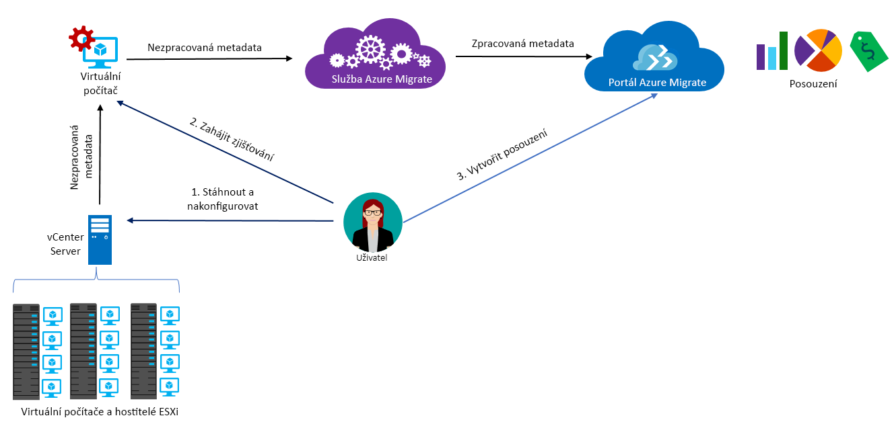

# Informace o službě Azure Migrate

Služba Azure Migrate posuzuje místní úlohy pro migraci do Azure. Služba posuzuje vhodnost místních počítačů k migraci a velikost na základě výkonu a poskytuje odhad nákladů na provoz místních počítačů v Azure. Pokud zvažujete migrace metodou „lift and shift“ nebo se nacházíte v počátečních fázích posuzování migrace, tato služba je určená přímo pro vás. Po posouzení můžete počítače migrovat do Azure pomocí služeb, jako jsou [Azure Site Recovery](https://docs.microsoft.com/azure/site-recovery/site-recovery-overview) a [Azure Database Migration Service](https://docs.microsoft.com/azure/dms/dms-overview).

## Proč používat službu Azure Migrate?

Azure Migrate vám pomůže s následujícími úlohami:

- **Posouzení připravenosti pro Azure**: Vyhodnoťte, jestli vaše místní počítače jsou vhodné pro spuštění v Azure.
- **Získejte doporučení k velikosti**: Získejte doporučení k velikosti pro virtuální počítače Azure na základě historie výkonu místních virtuálních počítačů.
- **Odhadované měsíční náklady**: Získejte odhadované náklady na provoz místních počítačů v Azure.  
- **Migrace s větší jistotou**: Vizualizace závislostí místních počítačů k vytváření skupin počítačů, které budete posuzovat a migrovat společně.

## Aktuální omezení

- Vhodnost k migraci na virtuální počítače Azure můžete posuzovat pouze u místních virtuálních počítačů VMware. Virtuální počítače VMware musí být spravované přes vCenter Server (verze 5.5, 6.0 nebo 6.5).
- Pokud chcete posoudit fyzické servery a virtuální počítače Hyper-V, použijte [Plánovač nasazení služby Azure Site Recovery](https://aka.ms/asr-dp-hyperv-doc) pro Hyper-V a [partnerské nástroje](https://azure.microsoft.com/migration/partners/) pro fyzické počítače.
- Je možné vyhledat až 1 500 virtuálních počítačů v rámci jednoho zjišťování a až 1 500 virtuálních počítačů v jednom projektu. Kromě toho můžete v rámci jednoho interního hodnocení vyhodnotit až 1 500 virtuálních počítačů.
- Pokud chcete provést zjišťování u velkého prostředí, můžete zjišťování rozdělit a vytvořit několik projektů. [Další informace](how-to-scale-assessment.md). Azure Migrate podporuje až 20 projektů na jedno předplatné.
- Azure Migrate podporuje pro posouzení migrace jenom spravované disky.
-  Projekt Azure Migrate můžete vytvořit pouze v následujících zeměpisných oblastech. Ale to vás neomezuje vaše schopnost vytvořit posouzení pro jiné cílové umístění Azure.
    **Zeměpisné oblasti** | **Umístění úložiště**
    --- | ---
    Sjednotí stavy | Střed USA – západ nebo USA – východ
    Azure Government | USA (Gov) – Virginia

    Zeměpisné oblasti přidružené k projektu migrace slouží k uložení metadat zjištěných v místním prostředí. Metadata jsou uložena v oblastech podle zeměpisné oblasti vybrané pro tento projekt migrace. Pokud můžete použít vizualizaci závislostí, tak, že vytvoříte nový pracovní prostor Log Analytics, vytvoří se pracovní prostor ve stejné oblasti jako projekt.
- Funkce vizualizace závislostí není k dispozici ve službě Azure Government.

## Za co musím platit?

[Další informace](https://azure.microsoft.com/pricing/details/azure-migrate/) o cenách služby Azure Migrate.

## Co je součástí posouzení?

Nastavení posouzení si můžete přizpůsobit podle vašich potřeb. Souhrn vlastností posouzení najdete v následující tabulce.

**Vlastnost** | **Podrobnosti**
--- | ---
**Cílové umístění** | Umístění Azure, do kterého chcete migrovat.  Azure Migrate aktuálně podporuje 33 oblastech jako cílové umístění migrace. [Seznam oblastí najdete tady](https://azure.microsoft.com/global-infrastructure/services/). Cílová oblast je standardně nastavená na USA – západ 2.
**Typ úložiště** | Typ spravované disky, které chcete přidělit pro všechny virtuální počítače, které jsou součástí posouzení. Pokud je kritérium určení velikosti *jako v místním nastavení velikosti* cílový typ disku můžete zadat buď jako disky premium (výchozí), standardní disky SSD nebo standardní HDD disky. Pro *určení velikosti na základě výkonu*, spolu s výše uvedených možností, máte také možnost vybrat automatického, která zajistí, že na disku, doporučení velikosti provádí automaticky podle data o výkonu virtuálních počítačů. Například, pokud chcete dosáhnout [jednu instanci virtuálního počítače SLA 99,9 %](https://azure.microsoft.com/support/legal/sla/virtual-machines/v1_8/), můžete chtít zadat typ úložiště jako spravované disky úrovně Premium, které zajistí, že všechny disky v posouzení se doporučují jako spravované disky úrovně Premium. Poznámka: Azure Migrate podporuje pro posouzení migrace jenom spravované disky.
**Rezervované instance** |  Můžete zadat, jestli v Azure máte [rezervované instance](https://azure.microsoft.com/pricing/reserved-vm-instances/). Azure Migrate odhadne náklady odpovídajícím způsobem.
**Kritérium určení velikosti** | Nastavení velikosti může být založen na **historie výkonu** z místních virtuálních počítačů (výchozí), nebo **jako místní**, bez zohlednění historie výkonu.
**Historie výkonu** | Azure Migrate ve výchozím nastavení vyhodnocuje výkon místních počítačů s využitím historie výkonu za poslední den a hodnoty 95. percentilu.
**Faktor komfortu** | Azure Migrate při posuzování počítá s rezervou (faktor komfortu). Tato rezerva se použije nad rámec dat o využití počítače pro virtuální počítače (procesor, paměť, disk a síť). Důvodem použití faktoru komfortu jsou problémy, jako jsou sezónní využití, krátká historie výkonu a pravděpodobný růst budoucího využití.   Například z virtuálního počítače s 10 jádry a 20% využitím je normálně ve výsledku virtuální počítač se 2 jádry. S faktorem komfortu 2,0× je však výsledkem virtuální počítač se 4 jádry. Výchozí nastavení komfortu je 1,3×.
**Řada virtuálních počítačů** | Řada virtuálních počítačů, která se použije k odhadu velikostí. Pokud máte například produkční prostředí, které se nechystáte migrovat na virtuální počítače řady A-Series v Azure, můžete vyloučit řadu A-Series ze seznamu nebo řad. Určení velikosti se provádí pouze na základě vybraných řad.   
**Měna** | Fakturační měna. Výchozí hodnota je USD.
**Sleva (%)** | Jakákoli sleva pro konkrétní předplatné, kterou získáte nad rámec nabídky Azure. Výchozí nastavení je 0 %.
**Doba provozu virtuálního počítače** | Pokud se vaše virtuální počítače běžet 24 x 7 v Azure, můžete určit dobu trvání (počet dnů za měsíc) a počtu hodin za den pro kterou se bude spuštěna a odhad nákladů se provede odpovídajícím způsobem. Výchozí hodnota je 31 dnů za měsíc a 24 hodin denně.
**Nabídka Azure** | [Nabídka Azure](https://azure.microsoft.com/support/legal/offer-details/), kterou máte zaregistrovanou. Azure Migrate odhadne náklady odpovídajícím způsobem.
**Zvýhodněné hybridní využití Azure** | Můžete zadat, jestli máte Software Assurance a nárok na [Zvýhodněné hybridní využití Azure](https://azure.microsoft.com/pricing/hybrid-use-benefit/) se sníženými náklady.

## Jak služba Azure Migrate funguje?

1.  Vytvoříte projekt Azure Migrate.
2.  Azure Migrate pomocí místního počítače označovaného jako zařízení kolektoru zjistí informace o místních počítačích. Toto zařízení vytvoříte tak, že stáhnete instalační soubor ve formátu .ova (Open Virtualization Appliance) a importujete ho jako virtuální počítač na místní vCenter Server.
3. Z vCenter Serveru se připojíte k virtuálnímu počítači a během připojování pro něj zadáte nové heslo.
4. Na virtuálním počítači spustíte kolektor a tím zahájíte zjišťování.
5. Kolektor pomocí rutin VMware PowerCLI shromáždí metadata virtuálního počítače. Zjišťování probíhá bez agenta a na hostitele VMware ani virtuální počítače se nic neinstaluje. Shromážděná metadata obsahují informace o virtuálním počítači (jádra, paměť, disky, velikosti disků a síťové adaptéry). Shromáždí se také data o výkonu virtuálních počítačů, včetně využití procesoru a paměti, IOPS disku, propustnosti disku (MB/s) a výstupu sítě (MB/s).
5.  Metadata se vloží do projektu Azure Migrate. Můžete je zobrazit na webu Azure Portal.
6.  Pro účely posouzení shromáždíte zjištěné virtuální počítače do skupin. Můžete například seskupit virtuální počítače, na kterých běží stejná aplikace. Pro přesnější seskupení můžete použít vizualizaci závislostí, zobrazit závislosti pro konkrétní počítač nebo pro všechny počítače ve skupině a skupinu upřesnit.
7.  Po nadefinování skupiny pro ni vytvoříte posouzení.
8.  Po dokončení můžete posouzení zobrazit na portálu nebo si ho stáhnout ve formátu aplikace Excel.

  

## Jaké jsou požadavky na porty?

Tabulka shrnuje porty potřebné ke komunikaci služby Azure Migrate.

Komponenta | Komunikuje s |  Podrobnosti
--- | --- |---
Kolektor  | Služba Azure Migrate | Kolektor se ke službě připojuje přes port SSL 443.
Kolektor | vCenter Server | Ve výchozím nastavení se kolektor připojuje k systému vCenter Server na portu 443. Pokud server naslouchá na jiném portu, nakonfigurujte ho jako odchozí port na virtuálním počítači kolektoru.
Místní virtuální počítač | Pracovní prostor Log Analytics | [TCP 443] | [Microsoft Monitoring Agent (MMA)](../log-analytics/log-analytics-windows-agent.md) se přes port TCP 443 připojuje k Log Analytics. Tento port potřebujete pouze v případě, že využíváte vizualizaci závislostí, která vyžaduje agenta MMA.

## Co se stane po posouzení?

Po posouzení místních počítačů můžete provést migraci pomocí několika nástrojů:

- **Azure Site Recovery**: Azure Site Recovery můžete migrovat do Azure. Provedete to tak, že si nejprve [připravíte potřebné komponenty Azure](../site-recovery/tutorial-prepare-azure.md), včetně účtu úložiště a virtuální sítě. V místním prostředí si [připravíte prostředí VMware](../site-recovery/vmware-azure-tutorial-prepare-on-premises.md). Jakmile bude vše připravené, nastavíte a povolíte replikaci do Azure a provedete migraci virtuálních počítačů. [Další informace](../site-recovery/vmware-azure-tutorial.md).
- **Azure Database Migration**: Pokud na místních počítačích běží databáze, jako je například SQL Server, MySQL nebo Oracle, můžete použít [Azure Database Migration Service](../dms/dms-overview.md) k migraci do Azure.

## Další postup

- [Postupujte podle kurzu](tutorial-assessment-vmware.md) a vytvořte posouzení pro místní virtuální počítač VMware.
- [Přečtěte si nejčastější dotazy](resources-faq.md) ohledně služby Azure Migrate.
