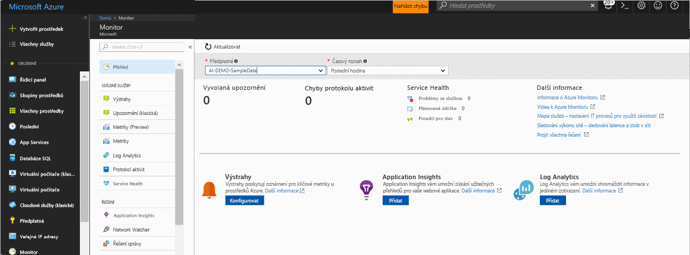
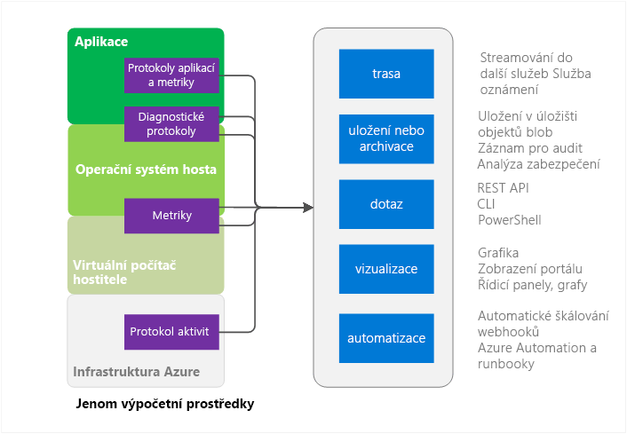
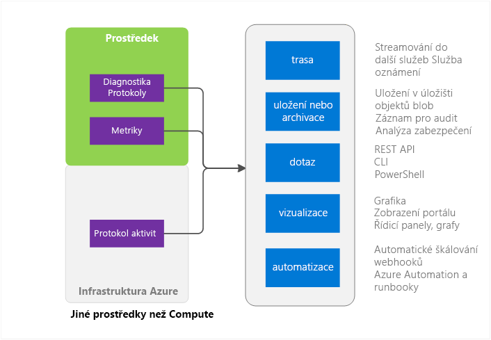

# Přehled služby Azure Monitor
Tento článek obsahuje přehled Azure Monitoru v Microsoft Azure. Popisuje činnost Azure Monitoru a poskytuje odkazy na další informace o tom, jak Azure Monitor používat.  Pokud máte raději úvodní představení pomocí videa, přejděte na odkazy v části Další kroky na konci tohoto článku. 

## Azure Monitor a další produkty pro monitorování od Microsoftu
Azure Monitor poskytuje metriky a protokoly základní infrastruktury pro většinu služeb v Microsoft Azure. Služby Azure, které do Azure Monitoru ještě nevkládají svoje data, je tam budou vkládat v budoucnu.

Microsoft dodává další produkty a služby, které poskytují další možnosti monitorování pro vývojáře, DevOps nebo provoz IT a mají také místní instalace. Přehled těchto produktů a služeb a principy jejich vzájemné spolupráce najdete v tématu o [monitorování v Microsoft Azure](monitoring-overview.md).

## Stránka s přehledem portálu

Azure Monitor má úvodní stránku, která uživatelům poskytuje tyto možnosti: 
- Seznámení s možnostmi monitorování, které Azure nabízí
- Zjišťování, konfigurace a onboarding platformy Azure a možností monitorování úrovně Premium

Tato stránka je výchozím místem pro navigaci včetně onboardingu. Zobrazuje pečlivě zpracované významné problémy z různých služeb, na které umožňuje uživateli kontextově přejít.
 

Po otevření stránky můžete vybírat mezi předplatnými, u kterých máte přístup pro čtení. Pro vybrané předplatné se zobrazují tyto možnosti:

- **Aktivovaná upozornění a zdroje upozornění** – Tato tabulka obsahuje souhrnné počty, zdroje upozornění a počty aktivovaných upozornění pro vybranou dobu trvání. Platí pro starší i novější upozornění. Přečtěte si další informace o [novějších upozorněních Azure](monitoring-overview-unified-alerts.md). 
- **Chyby protokolu aktivit** – Pokud některé prostředky Azure protokolují události se závažností na úrovni chyb, je možné zobrazit podrobné počty a kliknutím přejít na stránku protokolu aktivit, abyste mohli každou událost prozkoumat.
- **Azure Service Health** – Můžete zobrazit počet problémů služby Service Health, události plánované údržby a poradce pro stav. Azure Service Health poskytuje individuální informace o dopadu problémů v infrastruktuře Azure na vaše služby.  Další informace najdete v tématu o [Azure Service Health](../service-health/service-health-overview.md).  
- **Application Insights** – Můžete zobrazit klíčové ukazatele výkonu pro každý prostředek AppInsights v aktuálním předplatném. Klíčové ukazatele výkonu jsou optimalizované pro aplikaci na straně serveru, která monitoruje webové aplikace ASP.NET, Java, Node a obecné typy aplikací. Klíčové ukazatele výkonu zahrnují metriky pro frekvenci požadavků, dobu odezvy, chybovost a % dostupnosti. 

Pokud jste ještě neprovedli onboarding Log Analytics či Application Insights nebo pokud jste ještě v aktuálním předplatném nenakonfigurovali žádná upozornění Azure, bude stránka nabízet odkazy pro zahájení procesu onboardingu.

## Prostředky Azure Monitoru – podmnožina služby Compute

Mezi služby Compute Services patří: 
- Cloud Services 
- Virtuální počítače 
- Škálovací sady virtuálních počítačů 
- Service Fabric

### Aplikace – protokoly diagnostiky, protokoly aplikací a metriky
Aplikace můžou ve výpočetním modelu běžet nad hostovaným operačním systémem. Generují svoji vlastní sadu protokolů a metrik. Azure Monitor používá rozšíření Azure Diagnostics (Windows nebo Linux) ke shromažďování většiny protokolů a metrik na úrovni aplikace. Patří k nim tyto typy:

* Čítače výkonu
* Protokoly aplikací
* Protokoly událostí Windows
* Zdroj událostí .NET
* Protokoly IIS
* Trasování událostí pro Windows na základě manifestu
* Výpisy stavu systému
* Protokoly chyb zákazníků

Bez rozšíření diagnostiky je k dispozici jenom několik metrik, například Využití procesoru. 

### Metriky virtuálního počítače hostitele a hosta
Výše uvedené výpočetní prostředky mají vyhrazený virtuální počítač hostitele a hostovaný operační systém, se kterým komunikují. Virtuální počítač hostitele a hostovaný operační systém jsou ekvivalentem kořenového virtuálního počítače a virtuálního počítače hosta v modelu hypervisoru technologie Hyper-V. Metriky můžete shromažďovat v obou případech. V hostovaném operačním systému můžete shromažďovat také protokoly diagnostiky.   

### Protokol aktivit
V protokolu aktivit (dříve označovaném jako operační protokol nebo protokol auditu) můžete hledat informace o vašem prostředku z pohledu infrastruktury Azure. Tento protokol obsahuje informace, jako jsou třeba časy, kdy se prostředky vytvořily nebo zničily.  Další informace najdete v [přehledu protokolu aktivit](monitoring-overview-activity-logs.md). 

## Prostředky Azure Monitoru – vše ostatní

### Prostředek – metriky a protokoly diagnostiky
Metriky a protokoly diagnostiky, které lze shromažďovat, se liší v závislosti na typu prostředku. Služba Web Apps například poskytuje statistiky týkající se V/V disku a procent procesoru. Tyto metriky neexistují pro frontu služby Service Bus, která zase naopak poskytuje metriky jako velikost fronty a propustnost zpráv. Seznam metrik, které lze pro jednotlivé prostředky shromažďovat, je dostupný v tématu o [podporovaných metrikách](monitoring-supported-metrics.md). 

### Metriky virtuálního počítače hostitele a hosta
Mezi vaším prostředkem a konkrétním virtuálním počítačem hostitele a hosta nemusí nutně existovat mapování 1:1, takže metriky nemusí být dostupné.

### Protokol aktivit
Protokol aktivit je stejný jako pro výpočetní prostředky.  

## Využití monitorování dat
Když svoje data shromáždíte, můžete je v Azure Monitoru používat k následujícím činnostem.

### Trasa
Můžete data monitorování streamovat do jiných umístění. 

Příklady obsahují:

- Odesílání do Application Insights, abyste mohli používat nástroje pro podrobnější vizualizaci a analýzu
- Odesílání do Event Hubs, aby se umožnilo směrování do nástrojů jiných výrobců 

### Uchovávání a archivace
Některá data monitorování se už v Azure Monitoru uchovávají a jsou po určitou dobu dostupná. 
- Metriky se uchovávají po dobu 90 dnů. 
- Položky protokolu aktivit se uchovávají po dobu 90 dnů. 
- Protokoly diagnostiky se neuchovávají vůbec. 

Pokud chcete data uchovávat déle než po dobu uvedenou výše, můžete použít úložiště Azure. Data monitorování se budou ve vašem účtu úložiště uchovávat podle zásad uchovávání informací, které jste nastavili. Za prostor, který tato data zaberou v úložišti Azure, budete muset zaplatit. 

Několik způsobů, jak lze tato data používat:

- Po zápisu dat je můžete číst a zpracovávat jinými nástroji v rámci Azure nebo mimo Azure.
- Můžete si tato data stáhnout místně pro místní archivaci nebo můžete změnit zásady uchovávání informací v cloudu tak, aby se data uchovávala po delší dobu.  
- Můžete ponechat tato data v úložišti Azure po neomezenou dobu pro účely archivace. 

### Dotaz
Pro přístup k datům v systému nebo úložišti Azure můžete použít rozhraní REST API Azure Monitoru, příkazy rozhraní příkazového řádku (CLI) pro různé platformy, rutiny PowerShellu nebo sadu .NET SDK.

Příklady obsahují:

* Získávání dat pro vlastní monitorovací aplikaci, kterou jste vytvořili
* Vytváření vlastních dotazů a odesílání těchto dat do aplikace jiného výrobce

### Vizualizace
Vizualizace dat monitorování pomocí grafů a diagramů vám umožňuje rozpoznat trendy rychleji, než když prohlížíte samotná data.  

Mezi možné způsoby vizualizace patří:

* Použití webu Azure Portal
* Směrování dat do Azure Application Insights
* Směrování dat do Microsoft PowerBI
* Směrování dat do vizualizačního nástroje jiného výrobce pomocí živého streamování nebo tak, že necháte daný nástroj načítat data z archivu v úložišti Azure

### Automatizace
> [!NOTE]
> V rámci průběžného vývoje upozornění v Microsoft Azure je teď k dispozici jednotné prostředí pro zobrazení upozornění. Další informace o [nových upozorněních Azure](monitoring-overview-unified-alerts.md)

V Azure můžete pomocí dat monitorování aktivovat upozornění nebo dokonce celé procesy. Příklady obsahují:

* Použití dat k automatickému škálování výpočetních instancí směrem nahoru nebo dolů podle zatížení aplikace
* Odesílání e-mailů na základě podmínek metrik nebo protokolů 
* Provedení akce v systému mimo Azure pomocí volání adresy URL webu (webhooku)
* Provedení různých úloh pomocí spuštění runbooku ve službě Azure Automation

## Způsoby přístupu k Azure Monitoru
Obecně platí, že k manipulaci se sledováním, směrováním a načítáním dat se dá použít některý z následujících způsobů. Některé způsoby ale nemusí být dostupné pro všechny akce nebo typy dat.

* [Azure Portal](https://portal.azure.com)
* [PowerShell](insights-powershell-samples.md)  
* [Rozhraní příkazového řádku (CLI) pro různé platformy](insights-cli-samples.md)
* [REST API](https://docs.microsoft.com/rest/api/monitor/)
* [.NET SDK](http://www.nuget.org/packages/Microsoft.Azure.Management.Monitor)

## Další kroky
Další informace:
- Video s návodem pro Azure Monitor:  
[Zahájení práce s Azure Monitorem](https://channel9.msdn.com/Blogs/Azure-Monitoring/Get-Started-with-Azure-Monitor) 
- Videa s vysvětlením scénářů, kde lze Azure Monitor použít: [Monitorování a diagnostika v Microsoft Azure](https://channel9.msdn.com/events/Ignite/2016/BRK2234) a [Azure Monitor ve videu z Ignite 2016](https://myignite.microsoft.com/videos/4977)
- Projděte si rozhraní Azure Monitoru: [Začínáme se službou Azure Monitor](monitoring-get-started.md)
- Nastavte [rozšíření Azure Diagnostics](../azure-diagnostics.md) – pokud se pokoušíte diagnostikovat problémy s cloudovou službou, virtuálním počítačem, škálovacími sadami virtuálních počítačů nebo aplikací Service Fabric
- [Application Insights](https://azure.microsoft.com/documentation/services/application-insights/) – pokud se pokoušíte diagnostikovat problémy ve webové aplikaci App Service
- [Řešení potíží s Azure Storage](../storage/common/storage-e2e-troubleshooting.md) – při používání objektů blob, tabulek nebo front služby Storage
- [Log Analytics](https://azure.microsoft.com/documentation/services/log-analytics/)
