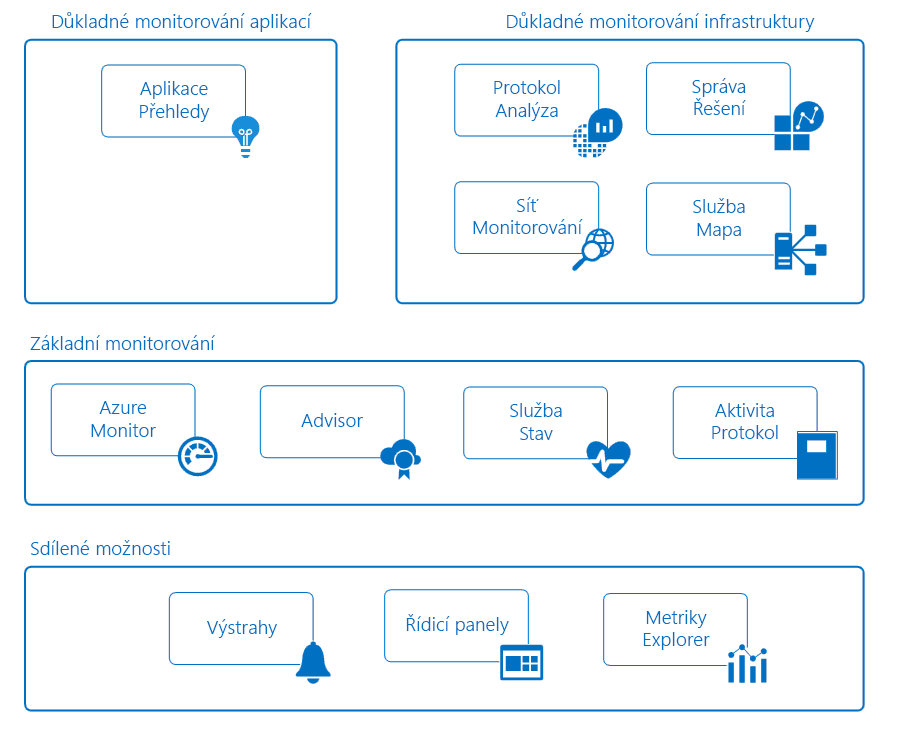

# Monitorování aplikací a prostředků Azure

Monitorování je shromažďování a analýza dat s cílem určit výkon, stav a dostupnost podnikové aplikace a prostředků, na kterých závisí. Efektivní strategie monitorování vám pomůže porozumět provozu jednotlivých komponent vaší aplikace. Pomůže vám také prodloužit dobu provozu díky proaktivnímu upozorňování na kritické problémy, abyste je mohli vyřešit předtím, než začnou způsobovat potíže.

Azure obsahuje více služeb, které v prostoru monitorování samostatně provádějí určité role nebo úlohy. Tyto služby společně poskytují komplexní řešení pro shromažďování dat, analýzy a akce na základě telemetrie z vaší aplikace a prostředků Azure, které je podporují. Můžou také provádět monitorování důležitých místních prostředků s cílem poskytovat prostředí hybridního monitorování. Důkladné seznámení s dostupnými nástroji a daty je prvním krokem při vývoji úplné strategie monitorování pro vaši aplikaci.

Následující diagram znázorňuje konceptuální zobrazení součástí, které společně poskytují monitorování prostředků Azure. Následující části popisují tyto součásti a obsahují odkazy na podrobné technické informace.

## Sdílené možnosti
Služby základního a hloubkového monitorování sdílejí funkce, které poskytují následující možnosti.

### Výstrahy
[Upozornění Azure](../monitoring-and-diagnostics/monitoring-overview-alerts.md) vás proaktivně upozorňují na závažné stavy a můžou v případě potřeby provádět opravné akce. Pravidla upozornění můžou používat data z více zdrojů včetně metrik a protokolů. Používají [skupiny akcí](../monitoring-and-diagnostics/monitoring-action-groups.md), které obsahují jedinečné sady příjemců a akcí reagujících na upozornění. Podle svých požadavků můžete určit, aby upozornění spouštěla pomocí webhooků externí akce a aby se integrovala s vašimi nástroji ITSM.

### Řídicí panely
[Řídicí panely Azure](../azure-portal/azure-portal-dashboards.md) umožňují kombinovat různé typy dat do jednoho podokna na webu [Azure Portal](https://portal.azure.com). Příslušný řídicí panel pak můžete sdílet s jinými uživateli Azure.

Můžete například vytvořit řídicí panel, který kombinuje tyto možnosti:
- Dlaždice, které zobrazují graf metrik
- Tabulka s protokoly aktivit
- Graf využívání z Application Insights
- Výstup prohledávání protokolů v Log Analytics

Můžete také exportovat data Log Analytics do [Power BI](https://docs.microsoft.com/power-bi/). Tam lze využít další vizualizace. Můžete také zpřístupnit data jiným uživatelům ve vaší organizaci i mimo ni.

### Průzkumník metrik
[Metriky](../monitoring-and-diagnostics/monitoring-overview-metrics.md) jsou číselné hodnoty generované prostředkem Azure, které vám můžou pomoct porozumět provozu a výkonu daného prostředku. Pomocí Průzkumníka metrik lze metriky odeslat do Log Analytics k analýze s daty z jiných zdrojů.

## Základní monitorování
Základní monitorování poskytuje nezbytné elementární monitorování prostředků Azure. Tyto služby vyžadují minimální konfiguraci a shromažďují základní telemetrii, kterou používají služby monitorování úrovně Premium.    

### Azure Monitor
[Azure Monitor](../monitoring-and-diagnostics/monitoring-overview-azure-monitor.md) poskytuje základní monitorování pro služby Azure na základě toho, že umožňuje shromažďování [metrik](../monitoring-and-diagnostics/monitoring-overview-metrics.md), [protokolů aktivit](../monitoring-and-diagnostics/monitoring-overview-activity-logs.md) a [diagnostických protokolů](../monitoring-and-diagnostics/monitoring-overview-of-diagnostic-logs.md). Pomocí protokolu aktivit lze například zjistit, kdy se nové prostředky vytvořily nebo změnily.

Jsou dostupné metriky, které poskytují statistiky o výkonu různých prostředků a dokonce i operačního systému ve virtuálním počítači. Tato data můžete na webu Azure Portal zobrazit pomocí některého z průzkumníků a na základě těchto metrik můžete vytvářet upozornění. Azure Monitor nabízí nejrychlejší kanál metrik (zkrácení z 5 minut na 1 minutu), takže byste ho měli používat pro upozornění a oznámení, která jsou náročná na rychlou odezvu.

Můžete také tyto metriky a protokoly odesílat do Azure Log Analytics, kde se provede určení trendů a podrobná analýza, nebo vytvořit další pravidla upozornění, která vás jako následek této analýzy budou proaktivně upozorňovat na kritické problémy.  

> [!NOTE]
> Odesílání vícedimenzionálních metrik do Log Analytics přes nastavení diagnostiky se v současné době nepodporuje. Metriky s dimenzemi se exportují jako ploché jednodimenzionální metriky agregované napříč hodnotami dimenzí.
>
> *Příklad:* Metriku Příchozí zprávy v centru událostí je možné zkoumat a převést na graf na úrovni jednotlivých front. Pokud se však metrika exportuje do Log Analytics, bude reprezentovaná jako všechny příchozí zprávy ve všech frontách v centru událostí.
>
>

### Azure Advisor
[Azure Advisor](../advisor/advisor-overview.md) neustále monitoruje konfiguraci prostředků a telemetrii využití. Potom na základě osvědčených postupů nabízí individuální doporučení. Postup podle těchto doporučení vám pomůže zvýšit výkon, zabezpečení a dostupnost prostředků podporujících vaše aplikace.

### Service Health
Stav vaší aplikace určují služby Azure, na kterých je tato aplikace závislá. [Azure Service Health](../service-health/service-health-overview.md) identifikuje všechny problémy se službami Azure, které by mohly vaši aplikaci ovlivnit. Service Health vám také pomůže naplánovat plánovanou údržbu.

### Protokol aktivit
[Protokol aktivit](../monitoring-and-diagnostics/monitoring-overview-activity-logs.md) poskytuje data o provozu prostředku Azure. K těmto informacím patří tyto položky:
- Změny konfigurace prostředku
- Incidenty Service Health
- Doporučení pro lepší využití prostředku
- Informace týkající se operací automatického škálování

Protokoly pro konkrétní prostředek můžete zobrazit na jeho stránce na webu Azure Portal. Protokoly z více prostředků můžete také zobrazit v Průzkumníku protokolu aktivit.

Položky protokolu aktivit můžete také odeslat do Log Analytics. Tam lze protokoly analyzovat pomocí dat shromažďovaných řešeními pro správu, agentů na virtuálních počítačích a dalších zdrojů.

## Služby hloubkového monitorování
Následující služby Azure nabízejí široké možnosti pro shromažďování dat monitorování a pro jejich analýzy na hlubší úrovni. Tyto služby využívají základní monitorování a běžné funkce v Azure. Nabízejí výkonné analytické nástroje pro práci se shromažďovanými daty a poskytují jedinečný přehled o vašich aplikacích a infrastruktuře. Prezentují data v kontextu scénářů, které cílí na různé cílové skupiny.

## Hloubkové monitorování aplikace
### Application Insights
Pomocí [Azure Application Insights](http://azure.microsoft.com/documentation/services/application-insights) můžete monitorovat dostupnost, výkon a využívání vaší aplikace, ať už je hostovaná v cloudu nebo místně.

Instrumentací aplikace pro práci s Application Insights můžete získávat podrobnější informace a implementovat scénáře DevOps. Můžete rychle identifikovat a diagnostikovat chyby a nečekat na to, až je nahlásí uživatel. Na základě shromažďovaných informací můžete informovaně rozhodovat o údržbě a vylepšení vaší aplikace.

Application Insights obsahuje řadu nástrojů pro interakci se shromažďovanými daty. Application Insights ukládá svoje data do běžného úložiště. Může využívat sdílené funkce, například upozornění, řídicí panely a hloubkovou analýzu pomocí dotazovacího jazyka Log Analytics.

## Hloubkové monitorování infrastruktury
### Log Analytics
[Log Analytics](http://azure.microsoft.com/documentation/services/log-analytics) hraje v monitorování Azure centrální roli, protože shromažďuje data z různých prostředků (včetně nástrojů jiných společností než Microsoft) do jednoho úložiště. Tam lze tato data analyzovat pomocí výkonného dotazovacího jazyka.

Application Insights a Azure Security Center ukládají svoje data do úložiště dat Log Analytics a využívají analytický modul této služby. Shromažďují se také data z Azure Monitoru, řešení pro správu a agentů nainstalovaných na virtuálních počítačích v cloudu nebo místně. Tyto sdílené funkce umožňují, abyste si vytvořili úplný přehled o vašem prostředí.

### Řešení pro správu
[Řešení pro správu](../log-analytics/log-analytics-add-solutions.md) jsou připravené sady logik, které poskytují přehled o konkrétní aplikaci nebo službě. K ukládání a analýzám dat monitorování, která shromažďují, využívají Log Analytics.

K dispozici jsou řešení pro správu od Microsoftu a partnerů, která nabízejí monitorování různých služeb Azure a služeb třetích stran. Mezi příklady řešení monitorování patří:
* [Monitorování kontejnerů](../log-analytics/log-analytics-containers.md) – umožňuje zobrazit a spravovat hostitele kontejnerů
* [Azure SQL Analytics](../log-analytics/log-analytics-azure-sql.md) – shromažďuje a vizualizuje metriky výkonu pro databáze Azure SQL

Všechna dostupná řešení pro správu jsou uvedená na webu Azure Portal na obrazovce služby *Monitor*.

### Monitorování sítě
K dispozici je několik nástrojů, které vzájemně spolupracují a monitorují různé aspekty sítě, ať už v Azure nebo místně.  

[Network Watcher](../network-watcher/network-watcher-monitoring-overview.md) poskytuje monitorování a diagnostiku na základě scénářů pro různé scénáře sítí v Azure. Ukládá data do metrik a diagnostiky Azure k další analýze. Funguje s následujícími řešeními pro monitorování různých aspektů sítě.

[Network Performance Monitor (NPM)](../log-analytics/log-analytics-network-performance-monitor.md) je cloudové řešení monitorování sítě, které monitoruje připojení mezi veřejnými cloudy, datovými centry a místními prostředími.

[ExpressRoute Monitor](../expressroute/how-to-npm.md) je funkce NPM, která monitoruje celkové připojení a výkon okruhů Azure ExpressRoute.

[DNS Analytics](../log-analytics/log-analytics-dns.md) je řešení, které poskytuje informace týkající se zabezpečení, výkonu a provozu na základě vašich serverů DNS.

[Monitorování koncového bodu služby](../networking/network-monitoring-overview.md) testuje dostupnost aplikací a zjišťuje aspekty omezující výkon mezi místním prostředím, sítěmi poskytovatelů a cloudovými nebo soukromými datovými centry.

### Mapa služeb
[Service Map](../operations-management-suite/operations-management-suite-service-map.md) poskytuje přehled o prostředí IaaS tak, že analyzuje virtuální počítače s jejich různými procesy a závislostmi na jiných počítačích a externích procesech. Provádí integraci událostí, údajů o výkonu a řešení pro správu v Log Analytics. Tato data lze potom zobrazit v kontextu jednotlivých počítačů a jejich vztahů k ostatním součástem prostředí.

Service Map se podobá [Mapě aplikace v Application Insights](../application-insights/app-insights-app-map.md). Zaměřuje se na součásti infrastruktury, které podporují vaše aplikace.

## Ukázkové scénáře
Dále následují ukázkové příklady, jak lze různé nástroje pro monitorování v Azure používat pro různé scénáře.

### Monitorování webové aplikace
Předpokládejme, že máte webovou aplikaci, která je nasazená v Azure prostřednictvím Azure App Service, Azure Storage a databáze SQL. Začnete tím, že zobrazíte [metriky](../monitoring-and-diagnostics/monitoring-overview-metrics.md) a [protokoly aktivit](../monitoring-and-diagnostics/monitoring-overview-activity-logs.md) pro tyto prostředky na jejich stránkách na webu Azure Portal. Vyhledáte důležité informace, například počet žádostí na aplikaci a průměrnou dobu odezvy. Identifikujete také všechny změny konfigurace.

Pak na portálu přejdete ke službě Monitor, abyste zobrazili metriky a protokoly pro různé prostředky společně. Při určování standardních parametrů pro metriky [vytvoříte pravidla upozornění](../monitoring-and-diagnostics/monitoring-overview-unified-alerts.md). Tato pravidla vás proaktivně upozorňují například na zvýšení průměrné doby odezvy nad prahovou hodnotu. Abyste získali rychlý přehled o denním výkonu vaší aplikace, vytvoříte řídicí panel Azure, který bude zobrazovat grafy metrik představujících důležité klíčové ukazatele výkonu.

Aby bylo možné provádět hlubší monitorování aplikace, [nakonfigurujete ji pro Application Insights](../application-insights/quick-monitor-portal.md). Teď můžete shromažďovat další data, která poskytují podrobnější informace o provozu a výkonu aplikace. Služba Application Insights zjišťuje základní vztahy mezi komponentami aplikace. Díky vizuálnímu znázornění prostřednictvím [Mapy aplikace](../application-insights/app-insights-app-map.md) a [kompletnímu trasování](../application-insights/app-insights-transaction-diagnostics.md) umožňuje diagnostikovat přesně tu komponentu, závislost nebo výjimku, ve které k problému došlo.

Vytvoříte [testy dostupnosti](../application-insights/app-insights-monitor-web-app-availability.md), které budou aplikaci proaktivně testovat z různých oblastí. Kvůli usnadnění práce vašim vývojářům [povolíte Profiler](../application-insights/enable-profiler-compute.md), aby bylo možné sledovat žádosti a všechny výjimky až na úroveň konkrétního řádku kódu. Abyste získali ještě větší přehled o službách používaných ve vaší aplikaci, přidáte [řešení SQL Analytics](../log-analytics/log-analytics-azure-sql.md), které bude shromažďovat další data v Log Analytics.

Po nějaké době se rozhodnete zjistit základní příčinu toho, že v určitých obdobích se výkon na webu snížil pod prahovou hodnotu. Napíšete dotaz pomocí Log Analytics. Pomůže vám určit korelaci mezi údaji o využití a výkonu, které shromažďuje Application Insights, a údaji o konfiguraci a výkonu prostředků Azure, které vaši aplikaci podporují.

### Monitorování virtuálních počítačů
Používáte kombinaci virtuálních počítačů s Windows a Linuxem, které běží v Azure. Pomocí Azure Monitoru zobrazíte [protokoly aktivit](../monitoring-and-diagnostics/monitoring-overview-activity-logs.md) a [metriky na úrovni hostitele](../monitoring-and-diagnostics/monitoring-overview-metrics.md). K virtuálním počítačům přidáte [rozšíření Azure Diagnostics](../virtual-machines/linux/tutorial-monitoring.md#install-diagnostics-extension), aby bylo možné shromažďovat metriky z hostovaného operačního systému. Potom vytvoříte [pravidla upozornění](../monitoring-and-diagnostics/monitoring-overview-unified-alerts.md), která vás budou proaktivně upozorňovat, že základní metriky, například využití procesoru a paměti, překračují prahové hodnoty.

Aby se shromažďovaly další podrobnosti o virtuálních počítačích, na kterých běží podniková aplikace, [vytvoříte pracovní prostor Log Analytics a povolíte rozšíření virtuálního počítače](../log-analytics/log-analytics-quick-collect-azurevm.md) na každém počítači. Nakonfigurujete [kolekci různých zdrojů dat](../log-analytics/log-analytics-data-sources.md) pro vaši aplikaci a [vytvoříte zobrazení](../log-analytics/log-analytics-view-designer.md), která budou podávat zprávy o jejím denním provozu a výkonu. Potom [vytvoříte pravidla upozornění](../monitoring-and-diagnostics/monitoring-overview-unified-alerts.md), která vás upozorní na příjem určitých chybových událostí.

Aby se stav nainstalovaného agenta průběžně monitoroval, přidáte [řešení pro správu Agent Health](../operations-management-suite/oms-solution-agenthealth.md). Abyste získali podrobnější informace o aplikaci, k virtuálním počítačům [přidáte agenta závislostí](../operations-management-suite/operations-management-suite-service-map-configure.md), aby je bylo možné přidat do řešení [Service Map](../operations-management-suite/operations-management-suite-service-map.md). Service Map zjišťuje kritické procesy a identifikuje připojení mezi počítači s jinými službami.

Po nahlášeném výpadku provedete pomocí řešení Service Map forenzní zkoumání, které identifikuje konkrétní počítače, u kterých k danému problému došlo. Potom vytvoříte [dotaz na data Log Analytics](../log-analytics/log-analytics-log-search-new.md), který tyto potíže v budoucnu identifikuje. A vytvoříte pravidlo upozornění, které vás v případě zjištění tohoto stavu proaktivně upozorní.

## Další kroky
Další informace:

* [Azure Monitor](https://azure.microsoft.com/services/monitor/) – pokud začínáte s metrikami a upozorněními pro základní monitorování
* [Application Insights](https://azure.microsoft.com/documentation/services/application-insights/) – pokud se pokoušíte diagnostikovat problémy ve webové aplikaci App Service
* [Log Analytics](https://azure.microsoft.com/documentation/services/log-analytics/) – pro analýzu shromážděných protokolů a dat monitorování
