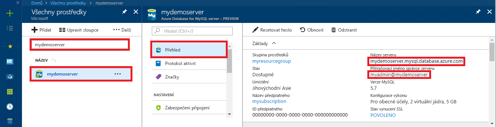

# <a name="azure-database-for-mysql-use-php-to-connect-and-query-data"></a>Azure Database for MySQL: Použití PHP k připojení a dotazování dat
Tento rychlý start ukazuje, jak se připojit ke službě Azure Database for MySQL pomocí aplikace v [PHP](https://secure.php.net/manual/intro-whatis.php). Ukazuje, jak pomocí příkazů jazyka SQL dotazovat, vkládat, aktualizovat a odstraňovat data v databázi. Toto téma předpokládá, že máte zkušenosti s vývojem pomocí PHP a teprve začínáte pracovat se službou Azure Database for MySQL.

## <a name="prerequisites"></a>Požadavky
Tento rychlý start jako výchozí bod využívá prostředky vytvořené v některém z těchto průvodců:
- [Vytvoření serveru Azure Database for MySQL pomocí webu Azure Portal](./quickstart-create-mysql-server-database-using-azure-portal.md)
- [Vytvoření serveru Azure Database for MySQL pomocí Azure CLI](./quickstart-create-mysql-server-database-using-azure-cli.md)

## <a name="install-php"></a>Instalace PHP
Nainstalujte PHP na vlastní server nebo vytvořte [webovou aplikaci](../app-service/overview.md) Azure, která zahrnuje PHP.

### <a name="macos"></a>MacOS
- Stáhněte [verzi PHP 7.1.4](https://secure.php.net/downloads.php).
- Nainstalujte PHP a další konfiguraci vyhledejte v [příručce k PHP](https://secure.php.net/manual/install.macosx.php).

### <a name="linux-ubuntu"></a>Linux (Ubuntu)
- Stáhněte [verzi PHP 7.1.4 Non-Thread Safe (x64)](https://secure.php.net/downloads.php).
- Nainstalujte PHP a další konfiguraci vyhledejte v [příručce k PHP](https://secure.php.net/manual/install.unix.php).

### <a name="windows"></a>Windows
- Stáhněte [verzi PHP 7.1.4 Non-Thread Safe (x64)](https://windows.php.net/download#php-7.1).
- Nainstalujte PHP a další konfiguraci vyhledejte v [příručce k PHP](https://secure.php.net/manual/install.windows.php).

## <a name="get-connection-information"></a>Získání informací o připojení
Získejte informace o připojení potřebné pro připojení ke službě Azure Database for MySQL. Potřebujete plně kvalifikovaný název serveru a přihlašovací údaje.

1. Přihlaste se k webu [Azure Portal](https://portal.azure.com/).
2. V nabídce vlevo na webu Azure Portal klikněte na **Všechny prostředky** a vyhledejte vytvořený server (například **mydemoserver**).
3. Klikněte na název serveru.
4. Na panelu **Přehled** serveru si poznamenejte **Název serveru** a **Přihlašovací jméno správce serveru**. Pokud zapomenete své heslo, můžete ho na tomto panelu také resetovat.
 

## <a name="connect-and-create-a-table"></a>Připojení a vytvoření tabulky
Pomocí následujícího kódu se připojte a vytvořte tabulku s využitím příkazu **CREATE TABLE** jazyka SQL. 

Tento kód využívá třídu **rozšíření MySQL Improved** (mysqli), která je zahrnutá v PHP. Kód volá metody [mysqli_init](https://secure.php.net/manual/mysqli.init.php) a [mysqli_real_connect](https://secure.php.net/manual/mysqli.real-connect.php) pro připojení k MySQL. Potom volá metodu [mysqli_query](https://secure.php.net/manual/mysqli.query.php) pro spuštění dotazu. Potom volá metodu [mysqli_close](https://secure.php.net/manual/mysqli.close.php) pro ukončení připojení.

Parametry host (hostitel), username (uživatelské jméno), password (heslo) a db_name (název databáze) nahraďte vlastními hodnotami. 

```php
<?php
$host = 'mydemoserver.mysql.database.azure.com';
$username = 'myadmin@mydemoserver';
$password = 'your_password';
$db_name = 'your_database';

//Establishes the connection
$conn = mysqli_init();
mysqli_real_connect($conn, $host, $username, $password, $db_name, 3306);
if (mysqli_connect_errno($conn)) {
die('Failed to connect to MySQL: '.mysqli_connect_error());
}

// Run the create table query
if (mysqli_query($conn, '
CREATE TABLE Products (
`Id` INT NOT NULL AUTO_INCREMENT ,
`ProductName` VARCHAR(200) NOT NULL ,
`Color` VARCHAR(50) NOT NULL ,
`Price` DOUBLE NOT NULL ,
PRIMARY KEY (`Id`)
);
')) {
printf("Table created\n");
}

//Close the connection
mysqli_close($conn);
?>
```

## <a name="insert-data"></a>Vložení dat
Pomocí následujícího kódu se připojte a vložte data s využitím příkazu **INSERT** jazyka SQL.

Tento kód využívá třídu **rozšíření MySQL Improved** (mysqli), která je zahrnutá v PHP. Kód využívá metodu [mysqli_prepare](https://secure.php.net/manual/mysqli.prepare.php) k vytvoření připraveného příkazu Insert a potom vytvoří vazbu parametrů pro každou vloženou hodnotu sloupce pomocí metody [mysqli_stmt_bind_param](https://secure.php.net/manual/mysqli-stmt.bind-param.php). Kód spustí tento příkaz pomocí metody [mysqli_stmt_execute](https://secure.php.net/manual/mysqli-stmt.execute.php) a potom tento příkaz zavře pomocí metody [mysqli_stmt_close](https://secure.php.net/manual/mysqli-stmt.close.php).

Parametry host (hostitel), username (uživatelské jméno), password (heslo) a db_name (název databáze) nahraďte vlastními hodnotami. 

```php
<?php
$host = 'mydemoserver.mysql.database.azure.com';
$username = 'myadmin@mydemoserver';
$password = 'your_password';
$db_name = 'your_database';

//Establishes the connection
$conn = mysqli_init();
mysqli_real_connect($conn, $host, $username, $password, $db_name, 3306);
if (mysqli_connect_errno($conn)) {
die('Failed to connect to MySQL: '.mysqli_connect_error());
}

//Create an Insert prepared statement and run it
$product_name = 'BrandNewProduct';
$product_color = 'Blue';
$product_price = 15.5;
if ($stmt = mysqli_prepare($conn, "INSERT INTO Products (ProductName, Color, Price) VALUES (?, ?, ?)")) {
mysqli_stmt_bind_param($stmt, 'ssd', $product_name, $product_color, $product_price);
mysqli_stmt_execute($stmt);
printf("Insert: Affected %d rows\n", mysqli_stmt_affected_rows($stmt));
mysqli_stmt_close($stmt);
}

// Close the connection
mysqli_close($conn);
?>
```

## <a name="read-data"></a>Čtení dat
Pomocí následujícího kódu se připojte a načtěte data s využitím příkazu **SELECT** jazyka SQL.  Tento kód využívá třídu **rozšíření MySQL Improved** (mysqli), která je zahrnutá v PHP. Kód používá metodu [mysqli_query](https://secure.php.net/manual/mysqli.query.php) k provedení příkazu jazyka SQL a metodu [mysqli_fetch_assoc](https://secure.php.net/manual/mysqli-result.fetch-assoc.php) k načtení výsledných řádků.

Parametry host (hostitel), username (uživatelské jméno), password (heslo) a db_name (název databáze) nahraďte vlastními hodnotami. 

```php
<?php
$host = 'mydemoserver.mysql.database.azure.com';
$username = 'myadmin@mydemoserver';
$password = 'your_password';
$db_name = 'your_database';

//Establishes the connection
$conn = mysqli_init();
mysqli_real_connect($conn, $host, $username, $password, $db_name, 3306);
if (mysqli_connect_errno($conn)) {
die('Failed to connect to MySQL: '.mysqli_connect_error());
}

//Run the Select query
printf("Reading data from table: \n");
$res = mysqli_query($conn, 'SELECT * FROM Products');
while ($row = mysqli_fetch_assoc($res)) {
var_dump($row);
}

//Close the connection
mysqli_close($conn);
?>
```

## <a name="update-data"></a>Aktualizace dat
Pomocí následujícího kódu se připojte a aktualizujte data s využitím příkazu **UPDATE** jazyka SQL.

Tento kód využívá třídu **rozšíření MySQL Improved** (mysqli), která je zahrnutá v PHP. Kód využívá metodu [mysqli_prepare](https://secure.php.net/manual/mysqli.prepare.php) k vytvoření připraveného příkazu Update a potom vytvoří vazbu parametrů pro každou aktualizovanou hodnotu sloupce pomocí metody [mysqli_stmt_bind_param](https://secure.php.net/manual/mysqli-stmt.bind-param.php). Kód spustí tento příkaz pomocí metody [mysqli_stmt_execute](https://secure.php.net/manual/mysqli-stmt.execute.php) a potom tento příkaz zavře pomocí metody [mysqli_stmt_close](https://secure.php.net/manual/mysqli-stmt.close.php).

Parametry host (hostitel), username (uživatelské jméno), password (heslo) a db_name (název databáze) nahraďte vlastními hodnotami. 

```php
<?php
$host = 'mydemoserver.mysql.database.azure.com';
$username = 'myadmin@mydemoserver';
$password = 'your_password';
$db_name = 'your_database';

//Establishes the connection
$conn = mysqli_init();
mysqli_real_connect($conn, $host, $username, $password, $db_name, 3306);
if (mysqli_connect_errno($conn)) {
die('Failed to connect to MySQL: '.mysqli_connect_error());
}

//Run the Update statement
$product_name = 'BrandNewProduct';
$new_product_price = 15.1;
if ($stmt = mysqli_prepare($conn, "UPDATE Products SET Price = ? WHERE ProductName = ?")) {
mysqli_stmt_bind_param($stmt, 'ds', $new_product_price, $product_name);
mysqli_stmt_execute($stmt);
printf("Update: Affected %d rows\n", mysqli_stmt_affected_rows($stmt));

//Close the connection
mysqli_stmt_close($stmt);
}

mysqli_close($conn);
?>
```


## <a name="delete-data"></a>Odstranění dat
Pomocí následujícího kódu se připojte a načtěte data s využitím příkazu **DELETE** jazyka SQL. 

Tento kód využívá třídu **rozšíření MySQL Improved** (mysqli), která je zahrnutá v PHP. Kód využívá metodu [mysqli_prepare](https://secure.php.net/manual/mysqli.prepare.php) k vytvoření připraveného příkazu Delete a potom vytvoří vazbu parametrů pro klauzuli Where v tomto příkazu pomocí metody [mysqli_stmt_bind_param](https://secure.php.net/manual/mysqli-stmt.bind-param.php). Kód spustí tento příkaz pomocí metody [mysqli_stmt_execute](https://secure.php.net/manual/mysqli-stmt.execute.php) a potom tento příkaz zavře pomocí metody [mysqli_stmt_close](https://secure.php.net/manual/mysqli-stmt.close.php).

Parametry host (hostitel), username (uživatelské jméno), password (heslo) a db_name (název databáze) nahraďte vlastními hodnotami. 

```php
<?php
$host = 'mydemoserver.mysql.database.azure.com';
$username = 'myadmin@mydemoserver';
$password = 'your_password';
$db_name = 'your_database';

//Establishes the connection
$conn = mysqli_init();
mysqli_real_connect($conn, $host, $username, $password, $db_name, 3306);
if (mysqli_connect_errno($conn)) {
die('Failed to connect to MySQL: '.mysqli_connect_error());
}

//Run the Delete statement
$product_name = 'BrandNewProduct';
if ($stmt = mysqli_prepare($conn, "DELETE FROM Products WHERE ProductName = ?")) {
mysqli_stmt_bind_param($stmt, 's', $product_name);
mysqli_stmt_execute($stmt);
printf("Delete: Affected %d rows\n", mysqli_stmt_affected_rows($stmt));
mysqli_stmt_close($stmt);
}

//Close the connection
mysqli_close($conn);
?>
```

## <a name="next-steps"></a>Další postup
> [!div class="nextstepaction"]
> [Připojení ke službě Azure Database for MySQL přes SSL](howto-configure-ssl.md)
