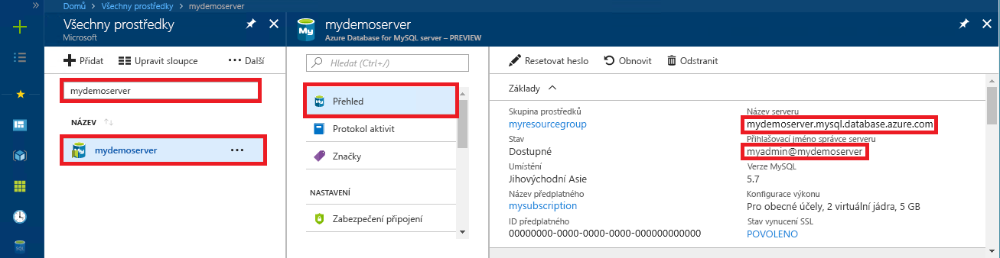

# <a name="quickstart-use-python-to-connect-and-query-data-with-azure-database-for-mysql"></a>Úvodní příručka: Připojení a dotazování dat pomocí Azure Database pro MySQL pomocí Pythonu

V tomto rychlém startu se připojíte k databázi Azure pro MySQL pomocí Pythonu. Potom pomocí příkazů SQL můžete dotazovat, vkládat, aktualizovat a odstraňovat data v databázi z platforem Mac, Ubuntu Linux a Windows. 

Toto téma předpokládá, že jste obeznámeni s vývojem pomocí Pythonu, ale jste na práci s Azure Database for MySQL.

## <a name="prerequisites"></a>Požadavky

- Účet Azure s aktivním předplatným. [Vytvořte si účet zdarma](https://azure.microsoft.com/free/?ref=microsoft.com&utm_source=microsoft.com&utm_medium=docs&utm_campaign=visualstudio).
- Databáze Azure pro server MySQL. [Vytvořte databázi Azure pro server MySQL pomocí portálu Azure](quickstart-create-mysql-server-database-using-azure-portal.md) nebo [vytvořte azure databázi pro server MySQL pomocí Azure CLI](quickstart-create-mysql-server-database-using-azure-cli.md).

## <a name="install-python-and-the-mysql-connector"></a>Instalace Pythonu a konektoru MySQL

Nainstalujte Python a mysql konektor pro Python do počítače pomocí následujících kroků: 

> [!NOTE]
> Tento rychlý start používá nezpracovaný přístup dotazu SQL pro připojení k MySQL. Pokud používáte webové rozhraní, použijte doporučený konektor pro rozhraní, například [mysqlclient](https://pypi.org/project/mysqlclient/) pro Django.

1. Stáhněte a nainstalujte [Python 3.7 nebo vyšší](https://www.python.org/downloads/) pro váš operační systém. Ujistěte se, že `PATH`přidáte Python do vašeho , protože konektor MySQL to vyžaduje.
   
1. Otevřete příkazový `bash` řádek nebo prostředí a `python -V` zkontrolujte verzi Pythonu spuštěním s přepínačem V s velkým písmenem.
   
1. Instalační `pip` program balíčku je součástí nejnovějších verzí Pythonu. Aktualizace `pip` na nejnovější verzi `pip install -U pip`spuštěním . 
   
   Pokud `pip` není nainstalována, můžete ji stáhnout `get-pip.py`a nainstalovat pomocí aplikace . Další informace naleznete v [tématu Instalace](https://pip.pypa.io/en/stable/installing/). 
   
1. Slouží `pip` k instalaci konektoru MySQL pro Python a jeho závislosti:
   
   ```bash
   pip install mysql-connector-python
   ```
   
   Můžete také nainstalovat konektor Pythonpro MySQL z [mysql.com](https://dev.mysql.com/downloads/connector/python/). Další informace o mysql konektoru pro Python naleznete v [MySQL Connector/Python Developer Guide](https://dev.mysql.com/doc/connector-python/en/). 

## <a name="get-connection-information"></a>Získání informací o připojení

Získejte informace o připojení, které potřebujete k připojení k Azure Database for MySQL z webu Azure Portal. Potřebujete název serveru, název databáze a přihlašovací údaje.

1. Přihlaste se k [portálu Azure](https://portal.azure.com/).
   
1. Na panelu hledání portálu vyhledejte a vyberte azure databázi pro server MySQL, který jste vytvořili, například **mydemoserver**.
   
   
   
1. Na stránce **Přehled** serveru si poznamenejte **název serveru** a přihlašovací jméno **správce serveru**. Pokud heslo zapomenete, můžete heslo obnovit také na této stránce.
   
   

## <a name="run-the-python-examples"></a>Spuštění příkladů pythonu

Pro každý příklad kódu v tomto článku:

1. Vytvořte nový soubor v textovém editoru.
1. Přidejte příklad kódu do souboru. V kódu nahraďte `<mypassword>`zástupné `<mydatabase>` symboly `<mydemoserver>`, `<myadmin>`, a zástupné symboly hodnotami serveru MySQL a databáze.
1. Uložte soubor do složky projektu s příponou *.py,* například *C:\pythonmysql\createtable.py* nebo */home/username/pythonmysql/createtable.py*.
1. Chcete-li kód spustit, otevřete příkazový řádek nebo `bash` prostředí `cd pythonmysql`a změňte adresář do složky projektu, například . Zadejte `python` příkaz následovaný například `python createtable.py`názvem souboru a stiskněte Enter. 
   
   > [!NOTE]
   > V systému Windows, pokud *python.exe* nebyl nalezen, možná budete muset přidat cestu Pythonu do proměnné prostředí `C:\python27\python.exe createtable.py`PATH nebo poskytnout úplnou cestu k *python.exe*, například .

## <a name="create-a-table-and-insert-data"></a>Vytvoření tabulky a vložení dat

Pomocí následujícího kódu se můžete připojit k serveru a databázi, vytvořit tabulku a načíst data pomocí příkazu **INSERT** SQL. 

Kód importuje knihovnu mysql.connector a používá funkci [connect()](https://dev.mysql.com/doc/connector-python/en/connector-python-api-mysql-connector-connect.html) pro připojení k Azure Database for MySQL pomocí [argumentů](https://dev.mysql.com/doc/connector-python/en/connector-python-connectargs.html) v kolekci config. Kód používá kurzor na připojení a [cursor.execute()](https://dev.mysql.com/doc/connector-python/en/connector-python-api-mysqlcursor-execute.html) metoda spustí dotaz SQL proti databázi MySQL. 

```python
import mysql.connector
from mysql.connector import errorcode

# Obtain connection string information from the portal
config = {
  'host':'<mydemoserver>.mysql.database.azure.com',
  'user':'<myadmin>@<mydemoserver>',
  'password':'<mypassword>',
  'database':'<mydatabase>'
}

# Construct connection string
try:
   conn = mysql.connector.connect(**config)
   print("Connection established")
except mysql.connector.Error as err:
  if err.errno == errorcode.ER_ACCESS_DENIED_ERROR:
    print("Something is wrong with the user name or password")
  elif err.errno == errorcode.ER_BAD_DB_ERROR:
    print("Database does not exist")
  else:
    print(err)
else:
  cursor = conn.cursor()

  # Drop previous table of same name if one exists
  cursor.execute("DROP TABLE IF EXISTS inventory;")
  print("Finished dropping table (if existed).")

  # Create table
  cursor.execute("CREATE TABLE inventory (id serial PRIMARY KEY, name VARCHAR(50), quantity INTEGER);")
  print("Finished creating table.")

  # Insert some data into table
  cursor.execute("INSERT INTO inventory (name, quantity) VALUES (%s, %s);", ("banana", 150))
  print("Inserted",cursor.rowcount,"row(s) of data.")
  cursor.execute("INSERT INTO inventory (name, quantity) VALUES (%s, %s);", ("orange", 154))
  print("Inserted",cursor.rowcount,"row(s) of data.")
  cursor.execute("INSERT INTO inventory (name, quantity) VALUES (%s, %s);", ("apple", 100))
  print("Inserted",cursor.rowcount,"row(s) of data.")

  # Cleanup
  conn.commit()
  cursor.close()
  conn.close()
  print("Done.")
```

## <a name="read-data"></a>Čtení dat

Pomocí následujícího kódu se připojte a načtěte data s využitím příkazu **SELECT** jazyka SQL. 

Kód importuje knihovnu mysql.connector a používá funkci [connect()](https://dev.mysql.com/doc/connector-python/en/connector-python-api-mysql-connector-connect.html) pro připojení k Azure Database for MySQL pomocí [argumentů](https://dev.mysql.com/doc/connector-python/en/connector-python-connectargs.html) v kolekci config. Kód používá kurzor na připojení a [cursor.execute()](https://dev.mysql.com/doc/connector-python/en/connector-python-api-mysqlcursor-execute.html) metoda spustí dotaz SQL proti databázi MySQL. 

Kód přečte řádky dat pomocí [fetchall()](https://dev.mysql.com/doc/connector-python/en/connector-python-api-mysqlcursor-fetchall.html) metoda, udržuje sadu výsledků v `for` řádku kolekce a používá iterátor pro smyčku přes řádky.

```python
import mysql.connector
from mysql.connector import errorcode

# Obtain connection string information from the portal
config = {
  'host':'<mydemoserver>.mysql.database.azure.com',
  'user':'<myadmin>@<mydemoserver>',
  'password':'<mypassword>',
  'database':'<mydatabase>'
}

# Construct connection string
try:
   conn = mysql.connector.connect(**config)
   print("Connection established")
except mysql.connector.Error as err:
  if err.errno == errorcode.ER_ACCESS_DENIED_ERROR:
    print("Something is wrong with the user name or password")
  elif err.errno == errorcode.ER_BAD_DB_ERROR:
    print("Database does not exist")
  else:
    print(err)
else:
  cursor = conn.cursor()

  # Read data
  cursor.execute("SELECT * FROM inventory;")
  rows = cursor.fetchall()
  print("Read",cursor.rowcount,"row(s) of data.")

  # Print all rows
  for row in rows:
    print("Data row = (%s, %s, %s)" %(str(row[0]), str(row[1]), str(row[2])))

  # Cleanup
  conn.commit()
  cursor.close()
  conn.close()
  print("Done.")
```

## <a name="update-data"></a>Aktualizace dat

Pomocí následujícího kódu se připojte a aktualizujte data s využitím příkazu **UPDATE** jazyka SQL. 

Kód importuje knihovnu mysql.connector a používá funkci [connect()](https://dev.mysql.com/doc/connector-python/en/connector-python-api-mysql-connector-connect.html) pro připojení k Azure Database for MySQL pomocí [argumentů](https://dev.mysql.com/doc/connector-python/en/connector-python-connectargs.html) v kolekci config. Kód používá kurzor na připojení a [cursor.execute()](https://dev.mysql.com/doc/connector-python/en/connector-python-api-mysqlcursor-execute.html) metoda spustí dotaz SQL proti databázi MySQL. 

```python
import mysql.connector
from mysql.connector import errorcode

# Obtain connection string information from the portal
config = {
  'host':'<mydemoserver>.mysql.database.azure.com',
  'user':'<myadmin>@<mydemoserver>',
  'password':'<mypassword>',
  'database':'<mydatabase>'
}

# Construct connection string
try:
   conn = mysql.connector.connect(**config)
   print("Connection established")
except mysql.connector.Error as err:
  if err.errno == errorcode.ER_ACCESS_DENIED_ERROR:
    print("Something is wrong with the user name or password")
  elif err.errno == errorcode.ER_BAD_DB_ERROR:
    print("Database does not exist")
  else:
    print(err)
else:
  cursor = conn.cursor()

  # Update a data row in the table
  cursor.execute("UPDATE inventory SET quantity = %s WHERE name = %s;", (200, "banana"))
  print("Updated",cursor.rowcount,"row(s) of data.")

  # Cleanup
  conn.commit()
  cursor.close()
  conn.close()
  print("Done.")
```

## <a name="delete-data"></a>Odstranění dat

Pomocí následujícího kódu se připojte a odeberte data s využitím příkazu **DELETE** jazyka SQL. 

Kód importuje knihovnu mysql.connector a používá funkci [connect()](https://dev.mysql.com/doc/connector-python/en/connector-python-api-mysql-connector-connect.html) pro připojení k Azure Database for MySQL pomocí [argumentů](https://dev.mysql.com/doc/connector-python/en/connector-python-connectargs.html) v kolekci config. Kód používá kurzor na připojení a [cursor.execute()](https://dev.mysql.com/doc/connector-python/en/connector-python-api-mysqlcursor-execute.html) metoda spustí dotaz SQL proti databázi MySQL. 

```python
import mysql.connector
from mysql.connector import errorcode

# Obtain connection string information from the portal
config = {
  'host':'<mydemoserver>.mysql.database.azure.com',
  'user':'<myadmin>@<mydemoserver>',
  'password':'<mypassword>',
  'database':'<mydatabase>'
}

# Construct connection string
try:
   conn = mysql.connector.connect(**config)
   print("Connection established.")
except mysql.connector.Error as err:
  if err.errno == errorcode.ER_ACCESS_DENIED_ERROR:
    print("Something is wrong with the user name or password.")
  elif err.errno == errorcode.ER_BAD_DB_ERROR:
    print("Database does not exist.")
  else:
    print(err)
else:
  cursor = conn.cursor()

  # Delete a data row in the table
  cursor.execute("DELETE FROM inventory WHERE name=%(param1)s;", {'param1':"orange"})
  print("Deleted",cursor.rowcount,"row(s) of data.")

  # Cleanup
  conn.commit()
  cursor.close()
  conn.close()
  print("Done.")
```

## <a name="next-steps"></a>Další kroky

> [!div class="nextstepaction"]
> [Migrace vaší databáze pomocí exportu a importu](./concepts-migrate-import-export.md)
