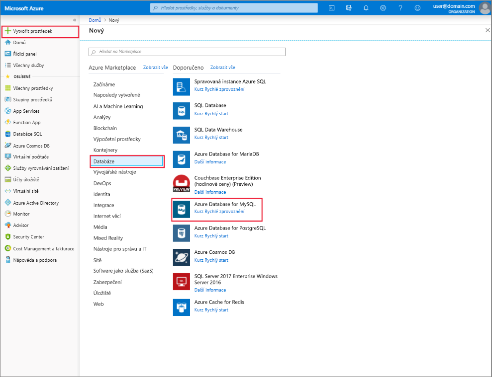

# Vytvoření a správa Azure Database for MySQL pomocí webu Azure portal
Toto téma popisuje, jak můžete rychle vytvořit nový server Azure Database for MySQL. Obsahuje také informace o tom, jak spravovat server s využitím webu Azure portal. Správa serveru obsahuje zobrazení Podrobnosti o serveru a databáze, resetuje se heslo, škálování prostředků a odstraněním serveru.

## Přihlášení k portálu Azure Portal
Přihlaste se k webu [Azure Portal](https://portal.azure.com).

## Vytvoření serveru Azure Database for MySQL
Následující postup použijte k vytvoření serveru Azure Database for MySQL s názvem "mydemoserver."

1. Klikněte na tlačítko **vytvořit prostředek** tlačítko umístěné v levém horním rohu webu Azure portal.

2. Na nové stránce vyberte **databází**a pak na stránce databáze, vyberte **– Azure Database for MySQL**.

    > Azure Database for MySQL serveru se vytvoří s definovanou sadou [výpočetní výkon a úložiště](./concepts-pricing-tiers.md) prostředky. Vytvoření databáze v rámci skupiny prostředků Azure a ve službě Azure Database for MySQL server.

   

3. Azure Database for MySQL – formulář vyplňte pomocí následujících informací:

    | **Pole formuláře** | **Popis pole** |
    |----------------|-----------------------|
    | *Název serveru* | mydemoserver (název serveru je globálně jedinečný) |
    | *Předplatné* | mysubscription (vyberte z rozevírací nabídky) |
    | *Skupina prostředků* | myresourcegroup (vytvořit novou skupinu prostředků nebo použijte již existující) |
    | *Výběr zdroje* | Prázdné (Vytvoření prázdné serveru MySQL) |
    | *Přihlašovací jméno správce serveru* | myadmin (název účtu správce instalace) |
    | *Heslo* | Nastavit heslo účtu správce |
    | *Potvrdit heslo* | potvrďte heslo účtu správce |
    | *Umístění* | Jihovýchodní Asie (vyberte mezi Severní Evropa a západní USA) |
    | *Verze* | 5.7 (zvolte databázi Azure pro verzi serveru MySQL) |

4. Klikněte na tlačítko **cenová úroveň** k určení úrovně vrstvy a výkon služby pro nový server. Vyberte **Obecné** kartu. *Gen 4*, *2 virtuální jádra*, *5 GB* a *7 dní* jsou výchozí hodnoty pro **Výpočetní generaci**, **Virtuální jádra**, **Úložiště** a **Období uchování zálohy**. Můžete ponechat tyto posuvníky tak, jak jsou. Pokud chcete povolit zálohování serveru v geograficky redundantním úložišti, vyberte v **Možnosti redundance zálohy** možnost **Geograficky redundantní**.

   

5. Klikněte na **Vytvořit**, aby se server zřídil. Zřizování trvá několik minut.

    > Vyberte **připnout na řídicí panel** možnost, povolíte snadné sledování vašich nasazení.

## Aktualizace serveru Azure Database for MySQL
Po zřízení nového serveru se uživatel má několik možností, jak ke konfiguraci existující server, včetně resetování hesla správce a škálování směrem nahoru nebo dolů na serveru tak, že změníte vCore a úložiště.

### Změna hesla správce uživatele
1. Ze serveru **přehled**, klikněte na tlačítko **resetovat heslo** zobrazíte okno pro resetování hesla.

   

2. Zadejte nové heslo a potvrzení hesla v okně, jak je znázorněno:

   

3. Klikněte na tlačítko **OK** nové heslo uložte.

### Virtuální jádra pro škálování směrem nahoru nebo dolů

1. Klikněte na **cenová úroveň**, který je umístěn v rámci **nastavení**.

2. Změnit **vCore** nastavení přesunete posuvník na požadovanou hodnotu.

    

3. Kliknutím na **OK** uložte změny.

### Úložiště o velikosti až

1. Klikněte na **cenová úroveň**, který je umístěn v rámci **nastavení**.

2. Změnit **úložiště** nastavení přesunete posuvník na požadovanou hodnotu.

    

3. Kliknutím na **OK** uložte změny.

## Odstranění serveru Azure Database for MySQL

1. Ze serveru **přehled**, klikněte na tlačítko **odstranit** tlačítko Otevřít výzvu k potvrzení odstranění.

    

2. Zadejte název serveru, do vstupního pole pro potvrzení double.

    

3. Klikněte na tlačítko **odstranit** potvrďte odstranění serveru. "Byl úspěšně odstraněn server MySQL" pop čekat až se zobrazí v oznamovacím pruhu.

## Seznam Azure Database for MySQL – databáze
Ze serveru **přehled**, posuňte se dolů, dokud se nezobrazí databáze v dolní části dlaždice. Všechny databáze na serveru jsou uvedené v tabulce.

   

## Zobrazit podrobnosti o serveru Azure Database for MySQL
Klikněte na **vlastnosti**, který je umístěn v rámci **nastavení** Chcete-li zobrazit podrobné informace o serveru.

## Další postup

[Rychlý start: Vytvoření Azure Database for MySQL pomocí webu Azure portal](./quickstart-create-mysql-server-database-using-azure-portal.md)