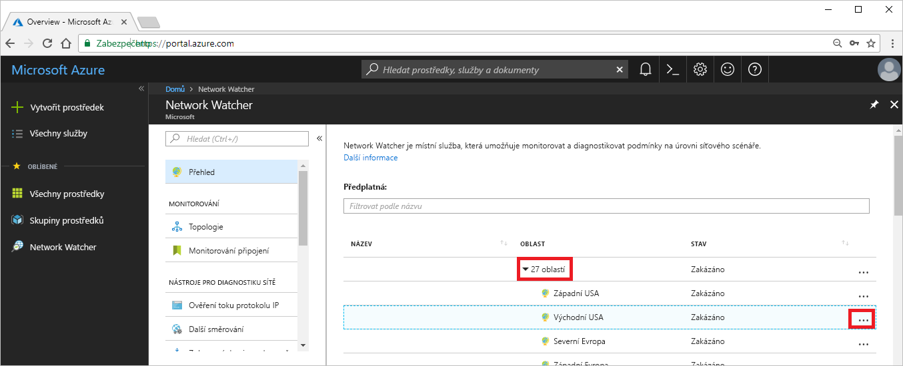
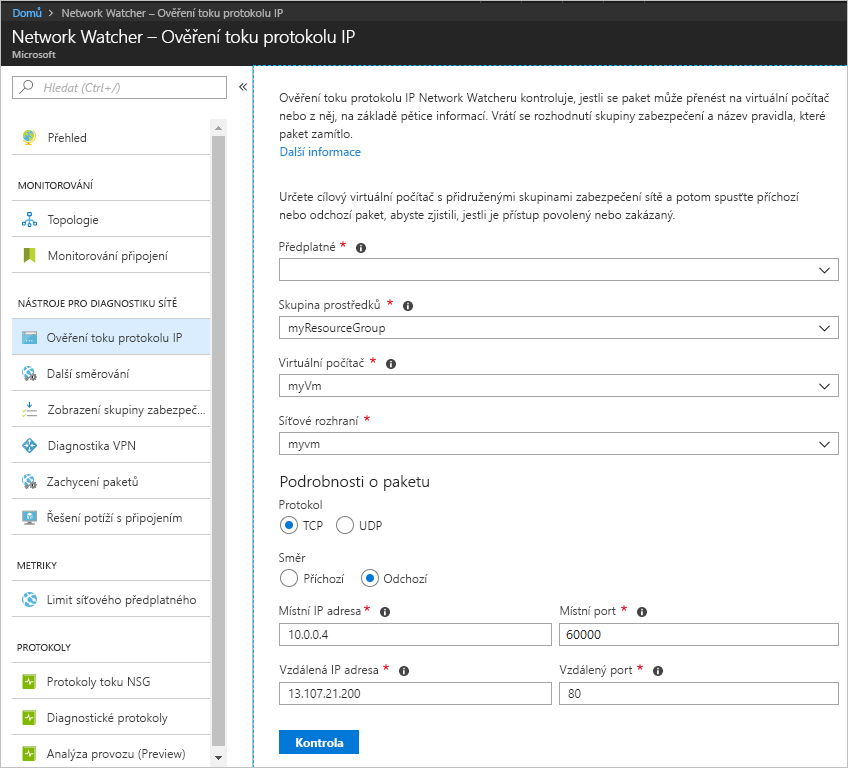

# Rychlý start: Diagnostika problému s filtrováním síťového provozu virtuálního počítače pomocí webu Azure Portal

V tomto rychlém startu nasadíte virtuální počítač a potom zkontrolujete obousměrnou komunikaci mezi IP adresou a adresou URL. Určíte příčinu selhání komunikace a najdete jeho řešení.

Pokud ještě nemáte předplatné Azure, vytvořte si [bezplatný účet](https://azure.microsoft.com/free/?WT.mc_id=A261C142F) před tím, než začnete.

## Přihlášení k Azure

Přihlaste se k webu Azure Portal na adrese https://portal.azure.com.

## Vytvoření virtuálního počítače

1. V levém horním rohu webu Azure Portal vyberte **+ Vytvořit prostředek**.
2. Vyberte **Compute** a pak vyberte **Windows Server 2016 Datacenter** nebo **Ubuntu Server 17.10 VM**.
3. Zadejte nebo vyberte následující informace, u zbývajících nastavení přijměte výchozí hodnoty a pak vyberte **OK**:

    |Nastavení|Hodnota|
    |---|---|
    |Název|myVm|
    |Uživatelské jméno| Zadejte libovolné uživatelské jméno.|
    |Heslo| Zadejte libovolné heslo. Heslo musí obsahovat nejméně 12 znaků a musí splňovat [zadané požadavky na složitost](../virtual-machines/windows/faq.md?toc=%2fazure%2fnetwork-watcher%2ftoc.json#what-are-the-password-requirements-when-creating-a-vm).|
    |Předplatné| Vyberte své předplatné.|
    |Skupina prostředků| Vyberte **Vytvořit novou** a zadejte **myResourceGroup**.|
    |Umístění| Vyberte **USA – východ**.|

4. Vyberte velikost virtuálního počítače a pak vyberte **Vybrat**.
5. V části **Nastavení** přijměte všechny výchozí hodnoty a vyberte **OK**.
6. V části **Vytvořit** na kartě **Souhrn** vyberte **Vytvořit** a spusťte nasazování virtuálního počítače. Nasazení virtuálního počítače trvá několik minut. Než budete pokračovat ve zbývajících krocích, počkejte, až virtuální počítač dokončí nasazování.

## Test síťové komunikace

Pokud chcete otestovat síťovou komunikaci pomocí sledovacího procesu sítě, nejprve ho povolte v alespoň jedné oblasti Azure a teprve potom použijte funkci ověření toků protokolu IP služby Network Watcher.

### Povolení sledovacího procesu sítě

Pokud už sledovací proces sítě máte alespoň v jedné oblasti povolený, přeskočte vpřed na část [Použití ověření toku protokolu IP](#use-ip-flow-verify).

1. Na webu Azure Portal vyberte **Všechny služby**. Do **pole filtru** zadejte *Network Watcher*. Jakmile se služba **Network Watcher** zobrazí ve výsledcích, vyberte ji.
2. Povolte sledovací proces sítě v oblasti USA – východ, protože tam jste v předchozím kroku nasadili virtuální počítač. Rozbalte **Oblasti** a potom vedle **USA – východ** vyberte **...** (stejně jako v následujícím obrázku):

    

3. Vyberte **Povolit Network Watcher**.

### Použití ověření toku protokolu IP

Když vytvoříte virtuální počítač, Azure u něj ve výchozím nastavení blokuje příchozí i odchozí síťový provoz. Později můžete výchozí nastavení Azure přepsat a povolit nebo odepřít další typy provozu.

1. Na webu Azure Portal vyberte **Všechny služby**. Do **pole filtru** *všech služeb* zadejte *Network Watcher*. Jakmile se služba **Network Watcher** zobrazí ve výsledcích, vyberte ji.
2. V části **NÁSTROJE PRO DIAGNOSTIKU SÍTĚ** vyberte **Ověření toku protokolu IP**.
3. Stejně jako na obrázku vyberte své předplatné, zadejte následující hodnoty, a potom vyberte **Zkontrolovat**:

    |Nastavení            |Hodnota                                                                                              |
    |---------          |---------                                                                                          |
    | Skupina prostředků    | Vyberte myResourceGroup.                                                                            |
    | Virtuální počítač   | Vyberte myVm.                                                                                       |
    | Síťové rozhraní | myVm – název síťového rozhraní, které web Azure Portal vytvořil, když jste vytvořili virtuální počítač, je jiný. |
    | Protocol (Protokol)          | TCP                                                                                               |
    | Směr         | Odchozí                                                                                          |
    | Místní IP adresa  | 10.0.0.4                                                                                          |
    | Místní port      | 60000                                                                                                |
    | Vzdálená IP adresa | 13.107.21.200 – jedna z adres stránky www.bing.com                                             |
    | Vzdálený port       | 80                                                                                                |

    

    Po několika sekundách vás vrácený výsledek informuje, že přístup je povolený pravidlem zabezpečení s názvem **AllowInternetOutbound**. Pokud už jste sledovací proces sítě měli před spuštěním kontroly vytvořený v nějaké jiné oblasti, než je USA – východ, služba Network Watcher sledovací proces sítě v oblasti USA – východ vytvořila automaticky, když jste spustili kontrolu.
4. Dokončete znovu krok tři, ale změňte možnost **Vzdálená IP adresa** na **172.31.0.100**. Vrácený výsledek vás informuje o tom, že přístup byl odepřen kvůli pravidlu zabezpečení s názvem **DefaultOutboundDenyAll**.
5. Dokončete znovu krok tři, ale změňte **Směr** na **Příchozí**, **Místní port** na **80** a **Vzdálený port** na **60000**. Vrácený výsledek vás informuje o tom, že přístup byl odepřen kvůli pravidlu zabezpečení s názvem **DefaultInboundDenyAll**.

Nyní, když už víte, která pravidla zabezpečení umožňují nebo odepírají příchozí a odchozí provoz virtuálního počítače, můžete určit, jak tyto problémy vyřešit.

## Zobrazení podrobností pravidla zabezpečení

1. Pokud chcete určit, proč pravidla v krocích 3 až 5 v části [Použití ověření toku protokolu IP](#use-ip-flow-verify) povolují nebo odepírají komunikaci, prohlédněte si platná pravidla zabezpečení pro síťové rozhraní virtuálního počítače. Do vyhledávacího pole v horní části webu Azure Portal zadejte *myvm*. Když se síťové rozhraní **myvm** (nebo libovolný jiný název síťového rozhraní) zobrazí ve výsledcích hledání, vyberte ho.
2. Podle následujícího obrázku v části **PODPORA A ŘEŠENÍ POTÍŽÍ** vyberte **Platná pravidla zabezpečení**:

    

    Ve třetím kroku v části [Použití ověření toku protokolu IP](#use-ip-flow-verify) jste zjistili, že komunikace byla povolená díky pravidlu **AllowInternetOutbound**. Na předchozím obrázku si můžete všimnout, že **CÍL** (DESTINATION) tohoto pravidla je **Internet**. Není však jasné, jak adresa 13.107.21.200, kterou jste ve třetím kroku v části [Použití ověření toku protokolu IP](#use-ip-flow-verify) testovali, souvisí s **Internetem**.
3. Vyberte pravidlo **AllowInternetOutBound** a podle následujícího obrázku vyberte **Cíl**:

    

    Jednou z předpon je **12.0.0.0/6**, která zahrnuje rozsah IP adres od 12.0.0.1 do 15.255.255.254. Vzhledem k tomu, že adresa 13.107.21.200 do tohoto rozsahu adres patří, pravidlo **AllowInternetOutBound** jí odchozí provoz umožní. Kromě toho na obrázku ve druhém kroku nejsou zobrazená žádná jiná pravidla s vyšší prioritou (nižším číslem), která by toto pravidlo přepisovala. Okno **Předpony adres** zavřete. Pokud byste chtěli odepřít odchozí komunikaci na IP adresu 13.107.21.200, mohli byste přidat pravidlo zabezpečení s vyšší prioritou, které portu 80 odchozí komunikaci na tuto IP adresu zakáže.
4. Když jste ve čtvrtém kroku v části [Použití ověření toku protokolu IP](#use-ip-flow-verify) spustili kontrolu odchozího provozu na IP adresu 172.131.0.100, zjistili jste, že pravidlo **DefaultOutboundDenyAll** tuto komunikaci odepřelo. Toto pravidlo plní stejnou funkci jako pravidlo **DenyAllOutBound** zobrazené na obrázku ve druhém kroku, které jako **CÍL** (DESTINATION) používá adresu **0.0.0.0/0**. Toto pravidlo zakazuje odchozí komunikaci na IP adresu 172.131.0.100, protože tato adresa se nenachází v **CÍLI** žádného jiného **odchozího pravidla** zobrazeného na obrázku. Pokud chcete odchozí komunikaci povolit, můžete přidat pravidlo zabezpečení s vyšší prioritou, které IP adrese 172.131.0.100 na portu 80 umožní odchozí komunikaci.
5. Když jste v pátém kroku v části [Použití ověření toku protokolu IP](#use-ip-flow-verify) spustili kontrolu příchozího provozu z IP adresy 172.131.0.100, zjistili jste, že pravidlo **DefaultInboundDenyAll** tuto komunikaci odepřelo. Toto pravidlo plní stejnou funkci jako pravidlo **DenyAllInBound** zobrazené na obrázku ve druhém kroku. Pravidlo **DenyAllInBound** se vynucuje, protože žádné pravidlo s vyšší prioritou, které by umožňovalo portu 80 příchozí provoz na virtuální počítač z IP adresy 172.31.0.100, neexistuje. Pokud chcete příchozí komunikaci povolit, mohli byste přidat pravidlo zabezpečení s vyšší prioritou, které by portu 80 příchozí komunikaci z IP adresy 172.31.0.100 umožnilo.

Kontroly v tomto rychlém startu testovaly konfiguraci Azure. Pokud kontroly vrátily očekávané výsledky a problémy se sítí přetrvávají, přesvědčte se, že mezi virtuálním počítačem a koncovým bodem, se kterým komunikujete, se nenachází brána firewall a že operační systém ve virtuálním počítači nemá bránu firewall, která by komunikaci povolovala nebo odepírala.

## Vyčištění prostředků

Pokud už je nepotřebujete, odstraňte skupinu prostředků a všechny prostředky, které obsahuje:

1. Do pole **Hledat** v horní části portálu zadejte *myResourceGroup*. Jakmile se ve výsledcích hledání zobrazí skupina prostředků **myResourceGroup**, vyberte ji.
2. Vyberte **Odstranit skupinu prostředků**.
3. V části **ZADEJTE NÁZEV SKUPINY PROSTŘEDKŮ** zadejte *myResourceGroup* a vyberte **Odstranit**.

## Další kroky

V tomto rychlém startu jste vytvořili virtuální počítač a diagnostikovali jste příchozí a odchozí filtry síťového provozu. Zjistili jste, že pravidla skupiny zabezpečení sítě umožňují nebo odepírají příchozí i odchozí provoz virtuálního počítače. Zjistěte více o [pravidlech zabezpečení](../virtual-network/security-overview.md?toc=%2fazure%2fnetwork-watcher%2ftoc.json) a způsobu [jejich vytvoření](../virtual-network/manage-network-security-group.md?toc=%2fazure%2fnetwork-watcher%2ftoc.json#create-a-security-rule).

Přestože budete používat správné filtry síťového provozu, komunikace s virtuálním počítačem může kvůli konfigurací směrování stejně selhat. Získejte více informací o [diagnostice potíží se směrováním sítě virtuálních počítačů](diagnose-vm-network-routing-problem.md) nebo si přečtěte článek o [řešení potíží s připojením](network-watcher-connectivity-portal.md), abyste mohli diagnostikovat potíže s odchozím směrováním, latencí a filtrováním provozu.