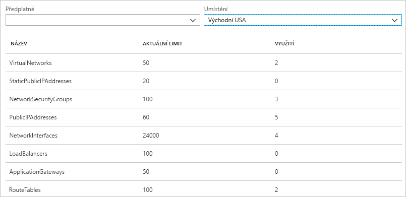
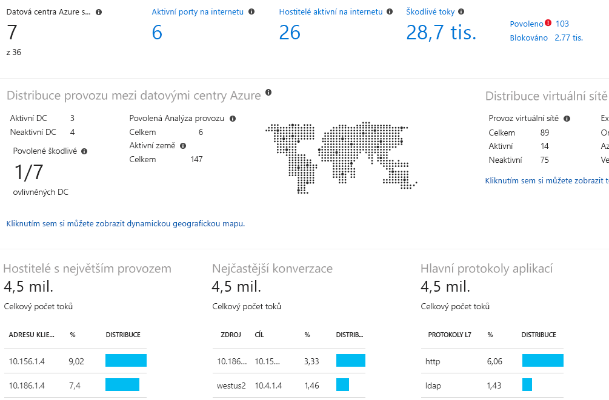

# Co je Azure Network Watcher?

Azure Network Watcher poskytuje nástroje pro monitorování, diagnostiku, zobrazení metrik a povolení nebo zakázání protokolů pro prostředky ve virtuální síti Azure.

## Monitorování

### Monitorování komunikace mezi virtuálním počítačem a koncovým bodem

Koncovým bodem může být jiný virtuální počítač, plně kvalifikovaný název domény, identifikátor URI nebo IPv4 adresa. Funkce *monitorování připojení* v pravidelných intervalech monitoruje komunikaci a poskytuje informace o dostupnosti, latenci a změnách síťové topologie mezi virtuálním počítačem a koncovým bodem. Například můžete mít virtuální počítač s webovým serverem, který komunikuje s virtuálním počítačem s databázovým serverem. Někdo ve vaší organizaci může bez vašeho vědomí pro virtuální počítač s webovým nebo databázovým serverem nebo podsíť použít vlastní pravidlo zabezpečení sítě nebo směrování.

Pokud se koncový bod stane nedostupným, řešení potíží s připojením vám poskytne informace o důvodu. Mezi možné důvody patří problém s překladem názvů DNS, procesor, paměť nebo brána firewall v operačním systému virtuálního počítače, typ segmentu směrování vlastní trasy, pravidlo zabezpečení pro virtuální počítač nebo podsíť odchozího připojení. Další informace o [pravidlech zabezpečení](../virtual-network/security-overview.md?toc=%2fazure%2fnetwork-watcher%2ftoc.json#security-rules) a [typech segmentů směrování tras](../virtual-network/virtual-networks-udr-overview.md?toc=%2fazure%2fnetwork-watcher%2ftoc.json) v Azure.

Monitorování připojení také poskytuje minimální, průměrnou a maximální zjištěnou latenci v průběhu času. Po zjištění latence připojení můžete zjistit, že se latence dá snížit přesunem vašich prostředků Azure do jiných oblastí Azure. Další informace o určování [relativních latencí mezi oblastmi Azure a poskytovateli internetových služeb](#determine-relative-latencies-between-azure-regions-and-internet-service-providers) a způsobu monitorování komunikace mezi virtuálním počítačem a koncovým bodem pomocí [monitorování připojení](connection-monitor.md). Pokud místo monitorování připojení v průběhu času chcete otestovat připojení k určitému bodu v čase, můžete podobným způsobem jako v případě monitorování připojení použít funkci [řešení potíží s připojením](#connection-troubleshoot).

Network Performance Monitor je cloudové hybridní řešení pro monitorování sítě, které vám pomáhá monitorovat výkon sítě mezi různými body vaší síťové infrastruktury. Umožňuje rovněž monitorovat síťové připojení ke službě a koncovým bodům aplikace a monitorovat výkon Azure ExpressRoute. Network Performance Monitor zjišťuje problémy se sítí, jako je ztráta přenosů, chyby směrování a problémy, které konvenční metody monitorování sítě nedokážou odhalit. Toto řešení generuje výstrahy a upozorní vás, když u síťové linky dojde k překročení prahové hodnoty. Zajišťuje také včasné zjištění problémů s výkonem sítě a lokalizuje příčinu problému na konkrétní segment sítě nebo zařízení. Přečtěte si další informace o řešení [Network Performance Monitor](../log-analytics/log-analytics-network-performance-monitor.md?toc=%2fazure%2fnetwork-watcher%2ftoc.json).

### Zobrazení prostředků ve virtuální síti a jejich vztahů

S tím, jak se do virtuální sítě přidávají prostředky, může být stále obtížnější porozumět, jaké prostředky jsou ve virtuální síti a jak spolu vzájemně souvisí. Funkce *topologie* umožňuje vygenerovat vizuální diagram prostředků ve virtuální síti a vztahů mezi těmito prostředky. Následující obrázek ukazuje příklad diagramu topologie pro virtuální síť se třemi podsítěmi, dvěma virtuálními počítači, síťovými rozhraními, veřejnými IP adresami, skupinami zabezpečení sítě, směrovacími tabulkami a vztahy mezi prostředky:

Můžete si stáhnout upravitelnou verzi obrázku ve formátu SVG. Další informace o [zobrazení topologie](view-network-topology.md).

## Diagnostika

### Diagnostika problémů s filtrováními provozu do nebo z virtuálního počítače

Když nasadíte virtuální počítač, Azure pro něj použije několik výchozích pravidel zabezpečení, která povolí nebo zakáží provoz do nebo z tohoto virtuálního počítače. Výchozí pravidla Azure můžete přepsat nebo můžete vytvořit další pravidla. V určitém okamžiku může virtuální počítač kvůli pravidlu zabezpečení ztratit schopnost komunikace s dalšími prostředky. Funkce *Ověření toku protokolu IP* umožňuje zadat zdrojovou a cílovou IPv4 adresu, port, protokol (TCP nebo UDP) a směr provozu (příchozí nebo odchozí). Ověření toku protokolu IP pak otestuje komunikaci a poskytne vám informace o úspěchu nebo selhání připojení. Pokud připojení selže, ověření toku protokolu IP vám poskytne informace o tom, které pravidlo zabezpečení komunikaci povolilo nebo zamítlo, abyste problém mohli vyřešit. Další informace o ověření toku protokolu IP získáte tak, že si projdete kurz týkající se [diagnostiky potíží s filtrováním síťového provozu u virtuálního počítače](diagnose-vm-network-traffic-filtering-problem.md).

### Diagnostika problémů se síťovým směrováním z virtuálního počítače

Když vytvoříte virtuální síť, Azure vytvoří pro provoz několik výchozích odchozích tras. Odchozí provoz ze všech prostředků nasazených ve virtuální síti, jako jsou virtuální počítače, se směruje na základě výchozích tras Azure. Výchozí trasy Azure můžete přepsat nebo můžete vytvořit další trasy. Možná zjistíte, že virtuální počítač už kvůli určité trase nemůže komunikovat s dalšími prostředky. Funkce *dalšího segmentu směrování* umožňuje zadat zdrojovou a cílovou IPv4 adresu. Další segment směrování pak otestuje komunikaci a poskytne vám informace o použitém typu dalšího segmentu směrování ke směrování provozu. Problém se směrováním pak můžete vyřešit odebráním, změnou nebo přidáním trasy. Další informace o funkci [dalšího segmentu směrování](diagnose-vm-network-routing-problem.md).

### Diagnostika odchozích připojení z virtuálního počítače

Funkce *řešení potíží s připojením* umožňuje otestovat připojení mezi virtuálním počítačem a jiným virtuálním počítačem, plně kvalifikovaným názvem domény, identifikátorem URI nebo IPv4 adresou. Test vrací podobné informace jako funkce [monitorování připojení](#connection-monitor), ale otestuje připojení k určitému bodu v čase, a nemonitoruje ho v průběhu času, jako to dělá monitorování připojení. Další informace o řešení potíží s připojeními pomocí funkce [řešení potíží s připojením](network-watcher-connectivity-overview.md).

### Zachytávání paketů směřujících do a z virtuálního počítače

Rozšířené možnosti filtrování a jemně vyladěné ovládací prvky, jako je možnost nastavit omezení času a velikosti, poskytují všestrannost. Zachycené pakety se můžou ukládat ve službě Azure Storage, na disku virtuálního počítače nebo na obou místech. Zachytávací soubor pak můžete analyzovat pomocí různých standardních nástrojů pro analýzu zachycených síťových dat. Další informace o [zachytávání paketů](network-watcher-packet-capture-overview.md).

### Diagnostika problémů s bránou virtuální sítě Azure a připojeními

Brány virtuální sítě zajišťují připojení mezi místními prostředky a virtuálními sítěmi Azure. Pro zajištění, aby nedošlo k přerušení komunikace, je důležité monitorovat brány a jejich připojení. Funkce *diagnostiky sítě VPN* poskytuje možnost diagnostikovat brány a připojení. Diagnostika sítě VPN diagnostikuje stav brány nebo připojení brány a poskytuje informace o dostupnosti brány nebo připojení brány. Pokud brána nebo připojení nejsou dostupné, diagnostika sítě VPN vám poskytne informace o příčině, abyste problém mohli vyřešit. Další informace o diagnostice sítě VPN získáte tak, že si projdete kurz týkající se [diagnostiky potíží s komunikací mezi sítěmi](diagnose-communication-problem-between-networks.md).

### Určení relativních latencí mezi oblastmi Azure a poskytovateli internetových služeb

Službu Network Watcher můžete dotazovat na informace o latenci mezi oblastmi Azure a poskytovateli internetových služeb. Po zjištění latencí mezi oblastmi Azure a poskytovateli internetových služeb můžete nasadit prostředky Azure a optimalizovat dobu odezvy sítě. Další informace o [relativních latencích](view-relative-latencies.md).

### Zobrazení pravidel zabezpečení pro síťové rozhraní

Efektivní pravidla zabezpečení pro síťové rozhraní představují kombinaci všech pravidel zabezpečení použitých pro síťové rozhraní a podsíť, ve které se síťové rozhraní nachází.  Funkce *zobrazení skupiny zabezpečení* ukazuje všechna pravidla zabezpečení použitá pro síťové rozhraní, podsíť, ve které se síťové rozhraní nachází, a agregaci obou. Když porozumíte tomu, která pravidla se pro síťové rozhraní používají, můžete přidávat, odebírat nebo měnit pravidla povolující nebo zamítající provoz. Další informace o [zobrazení skupiny zabezpečení](network-watcher-security-group-view-overview.md).

## Metriky

Existují [omezení](../azure-subscription-service-limits.md?toc=%2fazure%2fnetwork-watcher%2ftoc.json#azure-resource-manager-virtual-networking-limits) počtu síťových prostředků, které můžete vytvořit v rámci předplatného a oblasti Azure. Pokud dosáhnete těchto omezení, nemůžete v příslušném předplatném nebo oblasti vytvářet další prostředky. Funkce *omezení předplatného sítě* poskytuje souhrn počtu nasazení jednotlivých síťových prostředků v předplatném a oblasti a omezení příslušného prostředku. Následující obrázek ukazuje částečný výstup pro síťové prostředky nasazené v ukázkovém předplatném v oblasti USA – východ:

Tyto informace jsou užitečné při plánování budoucích nasazení prostředků.

## Logs

### Analýza provozu do nebo ze skupiny zabezpečení sítě

Skupiny zabezpečení sítě (NSG) povolují nebo zamítají příchozí nebo odchozí provoz síťového rozhraní na virtuálním počítači. Funkce *protokolu toku NSG* umožňuje protokolovat zdrojovou a cílovou IP adresu, port, protokol a jestli skupina NSG provoz povolila nebo zamítla. Protokoly můžete analyzovat pomocí různých nástrojů, jako je Power BI a funkce *analýzy provozu*. Analýza provozu poskytuje bohaté vizualizace dat zapsaných do protokolů toků NSG. Následující obrázek ukazuje některé informace a vizualizace, které poskytuje analýza provozu na základě dat protokolu toku NSG:

Další informace o protokolech toku NSG získáte tak, že si projdete kurz týkající se [protokolování síťového provozu do a z virtuálního počítače](network-watcher-nsg-flow-logging-portal.md) a způsobu implementace [analýzy provozu](traffic-analytics.md).

### Zobrazení diagnostických protokolů pro síťové prostředky

Pro síťové prostředky Azure, jako jsou skupiny zabezpečení sítě, veřejné IP adresy, nástroje pro vyrovnávání zatížení, brány virtuálních sítí a aplikační brány, můžete povolit protokolování diagnostiky. Funkce *diagnostických protokolů* poskytuje jednotné rozhraní umožňující povolení a zakázání diagnostických protokolů všech síťových prostředků, které generují diagnostické protokoly. Diagnostické protokoly můžete zobrazit pomocí nástrojů, jako jsou Microsoft Power BI a Azure Log Analytics. Další informace o analýze síťových diagnostických protokolů Azure najdete v tématu popisujícím [síťová řešení Azure v Log Analytics](../log-analytics/log-analytics-azure-networking-analytics.md?toc=%2fazure%2fnetwork-watcher%2ftoc.json).

## Další kroky

Teď máte přehled o službě Azure Network Watcher. Pokud chcete začít používat Network Watcher, proveďte diagnostiku běžného problému s komunikací do a z virtuálního počítače pomocí ověření toku protokolu IP. Pokyny najdete v rychlém startu [Diagnostika problému s filtrováním síťového provozu virtuálního počítače](diagnose-vm-network-traffic-filtering-problem.md).
