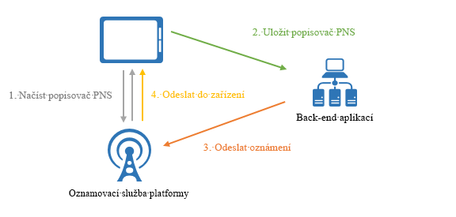
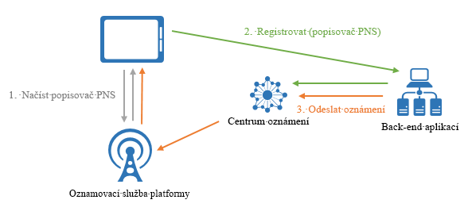

# Co je Azure Notification Hubs?

Služba Azure Notification Hubs nabízí snadno použitelné, škálovatelné zasílací jádro, které umožňuje posílat oznámení libovolné platformě (iOS, Android, Windows, Kindle, Baidu atd.) z libovolného back-endu (cloudový nebo místní). Notification Hubs funguje jak ve scénářích velkých organizací, tak ve spotřebitelských scénářích. Příklady scénářů:

- Odesílání oznámení o důležitých zprávách milionům uživatelů s minimálním zpožděním.
- Odesílání kupónů závislých na aktuální poloze segmentům zájemců.
- Odesílání oznámení o událostech uživatelům multimediálních, sportovních, finančních nebo herních aplikací nebo jejich skupinám.
- Zasílání propagačního obsahu aplikacím kvůli informovanosti zákazníků a podpoře nabídky.
- Upozorňování uživatelů na podnikové události, jako jsou nové zprávy a pracovní položky.
- Odesílání kódů k vícefaktorovému ověřování.

## Co jsou nabízená oznámení?

Nabízená oznámení představují způsob komunikace aplikace s uživatelem. Uživatelům mobilních aplikací se oznamují určité požadované informace. Tato oznámení se většinou nabízejí v místní nabídce nebo v dialogovém okně. Uživatelé si většinou můžou vybrat, jestli chtějí zprávu zobrazit nebo zavřít. Pokud zvolí první možnost, otevře se mobilní aplikace, která oznámení zveřejnila.

Nabízená oznámení jsou nedílnou součástí spotřebitelských aplikací, protože zvyšují zapojení a využití aplikace, ale jsou důležitá i v podnikových aplikacích, kde slouží ke zveřejňování aktuálních obchodních informací. Jde o nejlepší způsob komunikace aplikace s uživatelem, protože je energeticky nenáročný na mobilní zařízení, je flexibilní pro odesílatele oznámení a je k dispozici, i když odpovídající aplikace nejsou aktivní.

Další informace o nabízených oznámeních pro některé oblíbené platformy najdete v následujících tématech:

- [Android](https://developer.android.com/guide/topics/ui/notifiers/notifications.html)
- [iOS](https://developer.apple.com/notifications/)
- [Windows](https://msdn.microsoft.com/library/windows/apps/hh779725.aspx)

## Jak fungují nabízená oznámení

Nabízená oznámení se doručují prostřednictvím infrastruktur odpovídajících určitým platformám. Tyto infrastruktury se označují jako *systémy oznámení platforem* (PNS). Nabízejí jednoduché funkce doručování zpráv do zařízení se zadaným popisovačem. Tyto funkce nemají společné rozhraní. K odesílání oznámení pro všechny zákazníky prostřednictvím na Android, iOS a Windows verze aplikace, musí vývojář pracovat s Apple Push Notification Service(APNS), Firebase Cloud Messaging(FCM) a Service(WNS) oznámení Windows.

Celkový přehled fungování nabízených oznámení:

1. Klientská aplikace se rozhodne, že chce dostávat oznámení. Kontaktuje příslušný systém oznámení platformy (PNS) a načte jedinečný dočasný popisovač nabízených oznámení. Typ popisovače závisí na systému (například WNS používá identifikátory URI a APNS používá tokeny).
2. Klientská aplikace uloží popisovač v back-endové aplikaci neboli u poskytovatele.
3. Pokud chce aplikace odeslat nabízené oznámení, back-endová aplikace kontaktuje PNS prostřednictvím popisovače určeného pro konkrétní klientskou aplikaci.
4. Systém PNS předá oznámení do zařízení určeného popisovačem.

## Obtíže spojené s nabízenými oznámeními

Systémy PNS jsou velmi výkonné. Přesto ale nechávají většinu práce na vývojáři aplikace, a to i při implementaci běžných scénářů nabízených oznámení, jako je vysílání nabízených oznámení nebo jejich odeslání určitému segmentu uživatelů.

K zasílání nabízených oznámení je potřeba složitá infrastruktura, která nesouvisí s hlavní obchodní logikou aplikace. Některé problémy týkající se infrastruktury:

- **Závislost na platformě**
  - Back-end musí mít složitou a na údržbu náročnou logiku, která závisí na určité platformě a slouží k posílání oznámení zařízením s různými platformami, protože systémy PNS nejsou jednotné.
- **Škálování**
  - Podle pokynů PNS musí být tokeny zařízení aktualizované při každém spuštění aplikace. Back-end zpracovává velký počet přenosů a přístupů k databázi, jenom aby udržel aktuální tokeny. Pokud počet zařízení vzroste do stovek milionů a pak do miliard, jsou náklady na vytvoření a údržbu této infrastruktury velmi vysoké.
  - Většina systémů PNS nepodporuje vysílání na více zařízení. Jednoduché vysílání pro milion zařízení znamená milion volání systémů PNS. Škálovat tento provoz s minimální latencí není úplně jednoduché.
- **Směrování**
  - Systémy PNS sice nabízejí způsob, jak posílat zprávy zařízením, ale většina oznámení posílaných aplikacemi je cílených na uživatele nebo zájmové skupiny. Back-end proto musí udržovat registr, který spojuje zařízení se zájmovými skupinami, uživateli, vlastnostmi apod. Tato dodatečná režie prodlužuje dobu potřebnou k publikování a navyšuje náklady na údržbu aplikace.

## Proč používat Azure Notification Hubs?

Služba Notification Hubs eliminuje všechny komplikace, se kterými se můžete setkat, kdybyste nabízená oznámení z back-endové aplikace zasílali sami. Platformově univerzální škálovatelná infrastruktura, určená k zasílání nabízených oznámení, zmenšuje potřebu programování oznámení a zjednodušuje back-end. Se službou Notification Hubs zodpovídají zařízení jenom za registraci popisovačů systému PNS v centru, zatímco back-end posílá zprávy uživatelům nebo zájmovým skupinám. Je to vidět na následujícím obrázku:

Centra oznámení jsou předem připravená jádra pro zasílání oznámení, která mají následující výhody:

- **Jsou pro různé platformy**
  - Podporují všechny hlavní platformy, jako je iOS, Android, Windows, Kindle a Baidu.
  - Nabízejí společné rozhraní pro zasílání oznámení všem platformám ve formátech, které jsou specifické pro danou platformu nebo jsou na ní nezávislé, a to bez práce spojené s určitou platformou.
  - Správa popisovačů zařízení se provádí na jednom místě.
- **Jsou pro různé back-endy**
  - Mohou být cloudové nebo místní.
  - .NET, Node.js, Java atd.
- **Bohatá sada schémat doručování**
  - Vysílání na jeden nebo více platforem: Můžete se okamžitě vysílání na miliony zařízení napříč platformami pomocí jediného volání rozhraní API.
  - Odeslat do zařízení: Můžete cílit oznámení pro jednotlivá zařízení.
  - Push pro uživatele: Značky a šablony funkce vám pomůže oslovit všechny různé platformy zařízení uživatele.
  - Vložit do segmentu dynamické značky: Funkce značky vám pomůže segmentu zařízení a metodou push do nich podle svých potřeb, jestli posíláte na jeden segment nebo výraz segmentů (například aktivní a odpovídající Seattle není nového uživatele). Místo omezení publikování a odebírání můžete kdekoli a kdykoli aktualizovat značky zařízení.
  - Lokalizovaná nabízená: Funkce šablony pomáhá dosahovat lokalizace bez ovlivnění kódu back-endu.
  - Tiché nabízených oznámení: Model push pro vyžádání obsahu můžete povolit posílání tiché oznámení do zařízení a aktivaci jejich dokončení některých si nebo akce.
  - Plánované nabízené oznámení: Můžete naplánovat, kdykoli odeslat oznámení.
  - Přímé nabízených oznámení: Můžete přeskočit registraci zařízení se službou Notification Hubs a přímo batch metodou push do seznamu popisovače zařízení.
  - Přizpůsobená nabízená: Proměnné nabízených oznámení zařízení, které individuální pomáhá zasílané specifická pro zařízení nabízená oznámení pomocí přizpůsobených páry klíč hodnota.
- **Bohaté telemetrické funkce**
  - Na webu Azure Portal jsou k dispozici obecné telemetrické funkce poskytující informace o nabízených oznámeních, zařízeních, chybách a provozu.
  - Telemetrie zprávy sleduje každé nabízené oznámení od počátečního volání až po úspěšné hromadné odeslání nabízených oznámení službou Notification Hubs.
  - Zpětná vazba systému oznámení platformy oznamuje veškerou zpětnou vazbu systémů PNS, aby bylo možné ji použít k ladění.
- **Škálovatelnost**
  - Rychlé zprávy můžete posílat milionům zařízení bez změny architektury nebo horizontálního dělení zařízení.
- **Zabezpečení**
  - K dispozici je sdílený tajný přístupový klíč (SAS) nebo federované ověření.

## Integrace s App Service Mobile Apps

Pro zajištění plynulého a sjednocujícího prostředí napříč službami Azure nabízí [App Service Mobile Apps](../app-service-mobile/app-service-mobile-value-prop.md) integrovanou podporu pro nabízená oznámení prostřednictvím služby Notification Hubs. Služba [App Service Mobile Apps](../app-service-mobile/app-service-mobile-value-prop.md) nabízí vysoce škálovatelnou a globálně dostupnou platformu pro vývoj mobilních aplikací určenou pro vývojáře a integrátory systémů ve velkých firmách. Přináší bohatou sadu funkcí pro vývojáře pro mobilní zařízení.

Vývojáři v Mobile Apps mohou službu Notification Hubs využívat v rámci následujícího pracovního postupu:

1. Načtení popisovače systému PNS zařízení
2. Registrace zařízení ve službě Notification Hubs se provádí pohodlně v registračním rozhraní API sady Mobile Apps Client SDK.

    > [!NOTE]
    > Mějte na paměti, že služba Mobile Apps odstraní z bezpečnostních důvodů při registraci všechny značky. Služba Notification Hubs vám umožní přiřadit značky k zařízením přímo z back-endu.
3. Odesílání oznámení z back-endu aplikace pomocí Notification Hubs

Zde jsou některé výhody, které vývojáři získají díky této integraci:

- **Sady Mobile Apps Client SDK**: Tyto multiplatformní sady SDK poskytují jednoduchá rozhraní API pro registraci a automaticky komunikují s centrem oznámení propojeným s touto mobilní aplikací. Vývojáři se nemusí zabývat přihlašovacími údaji pro Notification Hubs a pracovat s další službou.
  - *Push uživateli*: Tyto sady SDK automaticky označí dané zařízení ověřeným ID uživatele Mobile Apps, díky čemuž je možné uskutečnit scénář nabízených oznámení pro uživatele.
  - *Odeslat do zařízení*: Sady SDK automaticky používají instalační ID Mobile Apps jako identifikátor GUID pro registraci v Notification Hubs, což vývojáře zbavuje nutnosti starat se o identifikátory GUID pro několik služeb.
- **Instalační model**: Služba Mobile Apps pracuje s nejnovějším modelem nabízených oznámení v Notification Hubs, který reprezentuje všechny vlastnosti nabízených oznámení související se zařízením v instalaci JSON, což vyhovuje Službě nabízených oznámení a nabízí snadné použití.
- **Flexibilita**: Vývojáři se vždy mohou rozhodnout pracovat přímo s Notification Hubs, a to i když je tato služba integrována.
- **Integrované prostředí na [webu Azure portal](https://portal.azure.com)**: Nabízená oznámení jsou v Mobile Apps vizuálně reprezentována jako funkce a vývojáři mohou přes Mobile Apps snadno pracovat s přidruženým centrem oznámení.

## Další postup

Začínáme s vytváření a používání centra oznámení pomocí následujících [kurzu: Nabízená oznámení do mobilní aplikace](notification-hubs-android-push-notification-google-fcm-get-started.md).

[0]: ./media/notification-hubs-overview/registration-diagram.png
[1]: ./media/notification-hubs-overview/notification-hub-diagram.png

[How customers are using Notification Hubs]: http://azure.microsoft.com/services/notification-hubs
[Notification Hubs tutorials and guides]: http://azure.microsoft.com/documentation/services/notification-hubs
[iOS]: http://azure.microsoft.com/documentation/articles/notification-hubs-ios-get-started
[Android]: http://azure.microsoft.com/documentation/articles/notification-hubs-android-get-started
[Windows Universal]: http://azure.microsoft.com/documentation/articles/notification-hubs-windows-store-dotnet-get-started
[Windows Phone]: http://azure.microsoft.com/documentation/articles/notification-hubs-windows-phone-get-started
[Kindle]: http://azure.microsoft.com/documentation/articles/notification-hubs-kindle-get-started
[Xamarin.iOS]: http://azure.microsoft.com/documentation/articles/partner-xamarin-notification-hubs-ios-get-started
[Xamarin.Android]: http://azure.microsoft.com/documentation/articles/partner-xamarin-notification-hubs-android-get-started
[Microsoft.WindowsAzure.Messaging.NotificationHub]: http://msdn.microsoft.com/library/microsoft.windowsazure.messaging.notificationhub.aspx
[Microsoft.ServiceBus.Notifications]: http://msdn.microsoft.com/library/microsoft.servicebus.notifications.aspx
[App Service Mobile Apps]: https://azure.microsoft.com/documentation/articles/app-service-mobile-value-prop/
[templates]: notification-hubs-templates-cross-platform-push-messages.md
[Azure portal]: https://portal.azure.com
[tags]: (http://msdn.microsoft.com/library/azure/dn530749.aspx)
