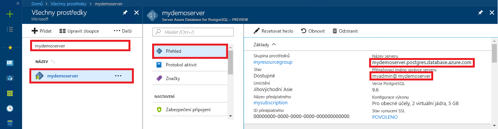

# <a name="quickstart-use-python-to-connect-and-query-data-in-azure-database-for-postgresql---single-server"></a>Úvodní příručka: Připojení a dotazování dat v Azure Database for PostgreSQL – jeden server pomocí Pythonu

V tomto rychlém startu pracujete s databází Azure pro PostgreSQL pomocí Pythonu v macOS, Ubuntu Linux nebo Windows. Rychlý start ukazuje, jak se připojit k databázi a používat příkazy SQL k dotazování, vkládání, aktualizaci a odstraňování dat. Článek předpokládá, že jste obeznámeni s Pythonem, ale jste noví v práci s Azure Database pro PostgreSQL.

## <a name="prerequisites"></a>Požadavky

- Účet Azure s aktivním předplatným. [Vytvořte si účet zdarma](https://azure.microsoft.com/free/?ref=microsoft.com&utm_source=microsoft.com&utm_medium=docs&utm_campaign=visualstudio).

- Dokončení [úvodního článku: Vytvořte databázi Azure pro postgreSQL server na webu Azure Portal](quickstart-create-server-database-portal.md) nebo [Quickstart: Vytvořte databázi Azure pro PostgreSQL pomocí azure cli](quickstart-create-server-database-azure-cli.md).
  
- [Python](https://www.python.org/downloads/) 2.7.9+ nebo 3.4+.
  
- Nejnovější [pip](https://pip.pypa.io/en/stable/installing/) balíček instalátor.

## <a name="install-the-python-libraries-for-postgresql"></a>Instalace knihoven Pythonu pro PostgreSQL
Modul [psycopg2](https://pypi.python.org/pypi/psycopg2/) umožňuje připojení k databázi PostgreSQL a dotazování se na ni a je k dispozici jako balíček [kolečka](https://pythonwheels.com/) Linux, macOS nebo Windows. Nainstalujte binární verzi modulu, včetně všech závislostí. Další informace `psycopg2` o instalaci a požadavcích naleznete v [tématu Instalace](http://initd.org/psycopg/docs/install.html). 

Chcete-li nainstalovat `psycopg2`, otevřete terminál `pip install psycopg2`nebo příkazový řádek a spusťte příkaz .

## <a name="get-database-connection-information"></a>Získání informací o připojení k databázi
Připojení k databázi Azure database for PostgreSQL vyžaduje plně kvalifikovaný název serveru a přihlašovací údaje. Tyto informace můžete získat z webu Azure Portal.

1. Na [webu Azure Portal](https://portal.azure.com/)vyhledejte a vyberte název serveru Azure Database for PostgreSQL. 
1. Na stránce **Přehled** serveru zkopírujte plně kvalifikovaný **název serveru** a uživatelské **jméno správce**. Plně kvalifikovaný **název serveru** je vždy ve formě * \<my-server-name>.postgres.database.azure.com*a uživatelské jméno **správce** je vždy ve formě * \<my-admin-username>@\<my-server-name>*. 
   
   Potřebujete také heslo správce. Pokud ji zapomenete, můžete ji obnovit z této stránky. 
   
   

## <a name="how-to-run-the-python-examples"></a>Jak spustit příklady Pythonu

Pro každý příklad kódu v tomto článku:

1. Vytvořte nový soubor v textovém editoru. 
   
1. Přidejte příklad kódu do souboru. V kódu nahraďte:
   - `<server-name>`a `<admin-username>` s hodnotami, které jste zkopírovali z portálu Azure.
   - `<admin-password>`s heslem serveru.
   - `<database-name>`s názvem databáze Azure pro databázi PostgreSQL. Při vytváření serveru byla automaticky vytvořena výchozí databáze s názvem *postgres.* Tuto databázi můžete přejmenovat nebo vytvořit novou databázi pomocí příkazů SQL. 
   
1. Uložte soubor do složky projektu s příponou *Py,* například *postgres-insert.py*. V systému Windows zkontrolujte, zda je při uložení souboru vybráno kódování UTF-8. 
   
1. Chcete-li soubor spustit, změňte složku projektu v rozhraní `python` příkazového řádku a `python postgres-insert.py`zadejte například název souboru .

## <a name="create-a-table-and-insert-data"></a>Vytvoření tabulky a vložení dat
Následující příklad kódu se připojí k databázi Azure Database for PostgreSQL pomocí funkce [psycopg2.connect](http://initd.org/psycopg/docs/connection.html) a načte data pomocí příkazu SQL **INSERT.** Funkce [cursor.execute](http://initd.org/psycopg/docs/cursor.html#execute) spustí dotaz SQL proti databázi. 

```Python
import psycopg2

# Update connection string information 
host = "<server-name>"
dbname = "<database-name>"
user = "<admin-username>"
password = "<admin-password>"
sslmode = "require"

# Construct connection string
conn_string = "host={0} user={1} dbname={2} password={3} sslmode={4}".format(host, user, dbname, password, sslmode)
conn = psycopg2.connect(conn_string) 
print("Connection established")

cursor = conn.cursor()

# Drop previous table of same name if one exists
cursor.execute("DROP TABLE IF EXISTS inventory;")
print("Finished dropping table (if existed)")

# Create a table
cursor.execute("CREATE TABLE inventory (id serial PRIMARY KEY, name VARCHAR(50), quantity INTEGER);")
print("Finished creating table")

# Insert some data into the table
cursor.execute("INSERT INTO inventory (name, quantity) VALUES (%s, %s);", ("banana", 150))
cursor.execute("INSERT INTO inventory (name, quantity) VALUES (%s, %s);", ("orange", 154))
cursor.execute("INSERT INTO inventory (name, quantity) VALUES (%s, %s);", ("apple", 100))
print("Inserted 3 rows of data")

# Clean up
conn.commit()
cursor.close()
conn.close()
```

Při úspěšném spuštění kódu vytvoří následující výstup:


## <a name="read-data"></a>Čtení dat
Následující příklad kódu se připojí k databázi Azure Database for PostgreSQL a ke čtení dat použije [cursor.execute](http://initd.org/psycopg/docs/cursor.html#execute) s příkazem SQL **SELECT.** Tato funkce přijme dotaz a vrátí sadu výsledků k iterátu přes pomocí [cursor.fetchall()](http://initd.org/psycopg/docs/cursor.html#cursor.fetchall). 

```Python
import psycopg2

# Update connection string information
host = "<server-name>"
dbname = "<database-name>"
user = "<admin-username>"
password = "<admin-password>"
sslmode = "require"

# Construct connection string
conn_string = "host={0} user={1} dbname={2} password={3} sslmode={4}".format(host, user, dbname, password, sslmode)
conn = psycopg2.connect(conn_string) 
print("Connection established")

cursor = conn.cursor()

# Fetch all rows from table
cursor.execute("SELECT * FROM inventory;")
rows = cursor.fetchall()

# Print all rows
for row in rows:
    print("Data row = (%s, %s, %s)" %(str(row[0]), str(row[1]), str(row[2])))

# Cleanup
conn.commit()
cursor.close()
conn.close()
```

## <a name="update-data"></a>Aktualizace dat
Následující příklad kódu se připojí k databázi Azure Database for PostgreSQL a k aktualizaci dat použije [cursor.execute](http://initd.org/psycopg/docs/cursor.html#execute) s příkazem SQL **UPDATE.** 

```Python
import psycopg2

# Update connection string information
host = "<server-name>"
dbname = "<database-name>"
user = "<admin-username>"
password = "<admin-password>"
sslmode = "require"

# Construct connection string
conn_string = "host={0} user={1} dbname={2} password={3} sslmode={4}".format(host, user, dbname, password, sslmode)
conn = psycopg2.connect(conn_string) 
print("Connection established")

cursor = conn.cursor()

# Update a data row in the table
cursor.execute("UPDATE inventory SET quantity = %s WHERE name = %s;", (200, "banana"))
print("Updated 1 row of data")

# Cleanup
conn.commit()
cursor.close()
conn.close()
```

## <a name="delete-data"></a>Odstranění dat
Následující příklad kódu se připojí k databázi Azure Database for PostgreSQL a pomocí [cursor.execute](http://initd.org/psycopg/docs/cursor.html#execute) s příkazem SQL **DELETE** odstraní položku inventáře, kterou jste dříve vložili. 

```Python
import psycopg2

# Update connection string information
host = "<server-name>"
dbname = "<database-name>"
user = "<admin-username>"
password = "<admin-password>"
sslmode = "require"

# Construct connection string
conn_string = "host={0} user={1} dbname={2} password={3} sslmode={4}".format(host, user, dbname, password, sslmode)
conn = psycopg2.connect(conn_string) 
print("Connection established")

cursor = conn.cursor()

# Delete data row from table
cursor.execute("DELETE FROM inventory WHERE name = %s;", ("orange",))
print("Deleted 1 row of data")

# Cleanup
conn.commit()
cursor.close()
conn.close()
```

## <a name="next-steps"></a>Další kroky
> [!div class="nextstepaction"]
> [Migrace vaší databáze pomocí exportu a importu](./howto-migrate-using-export-and-import.md)
