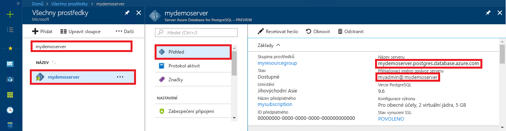

# <a name="quickstart-use-ruby-to-connect-and-query-data-in-azure-database-for-postgresql---single-server"></a>Rychlý Start: použití Ruby k připojení a dotazování dat v Azure Database for PostgreSQL – jeden server

Tento rychlý start ukazuje, jak se připojit ke službě Azure Database for PostgreSQL pomocí aplikace v [Ruby](https://www.ruby-lang.org). Ukazuje, jak pomocí příkazů jazyka SQL dotazovat, vkládat, aktualizovat a odstraňovat data v databázi. Kroky v tomto článku předpokládají, že máte zkušenosti s vývojem pomocí Ruby a teprve začínáte pracovat se službou Azure Database for PostgreSQL.

## <a name="prerequisites"></a>Požadavky
Tento rychlý start jako výchozí bod využívá prostředky vytvořené v některém z těchto průvodců:
- [Vytvoření databáze – portál](quickstart-create-server-database-portal.md)
- [Vytvoření databáze – Azure CLI](quickstart-create-server-database-azure-cli.md)

Je také nutné nainstalovat:
- [Ruby](https://www.ruby-lang.org/en/downloads/)
- Ruby PG, modul PostgreSQL pro Ruby

## <a name="get-connection-information"></a>Získání informací o připojení
Získejte informace o připojení potřebné pro připojení ke službě Azure Database for PostgreSQL. Potřebujete plně kvalifikovaný název serveru a přihlašovací údaje.

1. Přihlaste se k [Azure Portal](https://portal.azure.com/).
2. V nabídce vlevo na webu Azure Portal klikněte na **Všechny prostředky** a vyhledejte vytvořený server (například **mydemoserver**).
3. Klikněte na název serveru.
4. Na panelu **Přehled** serveru si poznamenejte **Název serveru** a **Přihlašovací jméno správce serveru**. Pokud zapomenete své heslo, můžete ho na tomto panelu také resetovat.
 

> [!NOTE]
> `@`Symbol v uživatelském jménu Azure Postgres byl kódovaný jako adresa URL `%40` ve všech připojovacích řetězcích. 

## <a name="connect-and-create-a-table"></a>Připojení a vytvoření tabulky
Pomocí následujícího kódu se připojte a vytvořte tabulku s využitím příkazu **CREATE TABLE** jazyka SQL, po kterém následují příkazy **INSERT INTO** jazyka SQL, které do tabulky přidají řádky.

Kód pro připojení ke službě Azure Database for PostgreSQL používá objekt [PG::Connection](https://www.rubydoc.info/gems/pg/PG/Connection) s konstruktorem [new()](https://www.rubydoc.info/gems/pg/PG/Connection#initialize-instance_method). Potom volá metodu [exec()](https://www.rubydoc.info/gems/pg/PG/Connection#exec-instance_method) pro spuštění příkazů DROP, CREATE TABLE a INSERT INTO. Kód kontroluje chyby pomocí třídy [PG::Error](https://www.rubydoc.info/gems/pg/PG/Error). Před ukončením potom volá metodu [close()](https://www.rubydoc.info/gems/pg/PG/Connection#lo_close-instance_method) pro ukončení připojení.

Nahraďte řetězce `host`, `database`, `user` a `password` vlastními hodnotami. 


```ruby
require 'pg'

begin
    # Initialize connection variables.
    host = String('mydemoserver.postgres.database.azure.com')
    database = String('postgres')
    user = String('mylogin%40mydemoserver')
    password = String('<server_admin_password>')

    # Initialize connection object.
    connection = PG::Connection.new(:host => host, :user => user, :dbname => database, :port => '5432', :password => password)
    puts 'Successfully created connection to database'

    # Drop previous table of same name if one exists
    connection.exec('DROP TABLE IF EXISTS inventory;')
    puts 'Finished dropping table (if existed).'

    # Drop previous table of same name if one exists.
    connection.exec('CREATE TABLE inventory (id serial PRIMARY KEY, name VARCHAR(50), quantity INTEGER);')
    puts 'Finished creating table.'

    # Insert some data into table.
    connection.exec("INSERT INTO inventory VALUES(1, 'banana', 150)")
    connection.exec("INSERT INTO inventory VALUES(2, 'orange', 154)")
    connection.exec("INSERT INTO inventory VALUES(3, 'apple', 100)")
    puts 'Inserted 3 rows of data.'

rescue PG::Error => e
    puts e.message 
    
ensure
    connection.close if connection
end
```

## <a name="read-data"></a>Čtení dat
Pomocí následujícího kódu se připojte a načtěte data s využitím příkazu **SELECT** jazyka SQL. 

Kód pro připojení ke službě Azure Database for PostgreSQL používá objekt [PG::Connection](https://www.rubydoc.info/gems/pg/PG/Connection) s konstruktorem [new()](https://www.rubydoc.info/gems/pg/PG/Connection#initialize-instance_method). Potom volá metodu [exec()](https://www.rubydoc.info/gems/pg/PG/Connection#exec-instance_method) pro spuštění příkazu SELECT a výsledky uloží do sady výsledků dotazu. Nad kolekcí sady výsledků dotazu se iteruje pomocí smyčky `resultSet.each do` a hodnoty aktuálního řádku se ukládají do proměnné `row`. Kód kontroluje chyby pomocí třídy [PG::Error](https://www.rubydoc.info/gems/pg/PG/Error). Před ukončením potom volá metodu [close()](https://www.rubydoc.info/gems/pg/PG/Connection#lo_close-instance_method) pro ukončení připojení.

Nahraďte řetězce `host`, `database`, `user` a `password` vlastními hodnotami. 

```ruby
require 'pg'

begin
    # Initialize connection variables.
    host = String('mydemoserver.postgres.database.azure.com')
    database = String('postgres')
    user = String('mylogin%40mydemoserver')
    password = String('<server_admin_password>')

    # Initialize connection object.
    connection = PG::Connection.new(:host => host, :user => user, :database => dbname, :port => '5432', :password => password)
    puts 'Successfully created connection to database.'

    resultSet = connection.exec('SELECT * from inventory;')
    resultSet.each do |row|
        puts 'Data row = (%s, %s, %s)' % [row['id'], row['name'], row['quantity']]
    end

rescue PG::Error => e
    puts e.message 
    
ensure
    connection.close if connection
end
```

## <a name="update-data"></a>Aktualizace dat
Pomocí následujícího kódu se připojte a aktualizujte data s využitím příkazu **UPDATE** jazyka SQL.

Kód pro připojení ke službě Azure Database for PostgreSQL používá objekt [PG::Connection](https://www.rubydoc.info/gems/pg/PG/Connection) s konstruktorem [new()](https://www.rubydoc.info/gems/pg/PG/Connection#initialize-instance_method). Potom volá metodu [exec()](https://www.rubydoc.info/gems/pg/PG/Connection#exec-instance_method) pro spuštění příkazu UPDATE. Kód kontroluje chyby pomocí třídy [PG::Error](https://www.rubydoc.info/gems/pg/PG/Error). Před ukončením potom volá metodu [close()](https://www.rubydoc.info/gems/pg/PG/Connection#lo_close-instance_method) pro ukončení připojení.

Nahraďte řetězce `host`, `database`, `user` a `password` vlastními hodnotami. 

```ruby
require 'pg'

begin
    # Initialize connection variables.
    host = String('mydemoserver.postgres.database.azure.com')
    database = String('postgres')
    user = String('mylogin%40mydemoserver')
    password = String('<server_admin_password>')

    # Initialize connection object.
    connection = PG::Connection.new(:host => host, :user => user, :dbname => database, :port => '5432', :password => password)
    puts 'Successfully created connection to database.'

    # Modify some data in table.
    connection.exec('UPDATE inventory SET quantity = %d WHERE name = %s;' % [200, '\'banana\''])
    puts 'Updated 1 row of data.'

rescue PG::Error => e
    puts e.message 
    
ensure
    connection.close if connection
end
```


## <a name="delete-data"></a>Odstranění dat
Pomocí následujícího kódu se připojte a načtěte data s využitím příkazu **DELETE** jazyka SQL. 

Kód pro připojení ke službě Azure Database for PostgreSQL používá objekt [PG::Connection](https://www.rubydoc.info/gems/pg/PG/Connection) s konstruktorem [new()](https://www.rubydoc.info/gems/pg/PG/Connection#initialize-instance_method). Potom volá metodu [exec()](https://www.rubydoc.info/gems/pg/PG/Connection#exec-instance_method) pro spuštění příkazu UPDATE. Kód kontroluje chyby pomocí třídy [PG::Error](https://www.rubydoc.info/gems/pg/PG/Error). Před ukončením potom volá metodu [close()](https://www.rubydoc.info/gems/pg/PG/Connection#lo_close-instance_method) pro ukončení připojení.

Nahraďte řetězce `host`, `database`, `user` a `password` vlastními hodnotami. 

```ruby
require 'pg'

begin
    # Initialize connection variables.
    host = String('mydemoserver.postgres.database.azure.com')
    database = String('postgres')
    user = String('mylogin%40mydemoserver')
    password = String('<server_admin_password>')

    # Initialize connection object.
    connection = PG::Connection.new(:host => host, :user => user, :dbname => database, :port => '5432', :password => password)
    puts 'Successfully created connection to database.'

    # Modify some data in table.
    connection.exec('DELETE FROM inventory WHERE name = %s;' % ['\'orange\''])
    puts 'Deleted 1 row of data.'

rescue PG::Error => e
    puts e.message 
    
ensure
    connection.close if connection
end
```

## <a name="next-steps"></a>Další kroky
> [!div class="nextstepaction"]
> [Migrace vaší databáze pomocí exportu a importu](./howto-migrate-using-export-and-import.md)
