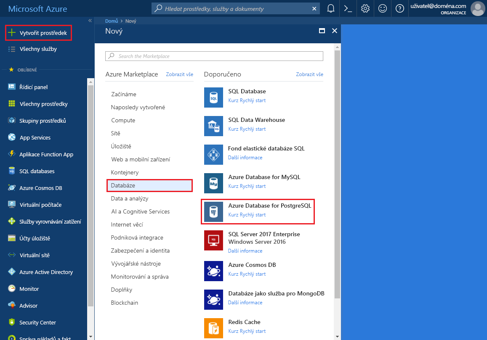

# <a name="infrastructure-double-encryption-for-azure-database-for-postgresql"></a>Dvojité šifrování infrastruktury pro Azure Database for PostgreSQL

Naučte se, jak nastavit a spravovat dvojité šifrování infrastruktury pro váš Azure Database for PostgreSQL.

## <a name="prerequisites"></a>Požadavky

* Musíte mít předplatné Azure a mít oprávnění správce k tomuto předplatnému.

## <a name="create-an-azure-database-for-postgresql-server-with-infrastructure-double-encryption---portal"></a>Vytvoření serveru Azure Database for PostgreSQL s využitím šifrování infrastruktury – portál

Pomocí těchto kroků můžete vytvořit Azure Database for MySQL server s šifrováním s dvojitou infrastrukturou v Azure Portal:

1. V levém horním rohu portálu vyberte **vytvořit prostředek** (+).

2. Vyberte **databáze**  >  **Azure Database for PostgreSQL**. Službu můžete vyhledat také zadáním PostgreSQL do vyhledávacího pole. Byla povolena možnost nasazení **jednoho serveru** .

   

3. Zadejte základní informace o serveru. Chcete-li nastavit parametr, vyberte **Další nastavení** a povolit zaškrtávací políčko **infrastruktura – dvojité šifrování** .

    

4. Vyberte **zkontrolovat + vytvořit** a zřiďte Server.

    

5. Po vytvoření serveru můžete ověřit šifrované šifrování infrastruktury tím, že zkontrolujete stav v okně **datový šifrovací** Server.

    

## <a name="create-an-azure-database-for-postgresql-server-with-infrastructure-double-encryption---cli"></a>Vytvoření serveru Azure Database for PostgreSQL s použitím šifrování infrastruktury – rozhraní příkazového řádku

Pomocí těchto kroků vytvořte Azure Database for MySQL server s dvojitým šifrováním infrastruktury z CLI:

Tento příklad vytvoří skupinu prostředků s názvem `myresourcegroup` v `westus` umístění.

```azurecli-interactive
az group create --name myresourcegroup --location westus
```
Následující příklad vytvoří server PostgreSQL 11 v Západní USA s názvem `mydemoserver` ve vaší skupině prostředků `myresourcegroup` s přihlašovacím jménem správce serveru `myadmin` . Toto je **pro obecné účely** server **Gen 4** s **2 virtuální jádra**. Tím se taky povolí dvojité šifrování infrastruktury pro vytvořený server. Nahraďte položku `<server_admin_password>` vlastní hodnotou.

```azurecli-interactive
az postgres server create --resource-group myresourcegroup --name mydemoserver  --location westus --admin-user myadmin --admin-password <server_admin_password> --sku-name GP_Gen4_2 --version 11 --infrastructure-encryption >Enabled/Disabled>
```

## <a name="next-steps"></a>Další kroky

Další informace o šifrování dat najdete v tématu [Azure Database for PostgreSQL dvojité šifrování infrastruktury dat](concepts-Infrastructure-double-encryption.md).

