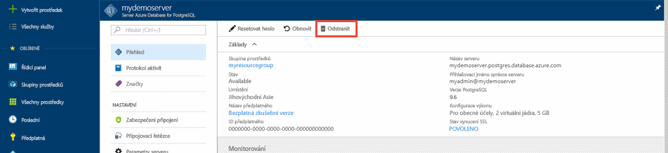

# <a name="quickstart-create-an-azure-database-for-postgresql-server-in-the-azure-portal"></a>Rychlý start: Vytvoření serveru Azure Database for PostgreSQL na webu Azure Portal

Azure Database for PostgreSQL je spravovaná služba, pomocí které spouštíte, spravujete a škálujete vysoce dostupné databáze PostgreSQL v cloudu. Tento rychlý start ukazuje, jak přibližně během pěti minut vytvořit server Azure Database for PostgreSQL pomocí webu Azure Portal.

Pokud ještě nemáte předplatné Azure, vytvořte si [bezplatný účet Azure](https://azure.microsoft.com/free/) před tím, než začnete.

## <a name="sign-in-to-the-azure-portal"></a>Přihlášení k webu Azure Portal
Otevřete webový prohlížeč a přejděte na [portál](https://portal.azure.com/). Zadejte přihlašovací údaje pro přihlášení k portálu. Výchozím zobrazením je váš řídicí panel služby.

## <a name="create-an-azure-database-for-postgresql-server"></a>Vytvoření serveru Azure Database for PostgreSQL

Server Azure Database for PostgreSQL se vytvoří s konfigurovanou sadou [výpočetních prostředků a prostředků úložiště](./concepts-pricing-tiers.md). Server se vytvoří v rámci [skupiny prostředků Azure](../azure-resource-manager/management/overview.md).

Server Azure Database for PostgreSQL vytvoříte pomocí tohoto postupu:
1. V levém horním rohu portálu vyberte **vytvořit prostředek** (+).

2. Vyberte **databáze**  >  **Azure Database for PostgreSQL**.

   > [!div class="mx-imgBorder"]
   > 

3. Vyberte možnost nasazení na **jeden server** .

   > [!div class="mx-imgBorder"]
   > 

4. Ve formuláři **základy** vyplňte následující informace:

   > [!div class="mx-imgBorder"]
   > 

   Nastavení|Navrhovaná hodnota|Popis
   ---|---|---
   Předplatné|Název vašeho předplatného|Předplatné Azure, které chcete použít pro váš server. Pokud máte více předplatných, zvolte předplatné, ve kterém se vám prostředek účtuje.
   Skupina prostředků|*myresourcegroup*| Název nové skupiny prostředků nebo některé ze stávajících ve vašem předplatném.
   Název serveru |*mydemoserver*|Jedinečný název, který identifikuje váš server Azure Database for PostgreSQL. K zadanému názvu serveru se připojí název domény *postgres.database.azure.com*. Název serveru může obsahovat pouze malá písmena, číslice a znak spojovníku (-). Musí se skládat z 3 až 63 znaků.
   Zdroj dat | *Žádný* | Pokud chcete vytvořit nový server úplně od začátku, vyberte *žádný* . (Pokud vytváříte server z geografické zálohy existujícího serveru Azure Database for PostgreSQL, vyberte *Záloha*.)
   Uživatelské jméno správce |*myadmin*| Váš vlastní přihlašovací účet, který budete používat pro připojení k serveru. Přihlašovací jméno správce nemůže být **azure_superuser**, **azure_pg_admin**, **admin**, **Administrator**, **root**, **Guest**ani **Public**. Nemůže začínat na **pg_**.
   Heslo |Vaše heslo| Nové heslo pro účet správce serveru. Musí mít 8 až 128 znaků. Heslo musí obsahovat znaky ze tří z těchto kategorií: velká písmena anglické abecedy, malá písmena anglické abecedy, číslice (0–9) a jiné než alfanumerické znaky (!, $, #, % apod.).
   Umístění|Oblast nejbližší vašim uživatelům| Umístění co nejblíže vašim uživatelům.
   Verze|Nejnovější hlavní verze| Nejnovější hlavní verze PostgreSQL, pokud nemáte jiné specifické požadavky.
   Výpočty + úložiště | **Obecné účely**, **Gen 5**, **2 virtuální jádra**, **5 GB**, **7 dní**, **Geograficky redundantní** | Konfigurace výpočtů, úložiště a zálohování pro nový server. Vyberte **Konfigurovat Server**. Pak vyberte příslušnou cenovou úroveň. Další informace najdete v [podrobnostech o cenách](https://azure.microsoft.com/pricing/details/postgresql/server/). Pokud chcete povolit zálohování serveru v geograficky redundantním úložišti, vyberte z **možností redundance zálohy**možnost **geograficky redundantní** . Vyberte **OK**.

   > [!NOTE]
   > Zvažte použití cenové úrovně Basic, pokud je pro vaše zatížení vhodné světlé výpočetní prostředky a vstupně-výstupní operace. Upozorňujeme, že servery vytvořené v cenové úrovni Basic se nedají později škálovat na Pro obecné účely nebo paměťově optimalizované. 
   
5. Vyberte možnost **zkontrolovat + vytvořit** a zkontrolujte výběr. Vyberte **Vytvořit**, aby se server zřídil. Tato operace může trvat několik minut.

6. Pokud chcete monitorovat proces nasazení, na panelu nástrojů vyberte ikonu **Oznámení** (zvonek). Po dokončení nasazení vyberte **Přejít k prostředku** otevře stránku **Přehled** serveru.

Vytvoří se prázdná databáze **Postgres** . Najdete v ní také **azure_maintenance** databázi, která se používá k oddělení procesů spravované služby od uživatelských akcí. Nemůžete získat přístup k **azure_maintenance** databázi.

## <a name="configure-a-server-level-firewall-rule"></a>Konfigurace pravidla brány firewall na úrovni serveru
Ve výchozím nastavení není vytvořený server veřejně přístupný a potřebujete udělit oprávnění k vaší IP adrese. Pokud chcete umožnit přístup k vaší IP adrese, přejděte na prostředek serveru v nabídce Azure Portal a vyberte **zabezpečení připojení** z levé strany pro prostředek serveru. Pokud si nejste jistí, jak prostředek najít, přečtěte si téma [Postup otevření prostředku](https://docs.microsoft.com/azure/azure-resource-manager/management/manage-resources-portal#open-resources).

> [!div class="mx-imgBorder"]
> 
  
Teď vyberte **Přidat aktuální IP adresu klienta** a pak vyberte **Uložit**. Můžete přidat další IP adresy nebo zadat rozsah IP adres pro připojení k serveru z těchto IP adres. Další informace najdete v tématu [Správa pravidel brány firewall](./concepts-firewall-rules.md) .
   
> [!NOTE]
> Ověřte, jestli vaše síť umožňuje odchozí provoz přes port 5432, který používá Azure Database for PostgreSQL, aby se předešlo problémům s připojením.  

## <a name="connect-to-azure-database-for-postgresql-server-using-psql"></a>Připojení k Azure Database for PostgreSQL serveru pomocí psql

Můžete použít [psql](http://postgresguide.com/utilities/psql.html) nebo [pgAdmin](https://www.pgadmin.org/docs/pgadmin4/latest/connecting.html) , které jsou oblíbenými klienty PostgreSQL. V tomto rychlém startu se připojíme pomocí psql v [Azure Cloud Shell](https://docs.microsoft.com/azure/cloud-shell/overview) v rámci Azure Portal.

1. Poznamenejte si název serveru, přihlašovací jméno správce serveru, heslo a ID předplatného nově vytvořeného serveru z části **Přehled** serveru, jak je znázorněno na následujícím obrázku.

2. Azure Cloud Shell na portálu spustíte tak, že vyberete ikonu na levém horním rohu, která je zvýrazněná na obrázku níže.

   > [!NOTE]
   > Pokud poprvé spouštíte Cloud Shell, zobrazí se výzva k vytvoření skupiny prostředků a účtu úložiště. Jedná se o jednorázový krok, který se automaticky připojí pro všechny relace. 

   > [!div class="mx-imgBorder"]
   > 

3. Spusťte tento příkaz na Azure Cloud Shell terminálu. Nahraďte hodnoty skutečným názvem serveru a přihlašovacím jménem uživatele správce. Použijte prázdnou databázi **Postgres** s uživatelem správce v tomto formátu: <admin-username> @ <servername> , jak je uvedeno níže pro Azure Database for PostgreSQL.

   ```azurecli-interactive
   psql --host=mydemoserver.postgres.database.azure.com --port=5432 --username=myadmin@mydemoserver --dbname=postgres
   ```
 
   Tady je postup, jak vypadat v Cloud Shell terminálu.
   
   ```bash
    Requesting a Cloud Shell.Succeeded.
    Connecting terminal...

    Welcome to Azure Cloud Shell
 
    Type "az" to use Azure CLI
    Type "help" to learn about Cloud Shell

    user@Azure:~$psql --host=mydemoserver.postgres.database.azure.com --port=5432 --username=myadmin@mydemoserver --dbname=postgres
    Password for user myadmin@mydemoserver.postgres.database.azure.com:
    psql (12.2 (Ubuntu 12.2-2.pgdg16.04+1), server 11.6)
    SSL connection (protocol: TLSv1.2, cipher: ECDHE-RSA-AES256-GCM-SHA384, bits: 256, compression: off)
    Type "help" for help.

    postgres=>
    ```
4. Ve stejném Azure Cloud Shell terminálu vytvořte **hosta** databáze.
   ```bash
   postgres=> CREATE DATABASE guest;
   ```

5. Teď můžete přepnout připojení k nově vytvořenému **hostovanému** databáze.

   ```bash
   \c guest
   ```
6. Zadejte `\q` a potom stisknutím klávesy ENTER ukončete psql. 

## <a name="clean-up-resources"></a>Vyčištění prostředků
Úspěšně jste vytvořili Azure Database for PostgreSQL Server ve skupině prostředků.  Pokud neočekáváte, že tyto prostředky budete potřebovat v budoucnu, můžete je odstranit odstraněním skupiny prostředků nebo pouhým odstraněním serveru PostgreSQL. Pokud chcete odstranit skupinu prostředků, postupujte podle těchto kroků:

1. V Azure Portal vyhledejte a vyberte **skupiny prostředků**. 
2. V seznamu Skupina prostředků vyberte název vaší skupiny prostředků.
3. Na stránce Přehled vaší skupiny prostředků vyberte **Odstranit skupinu prostředků**.
4. V potvrzovacím dialogovém okně zadejte název vaší skupiny prostředků a pak vyberte **Odstranit**.

Pokud chcete odstranit server, můžete kliknout na tlačítko **Odstranit** na stránce **Přehled** vašeho serveru, jak je znázorněno níže:
> [!div class="mx-imgBorder"]
> 

## <a name="next-steps"></a>Další kroky
> [!div class="nextstepaction"]
> [Migrace vaší databáze pomocí exportu a importu](./howto-migrate-using-export-and-import.md)
