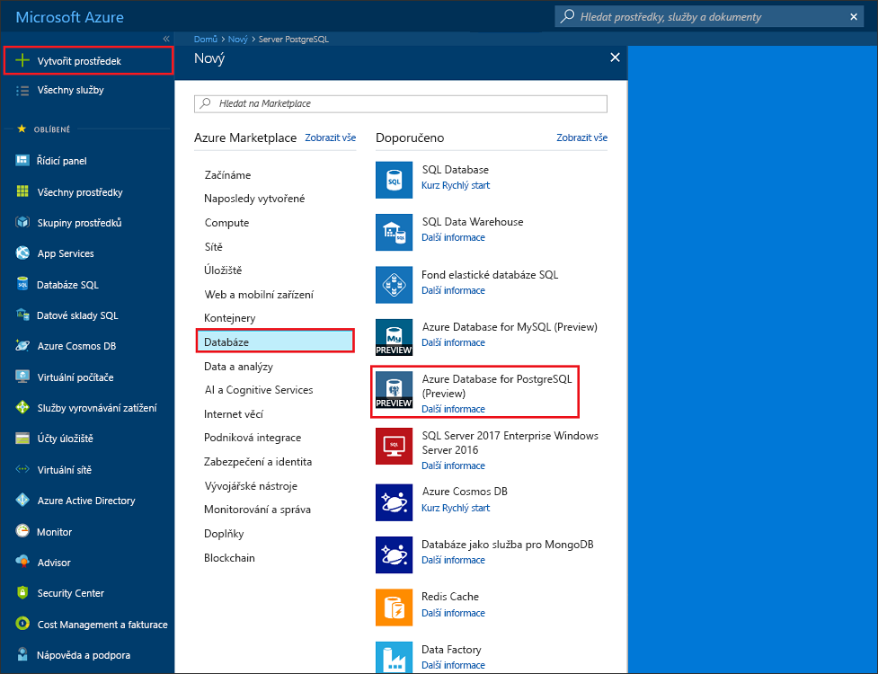
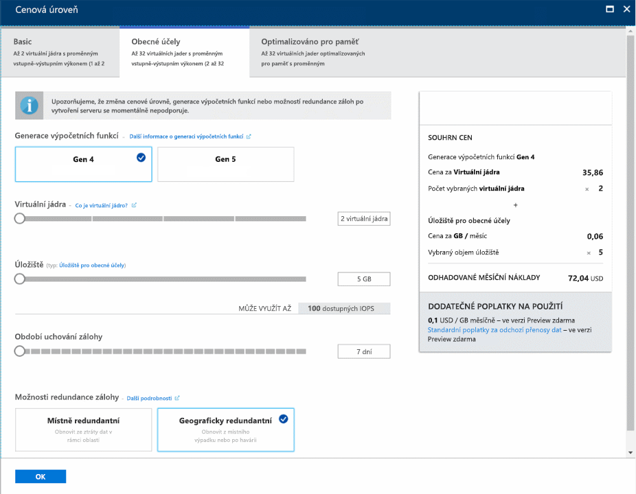
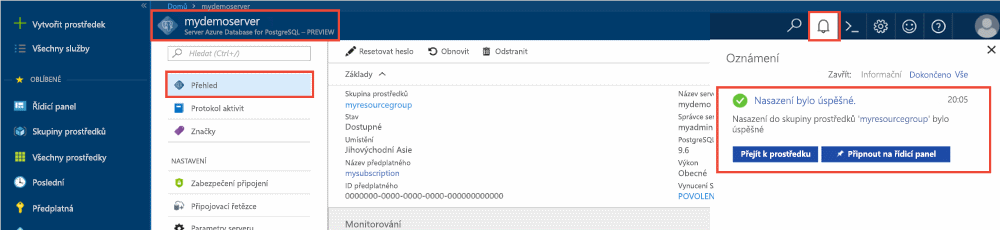
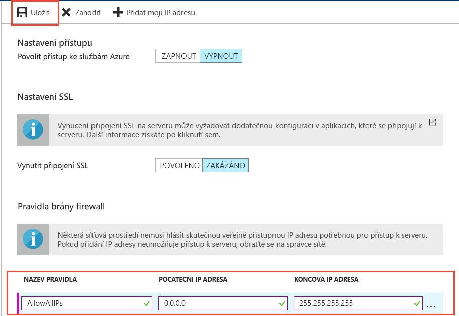
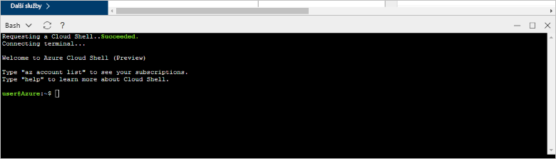

# <a name="tutorial-design-an-azure-database-for-postgresql---single-server-using-the-azure-portal"></a>Kurz: Návrh databáze Azure Database for PostgreSQL – jeden Server pomocí webu Azure portal

Azure Database for PostgreSQL je spravovaná služba, která umožňuje spouštět, spravovat a škálovat vysoce dostupné databáze PostgreSQL v cloudu. Azure Portal umožňuje snadnou správu vašeho serveru a návrh databáze.

V tomto kurzu se naučíte, jak pomocí webu Azure Portal provést následující kroky:
> [!div class="checklist"]
> * Vytvoření serveru Azure Database for PostgreSQL
> * Konfigurace brány firewall serveru
> * Vytvoření databáze pomocí nástroje [**psql**](https://www.postgresql.org/docs/9.6/static/app-psql.html)
> * Načtení ukázkových dat
> * Dotazování dat
> * Aktualizace dat
> * Obnovení dat

## <a name="prerequisites"></a>Požadavky
Pokud ještě nemáte předplatné Azure, vytvořte si [bezplatný účet](https://azure.microsoft.com/free/) před tím, než začnete.

## <a name="create-an-azure-database-for-postgresql"></a>Vytvoření Azure Database for PostgreSQL

Server Azure Database for PostgreSQL se vytvoří s definovanou sadou [výpočetních prostředků a prostředků úložiště](./concepts-compute-unit-and-storage.md). Server se vytvoří v rámci [skupiny prostředků Azure](../azure-resource-manager/resource-group-overview.md).

Server Azure Database for PostgreSQL vytvoříte pomocí tohoto postupu:
1. Klikněte na **Vytvořit prostředek** v levém horním rohu webu Azure Portal.
2. Na stránce **Nový** vyberte **Databáze** a na stránce **Databáze** vyberte **Azure Database for PostgreSQL**.
   

3. Vyberte **jeden server** možnost nasazení.

   

4. Vyplňte **Základy** formuláře následující informace:

    

    Nastavení|Navrhovaná hodnota|Popis
    ---|---|---
    Předplatné|Název vašeho předplatného|Předplatné Azure, které chcete použít pro váš server. Pokud máte více předplatných, zvolte předplatné, ve kterém se vám prostředek účtuje.
    Skupina prostředků|*myresourcegroup*| Název nové skupiny prostředků nebo některé ze stávajících ve vašem předplatném.
    Název serveru |*mydemoserver*|Jedinečný název, který identifikuje váš server Azure Database for PostgreSQL. K zadanému názvu serveru se připojí název domény *postgres.database.azure.com*. Název serveru může obsahovat pouze malá písmena, číslice a znak spojovníku (-). Musí se skládat z 3 až 63 znaků.
    Zdroj dat | *Žádné* | Vyberte *žádný* vytvořit nový server od začátku. (Pokud vytváříte server z geografické zálohy existujícího serveru Azure Database for PostgreSQL, vyberte *Záloha*.)
    Uživatelské jméno správce |*myadmin*| Váš vlastní přihlašovací účet, který budete používat pro připojení k serveru. Přihlašovací jméno správce nemůže být **azure_superuser**, **azure_pg_admin**, **admin**, **administrator**, **root**, **guest** ani **public**. Nemůže začínat na **pg_**.
    Heslo |Vaše heslo| Nové heslo pro účet správce serveru. Musí mít 8 až 128 znaků. Heslo musí obsahovat znaky ze tří z následujících kategorií: Velká písmena anglické abecedy, malá písmena, číslice (0 – 9) a jiné než alfanumerické znaky (!, $, #, % atd.).
    Location|Oblast nejbližší vašim uživatelům| Umístění co nejblíže vašim uživatelům.
    Version|Nejnovější hlavní verze| Nejnovější hlavní verze PostgreSQL, pokud nemáte jiné specifické požadavky.
    Výpočetní prostředky + úložiště | **Obecné účely**, **Gen 5**, **2 virtuální jádra**, **5 GB**, **7 dní**, **Geograficky redundantní** | Konfigurace výpočtů, úložiště a zálohování pro nový server. Vyberte **konfigurovat server**. Potom vyberte kartu **Obecné účely**. *5. generace*, *4 virtuální jádra*, *100 GB*, a *7 dní* jsou výchozí hodnoty pro **výpočetní generaci**,  **vCore**, **úložiště**, a **období uchování zálohy**. Můžete ponechat tyto posuvníky tak, jako je nebo je upravit. Pokud chcete povolit zálohování serveru v geograficky redundantním úložišti, vyberte v **Možnosti redundance zálohy** možnost **Geograficky redundantní**. Vyberte **OK** a uložte tento výběr cenové úrovně. Další snímek zachycuje tyto výběry.

   > [!NOTE]
   > Zvažte použití cenové úrovni Basic Pokud nízký výpočetní a vstupně-výstupní operace jsou dostatečné pro vaši úlohu. Všimněte si, že servery vytvořené v cenové úrovni Basic nelze později škálovat pro obecné účely nebo optimalizované pro paměť. Zobrazit [stránce s cenami](https://azure.microsoft.com/pricing/details/postgresql/) Další informace.
   > 

    

5. Vyberte **zkontrolujte + vytvořit** zkontrolujte zvolené položky. Vyberte **Vytvořit**, aby se server zřídil. Tato operace může trvat několik minut.

6. Pokud chcete monitorovat proces nasazení, na panelu nástrojů vyberte ikonu **Oznámení** (zvonek). Po dokončení nasazení můžete vybrat **Připnout na řídicí panel** a vytvořit dlaždici pro tento server na řídicím panelu webu Azure Portal, která slouží jako zástupce stránky **Přehled** serveru. Výběr **Přejít k prostředku** otevře stránku **Přehled** serveru.

    
   
   Ve výchozím nastavení se v rámci vašeho serveru vytvoří databáze **postgres**. Databáze [postgres](https://www.postgresql.org/docs/9.6/static/app-initdb.html) je výchozí databáze určená pro uživatele, nástroje a aplikace třetích stran. (Další výchozí databází je **azure_maintenance**. Její funkcí je oddělit procesy spravovaných služeb od akcí uživatelů. K této databázi nemáte přístup.)


## <a name="configure-a-server-level-firewall-rule"></a>Konfigurace pravidla brány firewall na úrovni serveru

Služba Azure Database for PostgreSQL využívá bránu firewall na úrovni serveru. Tato brána firewall ve výchozím nastavení brání všem externím aplikacím a nástrojům v připojení k serveru a kterékoli databázi na serveru, pokud není vytvořené pravidlo brány firewall k otevření brány firewall pro konkrétní rozsah IP adres. 

1. Jakmile se nasazení dokončí, klikněte na **Všechny prostředky** v nabídce vlevo a zadejte název **mydemoserver**. Vyhledáte tak nově vytvořený server. Klikněte na název serveru uvedený ve výsledcích hledání. Otevře se stránka **Přehled** vašeho serveru a poskytne vám možnosti další konfigurace.

   

2. Na stránce serveru vyberte **Zabezpečení připojení**. 

3. Klikněte do textového pole pod **Názvem pravidla** a přidejte nové pravidlo brány firewall, kterým povolíte připojení rozsahu IP adres. Zadejte rozsahu IP adresy. Klikněte na **Uložit**.

   

4. Klikněte na **Uložit** a pak kliknutím na **X** zavřete stránku **Zabezpečení připojení**.

   > [!NOTE]
   > Server Azure PostgreSQL komunikuje přes port 5432. Pokud se pokoušíte připojit z podnikové sítě, nemusí být odchozí provoz přes port 5432 bránou firewall vaší sítě povolený. Pokud je to tak, nebudete se moct připojit k serveru služby Azure SQL Database, dokud vaše IT oddělení neotevře port 5432.
   >

## <a name="get-the-connection-information"></a>Získání informací o připojení

Při vytváření serveru Azure Database for PostgreSQL se vytvořila i výchozí databáze **postgres**. Pokud se chcete připojit k databázovému serveru, budete muset zadat informace o hostiteli a přihlašovací údaje pro přístup.

1. V nabídce na levé straně webu Azure Portal klikněte na **Všechny prostředky** a vyhledejte právě vytvořený server.

   

2. Klikněte na název serveru **mydemoserver**.

3. Vyberte stránku **Přehled** serveru. Poznamenejte si **Název serveru** a **Přihlašovací jméno správce serveru**.

   


## <a name="connect-to-postgresql-database-using-psql-in-cloud-shell"></a>Připojení k databázi PostgreSQL pomocí psql ve službě Cloud Shell

Teď se pomocí nástroje příkazového řádku [psql](https://www.postgresql.org/docs/9.6/static/app-psql.html) připojíme k serveru Azure Database for PostgreSQL. 
1. Pomocí ikony terminálu v horním navigačním podokně spusťte službu Azure Cloud Shell.

   

2. Služba Azure Cloud Shell se otevře v prohlížeči a umožní vám zadat příkazy Bash.

   

3. V příkazovém řádku služby Cloud Shell se pomocí příkazů psql připojte k serveru Azure Database for PostgreSQL. Následující formát se používá pro připojení k serveru Azure Database for PostgreSQL s nástrojem [psql](https://www.postgresql.org/docs/9.6/static/app-psql.html):
   ```bash
   psql --host=<myserver> --port=<port> --username=<server admin login> --dbname=<database name>
   ```

   Třeba tento příkaz provádí pomocí přihlašovacích údajů pro přístup připojení k výchozí databázi s názvem **postgres** na serveru PostgreSQL **mydemoserver.postgres.database.azure.com**. Po zobrazení výzvy zadejte heslo správce serveru.

   ```bash
   psql --host=mydemoserver.postgres.database.azure.com --port=5432 --username=myadmin@mydemoserver --dbname=postgres
   ```

## <a name="create-a-new-database"></a>Vytvoření nové databáze
Po připojení k serveru vytvořte v příkazovém řádku prázdnou databázi.
```bash
CREATE DATABASE mypgsqldb;
```

V příkazovém řádku proveďte následující příkaz pro přepnutí připojení na nově vytvořenou databázi **mypgsqldb**.
```bash
\c mypgsqldb
```
## <a name="create-tables-in-the-database"></a>Vytvoření tabulek v databázi
Teď víte, jak se připojit k databázi Azure Database for PostgreSQL, a můžete začít provádět některé základní úlohy:

Nejdřív vytvoříte tabulku a načtete do ní data. Pomocí následujícího kódu SQL vytvoříme tabulku, která sleduje informace o inventáři:
```sql
CREATE TABLE inventory (
    id serial PRIMARY KEY, 
    name VARCHAR(50), 
    quantity INTEGER
);
```

Teď můžete nově vytvořenou databázi zobrazit v seznamu databází zadáním:
```sql
\dt
```

## <a name="load-data-into-the-tables"></a>Načtení dat do tabulek
Teď máte vytvořenou tabulku a můžete do ní vložit data. V otevřeném okně příkazového řádku spusťte následující dotaz, který vloží několik řádků dat.
```sql
INSERT INTO inventory (id, name, quantity) VALUES (1, 'banana', 150); 
INSERT INTO inventory (id, name, quantity) VALUES (2, 'orange', 154);
```

Tabulka inventáře, kterou jste vytvořili dříve, teď obsahuje dva řádky ukázkových dat.

## <a name="query-and-update-the-data-in-the-tables"></a>Dotazování na data a aktualizace dat v tabulkách
Provedením následujícího dotazu načtěte informace z databázové tabulky inventáře. 
```sql
SELECT * FROM inventory;
```

Data v tabulce můžete také aktualizovat.
```sql
UPDATE inventory SET quantity = 200 WHERE name = 'banana';
```

Aktualizované hodnoty se zobrazí po načtení dat.
```sql
SELECT * FROM inventory;
```

## <a name="restore-data-to-a-previous-point-in-time"></a>Obnovení dat k dřívějšímu bodu v čase
Představte si, že jste tuto tabulku omylem odstranili. Taková situace se těžko napravuje. Azure Database for PostgreSQL umožňuje přejít zpět k jakémukoli bodu v čase, pro který má server zálohy (závisí na konfigurovaném období uchovávání záloh), a obnovit tento bod v čase na nový server. Tento nový server můžete použít k obnovení odstraněných dat. Následující kroky obnoví server **mydemoserver** do bodu před přidáním tabulky inventáře.

1. Na stránce **Přehled** Azure Database for PostgreSQL pro váš server klikněte na **Obnovit** na panelu nástrojů. Otevře se stránka **Obnovit**.

   

2. Do formuláře **Restore** zadejte požadované údaje:

   

   - **Bod obnovení**: Vyberte v daném okamžiku, který nastal dřív, než se server změnil
   - **Cílový server**: Zadejte nový název serveru, kterou chcete obnovit
   - **Umístění**: Nejde vyberte oblast, ve výchozím nastavení je stejná jako u zdrojového serveru
   - **Cenová úroveň**: Tuto hodnotu nemůžete změnit, při obnovování serveru. Je stejná jako u zdrojového serveru. 
3. Kliknutím na **OK** provedete [obnovení serveru k určitému bodu v čase](./howto-restore-server-portal.md) před odstraněním tabulky. Obnovení serveru k jinému bodu v čase vytvoří duplicitní nový server k původnímu serveru v bodu v čase, který zadáte, a to za předpokladu, že spadá do doby uchování pro vaši [cenovou úroveň](./concepts-pricing-tiers.md).

## <a name="next-steps"></a>Další postup
V tomto kurzu jste se naučili, jak pomocí webu Azure Portal a dalších nástrojů provádět následující úlohy:
> [!div class="checklist"]
> * Vytvoření serveru Azure Database for PostgreSQL
> * Konfigurace brány firewall serveru
> * Vytvoření databáze pomocí nástroje [**psql**](https://www.postgresql.org/docs/9.6/static/app-psql.html)
> * Načtení ukázkových dat
> * Dotazování dat
> * Aktualizace dat
> * Obnovení dat

V dalším kroku se dozvíte, jak podobné úlohy provést pomocí rozhraní příkazového řádku Azure CLI, přečtěte si tento kurz: [Návrh první databáze Azure Database for PostgreSQL pomocí Azure CLI](tutorial-design-database-using-azure-cli.md)
