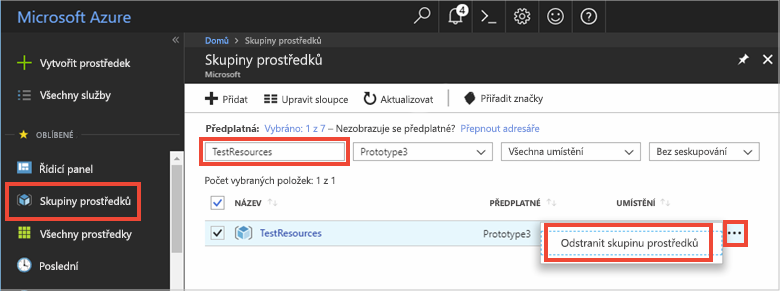

# <a name="quickstart-how-to-use-azure-redis-cache-with-java"></a>Rychlý start: Použití Azure Redis Cache s Javou


Azure Redis Cache vám umožňuje přístup do vyhrazené mezipaměti Redis spravované Microsoftem. Vaše mezipaměť je přístupná ze všech aplikací v rámci Microsoft Azure.

V tomto článku se dozvíte, jak začít pracovat s Azure Redis Cache pomocí klienta [Jedis](https://github.com/xetorthio/jedis) Redis Cache pro Javu.


K dokončení kroků v tomto rychlém startu můžete použít jakýkoli editor kódu. Skvělou volbou je však editor [Visual Studio Code](https://code.visualstudio.com/), který je dostupný pro platformy Windows, macOS a Linux.

[!INCLUDE [quickstarts-free-trial-note](../../includes/quickstarts-free-trial-note.md)]


## <a name="prerequisites"></a>Požadavky

[Apache Maven](http://maven.apache.org/)


## <a name="create-an-azure-redis-cache"></a>Vytvoření Azure Redis Cache

[!INCLUDE [redis-cache-create](../../includes/redis-cache-create.md)]

[!INCLUDE [redis-cache-access-keys](../../includes/redis-cache-access-keys.md)]

Přidejte proměnné prostředí pro **NÁZEV HOSTITELE** a **primární** přístupový klíč. Tyto proměnné z kódu použijete místo citlivých informací, které byste zahrnuli přímo do kódu.

```
set REDISCACHEHOSTNAME=contosoCache.redis.cache.windows.net
set REDISCACHEKEY=XXXXXXXXXXXXXXXXXXXXXXXXXXXXXXXXXXXXXXXXXXXX
```

## <a name="create-a-new-java-app"></a>Vytvoření nové aplikace Java

Pomocí Mavenu vygenerujte novou aplikaci rychlého startu:

```
mvn archetype:generate -DarchetypeGroupId=org.apache.maven.archetypes -DarchetypeArtifactId=maven-archetype-quickstart -DarchetypeVersion=1.3 -DgroupId=example.demo -DartifactId=redistest -Dversion=1.0
```

Přejděte do nového adresáře projektu *redistest*.

Otevřete soubor *pom.xml* a přidejte závislost pro [Jedis](https://github.com/xetorthio/jedis):

```xml
    <dependency>
        <groupId>redis.clients</groupId>
        <artifactId>jedis</artifactId>
        <version>2.9.0</version>
        <type>jar</type>
        <scope>compile</scope>
    </dependency>
```

Uložte soubor *pom.xml*.

Otevřete *App.java* a kód nahraďte následujícím kódem:

```java
package example.demo;

import redis.clients.jedis.Jedis;
import redis.clients.jedis.JedisShardInfo;

/**
 * Redis test
 *
 */
public class App 
{
    public static void main( String[] args )
    {

        boolean useSsl = true;
        String cacheHostname = System.getenv("REDISCACHEHOSTNAME");
        String cachekey = System.getenv("REDISCACHEKEY");

        // Connect to the Redis cache over the SSL port using the key.
        JedisShardInfo shardInfo = new JedisShardInfo(cacheHostname, 6380, useSsl);
        shardInfo.setPassword(cachekey); /* Use your access key. */
        Jedis jedis = new Jedis(shardInfo);      

        // Perform cache operations using the cache connection object...

        // Simple PING command        
        System.out.println( "\nCache Command  : Ping" );
        System.out.println( "Cache Response : " + jedis.ping());

        // Simple get and put of integral data types into the cache
        System.out.println( "\nCache Command  : GET Message" );
        System.out.println( "Cache Response : " + jedis.get("Message"));

        System.out.println( "\nCache Command  : SET Message" );
        System.out.println( "Cache Response : " + jedis.set("Message", "Hello! The cache is working from Java!"));

        // Demostrate "SET Message" executed as expected...
        System.out.println( "\nCache Command  : GET Message" );
        System.out.println( "Cache Response : " + jedis.get("Message"));

        // Get the client list, useful to see if connection list is growing...
        System.out.println( "\nCache Command  : CLIENT LIST" );
        System.out.println( "Cache Response : " + jedis.clientList());

        jedis.close();
    }
}
```

Tento kód ukazuje, jak se připojit k instanci služby Azure Redis Cache pomocí názvu hostitele mezipaměti a klíčových proměnných prostředí. Kód také ukládá a načítá hodnotu řetězce v mezipaměti. Spouští se také příkazy `PING` a `CLIENT LIST`. 

Uložte *App.java*.

## <a name="build-and-run-the-app"></a>Sestavení a spuštění aplikace

Spusťte následující příkaz Maven k sestavení a spuštění aplikace:

```
mvn exec:java -D exec.mainClass=example.demo.App
```

V níže uvedeném příkladu můžete vidět, že klíč `Message` měl předtím hodnotu z mezipaměti, která byla nastavena pomocí konzoly Redis na webu Azure Portal. Aplikace tuto hodnotu z mezipaměti aktualizovala. Aplikace rovněž spustila příkazy `PING` a `CLIENT LIST`.


## <a name="clean-up-resources"></a>Vyčištění prostředků

Pokud budete pokračovat k dalšímu kurzu, můžete prostředky vytvořené v tomto rychlém startu zachovat a znovu je použít.

V opačném případě, pokud jste už s ukázkovou aplikací v tomto rychlém startu skončili, můžete prostředky Azure vytvořené v tomto rychlém startu odstranit, abyste se vyhnuli poplatkům. 

> [!IMPORTANT]
> Odstranění skupiny prostředků je nevratné a skupina prostředků včetně všech v ní obsažených prostředků bude trvale odstraněna. Ujistěte se, že nechtěně neodstraníte nesprávnou skupinu prostředků nebo prostředky. Pokud jste vytvořili prostředky pro hostování této ukázky ve stávající skupině prostředků obsahující prostředky, které chcete zachovat, můžete místo odstranění skupiny prostředků odstranit jednotlivé prostředky z jejich odpovídajících oken.
>

Přihlaste se na web [Azure Portal ](https://portal.azure.com) a klikněte na **Skupiny prostředků**.

Do textového pole **Filtrovat podle názvu** zadejte název vaší skupiny prostředků. V pokynech v tomto článku se používala skupina prostředků *TestResources*. Ve výsledcích hledání klikněte na **...** u vaší skupiny prostředků a pak na **Odstranit skupinu prostředků**.



Zobrazí se výzva k potvrzení odstranění skupiny prostředků. Potvrďte odstranění zadáním názvu vaší skupiny prostředků a klikněte na **Odstranit**.

Po chvíli bude skupina prostředků včetně všech obsažených prostředků odstraněná.


## <a name="next-steps"></a>Další kroky

V tomto rychlém startu jste se naučili, jak používat službu Azure Redis Cache z aplikace Java. V dalším rychlém startu se můžete naučit používat službu Redis Cache s webovou aplikací ASP.NET.

> [!div class="nextstepaction"]
> [Vytvořte webovou aplikaci ASP.NET, která používá službu Azure Redis Cache.](./cache-web-app-howto.md)


