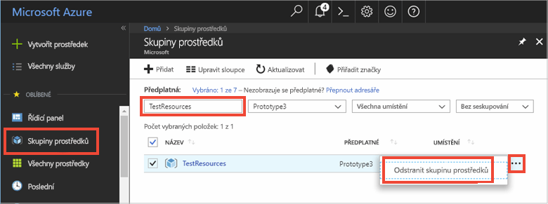

# <a name="quickstart-use-azure-redis-cache-with-python"></a>Rychlý start: Použití Azure Redis Cache s Pythonem


## <a name="introduction"></a>Úvod

V tomto rychlém startu se dozvíte, jak se pomocí Pythonu připojit k Azure Redis Cache za účelem čtení z mezipaměti a zápisu do mezipaměti. 


[!INCLUDE [quickstarts-free-trial-note](../../includes/quickstarts-free-trial-note.md)]

## <a name="prerequisites"></a>Požadavky

* Nainstalované [prostředí Python 2 nebo Python 3](https://www.python.org/downloads/) s nástrojem [pip](https://pypi.org/project/pip/). 

## <a name="create-a-redis-cache-on-azure"></a>Vytvoření mezipaměti Redis v Azure
[!INCLUDE [redis-cache-create](../../includes/redis-cache-create.md)]

[!INCLUDE [redis-cache-create](../../includes/redis-cache-access-keys.md)]

## <a name="install-redis-py"></a>Instalace redis-py

[Redis-py](https://github.com/andymccurdy/redis-py) je rozhraní Redis Cache pro Python. Pomocí nástroje pro správu balíčků Pythonu *pip* nainstalujte balíček redis-py. 

Následující příklad pomocí *pip3* pro Python3 nainstaluje balíček redis-py ve Windows 10 s použitím příkazového řádku sady Visual Studio 2017 Developer spuštěného se zvýšenými oprávněními správce.

    pip3 install redis


## <a name="read-and-write-to-the-cache"></a>Čtení z mezipaměti a zápis do mezipaměti

Spusťte Python a otestujte používání mezipaměti z příkazového řádku. Nahraďte `<Your Host Name>` a `<Your Access Key>` hodnotami pro vaši Redis Cache. 

```python
>>> import redis
>>> r = redis.StrictRedis(host='<Your Host Name>.redis.cache.windows.net',
        port=6380, db=0, password='<Your Access Key>', ssl=True)
>>> r.set('foo', 'bar')
True
>>> r.get('foo')
b'bar'
```

## <a name="create-a-python-script"></a>Vytvoření skriptu Pythonu

Vytvořte nový textový soubor skriptu *PythonApplication1.py*.

Do souboru *PythonApplication1.py* přidejte následující skript a uložte ho. Tento skript otestuje přístup k mezipaměti. Nahraďte `<Your Host Name>` a `<Your Access Key>` hodnotami pro vaši Redis Cache. 

```python
import redis

myHostname = "<Your Host Name>.redis.cache.windows.net"
myPassword = "<Your Access Key>"

r = redis.StrictRedis(host=myHostname, port=6380,password=myPassword,ssl=True)

result = r.ping()
print("Ping returned : " + str(result))

result = r.set("Message", "Hello!, The cache is working with Python!")
print("SET Message returned : " + str(result))

result = r.get("Message")
print("GET Message returned : " + result.decode("utf-8"))

result = r.client_list()
print("CLIENT LIST returned : ") 
for c in result:
    print("id : " + c['id'] + ", addr : " + c['addr'])
```

Spusťte skript s Pythonem.


## <a name="clean-up-resources"></a>Vyčištění prostředků

Pokud budete pokračovat dalším kurzem, můžete prostředky vytvořené v tomto rychlém startu zachovat a znovu je použít.

V opačném případě, pokud jste už s ukázkovou aplikací v tomto rychlém startu skončili, můžete prostředky Azure vytvořené v tomto rychlém startu odstranit, abyste se vyhnuli poplatkům. 

> [!IMPORTANT]
> Odstranění skupiny prostředků je nevratné a skupina prostředků včetně všech v ní obsažených prostředků bude trvale odstraněna. Ujistěte se, že nechtěně neodstraníte nesprávnou skupinu prostředků nebo prostředky. Pokud jste vytvořili prostředky pro hostování této ukázky ve stávající skupině prostředků obsahující prostředky, které chcete zachovat, můžete místo odstranění skupiny prostředků odstranit jednotlivé prostředky z jejich odpovídajících oken.
>

Přihlaste se na web [Azure Portal ](https://portal.azure.com) a klikněte na **Skupiny prostředků**.

Do textového pole **Filtrovat podle názvu** zadejte název vaší skupiny prostředků. V pokynech v tomto článku se používala skupina prostředků *TestResources*. Ve výsledcích hledání klikněte na **...** u vaší skupiny prostředků a pak na **Odstranit skupinu prostředků**.



Zobrazí se výzva k potvrzení odstranění skupiny prostředků. Potvrďte odstranění zadáním názvu vaší skupiny prostředků a klikněte na **Odstranit**.

Po chvíli bude skupina prostředků včetně všech obsažených prostředků odstraněná.


## <a name="next-steps"></a>Další kroky

> [!div class="nextstepaction"]
> [Vytvoření jednoduché webové aplikace ASP.NET využívající Azure Redis Cache](./cache-web-app-howto.md)


<!--Image references-->
[1]: ./media/cache-python-get-started/redis-cache-new-cache-menu.png
[2]: ./media/cache-python-get-started/redis-cache-cache-create.png
