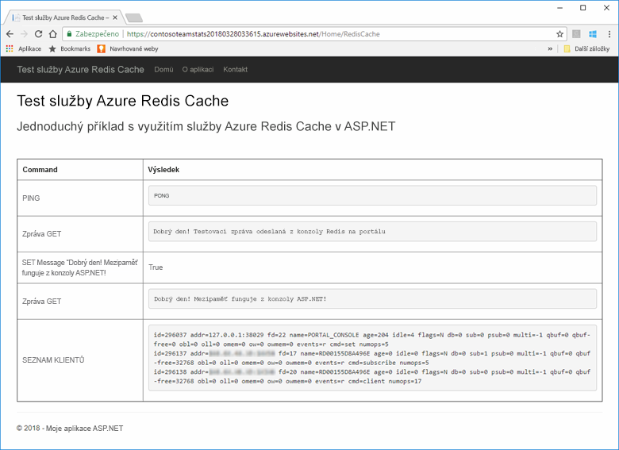
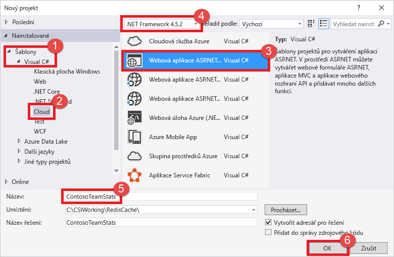
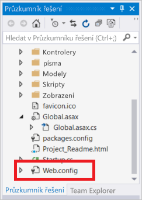
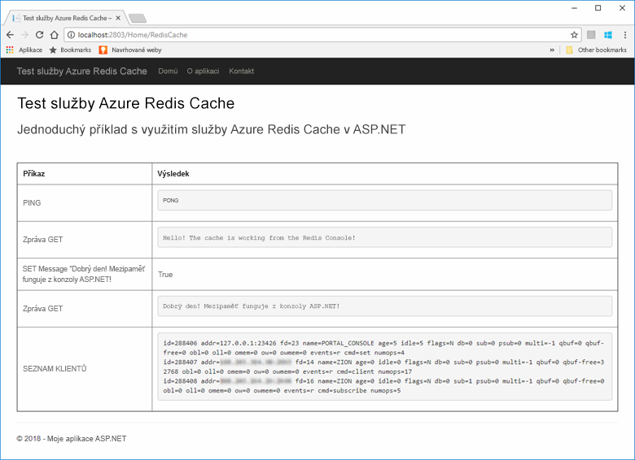
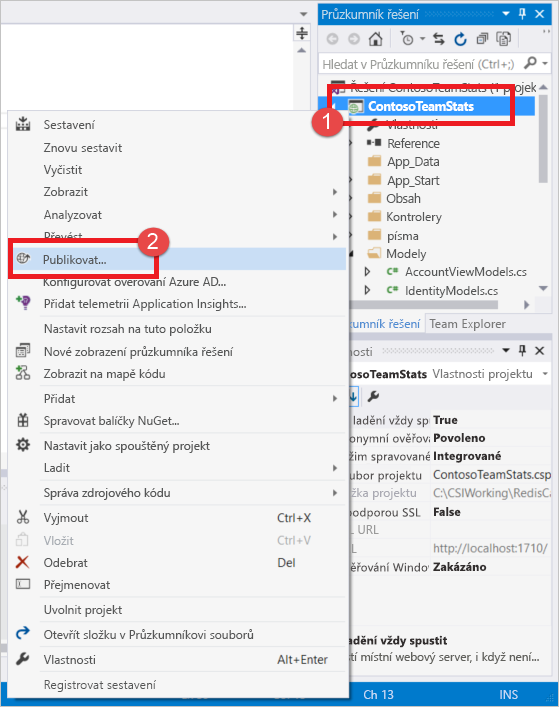
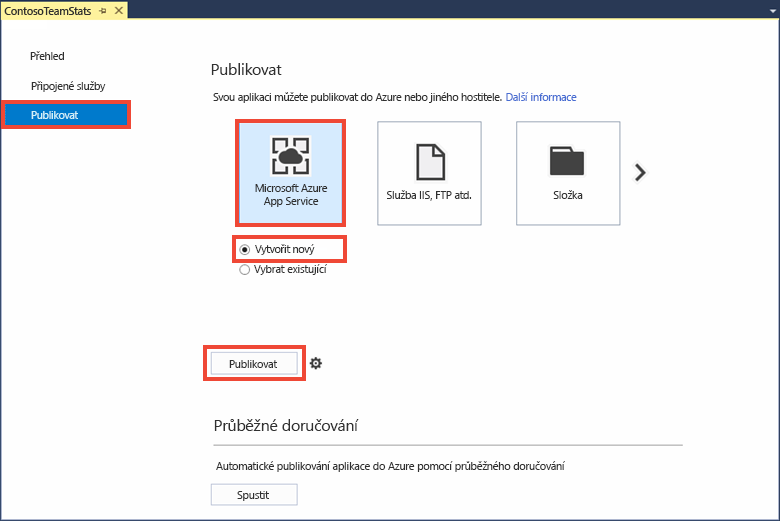
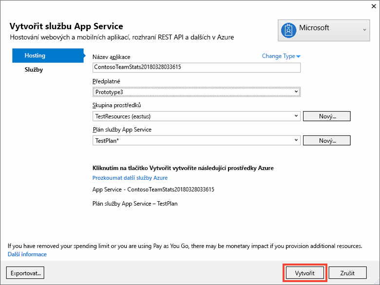
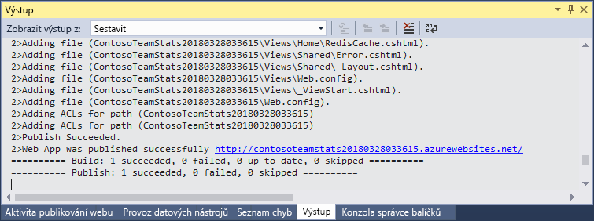
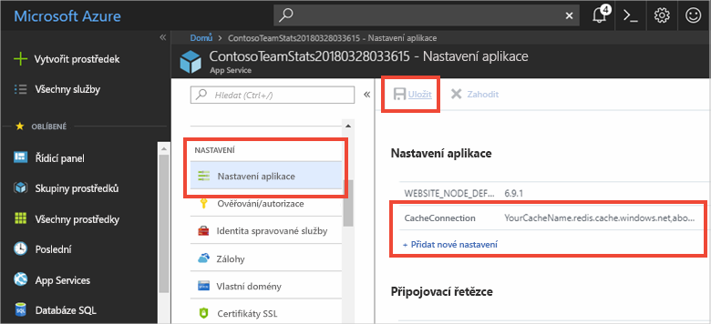

# <a name="quickstart-create-an-aspnet-web-app"></a>Rychlý start: Vytvoření webové aplikace ASP.NET 

## <a name="introduction"></a>Úvod

V tomto rychlém startu se naučíte, jak vytvořit a nasadit webovou aplikaci ASP.NET do služby Azure App Service pomocí sady Visual Studio 2017. Tato ukázková aplikace se připojuje ke službě Azure Redis Cache za účelem ukládání a načítání dat z mezipaměti. Až tento rychlý start dokončíte, budete mít běžící webovou aplikaci hostovanou v Azure, která čte a zapisuje do služby Azure Redis Cache.



[!INCLUDE [quickstarts-free-trial-note](../../includes/quickstarts-free-trial-note.md)]

## <a name="prerequisites"></a>Požadavky

K dokončení tohoto rychlého startu je potřeba nainstalovat sadu [Visual Studio 2017](https://www.visualstudio.com/downloads/) s následujícími prostředími:
* Vývoj pro ASP.NET a web
* Vývoj pro Azure

## <a name="create-the-visual-studio-project"></a>Vytvoření projektu sady Visual Studio

1. Otevřete sadu Visual Studio a potom vyberte **Soubor** >**Nový** > **Projekt**.

2. V dialogovém okně **Nový projekt** postupujte takto:

    

    a. V seznamu **Šablony** rozbalte uzel **Visual C#**.

    b. Vyberte **Cloud**.

    c. Vyberte **Webová aplikace ASP.NET**.

    d. Zkontrolujte, že je vybrané rozhraní **.NET Framework 4.5.2** nebo vyšší.

    e. Do pole **Název** zadejte název projektu. V tomto příkladu jsme použili **ContosoTeamStats**.

    f. Vyberte **OK**.
   
3. Jako typ projektu vyberte **MVC**.

4. Ujistěte se, že v nastavení **Ověřování** je zadáno **Bez ověřování**. V závislosti na verzi sady Visual Studio může být výchozí hodnotou nastavení **Ověřování** něco jiného. Chcete-li ji změnit, vyberte **Změnit ověřování** a pak **Bez ověřování**.

5. Vyberte **OK** a vytvořte projekt.

## <a name="create-a-cache"></a>Vytvoření mezipaměti

V dalším kroku vytvoříte pro aplikaci mezipaměť.

[!INCLUDE [redis-cache-create](../../includes/redis-cache-create.md)]

[!INCLUDE [redis-cache-access-keys](../../includes/redis-cache-access-keys.md)]

#### <a name="to-edit-the-cachesecretsconfig-file"></a>Úprava souboru *CacheSecrets.config*

3. Na počítači vytvořte soubor s názvem *CacheSecrets.config*. Uložte ho v umístění, ve kterém se nebude vracet se změnami zdrojového kódu ukázkové aplikace. V tomto rychlém startu je soubor *CacheSecrets.config* umístěný zde: *C:\AppSecrets\CacheSecrets.config*.

4. Upravte soubor *CacheSecrets.config*. Pak přidejte následující obsah:

    ```xml
    <appSettings>
        <add key="CacheConnection" value="<cache-name>.redis.cache.windows.net,abortConnect=false,ssl=true,password=<access-key>"/>
    </appSettings>
    ```

5. `<cache-name>` nahraďte názvem hostitele mezipaměti.

6. `<access-key>` nahraďte primárním klíčem mezipaměti.

    > [!TIP]
    > Při rotaci klíčů můžete použít sekundární přístupový klíč jako alternativní klíč během opětovného generování primárního přístupového klíče.
>
7. Uložte soubor.

## <a name="update-the-mvc-application"></a>Aktualizace aplikace MVC

V této části aplikaci aktualizujete tak, aby podporovala nové zobrazení, které ukáže jednoduchý test vůči službě Azure Redis Cache.

* [Aktualizace souboru web.config o nastavení aplikace pro mezipaměť](#Update-the-webconfig-file-with-an-app-setting-for-the-cache)
* [Konfigurace aplikace pro používání klienta StackExchange.Redis](#configure-the-application-to-use-stackexchangeredis)
* [Aktualizace souboru HomeController a rozložení](#update-the-homecontroller-and-layout)
* [Přidání nového zobrazení RedisCache](#add-a-new-rediscache-view)

### <a name="update-the-webconfig-file-with-an-app-setting-for-the-cache"></a>Aktualizace souboru web.config o nastavení aplikace pro mezipaměť

Když aplikaci spustíte místně, použijí se informace v souboru *TajnéKódyMezipaměti.config* pro připojení k instanci Azure Redis Cache. Později tuto aplikaci nasadíte do Azure. Přitom nakonfigurujete nastavení aplikace v Azure tak, aby aplikace místo použití tohoto souboru načetla informace o připojení k mezipaměti. 

Protože soubor *CacheSecrets.config* není nasazený v Azure společně s aplikací, použijete ho jen při místním testování aplikace. Tyto informace maximálně zabezpečte, abyste zabránili škodlivému přístupu k datům mezipaměti.

#### <a name="to-update-the-webconfig-file"></a>Aktualizace souboru *web.config*
1. V **Průzkumníku řešení** otevřete poklikáním soubor *web.config*.

    

2. V souboru *web.config* vyhledejte element `<appSetting>`. Potom přidejte tento atribut `file`. Pokud jste použili jiný název souboru nebo umístění, nahraďte těmito hodnotami hodnoty uvedené v příkladu.

* Před: `<appSettings>`
* Po: ` <appSettings file="C:\AppSecrets\CacheSecrets.config">`

Modul runtime ASP.NET sloučí obsah externího souboru se značkami v elementu `<appSettings>`. Pokud zadaný soubor nelze nalézt, modul runtime atribut souboru ignoruje. Vaše tajné kódy (připojovací řetězce k mezipaměti) nejsou součástí zdrojového kódu aplikace. Při nasazování webové aplikace do Azure se soubor *CacheSecrests.config* nenasadí.

### <a name="to-configure-the-application-to-use-stackexchangeredis"></a>Konfigurace aplikace pro používání StackExchange.Redis

1. Pokud chcete aplikaci nakonfigurovat tak, aby používala balíček NuGet [StackExchange.Redis](https://github.com/StackExchange/StackExchange.Redis) pro Visual Studio, vyberte **Nástroje > Správce balíčků NuGet > Konzola Správce balíčků**.

2. V okně `Package Manager Console` spusťte následující příkaz:

    ```powershell
    Install-Package StackExchange.Redis
    ```

3. Balíček NuGet se stáhne a přidá klientským aplikacím požadované odkazy na sestavení pro přístup do Azure Redis Cache pomocí klienta mezipaměti StackExchange.Redis. Pokud upřednostňujete použití verze klientské knihovny `StackExchange.Redis` se silným názvem, nainstalujte balíček `StackExchange.Redis.StrongName`.

### <a name="to-update-the-homecontroller-and-layout"></a>Aktualizace souboru HomeController a rozložení

1. V **Průzkumníku řešení** rozbalte složku **Kontrolery** a otevřete soubor *HomeController.cs*.

2. Na začátek souboru přidejte dva příkazy `using` pro podporu klienta mezipaměti a nastavení aplikace.

    ```csharp
    using System.Configuration;
    using StackExchange.Redis;
    ```

3. Přidejte následující metodu do třídy `HomeController` pro podporu nové akce `RedisCache`, která spustí několik příkazů vůči nové mezipaměti.

    ```csharp
        public ActionResult RedisCache()
        {
            ViewBag.Message = "A simple example with Azure Redis Cache on ASP.NET.";

            var lazyConnection = new Lazy<ConnectionMultiplexer>(() =>
            {
                string cacheConnection = ConfigurationManager.AppSettings["CacheConnection"].ToString();
                return ConnectionMultiplexer.Connect(cacheConnection);
            });

            // Connection refers to a property that returns a ConnectionMultiplexer
            // as shown in the previous example.
            IDatabase cache = lazyConnection.Value.GetDatabase();

            // Perform cache operations using the cache object...

            // Simple PING command
            ViewBag.command1 = "PING";
            ViewBag.command1Result = cache.Execute(ViewBag.command1).ToString();

            // Simple get and put of integral data types into the cache
            ViewBag.command2 = "GET Message";
            ViewBag.command2Result = cache.StringGet("Message").ToString();

            ViewBag.command3 = "SET Message \"Hello! The cache is working from ASP.NET!\"";
            ViewBag.command3Result = cache.StringSet("Message", "Hello! The cache is working from ASP.NET!").ToString();

            // Demostrate "SET Message" executed as expected...
            ViewBag.command4 = "GET Message";
            ViewBag.command4Result = cache.StringGet("Message").ToString();

            // Get the client list, useful to see if connection list is growing...
            ViewBag.command5 = "CLIENT LIST";
            ViewBag.command5Result = cache.Execute("CLIENT", "LIST").ToString().Replace(" id=", "\rid=");

            lazyConnection.Value.Dispose();

            return View();
        }
    ```

4. V **Průzkumníku řešení** rozbalte složku **Zobrazení** > **Sdílené**. Potom otevřete soubor *_Layout.cshtml*.

    Nahraďte:
    
    ```csharp
    @Html.ActionLink("Application name", "Index", "Home", new { area = "" }, new { @class = "navbar-brand" })
    ```

    textem:

    ```csharp
    @Html.ActionLink("Azure Redis Cache Test", "RedisCache", "Home", new { area = "" }, new { @class = "navbar-brand" })
    ```

### <a name="to-add-a-new-rediscache-view"></a>Přidání nového zobrazení RedisCache

1. V **Průzkumníku řešení** rozbalte složku **Zobrazení** a klikněte pravým tlačítkem na složku **Domů**. Zvolte **Přidat** > **Zobrazení**.

2. V dialogovém okně **Přidat zobrazení** jako název zobrazení zadejte **RedisCache**. Pak vyberte **Přidat**.

3. Kód v souboru *RedisCache.cshtml* nahraďte následujícím kódem:

    ```csharp
    @{
        ViewBag.Title = "Azure Redis Cache Test";
    }

    <h2>@ViewBag.Title.</h2>
    <h3>@ViewBag.Message</h3>
    <br /><br />
    <table border="1" cellpadding="10">
        <tr>
            <th>Command</th>
            <th>Result</th>
        </tr>
        <tr>
            <td>@ViewBag.command1</td>
            <td><pre>@ViewBag.command1Result</pre></td>
        </tr>
        <tr>
            <td>@ViewBag.command2</td>
            <td><pre>@ViewBag.command2Result</pre></td>
        </tr>
        <tr>
            <td>@ViewBag.command3</td>
            <td><pre>@ViewBag.command3Result</pre></td>
        </tr>
        <tr>
            <td>@ViewBag.command4</td>
            <td><pre>@ViewBag.command4Result</pre></td>
        </tr>
        <tr>
            <td>@ViewBag.command5</td>
            <td><pre>@ViewBag.command5Result</pre></td>
        </tr>
    </table>
    ```

## <a name="run-the-app-locally"></a>Místní spuštění aplikace

Projekt je standardně nakonfigurovaný tak, aby pro účely testování a ladění byla aplikace hostovaná místně ve službě [IIS Express](https://docs.microsoft.com/iis/extensions/introduction-to-iis-express/iis-express-overview).

### <a name="to-run-the-app-locally"></a>Spuštění aplikace místně
1. V sadě Visual Studio vyberte **Ladění** > **Spustit ladění** a sestavte a spusťte aplikaci místně pro účely testování a ladění.

2. V prohlížeči na navigačním panelu vyberte **Test Azure Redis Cache**.

3. V níže uvedeném příkladu měl klíč `Message` předtím hodnotu z mezipaměti, která byla nastavena pomocí konzoly Azure Redis Cache na portálu. Aplikace tuto hodnotu z mezipaměti aktualizovala. Aplikace rovněž spustila příkazy `PING` a `CLIENT LIST`.

    

## <a name="publish-and-run-in-azure"></a>Publikování a spuštění v Azure

Jakmile aplikaci úspěšně místně otestujete, můžete ji nasadit do Azure a spustit v cloudu.

### <a name="to-publish-the-app-to-azure"></a>Publikování aplikace do Azure

1. V sadě Visual Studio klikněte pravým tlačítkem na uzel projektu v Průzkumníku řešení. Potom vyberte **Publikovat**.

    

2. Vyberte **Microsoft Azure App Service**, dále **Vytvořit nový** a nakonec **Publikovat**.

    

3. V dialogovém okně **Vytvořit plán App Service** udělejte následující změny:

    | Nastavení | Doporučená hodnota | Popis |
    | ------- | :---------------: | ----------- |
    | **Název aplikace** | Použijte výchozí hodnotu. | Po nasazení do Azure se název aplikace stane názvem hostitele této aplikace. Kvůli zachování jedinečnosti může být v případě potřeby tento název doplněný o časové razítko. |
    | **Předplatné** | Zvolte svoje předplatné Azure. | K tomuto předplatnému se účtují všechny související poplatky za hosting. Pokud máte několik předplatných Azure, zkontrolujte, že je vybrané to správné.|
    | **Skupina prostředků** | Použijte stejnou skupinu prostředků, ve které jste vytvořili mezipaměť (například *TestResourceGroup*). | Skupina prostředků vám pomůže spravovat všechny prostředky jako skupinu. Až budete později chtít aplikaci odstranit, stačí jen odstranit tuto skupinu. |
    | **Plán služby App Service** | Vyberte **Nový** a potom vytvořte nový plán služby App Service s názvem *TestingPlan*. <br />Použijte stejné **Umístění** jako při vytváření mezipaměti. <br />Jako velikost zvolte **Free**. | Plán služby App Service definuje sadu výpočetních prostředků pro provozování webové aplikace. |

    

4. Až nakonfigurujete nastavení hostingu služby App Service, vyberte **Vytvořit**.

5. Sledujte okno **Výstup** v sadě Visual Studio, kde se zobrazuje stav publikování. Po publikování aplikace se zaprotokoluje adresa URL aplikace:

    

### <a name="add-the-app-setting-for-the-cache"></a>Přidání nastavení aplikace pro mezipaměť

Po publikování nové aplikace přidejte nové nastavení aplikace. Toto nastavení slouží k uložení informací o připojení k mezipaměti. 

#### <a name="to-add-the-app-setting"></a>Přidání nastavení aplikace 

1. Do panelu hledání nahoře na portálu Azure Portal zadejte název aplikace a vyhledejte novou aplikaci, kterou jste vytvořili.

    

2. Přidejte nové nastavení aplikace s názvem **PřipojeníKMezipaměti**, které aplikace použije pro připojení k mezipaměti. Použijte stejnou hodnotu, jakou jste pro `CacheConnection` nakonfigurovali v souboru *TajnéKódyMezipaměti.config*. Tato hodnota obsahuje název hostitele mezipaměti a přístupový klíč.

    

### <a name="run-the-app-in-azure"></a>Spuštění aplikace v Azure

V prohlížeči přejděte na adresu URL aplikace. Tato adresa se zobrazuje ve výsledcích operace publikování v okně výstupu v sadě Visual Studio. Je také k dispozici na portálu Azure Portal na stránce přehledu aplikace, kterou jste vytvořili.

Výběrem položky **Test Azure Redis Cache** na navigačním panelu otestujte přístup k mezipaměti.


## <a name="clean-up-resources"></a>Vyčištění prostředků

Pokud budete pokračovat k dalšímu kurzu, můžete prostředky vytvořené v tomto rychlém startu zachovat a znovu je použít.

V opačném případě, pokud jste už s ukázkovou aplikací v tomto rychlém startu skončili, můžete prostředky Azure vytvořené v tomto rychlém startu odstranit, abyste se vyhnuli poplatkům. 

> [!IMPORTANT]
> Odstranění skupiny prostředků je nevratné. Při odstranění skupiny prostředků se všechny prostředky, které obsahuje, trvale odstraní. Ujistěte se, že nechtěně neodstraníte nesprávnou skupinu prostředků nebo prostředky. Pokud jste vytvořili prostředky pro hostování této ukázky ve stávající skupině prostředků obsahující prostředky, které chcete zachovat, můžete místo odstranění skupiny prostředků odstranit jednotlivé prostředky z jejich odpovídajících oken.

### <a name="to-delete-a-resource-group"></a>Odstranění skupiny prostředků

1. Přihlaste se k portálu [Azure Portal](https://portal.azure.com) a potom vyberte **Skupiny prostředků**.

2. Do pole **Filtrovat podle názvu** zadejte název vaší skupiny prostředků. V pokynech v tomto článku se používala skupina prostředků *TestResources*. U skupiny prostředků ve výsledcích hledání vyberte **...** a pak vyberte **Odstranit skupinu prostředků**.

    

Zobrazí se výzva k potvrzení odstranění skupiny prostředků. Potvrďte odstranění zadáním názvu vaší skupiny prostředků a vyberte **Odstranit**.

Po chvíli se skupina prostředků včetně všech prostředků, které obsahuje, odstraní.

## <a name="next-steps"></a>Další postup

V dalším kurzu použijete službu Azure Redis Cache v reálnější situaci ke zvýšení výkonu aplikace. Tuto aplikaci aktualizujete tak, aby do mezipaměti ukládala tabulku výsledků s využitím principu s doplňováním mezipaměti aplikací pomocí ASP.NET a databáze.

> [!div class="nextstepaction"]
> [Vytvoření tabulky výsledků s principem doplňování mezipaměti aplikací v ASP.NET](cache-web-app-cache-aside-leaderboard.md)
