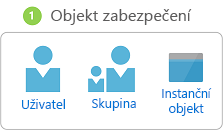
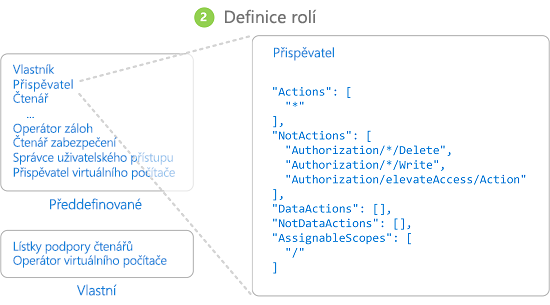
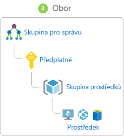
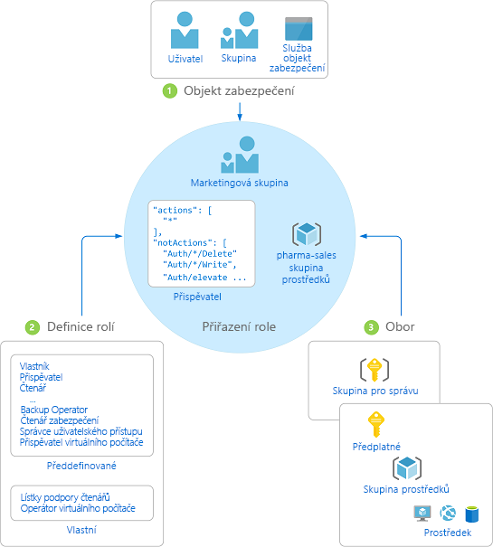

# Co je řízení přístupu na základě role (RBAC) u prostředků Azure?

Správa přístupu ke cloudovým prostředkům je velmi důležitou funkcí pro jakoukoli organizaci, která používá cloud. Řízení přístupu na základě role (RBAC) pomáhá spravovat, kdo má přístup k prostředkům Azure, co může s těmito prostředky dělat a k jakým oblastem má přístup.

RBAC je autorizační systém založený na [Azure Resource Manager,](../azure-resource-manager/management/overview.md) který poskytuje jemně odstupňovanou správu přístupu k prostředkům Azure.

## Co mi RBAC umožňuje?

Tady je několik příkladů toho, co vám RBAC umožňuje:

- Jednomu uživateli můžete povolit správu virtuálních počítačů v předplatném a jinému uživateli správu virtuálních sítí.
- Skupině DBA můžete povolit správu databází SQL v předplatném.
- Uživateli můžete povolit správu všech prostředků ve skupině prostředků, například virtuálních počítačů, webů a podsítí.
- Aplikaci můžete povolit přístup ke všem prostředkům ve skupině prostředků.

## Jak RBAC funguje

Způsob řízení přístupu k prostředkům pomocí RBAC spočívá ve vytvoření přiřazení rolí. To je klíčový koncept pochopit - je to, jak jsou vynucena oprávnění. Přiřazení role se skládá ze tří prvků: objekt zabezpečení, definice role a obor.

### Objekt zabezpečení

*Zaregistrovaný objekt zabezpečení* je objekt, který představuje uživatele, skupinu, instanční objekt nebo spravovanou identitu, která požaduje přístup k prostředkům Azure.

- Uživatel – jednotlivec, který má profil ve službě Azure Active Directory. Můžete také přiřadit role uživatelům v jiných tenantech. Informace o uživatelích v jiných organizacích najdete v článku o [B2B ve službě Azure Active Directory](../active-directory/b2b/what-is-b2b.md).
- Skupina – skupina uživatelů vytvořená ve službě Azure Active Directory. Když přiřadíte roli skupině, budou mít danou roli všichni její uživatelé. 
- Instanční objekt – identita zabezpečení, kterou používají aplikace nebo služby pro přístup ke konkrétním prostředkům Azure. Můžete si ji představit jako *identitu uživatele* (uživatelské jméno a heslo nebo certifikát) pro aplikaci.
- Spravovaná identita – identita ve službě Azure Active Directory, která se automaticky spravuje azure. Spravované [identity](../active-directory/managed-identities-azure-resources/overview.md) se obvykle používají při vývoji cloudových aplikací ke správě přihlašovacích údajů pro ověřování služeb Azure.

### Definice role

*Definice role* je kolekce oprávnění. Obvykle se tomu říká *jen role*. Definice role poskytuje seznam operací, které je možné provádět, například čtení, zápis a odstranění. Role mohou být souhrnné, například vlastník, nebo konkrétní, například čtenář virtuálních počítačů.

Azure obsahuje několik [předdefinovaných rolí](built-in-roles.md), které můžete využít. V následujícím seznamu najdete čtyři základní předdefinované role. První tři se vztahují ke všem typům prostředků.

- [Vlastník](built-in-roles.md#owner) – má úplný přístup ke všem prostředkům, včetně práva delegovat přístup na ostatní.
- [Přispěvatel](built-in-roles.md#contributor) – můžete vytvářet a spravovat všechny typy prostředků Azure, ale nemůže udělit přístup ostatním.
- [Čtenář](built-in-roles.md#reader) – může zobrazit existující prostředky Azure.
- [Správce uživatelských přístupů](built-in-roles.md#user-access-administrator) – může spravovat uživatelský přístup k prostředkům Azure.

Zbývající předdefinované role umožňují správu konkrétních prostředků Azure. Role [Přispěvatel virtuálních počítačů](built-in-roles.md#virtual-machine-contributor) například uživateli umožňuje vytvářet a spravovat virtuální počítače. Pokud předdefinované role nesplňují specifické potřeby vaší organizace, můžete vytvořit vlastní [role pro prostředky Azure](custom-roles.md).

Azure má datové operace, které umožňují udělit přístup k datům v rámci objektu. Pokud má uživatel například přístup ke čtení dat u účtu úložiště, bude moci číst objekty blob nebo zprávy v rámci daného účtu úložiště. Další informace najdete [v tématu Principy definic rolí pro prostředky Azure](role-definitions.md).

### Rozsah

*Obor* je sada prostředků, které přístup platí pro. Když přiřadíte roli, můžete definováním oboru dále omezit akce, které jsou povoleny. To je užitečné v případě, kdy někomu chcete udělit roli [Přispěvatel webů](built-in-roles.md#website-contributor), ale pouze pro jednu skupinu prostředků.

V Azure můžete zadat obor na více úrovních: na úrovni [skupiny pro správu](../governance/management-groups/overview.md), předplatného, skupiny prostředků nebo prostředku. Obory jsou strukturovány ve vztahu nadřazený-podřízený obor.

Když udělíte přístup na úrovni nadřízeného oboru, podřízené obory zdědí příslušná oprávnění. Příklad:

- Pokud uživateli přiřadíte roli [Vlastník](built-in-roles.md#owner) na úrovni oboru skupiny pro správu, může tento uživatel spravovat vše ve všech předplatných v příslušné skupině pro správu.
- Pokud přiřadíte roli [Čtenář](built-in-roles.md#reader) skupině v oboru předplatného, členové takové skupiny mohou zobrazit všechny skupiny prostředků a prostředky v daném předplatném.
- Pokud přiřadíte roli [Přispěvatel](built-in-roles.md#contributor) aplikaci v oboru skupiny prostředků, může aplikace spravovat prostředky všech typů v dané skupině prostředků, ale už ne žádné jiné skupiny prostředků v předplatném.

### Přiřazení rolí

Přiřazení *role* je proces připojení definice role k uživateli, skupině, instančnímu objektu nebo spravované identitě v určitém oboru za účelem udělení přístupu. Přístup se uděluje vytvořením přiřazení role a odvolává se odebráním přiřazení role.

Následující diagram znázorňuje příklad přiřazení role. V tomto příkladu byla marketingové skupině přiřazena role [Přispěvatel](built-in-roles.md#contributor) pro skupinu prostředků prodeje farmaceutických výrobků. To znamená, že uživatelé marketingové skupiny mohou vytvářet a spravovat prostředky Azure ve skupině prostředků prodeje farmaceutických výrobků. Uživatelé marketingové skupiny nemají přístup k prostředkům mimo skupinu prostředků prodeje farmaceutických výrobků, pokud nejsou součástí přiřazení jiné role.

Přiřazení rolí můžete vytvořit pomocí portálu Azure Portal, Azure CLI, Azure PowerShellu, sad Azure SDK nebo rozhraní REST API. V každém předplatném můžete mít až **2000** přiřazení rolí a v každé skupině pro správu **500** přiřazení rolí. K vytváření a odebírání přiřazení rolí musíte mít oprávnění `Microsoft.Authorization/roleAssignments/*`. Toto oprávnění se uděluje prostřednictvím role [Vlastník](built-in-roles.md#owner) nebo [Správce uživatelských přístupů](built-in-roles.md#user-access-administrator).

## Více přiřazení rolí

Co se tedy stane, pokud máte více překrývajících se přiřazení rolí? RBAC je aditivní model, takže vaše účinná oprávnění jsou součtem přiřazení rolí. Zvažte následující příklad, kde je uživateli udělena role přispěvatele v oboru předplatného a role čtenáře ve skupině prostředků. Součet oprávnění přispěvatele a oprávnění čtenáře je efektivně role přispěvatele pro skupinu prostředků. Proto v tomto případě přiřazení role Čtenáře nemá žádný vliv.

## Přiřazení zamítnutí

Model RBAC původně umožňoval jen povolení, ne zamítnutí, teď ale omezeně podporuje také přiřazení zamítnutí. Podobně jako přiřazení role, *odepřít přiřazení* připojí sadu odepřít akce pro uživatele, skupinu, instanční objekt nebo spravované identity v určitém oboru za účelem odepření přístupu. Přiřazení role definuje sadu akcí, které jsou *povoleny*, zatímco odepřít přiřazení definuje sadu akcí, které *nejsou povoleny*. Jinými slovy, přiřazení zamítnutí blokuje uživatelům možnost provádět určité akce i v případě, že přiřazení role jim přístup uděluje. Přiřazení zamítnutí mají přednost před přiřazením rolí. Další informace najdete [v tématu Principy odepřít přiřazení pro prostředky Azure](deny-assignments.md).

## Jak se v modelu RBAC určí, jestli má uživatel přístup k prostředku

V následující části popisujeme obecné kroky, které se v modelu RBAC používají k určení toho, zda budete mít v rovině správy přístup k prostředku. Tyto principy je užitečné chápat, pokud se snažíte vyřešit potíže s přístupem.

1. Uživatel (nebo instanční objekt služby) získá token pro Azure Resource Manager.

    Tento token obsahuje členství uživatele ve skupinách (včetně tranzitivního členství ve skupinách).

1. Uživatel provede s připojeným tokenem volání rozhraní REST API do Azure Resource Manageru.

1. Azure Resource Manager načte všechna přiřazení rolí a přiřazení zamítnutí vztahující se k prostředku, na kterém se akce provádí.

1. Azure Resource Manageru zúží přiřazení rolí, které se vztahují na tohoto uživatele nebo jeho skupinu, a určí, jaké role má uživatel u daného prostředku.

1. Azure Resource Manager určí, zda je akce ve volání rozhraní API je zahrnuta v rolích, které uživatel pro tento prostředek má.

1. Pokud uživatel nemá roli s akcí v požadovaném oboru, přístup není udělen. V opačném případě Azure Resource Manager ověří, zda platí přiřazení zamítnutí.

1. Pokud ano, přístup se zablokuje. Pokud ne, přístup je udělen.

## Licenční požadavky

[!INCLUDE [Azure AD free license](../../includes/active-directory-free-license.md)]

## Další kroky

- [Úvodní příručka: Zobrazení přístupu, který má uživatel k prostředkům Azure pomocí portálu Azure](check-access.md)
- [Správa přístupu k prostředkům Azure pomocí RBAC a webu Azure Portal](role-assignments-portal.md)
- [Vysvětlení různých rolí v Azure](rbac-and-directory-admin-roles.md)
- [Architektura přechodu na cloud: Správa přístupu k prostředkům v Azure](/azure/cloud-adoption-framework/govern/resource-consistency/resource-access-management)
