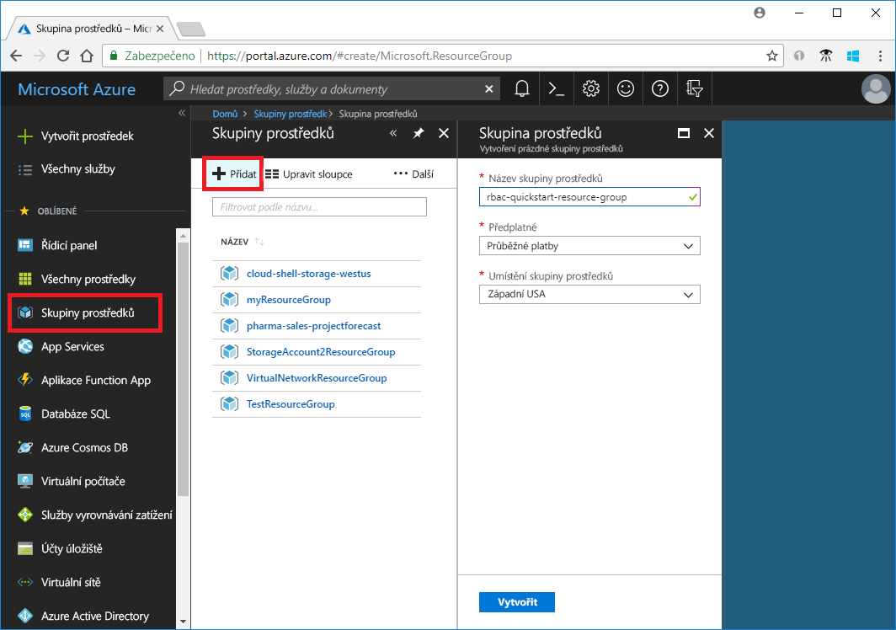
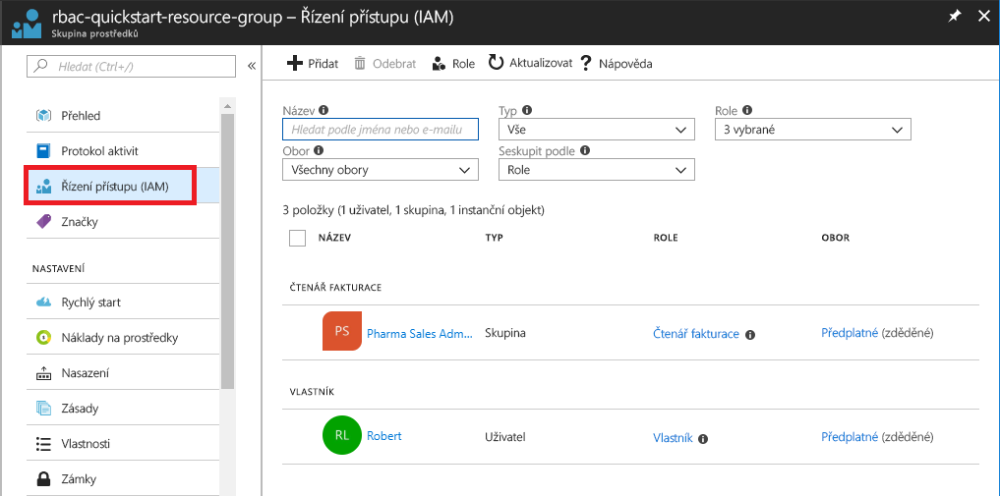
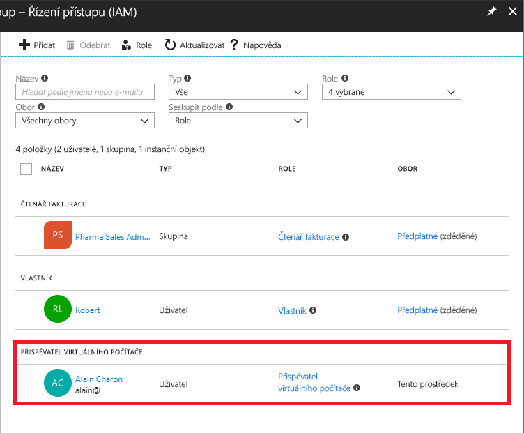
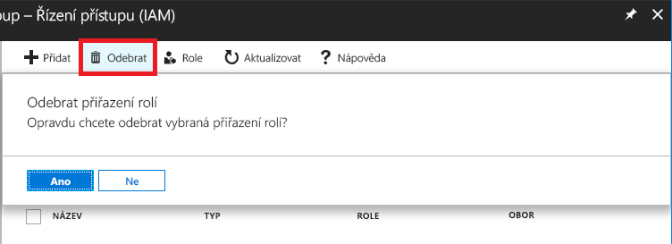
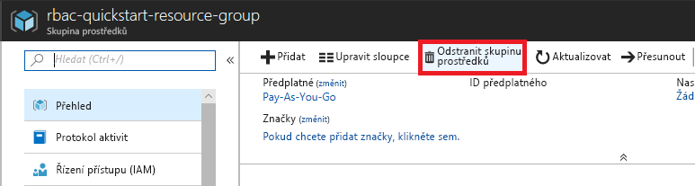

# Kurz: Udělení přístupu pro uživatele pomocí RBAC a webu Azure portal

[Řízení přístupu na základě role (RBAC)](overview.md) je způsob správy přístupu k prostředkům v Azure. V tomto kurzu je udělit uživatelům přístup k vytváření a správa virtuálních počítačů ve skupině prostředků.

V tomto kurzu se naučíte:

> [!div class="checklist"]
> * Udělení přístupu pro uživatele v oboru skupiny prostředků
> * Odebrání přístupu

Pokud ještě nemáte předplatné Azure, vytvořte si [bezplatný účet](https://azure.microsoft.com/free/?WT.mc_id=A261C142F) před tím, než začnete.

## Přihlášení k Azure

Přihlaste se k webu Azure Portal na adrese http://portal.azure.com.

## Vytvoření skupiny prostředků

1. V navigačním seznamu zvolte **Skupiny prostředků**.

1. Vyberte **Přidat** a otevřete okno **Skupina prostředků**.

   

1. Pro **název skupiny prostředků**, zadejte **rbac-resource-group**.

1. Vyberte předplatné a umístění.

1. Vyberte **Vytvořit** a vytvořte skupinu prostředků.

1. Vyberte **Aktualizovat** a aktualizujte seznam skupin prostředků.

   Nová skupina prostředků se zobrazí v seznamu skupin prostředků.

   

## Udělení přístupu

V RBAC se přístup uděluje vytvořením přiřazení role.

1. V seznamu **skupiny prostředků**, zvolte Nový **rbac-resource-group** skupinu prostředků.

1. Zvolte **Řízení přístupu (IAM)**.

1. Zvolte **přiřazení rolí** kartu pro zobrazení aktuálního seznamu přiřazení rolí.

   

1. Zvolte **přidat přiřazení role** otevřete podokno Přidat přiřazení role.

   Pokud nemáte oprávnění k přiřazování rolí, možnost Přidat přiřazení role se deaktivuje.

   

1. V rozevíracím seznamu **Role** vyberte **Přispěvatel virtuálních počítačů**.

1. V seznamu **Vybrat** vyberte sebe nebo jiného uživatele.

1. Zvolte **Uložit** a vytvořte přiřazení role.

   Po chvíli se má uživatel přiřazenou roli Přispěvatel virtuálních počítačů v oboru skupiny prostředků rbac-resource-group.

   

## Odebrání přístupu

V RBAC se přístup odebírá odebrání přiřazení role.

1. V seznamu přiřazení rolí přidejte zaškrtnutí vedle uživatele k roli Přispěvatel virtuálních počítačů.

1. Zvolte **Odebrat**.

   

1. Ve zprávě Odebrání přiřazení role, která se zobrazí, zvolte **Ano**.

## Vyčištění

1. V navigačním seznamu zvolte **Skupiny prostředků**.

1. Zvolte **rbac-resource-group** otevřete skupinu prostředků.

1. Vyberte **Odstranit skupinu prostředků** a skupinu prostředků odstraňte.

   

1. Na **Opravdu chcete odstranit** okně zadejte název skupiny prostředků: **rbac-resource-group**.

1. Vyberte **Odstranit** a skupinu prostředků odstraňte.

## Další postup

> [!div class="nextstepaction"]
> [Kurz: Udělení přístupu pro uživatele pomocí RBAC a PowerShellu](tutorial-role-assignments-user-powershell.md)

