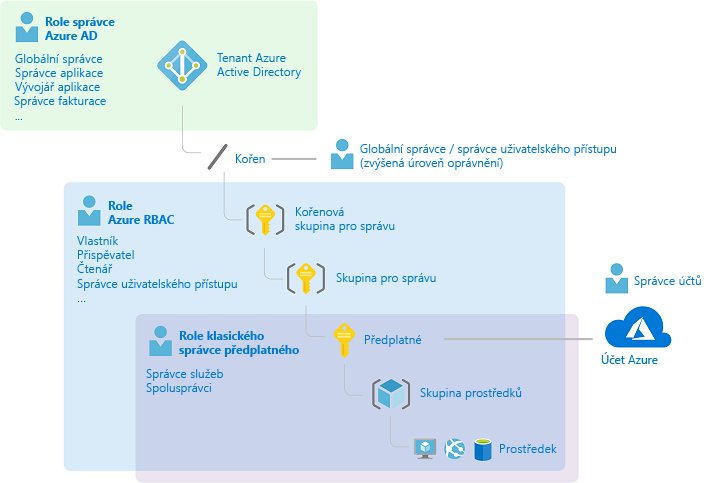
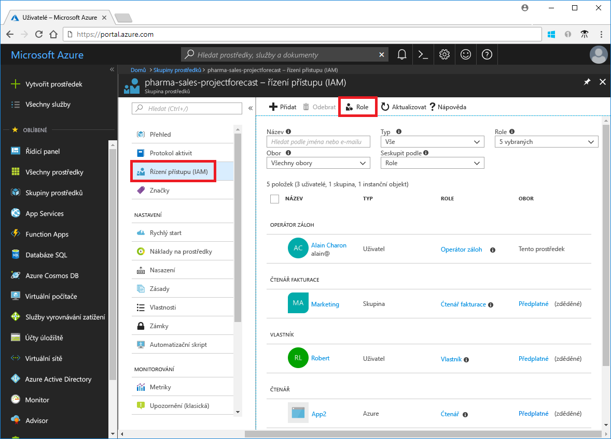
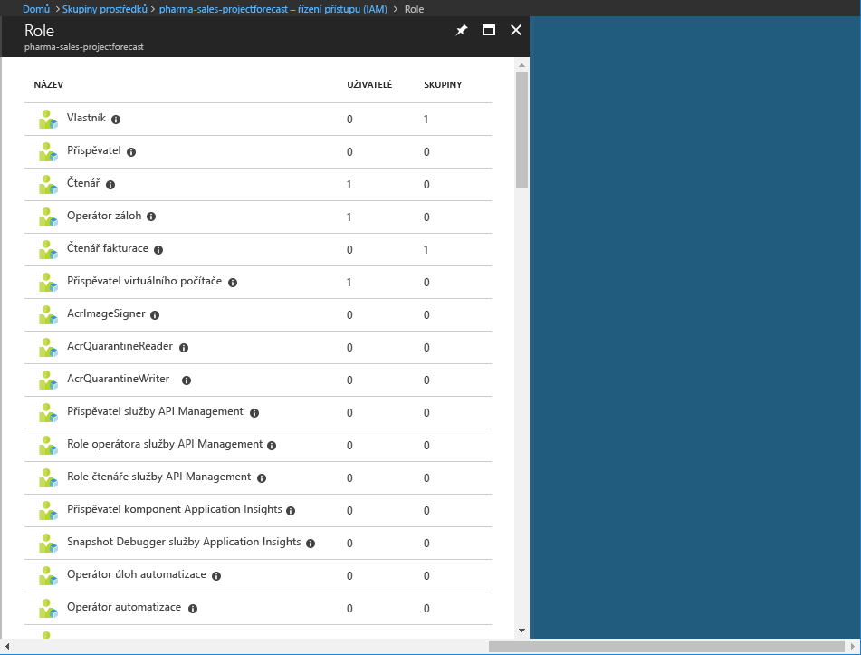
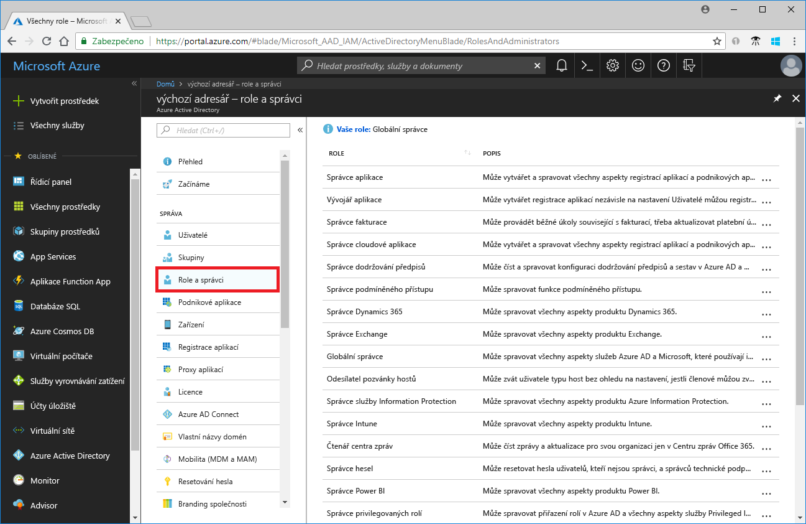
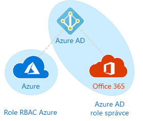

# Role klasického správce předplatného vs. role Azure RBAC vs. role správce Azure AD

Pokud s Azure teprve začínáte, může být pro vás trochu obtížné vyznat se v různých rolích v Azure. Tento článek vám pomůže porozumět následujícím rolím a tomu, kdy je použít:
- Role klasického správce předplatného
- Role řízení přístupu na základě rolí (RBAC) Azure
- Role správce služby Azure AD (Azure Active Directory)

## Jak spolu role souvisejí

Lepšímu porozumění rolí v Azure pomůže znalost trochy historie. Když byla poprvé služba Azure vydána, byl přístup k prostředkům spravován pomocí pouhých tří rolí správce: správce účtu, správce služeb a spolusprávce. Později bylo přidáno řízení přístupu na základě role (RBAC) pro prostředky Azure. Azure RBAC je novější systém autorizace, který poskytuje podrobnou správu přístupu k prostředkům Azure. Řízení přístupu na základě role zahrnuje mnoho předdefinovaných rolí, může být přiřazeno v různých oborech a umožňuje vytvářet vlastní role. Pokud chcete spravovat prostředky v Azure AD, například uživatele, skupiny nebo domény, máte k dispozici několik rolí správce Azure AD.

Následující diagram představuje souhrnné zobrazení toho, jak spolu souvisejí role klasického správce předplatného, role Azure RBAC a role správce Azure AD.

## Role klasického správce předplatného

Správce účtu, správce služeb a spolusprávce jsou tři role klasického správce předplatného v Azure. Klasičtí správci předplatného mají úplný přístup k předplatnému Azure. Mohou spravovat prostředky pomocí portálu Azure Portal, rozhraní API Azure Resource Manageru a rozhraní API modelu nasazení Classic. Účet, který slouží k registraci v Azure, je automaticky nastaven jako účet správce účtu a správce služeb. Potom je možné přidat další spolusprávce. Správce služeb a spolusprávci mají stejný přístup jako uživatelé s přiřazenou rolí vlastníka (role Azure RBAC) v oboru předplatného. Následující tabulka popisuje rozdíly mezi třemi rolemi klasického správce předplatného.

| Klasický správce předplatného | Omezení | Oprávnění | Poznámky |
| --- | --- | --- | --- |
| Správce účtu | 1 na účet Azure | <ul><li>Přístup do [Centra účtů Azure](https://account.azure.com/Subscriptions)</li><li>Správa všech předplatných v účtu</li><li>Vytváření nových předplatných</li><li>Rušení předplatných</li><li>Změna fakturace předplatného</li><li>Změna správce služeb</li></ul> | Koncepčně se jedná o vlastníka fakturace předplatného.|
| Správce služeb | 1 na předplatné Azure | <ul><li>Správa služeb na portálu [Azure Portal](https://portal.azure.com)</li><li>Přiřazení role spolusprávce uživatelům</li></ul> | Ve výchozím nastavení u nového předplatného je správce účtu současně i správcem služeb. Správce služeb má stejný přístup jako uživatel, který má přidělenu roli vlastníka v oboru předplatného. |
| Spolusprávce | 200 na předplatné | <ul><li>Má stejná přístupová oprávnění jako správce služeb, ale nemůže měnit přidružení předplatných k adresářům Azure.</li><li>Může uživatelům přiřazovat role spolusprávce, ale nemůže měnit správce služeb.</li></ul> | Spolusprávce má stejný přístup jako uživatel, který má přidělenu roli vlastníka v oboru předplatného. |

Na portálu Azure Portal ve vlastnostech předplatného se můžete podívat, kdo má přiřazenu roli správce účtu a roli správce služeb.

Informace o tom, jak přidat nebo změnit správce předplatného, najdete v dokumentaci k fakturaci Azure v části o [přidávání nebo změně správců předplatného](../billing/billing-add-change-azure-subscription-administrator.md).

### Účet Azure a předplatná Azure

Účet Azure reprezentuje fakturační vztah. Účet Azure je identita uživatele, jedno nebo více předplatných Azure a přidružená skupina prostředků Azure. Osoba, která vytvoří účet, je správcem účtu pro všechna předplatná vytvořená v daném účtu. Tato osoba je také výchozím správcem služeb pro předplatné.

Předplatná Azure vám usnadňují organizaci přístupu k prostředkům Azure. Zároveň vám pomohou řídit způsob, jak je používání prostředků vykazováno, fakturováno a placeno. Každé předplatné může mít jiné nastavení fakturace a plateb. Můžete tedy mít jiná předplatná a jiné plány pro různé pobočky, oddělení, projekty a podobně. Každá služba patří do předplatného a pro programové operace se může vyžadovat ID předplatného.

Účty a předplatná se spravují v [Centru účtů Azure](https://account.azure.com/Subscriptions).
## Role Azure RBAC

Azure RBAC je systém autorizace založený na [Azure Resource Manageru](../azure-resource-manager/resource-group-overview.md), který poskytuje podrobnou správu přístupu k prostředkům Azure, jako jsou výpočetní služby a úložiště. Azure RBAC zahrnuje více než 70 předdefinovaných rolí. Existují čtyři základní role RBAC. První tři se vztahují ke všem typům prostředků:

| Role Azure RBAC | Oprávnění | Poznámky |
| --- | --- | --- |
| [Vlastník](built-in-roles.md#owner) | <ul><li>Úplný přístup ke všem prostředkům</li><li>Delegování přístupu na jiné uživatele</li></ul> | Správce služeb a spolusprávci mají přiřazenu roli vlastníka v oboru předplatného. Platí pro všechny typy prostředků. |
| [Přispěvatel](built-in-roles.md#contributor) | <ul><li>Vytváření a správa všech typů prostředků Azure</li><li>Nemůže udělovat přístup ostatním</li></ul> | Platí pro všechny typy prostředků. |
| [Čtenář](built-in-roles.md#reader) | <ul><li>Zobrazení prostředků Azure</li></ul> | Platí pro všechny typy prostředků. |
| [Správce uživatelských přístupů](built-in-roles.md#user-access-administrator) | <ul><li>Správa uživatelských přístupů k prostředkům Azure</li></ul> |  |

Zbývající předdefinované role umožňují správu konkrétních prostředků Azure. Role [Přispěvatel virtuálních počítačů](built-in-roles.md#virtual-machine-contributor) například uživateli umožňuje vytvářet a spravovat virtuální počítače. Seznam všech předdefinovaných rolí najdete v článku, který se věnuje [předdefinovaným rolím](built-in-roles.md).

Řízení přístupu na základě role (RBAC) podporují pouze portál Azure Portal a rozhraní API Azure Resource Manageru. Uživatelé, skupiny a aplikace s přiřazenými rolemi RBAC nemohou používat [rozhraní API modelu nasazení Azure Classic](../azure-resource-manager/resource-manager-deployment-model.md).

Na portálu Azure Portal se přiřazení rolí pomocí RBAC zobrazují v okně **Řízení přístupu (IAM)**. Toto okno najdete na celém portálu, například u předplatných, skupin prostředků a různých prostředků.

Když kliknete na možnost **Role**, zobrazí se seznam předdefinovaných a vlastních rolí.

## Role správce Azure AD

Role správce Azure AD slouží ke správě prostředků Azure AD v adresáři, například k vytváření nebo úpravě uživatelů, přiřazení administrativních rolí dalším uživatelům, resetování hesel uživatelů, správě uživatelských licencí a správě domén. Následující tabulka popisuje několik důležitějších rolí správce Azure AD.

| Role správce Azure AD | Oprávnění | Poznámky |
| --- | --- | --- |
| [Globální správce](../active-directory/users-groups-roles/directory-assign-admin-roles.md#company-administrator) | <ul><li>Správa přístupu ke všem administrativním funkcím v Azure Active Directory i službám federovaným do Azure Active Directory</li><li>Přiřazení rolí správce dalším uživatelům</li><li>Resetování hesel uživatelů a všech ostatních správců</li></ul> | Osoba, která se zaregistruje v tenantovi Azure Active Directory, se stává globálním správcem. |
| [Správce uživatelů](../active-directory/users-groups-roles/directory-assign-admin-roles.md#user-account-administrator) | <ul><li>Vytváření a správa všech aspektů uživatelů a skupin</li><li>Správa lístků podpory</li><li>Monitorování stavu služby</li><li>Změna hesel pro uživatele, správce helpdesku a další správce uživatelů</li></ul> |  |
| [Správce fakturace](../active-directory/users-groups-roles/directory-assign-admin-roles.md#billing-administrator) | <ul><li>Nové nákupy</li><li>Správa předplatných</li><li>Správa lístků podpory</li><li>Monitorování stavu služby</li></ul> |  |

Seznam všech rolí správce Azure AD najdete v článku o [přiřazování rolí správce v Azure Active Directory](/azure/active-directory/active-directory-assign-admin-roles-azure-portal).

Na portálu Azure Portal najdete seznam rolí správce Azure AD v okně **Role a správci**.

## Rozdíly mezi rolemi Azure RBAC a rolemi správce Azure AD

Na obecné úrovni role Azure RBAC řídí oprávnění ke správě prostředků Azure a role správce Azure AD řídí oprávnění ke správě prostředků Azure Active Directory. Následující tabulka obsahuje přehled některých rozdílů.

| Role Azure RBAC | Role správce Azure AD |
| --- | --- |
| Správa přístupu k prostředkům Azure | Správa přístupu k prostředkům Azure Active Directory |
| Podpora vlastních rolí | Nemůže vytvářet vlastní role |
| Možnost zadání oboru na více úrovních (skupina pro správu, předplatné, skupina prostředků, prostředek) | Obor na úrovni tenanta |
| Dostupnost informací o roli na portálu Azure Portal, v Azure CLI, Azure PowerShellu, šablonách Azure Resource Manageru, rozhraní REST API | Dostupnost informací o roli na portálu pro správu Azure, portálu pro správu Office 365, v Microsoft Graphu, AzureAD PowerShellu |

### Překrývají se role Azure RBAC a role správce Azure AD?

Ve výchozím nastavení role Azure RBAC a role správce Azure AD nepokrývají Azure a Azure AD. Pokud ale globální správce vybere na portálu Azure Portal přepínač **Globální správce může spravovat předplatná Azure a skupiny pro správu** a tím zvýší úroveň svého přístupu, udělí se mu role [Správce uživatelských přístupů](built-in-roles.md#user-access-administrator) (což je role RBAC) pro všechna předplatná u konkrétního tenanta. Role správce uživatelských přístupů uživateli umožňuje udělit dalším uživatelům přístup k prostředkům Azure. Tento přepínač může být užitečný pro opakované získání přístupu k předplatnému. Další informace najdete v článku o [zvýšení úrovně přístupu pro správce Azure AD](elevate-access-global-admin.md).

Několik rolí správce Azure AD pokrývá Azure AD a Microsoft Office 365, například role globálního správce a správce uživatelů. Pokud jste například členem role Globální správce, máte funkce globálního správce v Azure AD a Office 365 a můžete mimo jiné provádět změny v Microsoft Exchangi a Microsoft SharePointu. Ve výchozím nastavení ale globální správce nemá přístup k prostředkům Azure.

## Další kroky

- [Co je řízení přístupu na základě role (RBAC)?](overview.md)
- [Přiřazení rolí správce v Azure Active Directory](/azure/active-directory/active-directory-assign-admin-roles-azure-portal)
- [Přidávání a změna správců předplatného Azure](/azure/billing/billing-add-change-azure-subscription-administrator)
