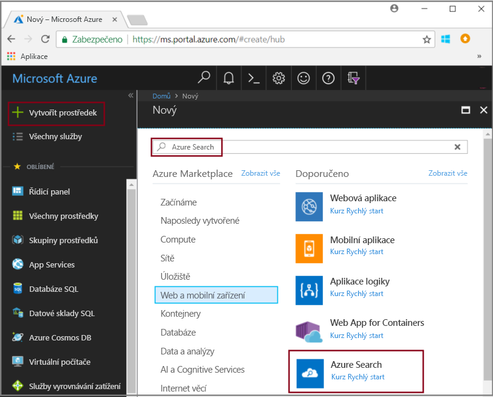
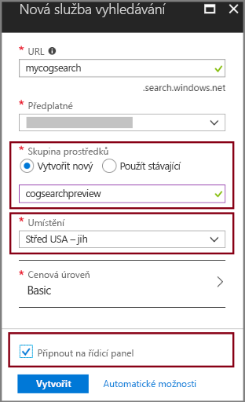
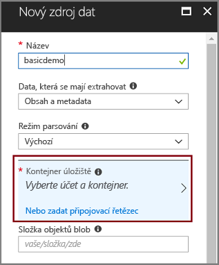
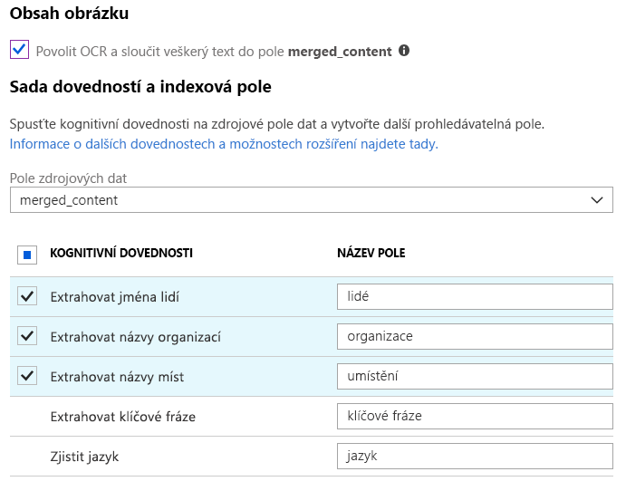
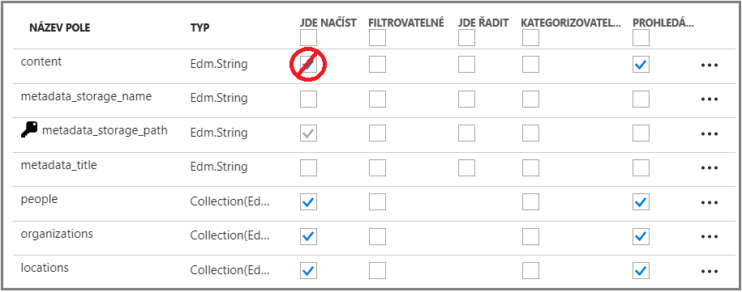
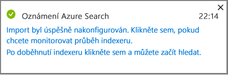
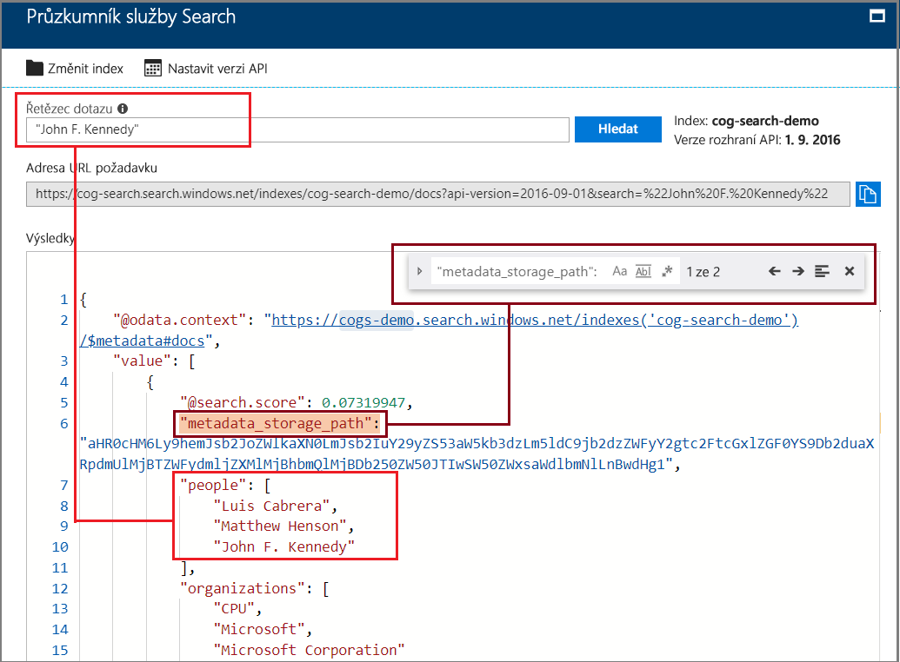

# Rychlý start: Vytvoření kanálu kognitivního hledání pomocí dovedností a ukázkových dat

Cognitive Search (Preview) přidává dovednosti extrakce dat, zpracování přirozeného jazyka (NLP) a zpracování obrazu do kanálu pro indexaci služby Azure Search, díky čemuž je možné v neprohledávatelném a nestrukturovaném obsahu snadněji vyhledávat. Informace vytvořené určitou dovedností, např. rozpoznáváním entit nebo analýzou obrazu, se přidají do indexu v Azure Search.

V tomto rychlém startu si můžete vyzkoušet kanál pro rozšiřování na portálu [Azure Portal](https://portal.azure.com) ještě dříve, než napíšete jediný řádek kódu:

* Začnete s ukázkovými daty ve službě Azure Blob Storage.
* Nakonfigurujete [Průvodce importem dat](search-import-data-portal.md) tak, aby podporoval indexování a rozšiřování. 
* Spustíte průvodce (dovednost entity zjistí lidi, lokality a organizace).
* Pomocí [Průzkumníka služby Hledání](search-explorer.md) se dotážete na rozšířená data.

##  Podporované oblasti

Kognitivní hledání si můžete vyzkoušet ve službě Azure Search vytvořené v následujících oblastech:

* Západní střed USA
* Střed USA – jih
* USA – východ
* Západní Evropa
* Severní Evropa
* Jihovýchodní Asie

Pokud ještě nemáte předplatné Azure, vytvořte si [bezplatný účet](https://azure.microsoft.com/free/?WT.mc_id=A261C142F) před tím, než začnete.

> [!NOTE]
> Cognitive Search je ve veřejné verzi Preview. Funkce spuštění sady dovedností, extrakce a normalizace image jsou v současnosti nabízené zdarma. Ceny těchto funkcí oznámíme později. 

## Požadavky

Článek [Co je kognitivní hledání?](cognitive-search-concept-intro.md) nabízí základní informace o architektuře a součástech rozšiřování. 

V tomto scénáři se používají výhradně služby Azure. Během přípravy se vytvářejí potřebné služby.

+ Služba Azure Blob Storage poskytuje zdrojová data.
+ Azure Search zpracovává příjem dat a indexování, rozšiřování pomocí kognitivního hledání a dotazy fulltextového vyhledávání.

### Nastavení služby Azure Search

Nejdříve se do služby Azure Search přihlaste. 

1. Přejděte na [Azure Portal](https://portal.azure.com) a přihlaste se pomocí svého účtu Azure.

1. Klikněte na **Vytvořit prostředek**, vyhledejte Azure Search a klikněte na **Vytvořit**. Pokud službu Search nastavujete poprvé a potřebujete ještě pomoc, přečtěte si informace v článku [Vytvoření služby Azure Search na portálu](search-create-service-portal.md).

  

1. V části Skupina prostředků vytvořte skupinu prostředků, která bude obsahovat všechny prostředky vytvořené během tohoto rychlého startu. To usnadní čištění prostředků, až rychlý start dokončíte.

1. Pro umístění, zvolte jednu z [podporované oblasti](#supported-regions) pro Kognitivního vyhledávání.

1. V části Cenová úroveň můžete pro účely kurzů a rychlých startů vytvořit bezplatnou (**Free**) službu. Pokud chcete důkladněji zkoumat svá vlastní data, vytvořte si [placenou službu](https://azure.microsoft.com/pricing/details/search/), např. **Basic** nebo **Standard**. 

  Bezplatná služba je omezená na 3 indexy, 16 MB maximální velikosti objektu blob a 2 minuty indexování, což pro úplné využití funkcí kognitivního hledání nestačí. Pokud se chcete podívat na limity pro jednotlivé úrovně, najdete je v článku o [limitech služeb](search-limits-quotas-capacity.md).

  > [!NOTE]
  > Cognitive Search je ve veřejné verzi Preview. Spouštění sad dovedností je v tuto chvíli k dispozici na všech úrovních, včetně bezplatné. Cenu této funkce oznámíme později.

1. Pokud chcete mít k informacím o službě rychlý přístup, připněte si službu na řídicí panel.

  

### Nastavení služby Azure Blob a načtení ukázkových dat

Kanál pro rozšiřování načítá data ze zdrojů dat Azure podporovaných [indexery služby Azure Search](search-indexer-overview.md). Při tomto cvičení použijeme službu Blob Storage, na které ukážeme několik typů obsahu.

1. [Stáhněte si ukázková data](https://1drv.ms/f/s!As7Oy81M_gVPa-LCb5lC_3hbS-4) sestávající z malé sady souborů různých typů. 

1. Zaregistruje si službu Azure Blob Storage, vytvořte si účet úložiště, pak se přihlaste do Průzkumníka služby Storage a vytvořte kontejner. Pokyny ke všem těmto krokům najdete v článku o [rychlém startu s Průzkumníkem služby Azure Storage](../storage/blobs/storage-quickstart-blobs-storage-explorer.md).

1. V Průzkumníkovi služby Azure Storage v kontejneru, který jste vytvořili, klikněte na **Nahrát** a nahrajte ukázkové soubory.

  

## Vytvoření kanálu pro rozšiřování

Přejděte zpátky na stránku řídicího panelu služby Azure Search a na panelu příkazů klikněte na **Importovat data**, abyste ve čtyřech krocích nastavili rozšiřování.

### Krok 1: Vytvoření zdroje dat

V části **Připojení k datům** > **Azure Blob Storage** vyberte účet a kontejner, které jste vytvořili. Zadejte název pro zdroj dat a u ostatních položek nechejte výchozí hodnoty. 

   

Kliknutím na tlačítko **OK** vytvořte zdroj dat.

Jednou z výhod **Průvodce importem dat** je to, že může navíc vytvořit váš index. Při vytváření zdroje dat průvodce zároveň sestaví schéma indexu. Vytvoření indexu může trvat několik sekund.

### Krok 2: Přidání kognitivních dovedností

Jako další krok přidáte do kanálu indexování kroky pro rozšiřování. Portál nabízí předdefinované kognitivní dovednosti pro analýzu obrazu a textu. Na portálu sada dovedností pracuje s jedním polem zdroje. To může vypadat jako malý cíl, ale pro objekty blob služby Azure pole `content` obsahuje většinu dokumentu objektu blob (např. wordový dokument nebo powerpointovou sadu karet). Z toho důvodu je toto pole ideální vstup, protože je v něm veškerý obsah objektu blob.

Občas můžete chtít extrahovat textovou reprezentaci ze souborů, které se převážně skládají z naskenovaných obrázků. Příkladem může být soubor PDF vygenerovaný skenerem. Služba Azure Search může automaticky extrahovat obsah z vložených obrázků v dokumentu. Pokud to chcete udělat, vyberte možnost **Povolit optické rozpoznávání znaků a sloučit veškerý text do pole merged_content**. Tím se automaticky vytvoří pole `merged_content`, které obsahuje text extrahovaný z dokumentu a také textovou reprezentaci obrázků vložených v tomto dokumentu. Když tuto možnost vyberete, `Source data field` se nastaví na `merged_content`.

V části **Přidat kognitivní dovednosti** zvolte dovednosti, které zpracovávají přirozený jazyk. Pro tento rychlý start zvolte rozpoznávání entit pro lidi, organizace a lokality.

Kliknutím na **OK** přijměte definici.
   
  

Dovednosti zpracování přirozeného jazyka pracují s textovým obsahem v ukázkové sadě dat. Vzhledem k tomu, že jsme nevybrali žádné možnosti zpracování obrazu, soubory JPEG, které se nacházejí v ukázkové sadě dat, se v tomto rychlém startu nezpracují. 

### Krok 3: Konfigurace indexu

Pamatujete si na index, který se vytvořil spolu se zdrojem dat? V tomto kroku si můžete zobrazit jeho schéma a případně upravit kterékoli nastavení. 

Pro tento rychlý start průvodce odvedl dobrou práci při nastavování rozumných výchozích hodnot: 

+ Každý index musí mít nějaký název. Pro tento typ zdroje dat je výchozí název *azureblob-index*.

+ Každý dokument musí mít nějaký klíč. Průvodce zvolil pole, které má jedinečné hodnoty. V tomto rychlém startu je klíč *metadata_storage_path*.

+ Všechny kolekce polí musí mít pole s datovým typem, který popisuje jejich hodnoty, a jednotlivá pole by měla mít atributy indexu, které popisují, jak se používají ve scénáři vyhledávání. 

Vzhledem k tomu, že jste vytvořili sadu dovedností, průvodce předpokládá, že chcete pole zdrojových dat a výstupní pole, která tyto dovednosti vytvářejí. Z tohoto důvodu portál přidává pole indexů pro `content`, `people`, `organizations` a `locations`. Všimněte si, že průvodce pro tato pole automaticky povoluje možnosti Retrievable a Searchable.

V části **Přizpůsobit index** si prohlédněte atributy polí a podívejte se, jak se v indexu používají. Možnost Searchable znamená, že se pole dá vyhledat. Možnost Retrievable znamená, že se dá vrátit ve výsledcích. 

Zvažte možnost zrušit u pole `content` možnost Retrievable. V objektech blob může toto pole obsahovat tisíce řádků, které se v nástroji jako **Průzkumník služby Hledání** jen obtížně čtou.

Kliknutím na **OK** přijměte definici indexu.

  

> [!NOTE]
> Aby byl snímek obrazovky stručnější, vynechala se z něj nevyužitá pole. Pokud postupujete na portálu, v seznamu uvidíte nějaká pole navíc.

### Krok 4: Konfigurace indexeru

Indexer je prostředek vysoké úrovně, který řídí proces indexování. Určuje název zdroje dat, index a frekvenci spouštění. Konečným výsledkem **Průvodce importem dat** je vždy indexer, který můžete opakovaně spouštět.

Na stránce **Indexer** pojmenujte daný indexer a použijte výchozí možnost jednorázového spuštění, aby se okamžitě spustil. 

  

Kliknutím na **OK** importujete, rozšíříte a zaindexujete data.

  

Indexování a rozšiřování může nějakou dobu trvat. To je důvod, proč se pro seznamování s touto službou doporučuje používat menší sady dat. Monitorovat indexování můžete na stránce Oznámení na portálu Azure Portal. 

## Dotaz v Průzkumníku služby Hledání

Až se index vytvoří, můžete odesílat dotazy, aby se z indexu vracely dokumenty. Na portálu použijte **Průzkumníka služby Hledání**, pomocí kterého spusťte dotazy a zobrazte si výsledky. 

1. Na stránce řídicího panelu služby Search klikněte na panelu příkazů na **Průzkumník služby Hledání**.

1. V horní části vyberte **Změnit index**, abyste mohli vybrat index, který jste vytvořili.

1. Zadejte hledaný řetězec pro dotaz na index, např. John F. Kennedy.

Výsledky se vrátí ve formátu JSON, který může být dost podrobný a jen obtížně čitelný, a to hlavně v případě velkých dokumentů, které pocházejí z objektů blob Azure. 

Pokud není možné si výsledky snadno projít, můžete v dokumentech hledat pomocí CTRL+F. V případě tohoto dotazu můžete v kódu JSON vyhledat výraz John F. Kennedy a zobrazit si tak instance daného hledaného výrazu. 

CTRL+F vám navíc může pomoct určit, kolik dokumentů v sadě výsledků je. Pro objekty blob Azure portál volí jako klíč metada_storage_path, protože každá hodnota je v dokumentu jedinečná. Pomocí CTRL+F vyhledejte metadata_storage_path a získáte počet dokumentů. Pro tento dotaz jsou v sadě výsledků dva dokumenty, které obsahují pojem John F. Kennedy.

  

## Shrnutí

Dokončili jste svoje první cvičení rozšířeného indexování. Účelem tohoto rychlého startu bylo představit důležité koncepty a projít s vámi průvodce, abyste mohli rychle vytvořit prototyp řešení kognitivního hledání pomocí svých vlastních dat.

Mezi klíčové koncepty, které jste si snad osvojili, patří závislost na zdrojích dat Azure. Rozšiřování pomocí kognitivního hledání se váže na indexery a indexery pracují s konkrétním zdrojem a službou Azure. I když tento rychlý start používá službu Azure Blob Storage, je možné použít i jiné zdroje dat Azure. Další informace najdete v článku o [indexerech ve službě Azure Search](search-indexer-overview.md).

Další důležitý koncept je to, že dovednosti pracují se vstupními poli. Na portálu si musíte zvolit jedno zdrojové pole pro všechny dovednosti. V kódu se jako vstup dají použít jiná pole nebo výstup z nadřazené dovednosti.

 Vstupy dovednosti se mapují na výstupní pole v indexu. Vnitřně portál nastaví [poznámky](cognitive-search-concept-annotations-syntax.md) a definuje [sadu dovedností](cognitive-search-defining-skillset.md), čímž určuje pořadí operací v obecném toku. Tyto kroky jsou na portálu skryté, ale až začnete psát kód, budou tyto koncepty důležité.

Nakonec jste zjistili, že k zobrazení výsledků slouží dotazy na index. Azure Search vlastně poskytuje prohledávatelný index, na který můžete poslat dotaz buď pomocí [jednoduché](https://docs.microsoft.com/rest/api/searchservice/simple-query-syntax-in-azure-search), nebo [plně rozšířené syntaxe dotazů](https://docs.microsoft.com/rest/api/searchservice/lucene-query-syntax-in-azure-search). Index, který obsahuje rozšířená pole, se v ničem neliší od ostatních indexů. Pokud chcete začlenit standardní nebo [vlastní analyzátory](search-analyzers.md), [profily vyhodnocování](https://docs.microsoft.com/rest/api/searchservice/add-scoring-profiles-to-a-search-index), [synonyma](search-synonyms.md), [filtry s charakteristikou](search-filters-facets.md), vyhledávání na základě geografických dat nebo jakoukoli jinou funkci služby Azure Search, nic tomu nebrání.

## Vyčištění prostředků

Pokud už jste všechno dostatečně prozkoumali, nejrychlejší způsob, jak vše vyčistit, je odstranit skupinu prostředků, která obsahuje službu Azure Search a službu Azure Blob.  

Za předpokladu, že jste vložili obě služby do stejné skupiny, odstraňte skupinu prostředků. Tím se trvale odstraní všechno, co v ní je, včetně služeb a veškerého uloženého obsahu, který jste pro toto cvičení vytvořili. Na portálu najdete název skupiny prostředků na stránce Přehled jednotlivých služeb.

## Další postup

Pokud chcete experimentovat s indexováním a rozšiřováním, můžete znovu spustit průvodce a použít jiné dovednosti a pole zdrojových dat. Pokud chcete postup opakovat, odstraňte index a indexer a pak znovu indexer vytvořte s tím, že vyberete novou kombinaci možností.

+ V části **Přehled** > **Indexy** vyberte index, který jste vytvořili, a klikněte na **Odstranit**.

+ V části **Přehled** klikněte dvakrát na dlaždici **Indexery**. Najděte indexer, který jste vytvořili, a odstraňte ho.

Alternativně můžete znovu použít ukázková data a služby, které jste vytvořili, a v dalším kurzu se naučit dělat totéž programově. 

> [!div class="nextstepaction"]
> [Kurz: Informace o rozhraních REST API kognitivního hledání](cognitive-search-tutorial-blob.md)
