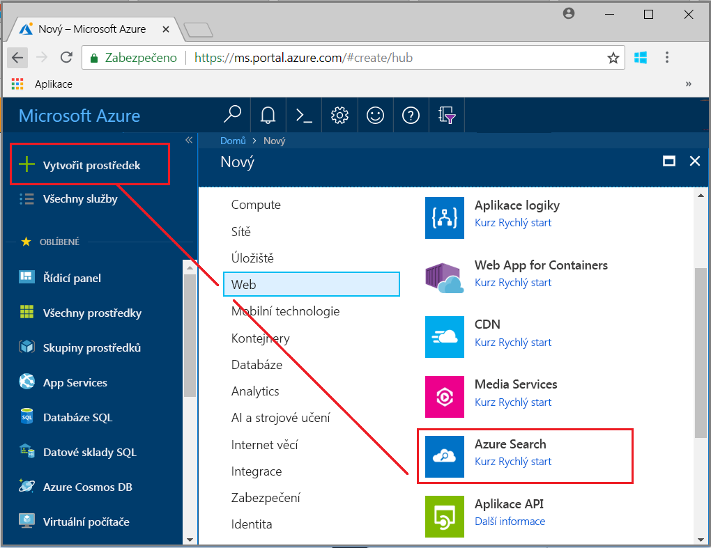
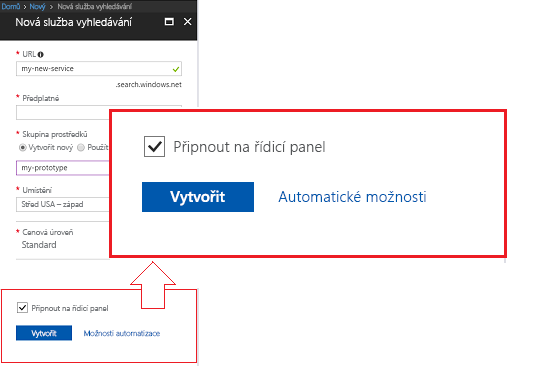
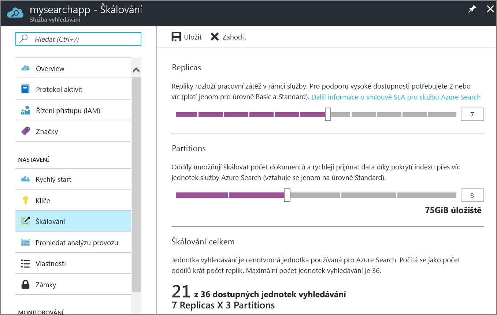

# Vytvoření služby Azure Search na portálu

Azure Search je samostatný prostředek, který se používá k vyhledávání ve vlastních aplikacích. Přestože Azure Search se snadno integruje s dalšími službami Azure, můžete také použít samostatně, s aplikacemi na síťové servery, nebo pomocí softwaru, která běží na jiných cloudových platformách. 

V tomto článku se dozvíte, jak a vytvoří prostředek Azure Search v [webu Azure portal](https://portal.azure.com/). 

Dáváte přednost prostředí PowerShell? Použijte [šablonu služby](https://azure.microsoft.com/resources/templates/101-azure-search-create/) Azure Resource Manageru. Nápovědu k zahájení práce, naleznete v tématu [Správa služby Azure Search pomocí prostředí PowerShell](search-manage-powershell.md).

## Předplatné (bezplatné nebo placené)

[Otevřete si bezplatný účet Azure](https://azure.microsoft.com/pricing/free-trial/?WT.mc_id=A261C142F) a použijte bezplatné kredity k vyzkoušení placených služeb Azure. Až kredity vyčerpáte, můžete si účet ponechat a dál používat bezplatné služby Azure, jako například Azure Websites. Nikdy vám nebudeme účtovat žádné poplatky, pokud si sami nezměníte nastavení a nezačnete používat placené služby.

Případně si můžete [aktivovat výhody pro předplatitele MSDN](https://azure.microsoft.com/pricing/member-offers/msdn-benefits-details/?WT.mc_id=A261C142F). Díky předplatnému MSDN každý měsíc získáváte kredity, které můžete použít pro placené služby Azure. 

## Vyhledání služby Azure Search
1. Přihlaste se k webu [Azure Portal](https://portal.azure.com/).
2. Klikněte na symbol plus (+ vytvořit prostředek") do levého horního rohu.
3. Pomocí panelu hledání vyhledejte "Azure Search" nebo přejít k prostředku pomocí **webové** > **Azure Search**.

## Zadání názvu služby a koncového bodu adresy URL

Název služby je součástí koncového bodu adresy URL, na který jsou prováděna volání rozhraní API: `https://your-service-name.search.windows.net`. Zadejte název služby do pole **URL**.

Například, pokud chcete, aby koncový bod se `https://my-app-name-01.search.windows.net`, zadali byste `my-app-name-01`.

Požadavky na název služby:
   * Musí být jedinečný v rámci oboru názvů search.windows.net.
   * Délka musí být 2 až 60 znaků.
   * Používejte malá písmena, číslice nebo pomlčky („-“).
   * Nepoužívejte pomlčku („-“) v prvních 2 znacích nebo jako poslední znak.
   * Nikde nepoužívejte po sobě jdoucí pomlčky („--“).

## Výběr předplatného
Pokud máte více než jedno předplatné, vyberte to, jehož součástí jsou také služby úložiště dat nebo souborů. Služba Azure Search můžete zjišťovat Azure Table Storage a Blob storage, SQL Database a Azure Cosmos DB pro indexování prostřednictvím [ *indexery*](search-indexer-overview.md), ale pouze pro služby ve stejném předplatném.

## Výběr skupiny prostředků
Skupina prostředků je kolekce společně používaných služeb a prostředků Azure. Pokud například používáte Azure Search k indexování databáze SQL, pak by obě služby měly být součástí stejné skupiny prostředků.

Pokud prostředky nejsou sloučením do jedné skupiny, nebo existující skupiny prostředků jsou vyplněny hodnotou prostředky používané v řešení nesouvisející, vytvořte novou skupinu prostředků pro váš prostředek Azure Search.

> [!TIP]
> Odstraněním skupiny prostředků se odstraní také služby v této skupině. U prototypových projektů, které využívají více služeb, spojení všech služeb do stejné skupiny prostředků usnadňuje vyčištění po skončení projektu. 

## Výběr umístění pro hostování 
Protože se jedná o službu Azure, je Azure Search možné hostovat v datových centrech po celém světě. [Ceny mohou lišit](https://azure.microsoft.com/pricing/details/search/) podle zeměpisné oblasti.

Pokud máte v úmyslu použít kognitivního vyhledávání, zvolte [oblasti s dostupností funkcí](cognitive-search-quickstart-blob.md#supported-regions).

## Výběr cenové úrovně (SKU)
[Služba Azure Search je v současné době nabízena v několika cenových úrovních](https://azure.microsoft.com/pricing/details/search/): Free, Basic nebo Standard. Každá úroveň má svou vlastní [kapacitu a limity](search-limits-quotas-capacity.md). Další pokyny získáte v tématu věnovaném [volbě cenové úrovně nebo SKU](search-sku-tier.md).

Úroveň Standard se obvykle používá pro produkční úlohy, ale většina zákazníků se službou začíná na úrovni Free.

Po vytvoření služby nelze cenovou úroveň změnit. Pokud budete později potřebovat vyšší nebo nižší úroveň, budete muset službu znovu vytvořit.

## Vytvoření služby

Připněte si službu na řídicí panel, abyste k ní po přihlášení měli snadno přístup.

## Získejte klíč a koncový bod adresy URL

S několika výjimkami pomocí nové služby vyžaduje zadání koncového bodu adresy URL a autorizační klíč rozhraní api –. Rychlé starty, kurzy, jako [prozkoumat Azure Search REST API (Postman)](search-fiddler.md) a [jak používat Azure Search z .NET](search-howto-dotnet-sdk.md), ukázky a vlastní kód všechny nutné koncového bodu a klíče ke spuštění pro váš konkrétní prostředek.

1. Na stránce Přehled služby vyhledejte a zkopírujte adresu URL koncového bodu na levé straně stránky. 

   

2. V levém navigačním podokně vyberte **klíče** a potom zkopírujte jednu z klíčů správce (jsou ekvivalentní). Správce klíče api Key jsou požadovány pro vytváření, aktualizaci a odstraňování objektů ve službě service.

   

Koncového bodu a klíče nejsou potřebné pro úlohy založené na portálu. Na portálu je už propojený prostředek Azure Search pomocí oprávnění správce. Portálu kurz začněte [kurzu: Import, index a dotazů ve službě Azure Search](search-get-started-portal.md).

## Škálování služby
Vytvoření služby může trvat několik minut (15 minut nebo déle v závislosti na úrovni). Po zřízení můžete službu škálovat tak, aby vyhovovala vašim potřebám. Protože jste pro službu Azure Search zvolili úroveň Standard, můžete škálovat dvě dimenze: repliky a oddíly. Pokud byste zvolili úroveň Basic, mohli byste přidávat pouze repliky. Při zřízení bezplatné služby škálování není k dispozici.

***Oddíly***: Umožňují službě ukládat a prohledávat více dokumentů.

***Repliky***: Umožňují službě zpracovat větší množství vyhledávacích dotazů.

Přidáním prostředků se zvýší vaše měsíční náklady. [Cenová kalkulačka](https://azure.microsoft.com/pricing/calculator/) vám pomůže porozumět důsledkům přidání prostředků na fakturaci. Mějte na paměti, že prostředky můžete upravit na základě zatížení. Například můžete navýšit prostředky kvůli vytvoření úplného počátečního indexu a později je pak snížit na úroveň vhodnější pro přírůstkové indexování.

> [!Important]
> Služba musí mít [2 repliky pro smlouvu SLA jen pro čtení a 3 repliky pro smlouvu SLA se čtením a zápisem](https://azure.microsoft.com/support/legal/sla/search/v1_0/).

1. Přejděte na stránku vyhledávací služby na webu Azure Portal.
2. V levém navigačním podokně vyberte **Nastavení** > **Škálování**.
3. Přetažením posuvníku můžete přidat prostředky obou typů.

> [!Note] 
> Každá úroveň má jiné [limity](search-limits-quotas-capacity.md) pro celkový počet jednotek vyhledávání povolených v jedné službě (repliky * oddíly = celkový počet jednotek vyhledávání).

## Přidání druhé služby

Většina zákazníků používá jenom jednu službu zřízenou na úrovni poskytování [správnou rovnováhu prostředků](search-sku-tier.md). Jedna služba může hostovat více indexů v souladu s [maximálními limity vámi vybrané úrovně](search-capacity-planning.md), přičemž každý index je izolovaný od ostatních indexů. Ve službě Azure Search můžou být požadavky směrovány pouze na jeden index, což minimalizuje nebezpečí náhodného nebo záměrného načítání dat z jiných indexů ve stejné službě.

I když většina zákazníků používá jenom jednu službu, redundance služby může být nutná v případě následujících provozních požadavků:

+ Zotavení po havárii (výpadek datového centra). Služba Azure Search neposkytuje rychlé převzetí služeb při selhání v případě výpadku. Doporučení a pokyny najdete v tématu [Správa služby](search-manage.md).
+ Z vašeho zkoumání modelování více tenantů vyplynulo, že využívání dalších služeb je optimální řešení. Další informace najdete v tématu [Návrh pro více tenantů](search-modeling-multitenant-saas-applications.md).
+ U globálně nasazených aplikací můžete potřebovat instanci Azure Search ve více oblastech, abyste minimalizovali latenci při mezinárodní provozu vaší aplikace.

> [!NOTE]
> Ve službě Azure Search nelze oddělit úlohy indexování a dotazování; proto nikdy nevytvářejte více služeb pro oddělené úlohy. Index je vždy dotazován ve službě, ve které byl vytvořen (nemůžete vytvořit index v jedné službě a zkopírovat ho do jiné).
>

Druhá služba není potřebná pro zajištění vysoké dostupnosti. Vysoká dostupnost pro dotazy se dosáhne, když použijete 2 nebo více replik v rámci stejné služby. Aktualizace replik jsou sekvenční, což znamená, že alespoň jedna replika je funkční při nasazení aktualizace služby. Další informace o době provozu najdete v tématu [Smlouvy SLA](https://azure.microsoft.com/support/legal/sla/search/v1_0/).

## Další postup
Po zřízení služby Azure Search, můžete pokračovat v portálu k vytvoření prvního indexu služby.

> [!div class="nextstepaction"]
> [Kurz: Import dat, index a spouštění dotazů na portálu](search-get-started-portal.md)
