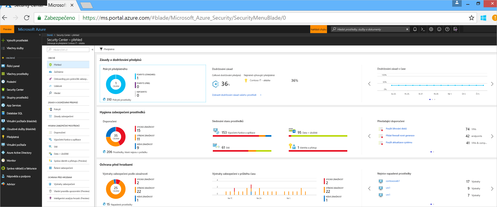
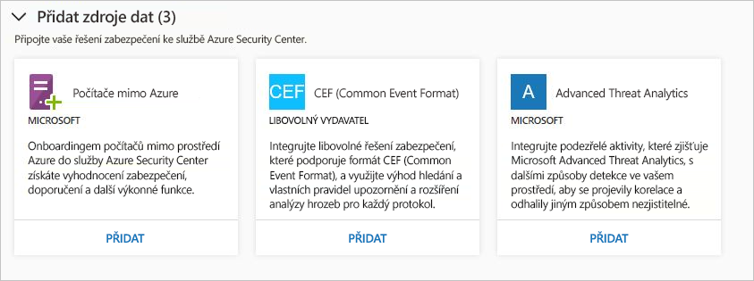
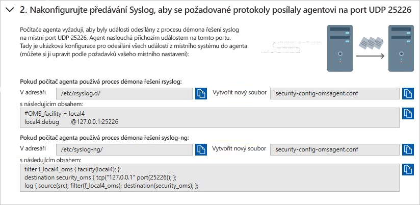
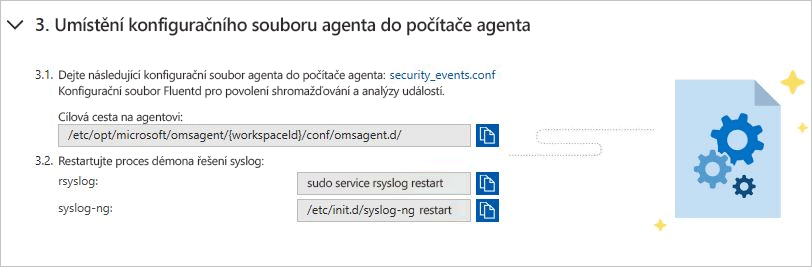
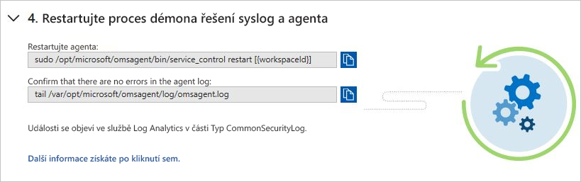
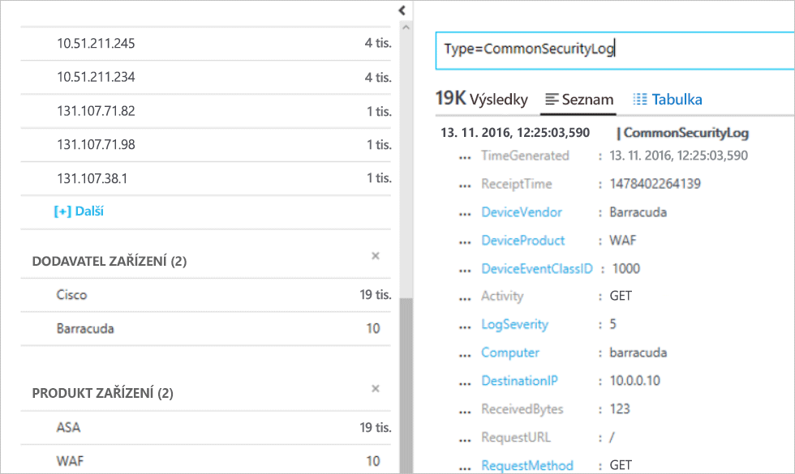

# Integrace řešení zabezpečení v Azure Security Center
Tento dokument vám pomůže se správou řešení zabezpečení již propojených s Azure Security Center a s přidáním nových řešení.

## Integrovaná řešení zabezpečení Azure
Security Center umožňuje snadné povolení integrovaných řešení zabezpečení v Azure. Mezi výhody patří:

- **Zjednodušené nasazení**: Security Center nabízí zjednodušené zřízení integrovaných partnerských řešení. Pro řešení, jako jsou antimalware a hodnocení ohrožení zabezpečení, může Security Center zřídit potřebného agenta na virtuálních počítačích, a pro zařízení brány firewall může Security Center zařídit většinu požadované konfigurace sítě.
- **Integrované detekce**: Události zabezpečení z partnerských řešení se automaticky shromažďují, agregují a zobrazují v rámci výstrah a incidentů služby Security Center. Tyto události jsou také sloučeny s detekcemi z jiných zdrojů a poskytují pokročilé možnosti detekce hrozeb.
- **Sjednocená Správa a sledování stavu**: Zákazníci můžou pomocí integrovaných událostí stavu monitorovat všechna partnerská řešení na první pohled. Je dostupná základní správa se snadným přístupem k pokročilému nastavení s použitím partnerského řešení.

Mezi integrovaná řešení zabezpečení v současné době patří:

- Firewall webových aplikací ([Barracuda](https://www.barracuda.com/products/webapplicationfirewall), [F5](https://support.f5.com/kb/en-us/products/big-ip_asm/manuals/product/bigip-ve-web-application-firewall-microsoft-azure-12-0-0.html), [Imperva](https://www.imperva.com/Products/WebApplicationFirewall-WAF), [Fortinet](https://www.fortinet.com/products.html) a [Azure Application Gateway](https://azure.microsoft.com/blog/azure-web-application-firewall-waf-generally-available/))
- Firewall nové generace ([Check Point](https://www.checkpoint.com/products/vsec-microsoft-azure/), [Barracuda](https://campus.barracuda.com/product/nextgenfirewallf/article/NGF/AzureDeployment/), [Fortinet](http://docs.fortinet.com/d/fortigate-fortios-handbook-the-complete-guide-to-fortios-5.2), [Cisco](http://www.cisco.com/c/en/us/td/docs/security/firepower/quick_start/azure/ftdv-azure-qsg.html) a [Palo Alto Networks](https://www.paloaltonetworks.com/products))
- Posouzení ohrožení zabezpečení ([Qualys](https://www.qualys.com/public-clouds/microsoft-azure/) a [Rapid7](https://www.rapid7.com/products/insightvm/))

> [!NOTE]
> Security Center neinstaluje agenta Microsoft Monitoring Agent na partnerská virtuální zařízení, protože většina dodavatelů zabezpečení na svých zařízeních zakazuje spouštění externích agentů.
>
>

## Způsob integrace řešení zabezpečení
Řešení zabezpečení Azure nasazená ze služby Security Center se automaticky připojí. Můžete také připojit další zdroje dat zabezpečení, včetně:

- Azure AD Identity Protection
- Počítače spuštěné místně nebo v jiných cloudech
- Řešení zabezpečení s podporou formátu CEF (Common Event Format)
- Microsoft Advanced Threat Analytics

## Správa integrovaných řešení zabezpečení Azure a dalších zdrojů dat

1. Přihlaste se k webu [Azure Portal](https://azure.microsoft.com/features/azure-portal/).

2. V **nabídce Microsoft Azure** vyberte **Security Center**. Otevře se obrazovka **Security Center – Přehled**.

3. V nabídce služby Security Center vyberte **Řešení zabezpečení**.

  

V části **Řešení zabezpečení** můžete zobrazit informace o stavu integrovaných řešení zabezpečení Azure a provádět základní úlohy správy. Můžete také připojit další typy zdrojů dat zabezpečení, jako jsou upozornění služby Azure Active Directory Identity Protection a protokoly brány firewall ve formátu CEF (Common Event Format).

### Připojená řešení

Část **Připojená řešení** obsahuje řešení zabezpečení, která jsou aktuálně připojená ke službě Security Center, a informace o stavu jednotlivých řešení.  

Stav partnerského řešení může být:

* V pořádku (zelený) – není žádný problém se stavem.
* Není v pořádku (červená) – Existuje problém stavu, které si žádá okamžitou pozornost.
* Problémy se stavem (oranžová) – řešení přestalo hlásit svůj stav.
* Neuveden (šedá) – řešení neohlásil cokoli, ale stav řešení nemusí být uvedený, pokud byl nedávno připojený a ještě probíhá jeho nasazení, nebo je k dispozici žádná data o stavu.

> [!NOTE]
> Pokud není k dispozici data stavu, Security Center zobrazuje datum a čas poslední událost přijata označující, zda je řešení hlásí, nebo ne. Pokud je k dispozici žádná data o stavu a nejsou během posledních 14 dní přijaty žádné výstrahy, Security Center upozorňuje, že řešení není v pořádku, nebo není generování sestav.
>
>

2. Vyberte **zobrazení** pro další informace a možnosti, které obsahuje:

  - **Konzola řešení**. Otevře prostředí pro správu pro toto řešení.
  - **Propojení virtuálních počítačů**. Otevřete okno propojit aplikace. Tady můžete ke svému partnerskému řešení připojit prostředky.
  - **Odstranit řešení**.
  - **Konfigurace**.

   

### Zjištěná řešení

Security Center automaticky vyhledává řešení zabezpečení spuštěná v Azure, která však nejsou připojená ke službě Security Center, a zobrazuje je v části **Zjištěná řešení**. To zahrnuje řešení Azure, jako je [Azure AD Identity Protection](https://docs.microsoft.com/azure/active-directory/active-directory-identityprotection), i partnerská řešení.

> [!NOTE]
> Funkce Zjištěná řešení vyžaduje úroveň Standard služby Security Center na úrovni předplatného. Další informace o cenových úrovních služby Security najdete na stránce s [cenami](security-center-pricing.md).
>
>

Pod řešením vyberte **PŘIPOJIT**, aby se řešení integrovalo se službou Security Center a vy jste dostávali upozornění na výstrahy zabezpečení.

Security Center také vyhledává řešení nasazená v předplatném, která dokážou přesměrovat protokoly CEF (Common Event Format). Zjistěte, jak ke službě Security Center [připojit řešení zabezpečení](quick-security-solutions.md) využívající protokoly CEF.

### Přidat zdroje dat

Část **Přidat zdroje dat** obsahuje další dostupné zdroje dat, které je možné připojit. Pokyny k přidání dat z některého z těchto zdrojů získáte kliknutím na **PŘIDAT**.

### Připojení externích řešení

Kromě shromažďování dat o zabezpečení z počítačů můžete také integrovat data přicházející z mnoha různých jiných řešení zabezpečení, včetně těch, které podporují protokol Common Event Format (CEF). CEF je standardní formát nad zprávami Syslog, který používá mnoho dodavatelů zabezpečení, aby byla možná vzájemná integrace událostí mezi různými platformami.

V tomto rychlém startu se naučíte:
- Připojit řešení zabezpečení do služby Azure Security Center pomocí protokolů CEF
- Ověření připojení pomocí řešení zabezpečení

#### Požadavky
Pokud chcete začít využívat Security Center, musíte mít předplatné pro Microsoft Azure. Pokud nemáte předplatné, můžete si vytvořit [bezplatný účet](https://azure.microsoft.com/free/).

Chcete-li si tento rychlý start použít, budete potřebovat služby Security Center na cenové úrovni Standard. Security Center úrovně Standard můžete vyzkoušet zdarma. Článek Rychlý Start: [Onboarding předplatného Azure na Security Center Standard](security-center-get-started.md) vás provede postupem upgradu na úroveň Standard. Další informace najdete na [stránce s cenami](https://azure.microsoft.com/pricing/details/security-center/).

Budete také potřebovat [počítač s Linuxem](https://docs.microsoft.com/azure/log-analytics/log-analytics-agent-linux) a službou Syslog, který je již připojený ke službě Security Center.

#### Připojit řešení pomocí CEF

1. Přihlaste se k webu [Azure Portal](https://azure.microsoft.com/features/azure-portal/).
2. V nabídce **Microsoft Azure** vyberte **Security Center**. Otevře se obrazovka **Security Center – Přehled**.

      

3. V hlavní nabídce služby Security Center vyberte **Zásady zabezpečení**.
4. Na stránce Řešení zabezpečení v části **Přidat zdroje dat (3)** klikněte na tlačítko **Přidat** pod položkou **Common Event Format**.

    

5. Na stránce Protokoly Common Event Format rozbalte druhý krok, **Configure Syslog forwarding to send the required logs to the agent on UDP port 25226** (Konfigurace předávání protokolu Syslog pro odesílání požadovaných dat agentovi na portu UDP 25226) a pokračujte na počítači s Linuxem podle následujících pokynů:

    

6. Rozbalte třetí krok, **Place the agent configuration file on the agent computer** (Uložení konfiguračního souboru agenta do počítače agenta) a pokračujte na počítači s Linuxem podle následujících pokynů:

    

7. Rozbalte čtvrtý krok, **Restart the syslog daemon and the agent** (Restartování démona syslog a agenta) a pokračujte na počítači s Linuxem podle následujících pokynů:

    

#### Ověření připojení

Než budete pokračovat následujícím postupem, musíte počkat, dokud syslog nezačne odesílat zprávy do služby Security Center. To může nějakou dobu trvat, závisí to na velikosti prostředí.

1.  V levém podokně řídicího panelu Security Center klikněte na tlačítko **Hledat**.
2.  Vyberte pracovní prostor, ke kterému je Syslog (počítač s Linuxem) připojený.
3.  Zadejte *CommonSecurityLog* a klikněte na tlačítko **Hledat**.

Následující příklad ukazuje výsledek tohoto postupu: 

#### Vyčištění prostředků
Další rychlé starty a kurzy v této kolekci vycházejí z tohoto rychlého startu. Pokud budete chtít pokračovat v práci s následnými kurzy a rychlými starty, ponechte v provozu úroveň Standard a nechte zapnuté automatické zřizování. Pokud neplánujete pokračovat nebo se chcete vrátit na úroveň Free:

1. Vraťte se do hlavní nabídky služby Security Center a vyberte **Zásady zabezpečení**.
2. Vyberte předplatné nebo zásady, které chcete vrátit na úroveň Free. Otevře se okno **Zásady zabezpečení**.
3. V části **SOUČÁSTI ZÁSAD** vyberte **Cenová úroveň**.
4. Výběrem **Free** změníte předplatné z úrovně Standard na úroveň Free.
5. Vyberte **Uložit**.

Pokud chcete vypnout automatické zřizování:

1. Vraťte se do hlavní nabídky služby Security Center a vyberte **Zásady zabezpečení**.
2. Vyberte předplatné, pro které chcete vypnout automatické zřizování.
3. V části **Zásady zabezpečení – shromažďování dat** výběrem možnosti **Vypnuto** u volby **Onboarding** vypnete automatické zřizování.
4. Vyberte **Uložit**.

>[!NOTE]
> Vypnutím automatického zřizování neodeberete agenta Microsoft Monitoring Agent z virtuálních počítačů Azure, na kterých byl agent zřízen. Vypnutí automatického zřizování omezí sledování zabezpečení pro vaše prostředky.
>

## Export dat do SIEM

Zpracované události vytvořené službou Azure Security Center se publikují do Azure [protokolu aktivit](../monitoring-and-diagnostics/monitoring-overview-activity-logs.md), jeden z protokolu typy dostupné v nástroji Azure Monitor. Azure Monitor nabízí konsolidované kanálu pro směrování všech dat monitorování do nástroje SIEM. To se provádí Streamovat data do centra událostí, kde ji potom je mohly vyžádat do nástroje partnera.

Tento kanál používá [Azure Monitoring jeden kanál](../azure-monitor/platform/stream-monitoring-data-event-hubs.md) pro získání přístupu k data monitorování z vašeho prostředí Azure. To umožňuje snadno nastavit sady Siem a monitorovací nástroje tato data využívají.

Tento oddíl popisuje, jak nakonfigurovat data Streamovat do centra událostí. Kroky předpokládají, že už máte Azure Security Center nakonfigurovat ve svém předplatném Azure.

Podrobný přehled

### Co je Azure security data vystavená do systému SIEM?

V této verzi jsme vystavit [výstrahy zabezpečení.](../security-center/security-center-managing-and-responding-alerts.md) V nadcházejících vydáních jsme se rozšířit datové sady s doporučení týkající se zabezpečení.

### Nastavení kanálu

#### Vytvoření centra událostí

Než začnete, budete muset [vytvořte obor názvů služby Event Hubs](../event-hubs/event-hubs-create.md). Tento obor názvů a centra událostí je cílem pro všemi daty monitorování.

#### Stream protokolů aktivit Azure do služby Event Hubs

Najdete v následujícím článku [streamování protokolu aktivit do služby Event Hubs](../azure-monitor/platform/activity-logs-stream-event-hubs.md)

#### Nainstalovat partnerský konektor SIEM 

Směrování dat monitorování do centra událostí pomocí Azure Monitor umožňuje snadnou integraci s partnerem SIEM a monitorovací nástroje.

Odkazovat na následující odkaz zobrazíte seznam [podporovány systémy Siem](../azure-monitor/platform/stream-monitoring-data-event-hubs.md#what-can-i-do-with-the-monitoring-data-being-sent-to-my-event-hub)

### Příklad pro dotazování na data 

Tady je několik Splunk dotazů, které můžete použít k načítání dat výstrah:

| **Popis dotazu** | **Dotaz** |
|----|----|
| Všechny výstrahy| index = hlavní Microsoft.Security/locations/alerts|
| Shrnout počet operací podle názvu| index = hlavní sourcetype = "amal: zabezpečení" \| tabulky operationName \| statistiky count podle operationName|
| Získání informací o výstrahy: Čas, název, stavu, ID a předplatné | index = hlavní Microsoft.Security/locations/alerts \| tabulky \_čas, properties.eventName, stavu, properties.operationId, am_subscriptionId |

## Další postup

V tomto článku jste se naučili integrovat partnerská řešení do služby Security Center. Další informace o službě Security Center najdete v následujících článcích:

* [Propojení Microsoft Advanced Threat Analytics a Azure Security Center](security-center-ata-integration.md)
* [Propojení Azure Active Directory Identity Protection a Azure Security Center](security-center-aadip-integration.md)
* [Monitorování stavu zabezpečení ve službě Security Center](security-center-monitoring.md). Zjistěte, jak monitorovat stav svých prostředků Azure.
* [Monitorování partnerských řešení pomocí služby Security Center](security-center-partner-solutions.md). Zjistěte, jak monitorovat stav partnerských řešení.
* [Azure Security Center – nejčastější dotazy](security-center-faq.md). Získejte odpovědi na nejčastější dotazy k používání služby Security Center.
* [Blog o zabezpečení Azure](https://blogs.msdn.com/b/azuresecurity/). Přečtěte si příspěvky o zabezpečení Azure a dodržování předpisů.
