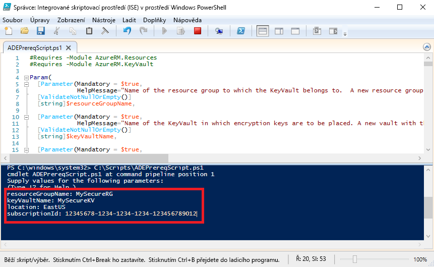

# <a name="quickstart-encrypt-a-windows-iaas-vm-with-azure-powershell"></a>Rychlý start: Šifrování virtuálního počítače IaaS s Windows pomocí Azure PowerShellu

Azure Disk Encryption pomáhá šifrovat disky virtuálních počítačů IaaS s Windows a Linuxem. Toto řešení je integrované do služby Azure Key Vault a pomáhá řídit a spravovat klíče a tajné klíče pro šifrování disků. Pomocí služby Azure Disk Encryption můžete zajistit zabezpečení neaktivních virtuálních počítačů s využitím standardní šifrovací technologie. V tomto rychlém startu vytvoříte virtuální počítač s Windows Serverem 2016 a zašifrujete disk s operačním systémem. 

Pokud ještě nemáte předplatné Azure, vytvořte si [bezplatný účet](https://azure.microsoft.com/free/?WT.mc_id=A261C142F) před tím, než začnete.

## <a name="prerequisites"></a>Požadavky

- Integrované skriptovací prostředí (ISE) v prostředí Windows PowerShell
- Nainstalujte nebo proveďte aktualizaci na [nejnovější verzi Azure PowerShellu](/powershell/azure/install-azurerm-ps).
    - Verze modulu AzureRM musí být 6.0.0 nebo novější. `Get-Module AzureRM -ListAvailable | Select-Object -Property Name,Version,Path`
- Kopie [skriptu pro požadované součásti služby Azure Disk Encryption](https://raw.githubusercontent.com/Azure/azure-powershell/master/src/ResourceManager/Compute/Commands.Compute/Extension/AzureDiskEncryption/Scripts/AzureDiskEncryptionPreRequisiteSetup.ps1).
    - Pokud tento skript již máte, stáhněte si novou kopii, protože nedávno došlo k jeho změně. 
    - Pomocí **CTRL-A** vyberte všechen text a pak ho pomocí **CTRL-C** zkopírujte do Poznámkového bloku.
    - Uložte soubor jako **ADEPrereqScript.ps1**.


## <a name="sign-in-to-azure"></a>Přihlášení k Azure

1. Klikněte pravým tlačítkem na **Integrované skriptovací prostředí (ISE) v prostředí Windows PowerShell** a klikněte na **Spustit jako správce**.
1. V okně **Správce: Integrované skriptovací prostředí (ISE) v prostředí Windows PowerShell** klikněte na **Zobrazit** a potom klikněte na **Zobrazit podokno skriptu**.
1. V podokně skriptu zadejte následující rutinu: 

     ```azurepowershell
      Connect-AzureRMAccount
     ```

1. Klikněte na zelenou šipku u **Spustit skript** nebo použijte F5. 
2. Pomocí interaktivního přihlášení dokončete připojení ke svému účtu Azure.
3. Zkopírujte své **ID předplatného**, které se vrátí a které použijete při spuštění dalšího skriptu PowerShellu. 

## <a name="bkmk_PrereqScript"></a>Spuštění skriptu pro požadované součásti služby Azure Disk Encryption
 Skript **ADEPrereqScript.ps1** vytvoří skupinu prostředků a trezor klíčů a nastaví zásady přístupu k trezoru klíčů. Tento skript také pro trezor klíčů vytvoří zámek prostředku, který ho pomůže chránit před nechtěným odstraněním.  

1. V okně **Správce: Integrované skriptovací prostředí (ISE) v prostředí Windows PowerShell** klikněte na **Soubor** a pak klikněte na **Otevřít**. Přejděte k souboru **ADEPrereqScript.ps1** a dvakrát na něj klikněte. Skript se otevře v podokně skriptu.
2. Kliknutím na zelenou šipku u **Spustit skript** nebo pomocí F5 spusťte skript. 
3. Zadejte názvy nové **skupiny prostředků** a nového **trezoru klíčů**. Pro účely tohoto rychlého startu nepoužívejte existující skupinu prostředků ani trezor klíčů, protože později skupinu prostředků odstraníme. 
4. Zadejte umístění, ve kterém chcete prostředky vytvořit, například **EastUS**. Seznam umístění získáte pomocí rutiny `Get-AzureRMLocation`.
5. Vložte své zkopírované **ID předplatného**. Své ID předplatného můžete získat pomocí rutiny `Get-AzureRMSubscription`.  
6. Klikněte na zelenou šipku u **Spustit skript**. 
7. Zkopírujte si vrácené hodnoty **DiskEncryptionKeyVaultUrl** a **DiskEncryptionKeyVaultId**, které použijete později.




## <a name="create-a-virtual-machine"></a>Vytvoření virtuálního počítače 
Teď je potřeba vytvořit virtuální počítač, abyste mohli zašifrovat jeho disk. Skript, který použijete, vytvoří virtuální počítač s Windows Serverem 2016 s 8 GB paměti RAM a 30GB diskem s operačním systémem. 

1. Zkopírujte skript do podokna skriptu **Správce: Integrované skriptovací prostředí (ISE) v prostředí Windows PowerShell** a změňte první tři proměnné. Skupina prostředků a umístění se musí shodovat s těmi, které jste použili pro [skript pro požadované součásti](#bkmk_PrereqScript).  

   ```azurepowershell
    # Variables for common values
    $resourceGroup = "MySecureRG"
    $location = "EastUS"
    $vmName = "MySecureVM"
    
    # Create user object
    $cred = Get-Credential -Message "Enter a username and password for the virtual machine."
    
    # Create a resource group
    #New-AzureRmResourceGroup -Name $resourceGroup -Location $location
    
    # Create a subnet configuration
    $subnetConfig = New-AzureRmVirtualNetworkSubnetConfig -Name mySubnet -AddressPrefix 192.168.1.0/24
    
    # Create a virtual network
    $vnet = New-AzureRmVirtualNetwork -ResourceGroupName $resourceGroup -Location $location `
      -Name MYvNET -AddressPrefix 192.168.0.0/16 -Subnet $subnetConfig
    
    # Create a public IP address and specify a DNS name
    $pip = New-AzureRmPublicIpAddress -ResourceGroupName $resourceGroup -Location $location `
      -Name "mypublicdns$(Get-Random)" -AllocationMethod Static -IdleTimeoutInMinutes 4
    
    # Create an inbound network security group rule for port 3389
    $nsgRuleRDP = New-AzureRmNetworkSecurityRuleConfig -Name myNetworkSecurityGroupRuleRDP  -Protocol Tcp `
      -Direction Inbound -Priority 1000 -SourceAddressPrefix * -SourcePortRange * -DestinationAddressPrefix * `
      -DestinationPortRange 3389 -Access Allow
    
    # Create a network security group
    $nsg = New-AzureRmNetworkSecurityGroup -ResourceGroupName $resourceGroup -Location $location `
      -Name myNetworkSecurityGroup -SecurityRules $nsgRuleRDP
    
    # Create a virtual network card and associate with public IP address and NSG
    $nic = New-AzureRmNetworkInterface -Name myNic -ResourceGroupName $resourceGroup -Location $location `
      -SubnetId $vnet.Subnets[0].Id -PublicIpAddressId $pip.Id -NetworkSecurityGroupId $nsg.Id
    
    # Create a virtual machine configuration
    $vmConfig = New-AzureRmVMConfig -VMName $vmName -VMSize Standard_D2_v3 | `
    Set-AzureRmVMOperatingSystem -Windows -ComputerName $vmName -Credential $cred | `
    Set-AzureRmVMSourceImage -PublisherName MicrosoftWindowsServer -Offer WindowsServer -Skus 2016-Datacenter-smalldisk -Version latest | `
    Add-AzureRmVMNetworkInterface -Id $nic.Id
    
    # Create a virtual machine
    New-AzureRmVM -ResourceGroupName $resourceGroup -Location $location -VM $vmConfig
   ```

2. Kliknutím na zelenou šipku u **Spustit skript** sestavte virtuální počítač.  


## <a name="encrypt-the-disk-of-the-vm"></a>Šifrování disku virtuálního počítače
Teď, když jste vytvořili a nakonfigurovali trezor klíčů a virtuální počítač, můžete zašifrovat jeho disk pomocí rutiny **Set-AzureRmVmDiskEncryptionExtension**. 
 
1. Spuštěním následující rutiny zašifrujte disk virtuálního počítače:

    ```azurepowershell
     Set-AzureRmVmDiskEncryptionExtension -ResourceGroupName "MySecureRG" -VMName "MySecureVM" `
     -DiskEncryptionKeyVaultId "<Returned by the prerequisites script>" -DiskEncryptionKeyVaultUrl "<Returned by the prerequisites script>"
     ```


1. Po dokončení šifrování můžete zašifrování disku ověřit pomocí následující rutiny: 

     ```azurepowershell
     Get-AzureRmVmDiskEncryptionStatus -ResourceGroupName "MySecureRG" -VMName "MySecureVM"
     ```
    
    
## <a name="clean-up-resources"></a>Vyčištění prostředků
 Skript **ADEPrereqScript.ps1** vytvoří pro trezor klíčů zámek prostředku. Pokud chcete vyčistit prostředky z tohoto rychlého startu, musíte nejprve odebrat zámek prostředku a pak odstranit skupinu prostředků. 

1. Odeberte zámek prostředku z trezoru klíčů.

     ```azurepowershell
     $LockId =(Get-AzureRMResourceLock -ResourceGroupName "MySecureRG" -ResourceName "MySecureVault" -ResourceType "Microsoft.KeyVault/vaults").LockID 
     Remove-AzureRmResourceLock -LockID $LockId
      ```
    
2. Odeberte skupinu prostředků. Tím se odstraní také všechny prostředky v této skupině. 
     ```azurepowershell
      Remove-AzureRmResourceGroup -Name "MySecureRG"
      ```

## <a name="next-steps"></a>Další kroky
V dalším článku najdete další informace o požadavcích na službu Azure Disk Encryption pro virtuální počítače IaaS.

> [!div class="nextstepaction"]
> [Požadavky na službu Azure Disk Encryption](azure-security-disk-encryption-prerequisites.md)