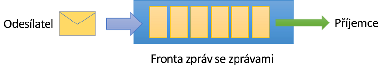
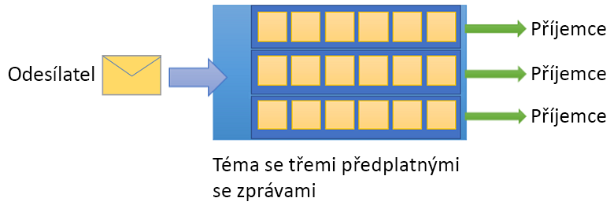

# Co je Azure Service Bus?

Microsoft Azure Service Bus je plně spravovaný zprostředkovatel zpráv podnikové integrace. Service Bus se nejčastěji používá k vzájemnému oddělení aplikací a služeb a je spolehlivou a bezpečnou platformou pro přenos asynchronních dat a stavu. Data se mezi různými aplikacemi a službami přenáší pomocí *zpráv*. Zpráva je v binárním formátu, který může zahrnovat JSON, XML nebo jen text. 

Mezi běžné scénáře zasílání zpráv patří:

* Zasílání zpráv: umožňuje přenášení podnikových dat, jako jsou například prodeje nebo nákupní objednávky, deníky nebo přesuny zásob.
* Oddělení aplikací: vylepšuje spolehlivost a škálovatelnost aplikací a služeb (klient a služba nemusí být online ve stejnou dobu).
* Témata a předplatná: povoluje vztahy 1:*n* mezi vydavateli a odběrateli.
* Relace zpráv: implementuje pracovní postupy, které vyžadují řazení zpráv nebo odložení zpráv.

## Obory názvů

Obor názvů je kontejner oboru pro všechny součásti zasílání zpráv. Součástí jednoho oboru názvů může být několik front a témat, přičemž obory názvů často slouží jako kontejnery aplikací.

## Fronty

Zprávy se odesílají do *front* a přijímají se z nich. Fronty umožňují uložit zprávy, dokud není přijímající aplikace dostupná pro jejich příjem a zpracování.

Zprávy se ve frontách řadí a označují časovým razítkem při doručení. Jakmile je zpráva přijata, uchovává se bezpečně v redundantním úložišti. Zprávy se doručují v režimu *nabízení*, který doručuje zprávy na vyžádání.

## Témata

K odesílání a přijímání zpráv můžete také použít *témata*. Zatímco fronta se často používá pro komunikaci point-to-point, témata jsou užitečná ve scénářích publikování nebo přihlášení k odběru.

Témata mohou mít několik nezávislých odběrů. Odběratel tématu může přijímat kopie všech zpráv zaslaných do daného tématu. Odběry jsou pojmenované entity, které jsou vytvořené jako trvalé, ale jejich platnost může vypršet nebo se mohou automaticky odstranit.

V některých scénářích nemusíte chtít, aby jednotlivé odběry přijímaly všechny zprávy odeslané do tématu. Pokud tomu tak je, můžete použít [pravidla a filtry](topic-filters.md) a definovat podmínky, které vyvolají volitelné [akce](topic-filters.md#actions), filtrují zadané zprávy a nastavují nebo upravují vlastnosti zpráv.

## Pokročilé funkce

Service Bus má také pokročilé funkce, které vám umožní řešit složitější problémy týkající se zasílání zpráv. Následující části popisují tyto klíčové funkce:

### Relace zpráv

Pokud chcete ve službě Service Bus zajistit použití metody FIFO (first in first out), použijte relace. [Relace zpráv](message-sessions.md) umožňují společné a seřazené zpracování sekvencí souvisejících zpráv bez vazby. 

### Automatické přeposílání

Funkce [automatického přeposílání](service-bus-auto-forwarding.md) umožňuje zřetězit frontu nebo odběr do jiné fronty nebo tématu, které jsou součástí stejného oboru názvů. Pokud je automatické přeposílání povoleno, Service Bus automaticky odebere zprávy, které jsou umístěné v první frontě nebo odběru (zdroj) a vloží je do druhé fronty nebo tématu (cíl).

### Ukládání nedoručených zpráv

Service Bus podporuje [frontu nedoručených zpráv](service-bus-dead-letter-queues.md) (DLQ) k ukládání zpráv, které nemohou být doručeny jakémukoli příjemci, nebo zpráv, které nejdou zpracovat. Zprávy pak můžete z DLQ odebrat a prozkoumat je.

### Naplánované doručení

Zprávy můžete odeslat do fronty nebo tématu [pro zpožděné zpracování](message-sequencing.md#scheduled-messages). Můžete třeba naplánovat úlohu, která bude systému pro zpracování dostupná v konkrétní čas.

### Odložení zpráv

Pokud klient fronty nebo odběru přijme zprávu, kterou je ochoten zpracovat, ale jejíž zpracování momentálně není možné z důvodu zvláštních okolností v aplikaci, má entita možnost [odložit načtení zprávy](message-deferral.md) na pozdější čas. Zpráva zůstane ve frontě nebo odběru, ale odloží se bokem.

### Dávkování

[Dávkování na straně klienta](service-bus-performance-improvements.md#client-side-batching) umožňuje, aby klient fronty nebo tématu zpozdil odeslání zprávy po určené časové období. Pokud během tohoto časového období klient odešle další zprávy, přenese zprávy v jedné dávce. 

### Transakce

Skupiny [transakcí](service-bus-transactions.md) seskupují dvě nebo více operací do rozsahu provádění. Service Bus podporuje operace seskupení u jedné entity zasílání zpráv (fronty, tématu, odběru) v rámci oboru transakce.

### Filtrování a akce

Odběratelé mohou definovat zprávy, které chtějí z tématu přijímat. Tyto zprávy se určují ve formě jednoho nebo více [pojmenovaných pravidel odběru](topic-filters.md). Pro každou odpovídající podmínku pravidla odběr vytvoří kopii zprávy, která může pro každé odpovídající pravidlo obsahovat jiné poznámky.

### Automatické odstranění v případě nečinnosti

[Automatické odstranění v případě nečinnosti](/dotnet/api/microsoft.servicebus.messaging.queuedescription.autodeleteonidle) umožňuje zadat interval nečinnosti, po jehož uplynutí se fronta automaticky odstraní. Minimální doba trvání je 5 minut.

### Vyhledávání duplicit

Pokud dojde k chybě, která způsobí, že klient pochybuje o výsledku operace odeslání, [vyhledávání duplicit](duplicate-detection.md) odstraní nejistotu v těchto situacích tak, že odesílateli umožní odeslat stejnou zprávu a frontě nebo tématu umožní zahodit jakékoli duplicitní kopie.

### SAS, RBAC a MSI

Service Bus podporuje protokoly zabezpečení, jako jsou [podpisy sdíleného přístupu](service-bus-sas.md) (SAS), [řízení přístupu na základě role](service-bus-role-based-access-control.md) (RBAC) a [identita spravované služby](service-bus-managed-service-identity.md) (MSI).

### Geografické zotavení po havárii

Pokud v oblastech nebo datových centrech Azure dojde k výpadku, [geografické zotavení po havárii](service-bus-geo-dr.md) umožní, aby zpracování dat pokračovalo v jiné oblasti nebo datovém centru.

### Zabezpečení

Service Bus podporuje standardní protokoly [AMQP 1.0](service-bus-amqp-overview.md) a [HTTP/REST](/rest/api/servicebus/).

## Klientské knihovny

Service Bus podporuje klientské knihovny pro [.NET](https://github.com/Azure/azure-service-bus-dotnet/tree/master), [Javu](https://github.com/Azure/azure-service-bus-java/tree/master), [JMS](https://github.com/Azure/azure-service-bus/tree/master/samples/Java/qpid-jms-client).

## Integrace

Service Bus umožňuje úplnou integraci s následujícími službami Azure:

- [Event Grid](https://azure.microsoft.com/services/event-grid/) 
- [Logic Apps](https://azure.microsoft.com/services/logic-apps/) 
- [Functions](https://azure.microsoft.com/services/functions/) 
- [Dynamics 365](https://dynamics.microsoft.com)
- [Stream Analytics](https://azure.microsoft.com/services/stream-analytics/)
 
## Další kroky

Pokud chcete začít používat zasílání zpráv služby Service Bus, podívejte se na následující články:

* [Porovnání služeb Azure pro zasílání zpráv](../event-grid/compare-messaging-services.md?toc=%2fazure%2fservice-bus-messaging%2ftoc.json&bc=%2fazure%2fservice-bus-messaging%2fbreadcrumb%2ftoc.json)
* Přečtěte si další informace o úrovních [Standard a Premium](https://azure.microsoft.com/pricing/details/service-bus/) služby Azure Service Bus a jejich cenách.
* [Výkon a latence úrovně Premium služby Azure Service Bus](https://blogs.msdn.microsoft.com/servicebus/2016/07/18/premium-messaging-how-fast-is-it/)
* Vyzkoušejte rychlé starty v [.NET](service-bus-quickstart-powershell.md), [Javě](service-bus-quickstart-powershell.md) nebo [JMS](service-bus-quickstart-powershell.md).
