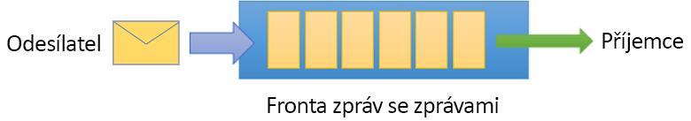
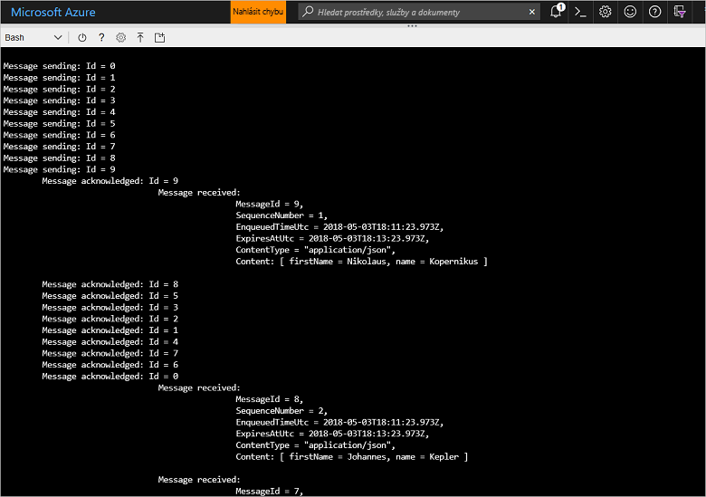

# <a name="quickstart-send-and-receive-messages-using-azure-cli-and-java"></a>Rychlý start: Odesílání a přijímání zpráv pomocí Azure CLI a Javy

Microsoft Azure Service Bus je podniková integrace zprostředkovatele zpráv, která zajišťuje zabezpečené zasílání a přijímání zpráv a spolehlivost. Typický scénář služby Service Bus obvykle zahrnuje vzájemné oddělení dvou nebo více aplikací, služeb či procesů (aplikace nemusí být online ve stejnou dobu), převedení stavu nebo změny dat a zasílání zpráv mezi aplikacemi. 

Maloobchod může například odeslat data o prodeji administrativní podpoře (back office) nebo oblastnímu distribučním centru, aby došlo k doplnění a aktualizaci zásob. V tomto případě klientská aplikace odesílá zprávy do fronty služby Service Bus a přijímá je z ní:



Tento rychlý start popisuje, jak odesílat a přijímat zprávy Service Bus pomocí Azure CLI a knihovny Java Service Bus. Pokud vás zajímají techničtější podrobnosti, můžete si [přečíst vysvětlení](#understand-the-sample-code) klíčových prvků vzorového kódu.

Pokud ještě nemáte předplatné Azure, můžete si vytvořit [bezplatný účet][] před tím, než začnete.

[!INCLUDE [cloud-shell-try-it.md](../../includes/cloud-shell-try-it.md)]

## <a name="log-in-to-azure"></a>Přihlášení k Azure

Klikněte na tlačítko Cloud Shell v nabídce v pravém horním rohu webu Azure Portal a z rozevíracího seznamu **Vybrat prostředí** vyberte **Bash**. 

## <a name="use-cli-to-create-resources"></a>Použití CLI k vytvoření prostředků

Ve službě Cloud Shell zřiďte v příkazovém řádku Bash pomocí následujících příkazů prostředky služby Service Bus. Nezapomeňte všechny zástupné symboly nahradit příslušnými hodnotami:

```azurecli-interactive
# Create a resource group
az group create --name myResourceGroup --location eastus

# Create a Service Bus messaging namespace with a unique name
namespaceName=myNameSpace$RANDOM
az servicebus namespace create \
   --resource-group myResourceGroup \
   --name $namespaceName \
   --location eastus

# Create a Service Bus queue
az servicebus queue create --resource-group myResourceGroup \
   --namespace-name $namespaceName \
   --name myQueue

# Get the connection string for the namespace
connectionString=$(az servicebus namespace authorization-rule keys list \
   --resource-group myResourceGroup \
   --namespace-name  $namespaceName \
   --name RootManageSharedAccessKey \
   --query primaryConnectionString --output tsv)
```

Po dokončení všech příkazů zkopírujte vybraný připojovací řetězec a název fronty a vložte je do dočasného umístění, třeba do Poznámkového bloku. Budete je potřebovat v dalším kroku.

## <a name="send-and-receive-messages"></a>Odesílání a příjem zpráv

Když vytvoříte obor názvů a frontu a máte potřebná pověření, jste připraveni odesílat a přijímat zprávy. Kód můžete zkontrolovat v [této složce s ukázkami na GitHubu](https://github.com/Azure/azure-service-bus/tree/master/samples/Java/quickstarts-and-tutorials/quickstart-java/src/main/java/samples/quickstart/SendAndReceiveMessages.java).

1. Přesvědčte se, že je služba Cloud Shell spuštěná a zobrazuje příkazový řádek Bash.

2. Pomocí následujícího příkazu naklonujte [úložiště Service Bus na GitHubu](https://github.com/Azure/azure-service-bus/):

   ```bash
   git clone https://github.com/Azure/azure-service-bus.git
   ```

2. Změňte svůj aktuální adresář na složku s ukázkou použitím lomítek jako oddělovačů cest:

   ```bash
   cd azure-service-bus/samples/Java/quickstarts-and-tutorials/quickstart-java 
   ```

3. Proveďte následující příkaz, kterým vytvoříte aplikaci:
   
   ```bash
   mvn clean package -DskipTests
   ```

4. Program spustíte následujícím příkazem. Pokud jste nerestartovali prostředí Bash, tak se proměnná s připojovacím řetězcem automaticky nahradí:

   ```bash
   java -jar ./target/samples.quickstart-1.0.0-jar-with-dependencies.jar -c $connectionString -q myQueue
   ```

6. Sledujte, jak se do fronty odešle 10 zpráv. Řazení zpráv není zaručené, ale můžete si všimnout, že se zprávy společně s daty datových částí odešlou, potvrdí a přijmou:

   

## <a name="clean-up-resources"></a>Vyčištění prostředků

Spuštěním následujícího příkazu odeberte skupinu prostředků, obor názvů a všechny související prostředky:

```azurecli-interactive
az group delete --resource-group myResourceGroup
```

## <a name="understand-the-sample-code"></a>Vysvětlení vzorového kódu

Tato část obsahuje další podrobnosti o klíčových částech vzorového kódu. Kód si můžete prohlédnout [zde](https://github.com/Azure/azure-service-bus/blob/master/samples/Java/quickstarts-and-tutorials/quickstart-java/src/main/java/samples/quickstart/SendAndReceiveMessages.java) na úložišti GitHub.

### <a name="get-connection-string-and-queue"></a>Získání připojovacího řetězce a fronty

Nejprve kód deklaruje dvě proměnné řetězce, které se předají programu jako argumenty v příkazovém řádku:

```java
String ConnectionString = null;
String QueueName = null;
```

Tyto hodnoty se přidávají prostřednictvím parametrů a přidělují se v metodě `runApp()`:

```java
public static void main(String[] args) {
    SendAndReceiveMessages app = new SendAndReceiveMessages();
    try {
        app.runApp(args);
        app.run();
    } catch (Exception e) {
        System.out.printf("%s", e.toString());
    }
    System.exit(0);
}

public void runApp(String[] args) {
    try {
        // parse connection string from command line             
        Options options = new Options();
        options.addOption(new Option("c", true, "Connection string"));
        options.addOption(new Option("q", true, "Queue Name"));
        CommandLineParser clp = new DefaultParser();
        CommandLine cl = clp.parse(options, args);
        if (cl.getOptionValue("c") != null && cl.getOptionValue("q") != null) {
            ConnectionString = cl.getOptionValue("c");
            QueueName =  cl.getOptionValue("q");
        }
        else
        {
            HelpFormatter formatter = new HelpFormatter();
            formatter.printHelp("run jar with", "", options, "", true);
        }

    } catch (Exception e) {
        System.out.printf("%s", e.toString());
    }
}
```

### <a name="create-queue-clients-to-send-and-receive"></a>Vytvoření klientů fronty k odesílání a přijímání zpráv

Abyste mohli odesílat a přijímat zprávy, metoda `run()` vytvoří instance klienta fronty, které se skládají z připojovacího řetězce a názvu fronty. Tento kód vytvoří dva klienty fronty – jednoho pro odesílání a jednoho pro přijímání zpráv:

```java
public void run() throws Exception {
// Create a QueueClient instance for receiving using the connection string builder
// We set the receive mode to "PeekLock", meaning the message is delivered
// under a lock and must be acknowledged ("completed") to be removed from the queue
QueueClient receiveClient = new QueueClient(new ConnectionStringBuilder(ConnectionString, QueueName), ReceiveMode.PEEKLOCK);
this.registerReceiver(receiveClient);

// Create a QueueClient instance for sending and then asynchronously send messages.
QueueClient sendClient = new QueueClient(new ConnectionStringBuilder(ConnectionString, QueueName), ReceiveMode.PEEKLOCK);
```

Metoda `run()` také spustí operaci asynchronního odesílání zpráv a jakmile tuto operaci dokončí, odesílatele zavře:

```java
this.sendMessagesAsync(sendClient).thenRunAsync(() -> sendClient.closeAsync());
``` 

### <a name="construct-and-send-messages"></a>Vytvoření a odeslání zpráv

Metoda `sendMessagesAsync()` vytvoří sadu deseti zpráv a pomocí klienta fronty je asynchronně odešle:

```java
CompletableFuture<Void> sendMessagesAsync(QueueClient sendClient) {
List<HashMap<String, String>> data =
        GSON.fromJson(
                "[" +
                        "{'name' = 'Einstein', 'firstName' = 'Albert'}," +
                        "{'name' = 'Heisenberg', 'firstName' = 'Werner'}," +
                        "{'name' = 'Curie', 'firstName' = 'Marie'}," +
                        "{'name' = 'Hawking', 'firstName' = 'Steven'}," +
                        "{'name' = 'Newton', 'firstName' = 'Isaac'}," +
                        "{'name' = 'Bohr', 'firstName' = 'Niels'}," +
                        "{'name' = 'Faraday', 'firstName' = 'Michael'}," +
                        "{'name' = 'Galilei', 'firstName' = 'Galileo'}," +
                        "{'name' = 'Kepler', 'firstName' = 'Johannes'}," +
                        "{'name' = 'Kopernikus', 'firstName' = 'Nikolaus'}" +
                        "]",
                new TypeToken<List<HashMap<String, String>>>() {}.getType());

List<CompletableFuture> tasks = new ArrayList<>();
for (int i = 0; i < data.size(); i++) {
    final String messageId = Integer.toString(i);
    Message message = new Message(GSON.toJson(data.get(i), Map.class).getBytes(UTF_8));
    message.setContentType("application/json");
    message.setLabel("Scientist");
    message.setMessageId(messageId);
    message.setTimeToLive(Duration.ofMinutes(2));
    System.out.printf("\nMessage sending: Id = %s", message.getMessageId());
    tasks.add(
            sendClient.sendAsync(message).thenRunAsync(() -> {
                System.out.printf("\n\tMessage acknowledged: Id = %s", message.getMessageId());
            }));
}
return CompletableFuture.allOf(tasks.toArray(new CompletableFuture<?>[tasks.size()]));
```

### <a name="receive-messages"></a>Příjem zpráv

Metoda `registerReceiver()` zaregistruje zpětné volání `RegisterMessageHandler` a zároveň nastaví některé možnosti popisovače zpráv:

```java
void registerReceiver(QueueClient queueClient) throws Exception {
    // register the RegisterMessageHandler callback
    queueClient.registerMessageHandler(new IMessageHandler() {
                           // callback invoked when the message handler loop has obtained a message
                           public CompletableFuture<Void> onMessageAsync(IMessage message) {
                               // receives message is passed to callback
                               if (message.getLabel() != null &&
                                       message.getContentType() != null &&
                                       message.getLabel().contentEquals("Scientist") &&
                                       message.getContentType().contentEquals("application/json")) {
                                    byte[] body = message.getBody();
                                   Map scientist = GSON.fromJson(new String(body, UTF_8), Map.class);

                                   System.out.printf(
                                           "\n\t\t\t\tMessage received: \n\t\t\t\t\t\tMessageId = %s, \n\t\t\t\t\t\tSequenceNumber = %s, \n\t\t\t\t\t\tEnqueuedTimeUtc = %s," +
                                                   "\n\t\t\t\t\t\tExpiresAtUtc = %s, \n\t\t\t\t\t\tContentType = \"%s\",  \n\t\t\t\t\t\tContent: [ firstName = %s, name = %s ]\n",
                                           message.getMessageId(),
                                           message.getSequenceNumber(),
                                           message.getEnqueuedTimeUtc(),
                                           message.getExpiresAtUtc(),
                                           message.getContentType(),
                                           scientist != null ? scientist.get("firstName") : "",
                                           scientist != null ? scientist.get("name") : "");
                               }
                               return CompletableFuture.completedFuture(null);
                           }

                           // callback invoked when the message handler has an exception to report
                           public void notifyException(Throwable throwable, ExceptionPhase exceptionPhase) {
                               System.out.printf(exceptionPhase + "-" + throwable.getMessage());
                           }
                       },
    // 1 concurrent call, messages are auto-completed, auto-renew duration
    new MessageHandlerOptions(1, true, Duration.ofMinutes(1)));

}
```

## <a name="next-steps"></a>Další kroky

V tomto článku jste vytvořil obor názvů služby Service Bus a další prostředky potřebné k odesílání a přijímání zpráv z fronty. Další informace o psaní kódu souvisejícího s odesíláním a přijímáním zpráv získáte, když budete pokračovat následujícím kurzem služby Service Bus:

> [!div class="nextstepaction"]
> [Aktualizace zásob pomocí Azure CLI a Javy](./service-bus-tutorial-topics-subscriptions-cli.md)

[bezplatný účet]: https://azure.microsoft.com/free/?ref=microsoft.com&utm_source=microsoft.com&utm_medium=docs&utm_campaign=visualstudio
[fully qualified domain name]: https://wikipedia.org/wiki/Fully_qualified_domain_name
[Install Azure CLI 2.0]: /cli/azure/install-azure-cli
[az group create]: /cli/azure/group#az_group_create