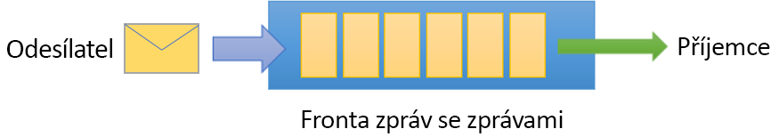
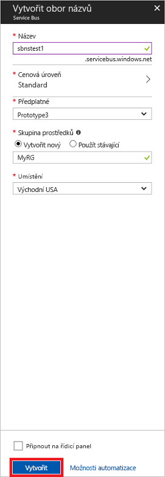

# <a name="quickstart-send-and-receive-messages-using-the-azure-portal-and-net"></a>Rychlý start: Odesílání a přijímání zpráv pomocí webu Azure Portal a architektury .NET

Microsoft Azure Service Bus je podniková integrace zprostředkovatele zpráv, která zajišťuje zabezpečené odesílání a přijímání zpráv a absolutní spolehlivost. Typický scénář služby Service Bus obvykle zahrnuje vzájemné oddělení dvou nebo více aplikací, služeb nebo procesů a převedení stavu nebo změny dat. Mezi takové scénáře může patřit plánování několika dávkových úloh v jiné aplikaci nebo službě či spuštění vyřizování objednávek. Maloobchod může například odeslat data o prodeji administrativní podpoře (back office) nebo oblastnímu distribučním centru, aby došlo k doplnění a aktualizaci zásob. V tomto scénáři klientská aplikace odesílá zprávy do fronty služby Service Bus a přijímá je z ní.  



Tento rychlý start popisuje, jak odesílat zprávy do fronty Service Bus a přijímat je. Používá se k tomu web [Azure Portal][Azure portal], kde se vytvoří obor názvů pro odesílání zpráv a v tomto oboru názvů fronta. Dále je třeba získat v oboru názvů přihlašovací údaje pro autorizaci. Postup pak ukazuje, jak do této fronty odesílat zprávy a přijímat je z ní pomocí [knihovny .NET Standard](https://www.nuget.org/packages/Microsoft.Azure.ServiceBus).

Pokud ještě nemáte předplatné Azure, můžete si vytvořit [bezplatný účet][] před tím, než začnete.

## <a name="prerequisites"></a>Požadavky

Před tímto kurzem se ujistěte, že máte nainstalované tyto položky:

- [Visual Studio 2017 s aktualizací Update 3 (verze 15.3, 26730.01)](https://www.visualstudio.com/vs) nebo novější.
- [NET Core SDK](https://www.microsoft.com/net/download/windows) verze 2.0 nebo novější.

## <a name="log-on-to-the-azure-portal"></a>Přihlášení k webu Azure Portal

Začněte tak, že přejdete na [portál Azure Portal][Azure portal] a přihlásíte se pomocí svého předplatného Azure. Prvním krokem je vytvoření oboru názvů služby Service Bus typu **zasílání zpráv**.

## <a name="create-a-service-bus-namespace"></a>Vytvoření oboru názvů Service Bus

Obor názvů Service Bus pro zasílání zpráv poskytuje jedinečný kontejner oboru (odkazuje se na něj [plně kvalifikovaným názvem domény][]), ve kterém můžete vytvořit jednu nebo více front, témat a odběrů. V následujícím příkladu vytvoříme obor názvů Service Bus pro zasílání zpráv v nové nebo existující [skupině prostředků](/azure/azure-resource-manager/resource-group-portal):

1. V levém navigačním podokně portálu klikněte na **+ Vytvořit prostředek**, potom klikněte na **Podniková integrace** a pak na **Service Bus**.
2. V dialogovém okně **Vytvořit obor názvů** zadejte název oboru názvů. Systém okamžitě kontroluje, jestli je název dostupný.
3. Po kontrole, že je název oborů názvů k dispozici, zvolte cenovou úroveň (Standard nebo Premium).
4. V poli **Předplatné** zvolte předplatné Azure, ve které chcete vytvořit obor názvů.
5. V poli **Skupina prostředků** zvolte existující skupinu prostředků, ve které bude obor názvů fungovat, nebo vytvořte novou.      
6. V poli **Umístění**, vyberte zemi nebo oblast, ve které by měl být oboru názvů hostován.
7. Klikněte na možnost **Vytvořit**. Systém teď vytvoří obor názvů a povolí ho. Pravděpodobně budete muset několik minut počkat, než systém zřídí prostředky pro váš účet.



### <a name="obtain-the-management-credentials"></a>Získání přihlašovacích údajů pro správu

Vytvořením nového oboru názvů se automaticky vygeneruje počáteční pravidlo sdíleného přístupového podpisu (SAS) s přidruženým párem primárního a sekundárního klíče, které udělují úplnou kontrolu nad všemi aspekty tohoto oboru názvů. Pokud chcete zkopírovat počáteční pravidlo, postupujte následovně: 

1.  Klikněte na **Všechny prostředky** a pak klikněte na název nově vytvořeného oboru názvů.
2. V okně oboru názvů klikněte na **Zásady sdíleného přístupu**.
3. Na obrazovce **Zásady sdíleného přístupu** klikněte na **RootManageSharedAccessKey**.
4. V okně **Zásada: RootManageSharedAccessKey** klikněte na tlačítko **Kopírovat** vedle položky **Primární připojovací řetězec** a zkopírujte si připojovací řetězec do schránky pro pozdější použití. Vložte tuto hodnotu do Poznámkového bloku nebo jiného dočasného umístění. 

    ![connection-string][connection-string]
5. Opakujte předchozí krok, zkopírujte si hodnotu pro **primární klíč** a vložte ji do dočasného umístění pro pozdější použití.

## <a name="create-a-queue"></a>Vytvoření fronty

Pokud chcete vytvořit frontu Service Bus, zadejte obor názvů, do kterého má téma spadat. Následující příklad ukazuje, jak vytvořit frontu na webu Azure Portal:

1. V levém navigačním podokně portálu klikněte na **Service Bus** (pokud položku **Service Bus** nevidíte, klikněte na **Další služby**).
2. Klikněte na obor názvů, ve kterém chcete vytvořit frontu.
3. V okně oboru názvů klikněte na **Fronty** a pak v okně **Fronty** klikněte na **+ Fronta**.
4. Zadejte **Název** fronty a nechte ostatní hodnoty na jejich výchozích hodnotách.
5. V dolní části okna klikněte na **Vytvořit**.
6. Název fronty si poznamenejte.

## <a name="send-and-receive-messages"></a>Odesílání a příjem zpráv

Pokud jste zřídili obor názvů a frontu a máte potřebná pověření, můžete začít odesílat a přijímat zprávy. Kód si můžete zkontrolovat v [této složce s ukázkami na GitHubu](https://github.com/Azure/azure-service-bus/tree/master/samples/Java/quickstarts-and-tutorials/quickstart-jms).

Kód spustíte následovně:

1. Pomocí následujícího příkazu naklonujte [úložiště Service Bus na GitHubu](https://github.com/Azure/azure-service-bus/):

   ```shell
   git clone https://github.com/Azure/azure-service-bus.git
   ```

3. Přejděte do složky s ukázkou `azure-service-bus\samples\DotNet\GettingStarted\BasicSendReceiveQuickStart\BasicSendReceiveQuickStart`.

4. Zkopírujte připojovací řetězec a název fronty, které jste získali v části [Získání přihlašovacích údajů pro správu](#obtain-the-management-credentials).

5.  Do příkazového řádku zadejte následující příkaz:

   ```shell
   dotnet build
   ```

6.  Přejděte do složky `bin\Debug\netcoreapp2.0`.

7.  Zadáním následujícího příkazu spusťte program. Nezapomeňte `myConnectionString` nahradit hodnotou, kterou jste předtím získali, a `myQueueName` nahraďte názvem vytvořené fronty:

   ```shell
   dotnet BasicSendReceiveQuickStart.dll -ConnectionString "myConnectionString" -QueueName "myQueueName"
   ``` 

8. Sledujte, jak se do fronty odešle deset zpráv a jak se následně z fronty přijmou:

   

## <a name="clean-up-resources"></a>Vyčištění prostředků

K odebrání skupiny prostředků, oboru názvů a fronty můžete použít web Azure Portal.

## <a name="understand-the-sample-code"></a>Vysvětlení vzorového kódu

Tato část obsahuje další podrobnosti o chování ukázkového kódu. 

### <a name="get-connection-string-and-queue"></a>Získání připojovacího řetězce a fronty

Připojovací řetězec a název fronty se předají metodě `Main()` jako argumenty příkazového řádku. Metoda `Main()` deklaruje dvě proměnné řetězce, do kterých se tyto údaje načtou:

```csharp
static void Main(string[] args)
{
    string ServiceBusConnectionString = "";
    string QueueName = "";

    for (int i = 0; i < args.Length; i++)
    {
        var p = new Program();
        if (args[i] == "-ConnectionString")
        {
            Console.WriteLine($"ConnectionString: {args[i+1]}");
            ServiceBusConnectionString = args[i + 1]; 
        }
        else if(args[i] == "-QueueName")
        {
            Console.WriteLine($"QueueName: {args[i+1]}");
            QueueName = args[i + 1];
        }                
    }

    if (ServiceBusConnectionString != "" && QueueName != "")
        MainAsync(ServiceBusConnectionString, QueueName).GetAwaiter().GetResult();
    else
    {
        Console.WriteLine("Specify -Connectionstring and -QueueName to execute the example.");
        Console.ReadKey();
    }                            
}
```
 
Metoda `Main()` pak spustí asynchronní smyčku zpráv, `MainAsync()`.

### <a name="message-loop"></a>Smyčka zpráv

Metoda MainAsync() vytvoří klienta fronty s argumenty příkazového řádku, zavolá obslužnou rutinu pro příjem zpráv s názvem `RegisterOnMessageHandlerAndReceiveMessages()` a sadu zpráv odešle:

```csharp
static async Task MainAsync(string ServiceBusConnectionString, string QueueName)
{
    const int numberOfMessages = 10;
    queueClient = new QueueClient(ServiceBusConnectionString, QueueName);

    Console.WriteLine("======================================================");
    Console.WriteLine("Press any key to exit after receiving all the messages.");
    Console.WriteLine("======================================================");

    // Register QueueClient's MessageHandler and receive messages in a loop
    RegisterOnMessageHandlerAndReceiveMessages();

    // Send Messages
    await SendMessagesAsync(numberOfMessages);

    Console.ReadKey();

    await queueClient.CloseAsync();
}
```

Metoda `RegisterOnMessageHandlerAndReceiveMessages()` jednoduše nastaví některé možnosti obslužné rutiny zpráv a potom zavolá metodu `RegisterMessageHandler()` klienta fronty, která spustí příjem:

```csharp
static void RegisterOnMessageHandlerAndReceiveMessages()
{
    // Configure the MessageHandler Options in terms of exception handling, number of concurrent messages to deliver etc.
    var messageHandlerOptions = new MessageHandlerOptions(ExceptionReceivedHandler)
    {
        // Maximum number of Concurrent calls to the callback `ProcessMessagesAsync`, set to 1 for simplicity.
        // Set it according to how many messages the application wants to process in parallel.
        MaxConcurrentCalls = 1,

        // Indicates whether MessagePump should automatically complete the messages after returning from User Callback.
        // False below indicates the Complete will be handled by the User Callback as in `ProcessMessagesAsync` below.
        AutoComplete = false
    };

    // Register the function that will process messages
    queueClient.RegisterMessageHandler(ProcessMessagesAsync, messageHandlerOptions);
} 
```

### <a name="send-messages"></a>Odesílání zpráv

Operace vytvoření a odeslání zpráv probíhají v metodě `SendMessagesAsync()`:

```csharp
static async Task SendMessagesAsync(int numberOfMessagesToSend)
{
    try
    {
        for (var i = 0; i < numberOfMessagesToSend; i++)
        {
            // Create a new message to send to the queue
            string messageBody = $"Message {i}";
            var message = new Message(Encoding.UTF8.GetBytes(messageBody));

            // Write the body of the message to the console
            Console.WriteLine($"Sending message: {messageBody}");

            // Send the message to the queue
            await queueClient.SendAsync(message);
        }
    }
    catch (Exception exception)
    {
        Console.WriteLine($"{DateTime.Now} :: Exception: {exception.Message}");
    }
}
```

### <a name="process-messages"></a>Zpracování zpráv

Metoda `ProcessMessagesAsync()` rozpoznává, zpracovává a dokončuje příjem zpráv:

```csharp
static async Task ProcessMessagesAsync(Message message, CancellationToken token)
{
    // Process the message
    Console.WriteLine($"Received message: SequenceNumber:{message.SystemProperties.SequenceNumber} Body:{Encoding.UTF8.GetString(message.Body)}");

    // Complete the message so that it is not received again.
    await queueClient.CompleteAsync(message.SystemProperties.LockToken);
}
```

## <a name="next-steps"></a>Další kroky

V tomto článku jste vytvořil obor názvů služby Service Bus a další prostředky potřebné k odesílání a přijímání zpráv z fronty. Další informace o psaní kódu souvisejícího s odesíláním a přijímáním zpráv získáte, když budete pokračovat následujícím kurzem služby Service Bus:

> [!div class="nextstepaction"]
> [Aktualizace zásob pomocí webu Azure Portal](./service-bus-tutorial-topics-subscriptions-portal.md)


[bezplatný účet]: https://azure.microsoft.com/free/?ref=microsoft.com&utm_source=microsoft.com&utm_medium=docs&utm_campaign=visualstudio
[plně kvalifikovaným názvem domény]: https://wikipedia.org/wiki/Fully_qualified_domain_name
[Azure portal]: https://portal.azure.com/

[connection-string]: ./media/service-bus-quickstart-portal/connection-string.png
[service-bus-flow]: ./media/service-bus-quickstart-portal/service-bus-flow.png
