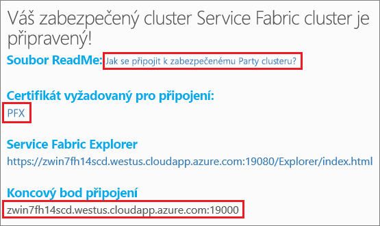

# <a name="quickstart-deploy-windows-containers-to-service-fabric"></a>Rychlý start: Nasazení kontejnerů Windows do Service Fabric

Azure Service Fabric je platforma distribuovaných systémů pro nasazování a správu škálovatelných a spolehlivých mikroslužeb a kontejnerů.

Spuštění existující aplikace v kontejneru Windows v clusteru Service Fabric nevyžaduje žádné změny aplikace. Tento rychlý start ukazuje, jak nasadit předem připravenou image kontejneru Dockeru v aplikaci Service Fabric. Až budete hotovi, budete mít funkční kontejner Windows Server 2016 Nano Serveru a služby IIS. Tento rychlý start popisuje nasazení kontejneru Windows. Pokud chcete nasadit kontejner Linuxu, přečtěte si [tento rychlý start](service-fabric-quickstart-containers-linux.md).

![Výchozí webová stránka služby IIS][iis-default]

V tomto rychlém startu se naučíte:

* Zabalení kontejneru image Dockeru
* Konfigurace komunikace
* Sestavení a zabalení aplikace Service Fabric
* Nasazení aplikace typu kontejner do Azure

## <a name="prerequisites"></a>Požadavky

* Předplatné Azure (můžete si vytvořit [bezplatný účet](https://azure.microsoft.com/free/?WT.mc_id=A261C142F)).
* Vývojový počítač s:
  * Visual Studio 2015 nebo Visual Studio 2017.
  * [Sada Service Fabric SDK a nástroje](service-fabric-get-started.md).

## <a name="package-a-docker-image-container-with-visual-studio"></a>Zabalení kontejneru image Dockeru pomocí sady Visual Studio

Sada Service Fabric SDK a nástroje poskytují šablonu služby, která vám pomůže s nasazením kontejneru do clusteru Service Fabric.

Spusťte sadu Visual Studio jako správce.  Vyberte **Soubor** > **Nový** > **Projekt**.

Vyberte **Aplikace Service Fabric**, pojmenujte ji MyFirstContainer a klikněte na **OK**.

Z šablon **Hostované kontejnery a aplikace** vyberte **Kontejner**.

Do pole **Název image** zadejte microsoft/iis:nanoserver, což je [základní image Windows Server Nano Serveru a služby IIS](https://hub.docker.com/r/microsoft/iis/).

Nakonfigurujte mapování portů kontejneru na porty hostitele tak, aby se příchozí požadavky na službu na portu 80 mapovaly na port 80 v kontejneru.  Nastavte **Port kontejneru** na 80 a **Port hostitele** také na 80.  

Pojmenujte službu MyContainerService a klikněte na **OK**.

![Dialogové okno Nová služba][new-service]

## <a name="specify-the-os-build-for-your-container-image"></a>Specifikace čísla sestavení operačního systému pro image kontejneru
Kontejnery sestavené s konkrétní verzí Windows Serveru nemusí fungovat na hostiteli s jinou verzí Windows Serveru. Například kontejnery sestavené s využitím Windows Serveru verze 1709 nefungují na hostitelích se systémem Windows Server 2016. Další informace najdete v článku o [kompatibilitě operačního systému kontejneru a operačního systému hostitele s Windows Serverem](service-fabric-get-started-containers.md#windows-server-container-os-and-host-os-compatibility). 

Verze 6.1 modulu runtime služby Service Fabric a novější umožňuje specifikovat více imagí operačního systému na kontejner a označit jednotlivé image verzí sestavení daného operačního systému, na který by se měly nasazovat. Tímto se zajistí, že aplikace poběží na více hostitelích s různými verzemi operačního systému Windows. Další informace najdete v článku o [zadání imagí kontejneru pro konkrétní sestavení operačního systému](service-fabric-get-started-containers.md#specify-os-build-specific-container-images). 

Společnost Microsoft publikuje různé image pro verze IIS sestavené na různých verzích Windows Serveru. Abyste měli jistotu, že služba Service Fabric nasadí kontejner kompatibilní s verzí Windows Serveru běžící v uzlech clusteru, ve kterých nasazuje vaši aplikaci, přidejte do souboru *ApplicationManifest.xml* následující řádky. Verze sestavení pro Windows Server 2016 je 14393 a verze sestavení pro Windows Server verze 1709 je 16299. 

```xml
    <ContainerHostPolicies CodePackageRef="Code"> 
      <ImageOverrides> 
        ...
          <Image Name="microsoft/iis:nanoserverDefault" /> 
          <Image Name= "microsoft/iis:nanoserver" Os="14393" /> 
          <Image Name="microsoft/iis:windowsservercore-1709" Os="16299" /> 
      </ImageOverrides> 
    </ContainerHostPolicies> 
```

Manifest služby dále specifikuje jenom jednu image na nanoserver, `microsoft/iis:nanoserver`. 

## <a name="create-a-cluster"></a>Vytvoření clusteru

Pokud chcete nasadit aplikaci do clusteru v Azure, můžete se připojit k Party Clusteru. Party clustery jsou bezplatné, časově omezené clustery Service Fabric hostované v Azure a provozované týmem Service Fabric, na kterých může kdokoli nasazovat aplikace a seznamovat se s platformou.  Cluster používá jediný certifikát podepsaný svým držitelem (self-signed certificate) pro zabezpečení mezi uzly i mezi klientem a uzlem. Party Clustery podporují kontejnery. Pokud se rozhodnete nastavit a používat vlastní cluster, musí tento cluster využívat skladovou položku, která podporuje kontejnery (například Windows Server 2016 Datacenter s kontejnery).

Přihlaste se a [připojte se ke clusteru Windows](http://aka.ms/tryservicefabric). Stáhněte si do počítače certifikát PFX kliknutím na odkaz **PFX**. Klikněte na odkaz **How to connect to a secure Party cluster?** (Jak se připojit k zabezpečenému Party Clusteru?) a zkopírujte heslo certifikátu. Certifikát, heslo certifikátu a hodnotu **Koncový bod připojení** použijete v následujících krocích.



> [!Note]
> Každou hodinu je k dispozici omezený počet Party Clusterů. Pokud se vám při pokusu o registraci Party Clusteru zobrazí chyba, můžete chvíli počkat a zkusit to znovu nebo můžete podle kroků v kurzu [Nasazení aplikace .NET](https://docs.microsoft.com/azure/service-fabric/service-fabric-tutorial-deploy-app-to-party-cluster#deploy-the-sample-application) vytvořit cluster Service Fabric ve svém předplatném Azure a nasadit aplikaci do něj. Cluster vytvořený prostřednictvím sady Visual Studio podporuje kontejnery. Po nasazení a ověření aplikace v clusteru můžete přeskočit k části [Kompletní příklad manifestů služby a aplikace Service Fabric](#complete-example-service-fabric-application-and-service-manifests) v tomto rychlém startu.
>

Na počítači s Windows nainstalujte PFX do úložiště certifikátů *CurrentUser\My*.

```powershell
PS C:\mycertificates> Import-PfxCertificate -FilePath .\party-cluster-873689604-client-cert.pfx -CertStoreLocation Cert:\CurrentUser\My -Password (ConvertTo-SecureString 873689604 -AsPlainText -Force)


  PSParentPath: Microsoft.PowerShell.Security\Certificate::CurrentUser\My

Thumbprint                                Subject
----------                                -------
3B138D84C077C292579BA35E4410634E164075CD  CN=zwin7fh14scd.westus.cloudapp.azure.com
```

Zapamatujte si kryptografický otisk pro následující krok.

## <a name="deploy-the-application-to-azure-using-visual-studio"></a>Nasazení aplikace do Azure pomocí sady Visual Studio

Aplikace je teď připravená a přímo ze sady Visual Studio ji můžete nasadit do clusteru.

V Průzkumníku řešení klikněte pravým tlačítkem na **MyFirstContainer** a zvolte **Publikovat**. Zobrazí se dialogové okno Publikovat.

Do pole **Koncový bod připojení** zkopírujte **Koncový bod připojení** ze stránky Party clusteru. Například, `zwin7fh14scd.westus.cloudapp.azure.com:19000`. Klikněte na **Rozšířené parametry připojení** a ověřte informace o parametrech připojení.  Hodnoty *FindValue* and *ServerCertThumbprint* musí odpovídat kryptografickému otisku certifikátu nainstalovanému v předchozím kroku.


Klikněte na **Publikovat**.

Každá aplikace v clusteru musí mít jedinečný název.  Party clustery jsou však veřejné a sdílené prostředí a může dojít ke konfliktu s již existující aplikací.  Pokud dojde ke konfliktu názvů, přejmenujte projekt sady Visual Studio a opakujte nasazení.

Otevřete prohlížeč a přejděte na **Koncový bod připojení** uvedený na stránce Party Clusteru. Volitelně můžete před adresu URL přidat identifikátor schématu `http://` a připojit za ní port `:80`. Například, http://zwin7fh14scd.westus.cloudapp.azure.com:80. Měla by se zobrazit výchozí webová stránka služby IIS: ![Výchozí webová stránka služby IIS][iis-default]

## <a name="next-steps"></a>Další kroky

V tomto rychlém startu jste se naučili:

* Zabalení kontejneru image Dockeru
* Konfigurace komunikace
* Sestavení a zabalení aplikace Service Fabric
* Nasazení aplikace typu kontejner do Azure

Další informace o práci s kontejnery Windows v Service Fabric najdete v kurzu věnovaném aplikacím typu kontejner pro Windows.

> [!div class="nextstepaction"]
> [Vytvoření aplikace typu kontejner pro Windows](./service-fabric-host-app-in-a-container.md)

[iis-default]: ./media/service-fabric-quickstart-containers/iis-default.png
[publish-dialog]: ./media/service-fabric-quickstart-containers/publish-dialog.png
[new-service]: ./media/service-fabric-quickstart-containers/NewService.png
