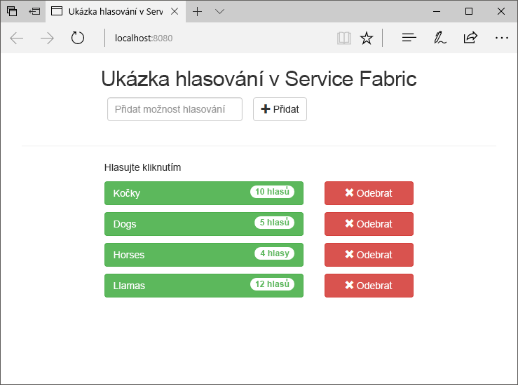
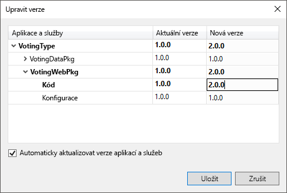
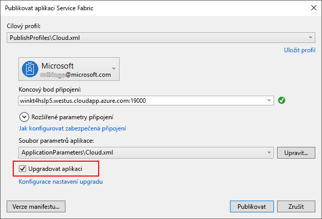
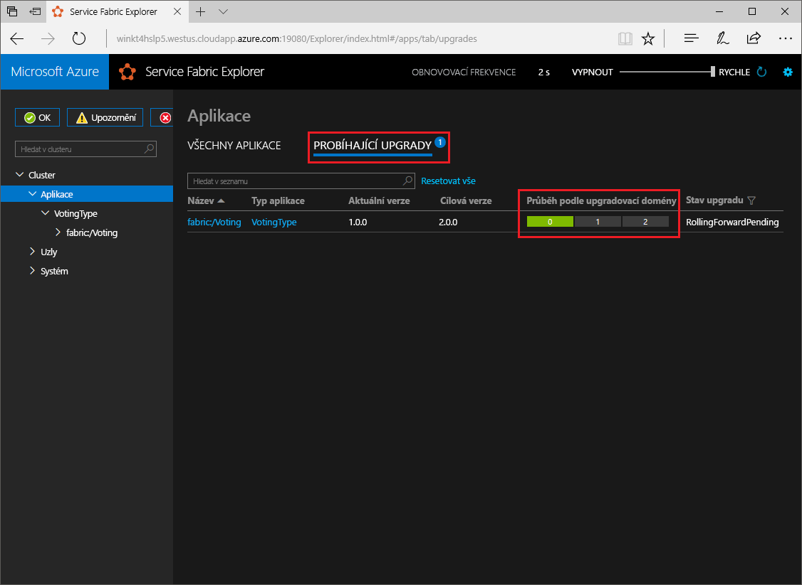

# <a name="quickstart-deploy-a-net-reliable-services-application-to-service-fabric"></a>Rychlý start: Nasazení aplikací .NET do Service Fabric reliable services

Azure Service Fabric je platforma distribuovaných systémů pro nasazování a správu škálovatelných a spolehlivých mikroslužeb a kontejnerů.

Tento rychlý start ukazuje, jak nasadit první aplikaci .NET do Service Fabric. Až budete hotovi, budete mít hlasovací aplikaci s webovým front-endem v ASP.NET Core, která ukládá výsledky hlasování do stavové back-end služby v clusteru.



Pomocí této aplikace se naučíte:

* Vytvoření aplikace pomocí .NET a Service Fabric
* Použití ASP.NET jako webového front-endu
* Ukládání dat aplikace do stavové služby
* Místní ladění aplikace
* Škálování aplikace na více instancí napříč několika uzly
* Provedení upgradu aplikace se zajištěním provozu

## <a name="prerequisites"></a>Požadavky

K provedení kroků v tomto kurzu Rychlý start je potřeba:

1. [Nainstalovat sadu Visual Studio 2017](https://www.visualstudio.com/) se sadami funkcí **Vývoj pro Azure** a **Vývoj pro ASP.NET a web**.
2. [Nainstalovat Git](https://git-scm.com/).
3. [Nainstalovat sadu Microsoft Azure Service Fabric SDK](https://www.microsoft.com/web/handlers/webpi.ashx?command=getinstallerredirect&appid=MicrosoftAzure-ServiceFabric-CoreSDK).
4. Spusťte následující příkaz a povolte sadě Visual Studio nasazování do místního clusteru Service Fabric:
    ```powershell
    Set-ExecutionPolicy -ExecutionPolicy Unrestricted -Force -Scope CurrentUser
    ```
    
## <a name="build-a-cluster"></a>Sestavení clusteru

Po instalaci modulu runtime, sady SDK, nástroje sady Visual Studio, Docker a mít spuštěnou Dockeru, vytvořte pěti uzly místního vývojového clusteru.

> [!IMPORTANT]
> Před vytvořením clusteru **musí** být spuštěný Docker.
> Zkontrolujte, že je Dockeru spuštěný, otevřením okna terminálu a zadáním příkazu `docker ps`, abyste viděli, jestli došlo k chybě. Pokud odpověď neindikuje chybu, Docker je spuštěný a vy jste připravení vytvořit cluster.


1. Jako správce otevřete nové okno PowerShellu se zvýšenými oprávněními.
2. Vývojový cluster vytvoříte spuštěním následujícího příkazu PowerShellu:

    ```powershell
    . "C:\Program Files\Microsoft SDKs\Service Fabric\ClusterSetup\DevClusterSetup.ps1"
    ```
3. Spuštěním následujícího příkazu spusťte nástroj Správce místního clusteru:

    ```powershell
    . "C:\Program Files\Microsoft SDKs\Service Fabric\Tools\ServiceFabricLocalClusterManager\ServiceFabricLocalClusterManager.exe"
    ```

>[!NOTE]
> Ukázková aplikace v tomto rychlém startu používá funkce, které nejsou dostupné v systému Windows 7.
>

## <a name="download-the-sample"></a>Stažení ukázky

V příkazovém okně naklonujte spuštěním následujícího příkazu úložiště ukázkové aplikace do místního počítače.

```git
git clone https://github.com/Azure-Samples/service-fabric-dotnet-quickstart
```

## <a name="run-the-application-locally"></a>Místní spuštění aplikace

Klikněte pravým tlačítkem na ikonu sady Visual Studio v nabídce Start a zvolte **Spustit jako správce**. Abyste mohli ke svým službám připojit ladicí program, musíte sadu Visual Studio spustit jako správce.

Otevřete řešení sady Visual Studio **Voting.sln** z úložiště, které jste naklonovali.

Ve výchozím nastavení je hlasovací aplikace naslouchá na portu 8080.  Port aplikace je nastavený v souboru */VotingWeb/PackageRoot/ServiceManifest.xml*.  Port aplikace můžete změnit aktualizací atributu **Port** elementu **Endpoint**.  Pokud chcete aplikaci nasadit a spustit místně, port aplikace musí být otevřený a dostupný na vašem počítači.  Pokud změníte port aplikace, nahraďte hodnotu 8080 v celém tomto článku za novou hodnotu portu aplikace.

Pokud chcete aplikaci nasadit, stiskněte **F5**.

> [!NOTE]
> V okně výstupu sady Visual Studio se zobrazí zpráva "Adresa URL aplikace není nastavena nebo není adresu URL protokolu HTTP/HTTPS, takže se do aplikace neotevře v prohlížeči."  Tato zpráva neznačí chybu, pouze informuje, že se prohlížeč nespustí automaticky.

Po dokončení nasazení spusťte prohlížeč a otevřete `http://localhost:8080` zobrazíte front-endu webové aplikace.


Teď můžete přidat sadu možností hlasování a začít přijímat hlasy. Aplikace je spuštěná a ukládá veškerá data v clusteru Service Fabric, aniž by potřebovala samostatnou databázi.

## <a name="walk-through-the-voting-sample-application"></a>Prohlídka ukázkové hlasovací aplikace

Hlasovací aplikace se skládá ze dvou služeb:

* Webová front-end služba (VotingWeb) – Webová front-end služba v ASP.NET, která obsluhuje webovou stránku a zveřejňuje webová rozhraní API pro komunikaci s back-end službou.
* Back-end služba (VotingData) – Webová služba v ASP.NET Core, která zveřejňuje rozhraní API pro ukládání výsledků hlasování do spolehlivého slovníku trvale uloženého na disku.


Při hlasování v aplikaci dojde k následujícím událostem:

1. JavaScript odešle požadavek s hlasem do webového rozhraní API ve webové front-end službě jako požadavek HTTP PUT.

2. Webová front-end služba pomocí proxy vyhledá požadavek HTTP PUT a přesměruje ho do back-end služby.

3. Back-end služba přijme příchozí požadavek a uloží aktualizované výsledky do spolehlivého slovníku, který se replikuje do několika uzlů v rámci clusteru a trvale se uloží na disku. Veškerá data aplikace se ukládají v clusteru, takže není potřeba žádná databáze.

## <a name="debug-in-visual-studio"></a>Ladění v sadě Visual Studio

Aplikace by měla být spuštěná bez problémů, ale pomocí ladicího programu se můžete podívat, jak fungují klíčové části aplikace. Při ladění aplikace v sadě Visual Studio používáte místní vývojový cluster Service Fabric. Možnosti ladění si můžete upravit tak, aby vyhovovaly vašemu scénáři. V této aplikaci se data ukládají v back-end službě s použitím spolehlivého slovníku. Sada Visual Studio ve výchozím nastavení odebere aplikaci při zastavení ladicího programu. Odebrání aplikace způsobí i odebrání dat v back-end službě. Pokud chcete zachovat data mezi ladicími relacemi, můžete změnit **Režim ladění aplikace** ve vlastnosti projektu **Voting** v sadě Visual Studio.

Pokud se chcete podívat, co se děje v kódu, proveďte následující kroky:

1. Otevřete soubor **/VotingWeb/Controllers/VotesController.cs** a nastavte zarážku v metodě **Put** webového rozhraní API (řádek 69) – Soubor můžete vyhledat v Průzkumníku řešení v sadě Visual Studio.

2. Otevřete soubor **/VotingData/Controllers/VoteDataController.cs** a nastavte zarážku v metodě **Put** tohoto webového rozhraní API (řádek 54).

3. Vraťte se do prohlížeče a klikněte na některou možnost hlasování nebo přidejte novou. Dostanete se k první zarážce v kontroleru rozhraní API webového front-endu.
    * Tady JavaScript v prohlížeči odesílá požadavek do kontroleru webového rozhraní API ve front-end službě.

    

    * Nejprve se vytvoří adresa URL k ReverseProxy pro back-end službu **(1)**.
    * Pak se do ReverseProxy odešle požadavek HTTP PUT **(2)**.
    * Nakonec se do klienta vrátí odpověď z back-end služby **(3)**.

4. Pokračujte stisknutím **F5**.
    - Po zobrazení výzvy v prohlížeči udělte skupině ServiceFabricAllowedUsers oprávnění ke čtení a provádění v režimu ladění.
    - Nyní jste se dostali k zarážce v back-end službě.

    

    * Na prvním řádku v metodě **(1)** `StateManager` načte nebo přidá spolehlivý slovník `counts`.
    * Všechny interakce s hodnotami ve spolehlivém slovníku vyžadují transakci. Tuto transakci vytvoří tento příkaz using **(2)**.
    * V transakci se pro možnost hlasování aktualizuje hodnota příslušného klíče a potvrdí se operace **(3)**. Jakmile se vrátí metoda potvrzení, data ve slovníku se aktualizují a replikují do dalších uzlů v clusteru. Data jsou teď bezpečně uložená v clusteru a v případě selhání back-end služby ji můžou převzít ostatní uzly, aby data byla i nadále dostupná.
5. Pokračujte stisknutím **F5**.

Pokud chcete zastavit ladicí relaci, stiskněte **Shift + F5**.

## <a name="perform-a-rolling-application-upgrade"></a>Provedení upgradu aplikace se zajištěním provozu

Když do aplikace nasazujete nové aktualizace, Service Fabric je bezpečným způsobem zavádí postupně. Upgrady se zajištěním provozu zajišťují upgradování bez výpadků a také automatické vrácení zpět v případě, že dojde k chybě.

Pokud chcete upgradovat aplikaci, postupujte následovně:

1. Otevřete v sadě Visual Studio soubor **/VotingWeb/Views/Home/Index.cshtml**.
2. Změňte nadpis na stránce přidáním nebo aktualizací textu. Nadpis můžete změnit například na Ukázková hlasovací aplikace Service Fabric v2.
3. Uložte soubor.
4. V Průzkumníku řešení klikněte pravým tlačítkem na **Voting** a zvolte **Publikovat**. Zobrazí se dialogové okno Publikovat.
5. Klikněte na tlačítko **Verze manifestu** a změňte verzi služby a aplikace.
6. Změňte například verzi elementu **Kód** v části **VotingWebPkg** na 2.0.0 a klikněte na **Uložit**.

    
7. V **publikovat aplikaci Service Fabric** dialogového okna, zkontrolujte **upgradovat aplikaci zaškrtávací políčko**.
8.  Změna **cílový profil** k **PublishProfiles\Local.5Node.xml** a ujistěte se, že **koncový bod připojení** je nastavena na **místní Cluster**. 
9. Vyberte **upgradovat aplikaci**.

    

10. Klikněte na **Publikovat**.

    V průběhu upgradu můžete aplikaci dál používat. Vzhledem k tomu, že v clusteru máte spuštěné dvě instance služby, můžou některé požadavky přicházet do upgradované verze aplikace, zatímco jiné můžou stále přicházet do staré verze.

11. Otevřete prohlížeč a přejděte na adresu clusteru na portu 19080. Například `http://localhost:19080/`.
12. Ve stromovém zobrazení klikněte na uzel **Aplikace** a pak na **Probíhající upgrady** v pravém podokně. Zobrazí se postupné zavádění upgradu napříč upgradovacími doménami ve vašem clusteru. U každé domény se nejprve ověří, jestli je v pořádku, a pak se přejde k další. Po ověření stavu domény se upgradovací doména v indikátoru průběhu zobrazí zeleně.
    

    Service Fabric zajišťuje bezpečné upgrady tím, že po upgradu služby na každém uzlu v clusteru dvě minuty počká. Počítejte s tím, že úplná aktualizace bude trvat přibližně osm minut.

## <a name="next-steps"></a>Další postup

V tomto rychlém startu jste se naučili:

* Vytvoření aplikace pomocí .NET a Service Fabric
* Použití ASP.NET jako webového front-endu
* Ukládání dat aplikace do stavové služby
* Místní ladění aplikace
* Škálování aplikace na více instancí napříč několika uzly
* Provedení upgradu aplikace se zajištěním provozu

Další informace o Service Fabric a .NET najdete v tomto kurzu:
> [!div class="nextstepaction"]
> [Aplikace .NET v Service Fabric](service-fabric-tutorial-create-dotnet-app.md)
