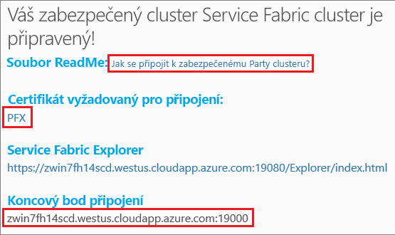
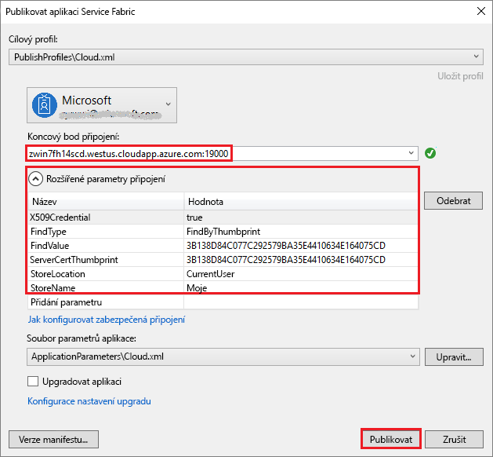

# <a name="tutorial-deploy-a-service-fabric-application-to-a-cluster-in-azure"></a>Kurz: Nasazení aplikace Service Fabric do clusteru v Azure

Tento kurz představuje druhý díl série kurzů a ukáže vám, jak nasadit aplikaci Azure Service Fabric do nového clusteru v Azure.

V tomto kurzu se naučíte:
> [!div class="checklist"]
> * Vytvořit Party cluster
> * Nasadit aplikaci do vzdáleného clusteru pomocí sady Visual Studio

V této sérii kurzů se naučíte:
> [!div class="checklist"]
> * [Sestavit aplikaci .NET pro Service Fabric](service-fabric-tutorial-create-dotnet-app.md)
> * Nasadit aplikaci do vzdáleného clusteru
> * [Přidat koncový bod HTTPS do front-end služby ASP.NET Core](service-fabric-tutorial-dotnet-app-enable-https-endpoint.md)
> * [Nakonfigurovat CI/CD pomocí Visual Studio Team Services](service-fabric-tutorial-deploy-app-with-cicd-vsts.md)
> * [Nastavit monitorování a diagnostiku aplikace](service-fabric-tutorial-monitoring-aspnet.md)

## <a name="prerequisites"></a>Požadavky

Než začnete s tímto kurzem:

* Pokud ještě nemáte předplatné Azure, vytvořte si [bezplatný účet](https://azure.microsoft.com/free/?WT.mc_id=A261C142F).
* [Nainstalujte sadu Visual Studio 2017](https://www.visualstudio.com/) se sadami funkcí **Vývoj pro Azure** a **Vývoj pro ASP.NET a web**.
* [Nainstalujte sadu Service Fabric SDK](service-fabric-get-started.md).

## <a name="download-the-voting-sample-application"></a>Stažení ukázkové hlasovací aplikace

Pokud jste nesestavili ukázkovou hlasovací aplikaci v [první části této série kurzů](service-fabric-tutorial-create-dotnet-app.md), můžete si ji stáhnout. V příkazovém okně naklonujte spuštěním následujícího příkazu úložiště ukázkové aplikace do místního počítače.

```git
git clone https://github.com/Azure-Samples/service-fabric-dotnet-quickstart
```

## <a name="publish-to-a-service-fabric-cluster"></a>Publikování do clusteru Service Fabric

Aplikace je teď připravená a přímo ze sady Visual Studio ji můžete nasadit do clusteru. [Cluster Service Fabric](/service-fabric/service-fabric-deploy-anywhere.md) je síťově propojená sada virtuálních nebo fyzických počítačů, ve které se nasazují a spravují mikroslužby.

Pro účely tohoto kurzu máte dvě možnosti nasazení hlasovací aplikace do clusteru Service Fabric pomocí sady Visual Studio:

* Publikovat do zkušebního (Party) clusteru.
* Publikovat do existujícího clusteru ve vašem předplatném.  Clustery Service Fabric lze vytvořit prostřednictvím webu [Azure Portal](https://portal.azure.com), pomocí skriptů [PowerShellu](./scripts/service-fabric-powershell-create-secure-cluster-cert.md) nebo [Azure CLI](./scripts/cli-create-cluster.md) nebo ze [šablony Azure Resource Manageru](service-fabric-tutorial-create-vnet-and-windows-cluster.md).

> [!NOTE]
> Řada služeb ke komunikaci mezi sebou používá reverzní proxy server. Clustery vytvořené v sadě Visual Studio a Party Clustery mají ve výchozím nastavení reverzní proxy server povolený.  Pokud používáte existující cluster, musíte [v clusteru povolit reverzní proxy server](service-fabric-reverseproxy.md#setup-and-configuration).


### <a name="find-the-votingweb-service-endpoint-for-your-azure-subscription"></a>Vyhledání koncového bodu služby VotingWeb pro vaše předplatné Azure

Pokud se chystáte publikovat hlasovací aplikaci do svého vlastního předplatného Azure, vyhledejte koncový bod webové služby front-endu. Pokud používáte Party cluster, port 8080 používaná ukázkovou hlasovací aplikací se otevře automaticky a nebudete ho muset konfigurovat ve službě Load Balancer Party clusteru.

Webová služba front-endu naslouchá na určitém portu.  Když se aplikace nasadí do clusteru v Azure, běží cluster i aplikace na pozadí služby Azure Load Balancer.  Port aplikace musí být ve službě Azure Load Balancer pro tento cluster otevřený pomocí pravidla, aby příchozí přenosy měly k webové službě přístup.  Tento port (například 8080) se nachází v souboru *VotingWeb/PackageRoot/ServiceManifest.xml* v elementu **Endpoint**:

```xml
<Endpoint Protocol="http" Name="ServiceEndpoint" Type="Input" Port="8080" />
```

Pro vaše předplatné Azure otevřete tento port v Azure pomocí pravidla vyrovnávání zatížení prostřednictvím [skriptu PowerShellu](./scripts/service-fabric-powershell-open-port-in-load-balancer.md) nebo pomocí nástroje pro vyrovnávání zatížení pro tento cluster na [webu Azure Portal](https://portal.azure.com).

### <a name="join-a-party-cluster"></a>Připojení k Party clusteru

> [!NOTE]
> Pokud se chystáte publikovat aplikaci ve vlastním clusteru v rámci předplatného Azure, přeskočte ke kroku Nasazení aplikace pomocí sady Visual Studio v následujícím oddíle.

Party clustery jsou bezplatné, časově omezené clustery Service Fabric hostované v Azure a provozované týmem Service Fabric, na kterých může kdokoli nasazovat aplikace a seznamovat se s platformou. Cluster používá jediný certifikát podepsaný svým držitelem pro zabezpečení mezi uzly i mezi klientem a uzlem.

Přihlaste se a [připojte se ke clusteru Windows](http://aka.ms/tryservicefabric). Stáhněte si do počítače certifikát PFX kliknutím na odkaz **PFX**. Klikněte na odkaz **How to connect to a secure Party cluster?** (Jak se připojit k zabezpečenému Party Clusteru?) a zkopírujte heslo certifikátu. Certifikát, heslo certifikátu a hodnotu **Koncový bod připojení** použijete v následujících krocích.



> [!Note]
> Každou hodinu je k dispozici omezený počet Party Clusterů. Pokud se vám při pokusu o registraci Party Clusteru zobrazí chyba, můžete chvíli počkat a zkusit to znovu nebo můžete podle kroků v kurzu [Nasazení aplikace .NET](https://docs.microsoft.com/azure/service-fabric/service-fabric-tutorial-deploy-app-to-party-cluster#deploy-the-sample-application) vytvořit cluster Service Fabric ve svém předplatném Azure a nasadit aplikaci do něj. Pokud ještě nemáte předplatné Azure, můžete si vytvořit [bezplatný účet](https://azure.microsoft.com/free/?WT.mc_id=A261C142F).
>

Na svém počítači s Windows nainstalujte soubor PFX do úložiště certifikátů *CurrentUser\My*.

```powershell
PS C:\mycertificates> Import-PfxCertificate -FilePath .\party-cluster-873689604-client-cert.pfx -CertStoreLocation Cert:\CurrentUser\My -Password (ConvertTo-SecureString 873689604 -AsPlainText -Force)


   PSParentPath: Microsoft.PowerShell.Security\Certificate::CurrentUser\My

Thumbprint                                Subject
----------                                -------
3B138D84C077C292579BA35E4410634E164075CD  CN=zwin7fh14scd.westus.cloudapp.azure.com
```

Zapamatujte si kryptografický otisk pro následující krok.

> [!Note]
> Webová front-end služba je ve výchozím nastavení nakonfigurovaná k naslouchání příchozímu provozu na portu 8080. Port 8080 je v Party clusteru otevřený.  Pokud potřebujete změnit port aplikace, změňte ho na některý z portů, které jsou v Party clusteru otevřené.
>

### <a name="publish-the-application-using-visual-studio"></a>Publikování aplikace pomocí sady Visual Studio

Aplikace je teď připravená a přímo ze sady Visual Studio ji můžete nasadit do clusteru.

1. V Průzkumníku řešení klikněte pravým tlačítkem na **Voting** a zvolte **Publikovat**. Zobrazí se dialogové okno Publikovat.

2. Do pole **Koncový bod připojení** zkopírujte **Koncový bod připojení** ze stránky Party clusteru nebo předplatného Azure. Například, `zwin7fh14scd.westus.cloudapp.azure.com:19000`. Klikněte na **Rozšířené parametry připojení** a ujistěte se, že hodnoty *FindValue* and *ServerCertThumbprint* odpovídají kryptografickému otisku certifikátu nainstalovaného v předchozím kroku pro Party cluster nebo certifikát odpovídající vašemu předplatnému Azure.

    

    Každá aplikace v clusteru musí mít jedinečný název.  Party clustery jsou však veřejné a sdílené prostředí a může dojít ke konfliktu s již existující aplikací.  Pokud dojde ke konfliktu názvů, přejmenujte projekt sady Visual Studio a opakujte nasazení.

3. Klikněte na **Publikovat**.

4. Otevřete prohlížeč a přejděte do hlasovací aplikace v clusteru zadáním adresy clusteru následované :8080 (nebo jiným portem podle konfigurace), například `http://zwin7fh14scd.westus.cloudapp.azure.com:8080`. Nyní by se měla zobrazit aplikace spuštěná v clusteru v Azure. Na hlasovací webové stránce zkuste přidávat a odstraňovat možnosti hlasování a hlasovat pro jednu nebo několik z těchto možností.

    


## <a name="next-steps"></a>Další kroky

V tomto kurzu jste se naučili:

> [!div class="checklist"]
> * Vytvořit Party cluster
> * Nasadit aplikaci do vzdáleného clusteru pomocí sady Visual Studio

Přejděte k dalšímu kurzu:
> [!div class="nextstepaction"]
> [Povolení HTTPS](service-fabric-tutorial-dotnet-app-enable-https-endpoint.md)
