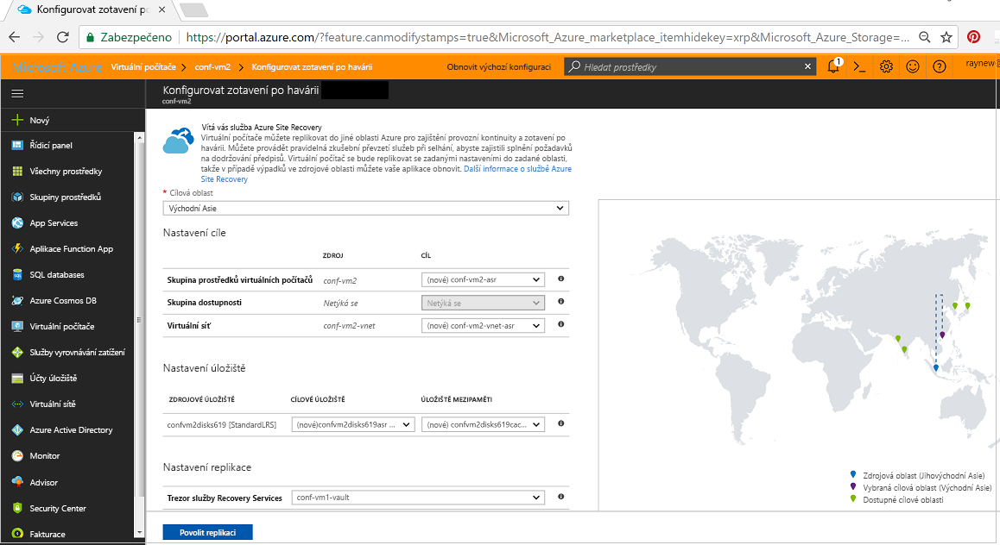
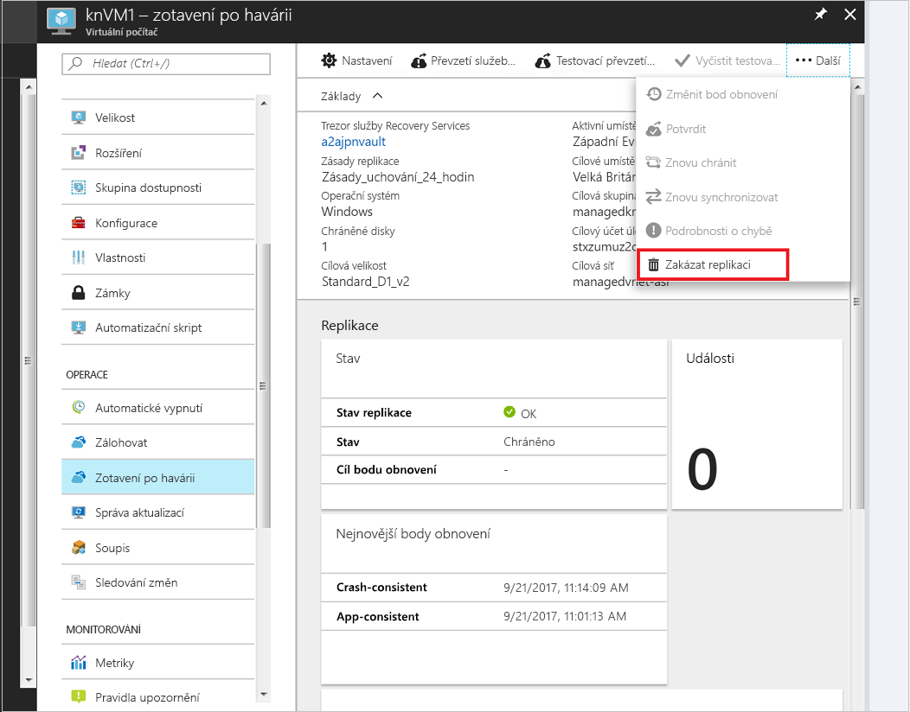

# Nastavení zotavení po havárii do sekundární oblasti Azure pro virtuální počítač Azure 

Služba [Azure Site Recovery](site-recovery-overview.md) přispívá ke strategii provozní kontinuity a zotavení po havárii (BCDR) tím, že zajišťuje provoz a dostupnost obchodních aplikací během plánovaných i neplánovaných výpadků. Site Recovery spravuje a orchestruje zotavení po havárii místních počítačů a virtuálních počítačů Azure, včetně replikace, převzetí služeb při selhání a zotavení.

Tento rychlý start popisuje, jak replikovat virtuální počítač Azure do jiné oblasti Azure.

Pokud ještě nemáte předplatné Azure, vytvořte si [bezplatný účet](https://azure.microsoft.com/free/?WT.mc_id=A261C142F) před tím, než začnete.

> [!NOTE]
> Cílem tohoto článku je provést nového uživatele prostředím Azure Site Recovery s výchozími možnostmi a minimálním přizpůsobením. Pokud se chcete dozvědět více o různých nastaveních, která je možné přizpůsobit, projděte si [kurz povolení replikace pro virtuální počítače Azure](azure-to-azure-tutorial-enable-replication.md).

## Přihlášení k Azure

Přihlaste se k webu Azure Portal na adrese http://portal.azure.com.

## Povolení replikace virtuálního počítače Azure

1. Na webu Azure Portal klikněte na **Virtuální počítače** a vyberte virtuální počítač, který chcete replikovat.
2. V části **Operace** klikněte na **Zotavení po havárii**.
3. V části **Konfigurovat zotavení po havárii** > **Cílová oblast** vyberte cílovou oblast, do které chcete replikaci provést.
4. Pro účely tohoto rychlého startu přijměte výchozí nastavení.
5. Klikněte na **Povolit replikaci**. Tím se spustí úloha, která povolí replikaci pro daný virtuální počítač.

    

## Ověření nastavení

Po dokončení úlohy replikace můžete zkontrolovat stav replikace, upravit nastavení replikace a otestovat nasazení.

1. V nabídce virtuálního počítače klikněte na **Zotavení po havárii**.
2. Můžete zkontrolovat stav replikace, vytvořené body obnovení a zdrojové a cílové oblasti na mapě.

   

## Vyčištění prostředků

Virtuální počítač v primární oblasti se přestane replikovat, když pro něj zakážete replikaci:

- Automaticky se vyčistí nastavení replikace zdroje. Mějte prosím na paměti, že rozšíření služby Site Recovery, který je nainstalován jako součást replikace není odebrán a musí být odstraněny ručně. 
- Zastaví se také fakturace služby Site Recovery pro daný virtuální počítač.

Následujícím způsobem zakažte replikaci

1. Vyberte virtuální počítač.
2. V části **Zotavení po havárii** klikněte na **Zakázat replikaci**.

   

## Další postup

V tomto rychlém startu jste replikovali jeden virtuální počítač do sekundární oblasti. Teď můžete prozkoumat další možnosti a vyzkoušet replikaci sady virtuálních počítačů Azure s využitím plánu obnovení.

> [!div class="nextstepaction"]
> [Konfigurace zotavení po havárii pro virtuální počítače Azure](azure-to-azure-tutorial-enable-replication.md)
