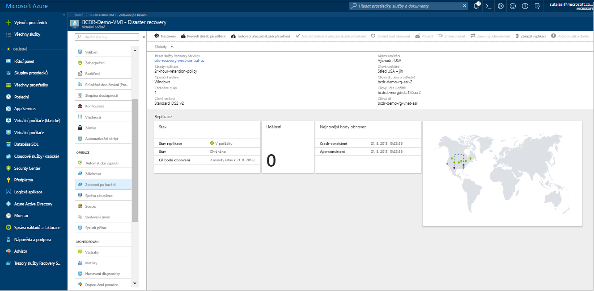

# Přesuňte virtuální počítače Azure do zóny dostupnosti
Zóny dostupnosti v Azure chrání vaše aplikace a data před selháními datových center. Každé zóny dostupnosti se skládá z jednoho nebo více datových Center vybavených nezávislým napájením, chlazením a sítí. K zajištění odolnosti proti chybám, je minimálně tří samostatných zón ve všech oblastech, povolené. Fyzické oddělení zón dostupnosti v rámci oblasti chrání aplikace a data před selháními datových center. Zóny dostupnosti Azure nabízí odvětví nejlepší 99,99 % doby provozu SLA k virtuálním počítačům. Zóna dostupnosti se podporuje ve vybraných oblastech, jak je uvedeno [tady](https://docs.microsoft.com/azure/availability-zones/az-overview#regions-that-support-availability-zones). 

V případě, že jste nasadili virtuální počítače jako 'jedna instance na konkrétní oblasti, kde chcete zlepšit dostupnost přesunutím do zóny dostupnosti můžete tak provést pomocí Azure Site Recovery. To můžete dále rozdělená na:

- Přesunout virtuální počítače jedné instance do zón dostupnosti v cílové oblasti
- Přesunout virtuální počítače ve skupině dostupnosti do zóny dostupnosti v cílové oblasti

> [!IMPORTANT]
> Azure Site Recovery aktuálně podporuje přesun virtuálních počítačů z v oblasti do druhé a nepodporuje přesun v rámci oblasti. 

## Ověřte požadavky

- Ověřte, jestli má cílové oblasti [podpory pro zóny dostupnosti](https://docs.microsoft.com/azure/availability-zones/az-overview#regions-that-support-availability-zones)– ověření, jestli podle vaší volby [podporované zdrojové oblasti – kombinace cílové oblasti](https://docs.microsoft.com/azure/site-recovery/azure-to-azure-support-matrix#region-support) a informovaně rozhodnout, jestli v cílové oblasti.
- Ujistěte se, že rozumíte [komponentám a architektuře řešení](azure-to-azure-architecture.md).
- Zkontrolujte [omezení podpory a požadavky](azure-to-azure-support-matrix.md).
- Ověření oprávnění účtu: Pokud jste si právě vytvořili bezplatný účet Azure, pak jste správcem předplatného. Jestliže správcem předplatného nejste, požádejte správce o přiřazení potřebných oprávnění. Povolení replikace pro virtuální počítač a nakonec kopírování dat k cíli pomocí Azure Site Recovery, musíte mít:

    1. Oprávnění k vytvoření virtuálního počítače v prostředcích Azure. Tato oprávnění má předdefinovaná role Přispěvatel virtuálních počítačů. Patří k nim:
        - Oprávnění k vytvoření virtuálního počítače ve vybrané skupině prostředků
        - Oprávnění k vytvoření virtuálního počítače ve vybrané virtuální síti
        - Oprávnění zapisovat na vybraný účet úložiště

    2. Potřebujete také oprávnění ke správě operací služby Azure Site Recovery. Všechna oprávnění nutná ke správě operací služby Site Recovery v  trezoru služby Recovery Services má role Přispěvatel Site Recovery.

## Příprava zdrojové virtuální počítače

1. Vaše virtuální počítače by měl použití spravovaných disků, pokud chcete přesunout do zóny dostupnosti pomocí služby Site Recovery. Můžete převést stávající Windows virtuální počítače (VM), které používají nespravované disky, můžete převést virtuální počítače použít spravované disky pomocí kroků uvedených [tady](https://docs.microsoft.com/azure/virtual-machines/windows/convert-unmanaged-to-managed-disks). V takovém případě Ujistěte se, že skupina dostupnosti je nakonfigurovaný jako "spravované. 
2. Zkontrolujte, že jsou na virtuálních počítačích Azure, kterou chcete přesunout všechny nejnovější kořenové certifikáty. Pokud nejsou k dispozici nejnovější kořenové certifikáty, kopírování dat do cílové oblasti není možné kvůli omezení zabezpečení.

3. U virtuálních počítačů s Windows zajistíte přítomnost všech důvěryhodných kořenových certifikátů tím, že na ně nainstalujete všechny nejnovější aktualizace Windows. V odpojeném prostředí dodržujte při aktualizaci Windows a certifikátů standardní postupy uplatňované ve vaší organizaci.

4. U virtuálních počítačů s Linuxem postupujte při získávání nejnovějších důvěryhodných kořenových certifikátů a seznamu odvolaných certifikátů na virtuálním počítači podle pokynů, které jste dostali od distributora Linuxu.
5. Ujistěte se, že ověřovací proxy server nepoužíváte k řízení síťového připojení pro virtuální počítače chcete přesunout.

6. Pokud se pokoušíte přesunout virtuální počítač nemá přístup k Internetu a k řízení odchozího přístupu používá proxy server brány firewall, Zkontrolujte prosím požadavky [tady](azure-to-azure-tutorial-enable-replication.md#configure-outbound-network-connectivity).

7. Identifikujte zdroj sítě rozložení a všechny prostředky, které aktuálně používáte – včetně nástrojů pro vyrovnávání zatížení, skupin zabezpečení sítě, veřejná IP atd. pro ověření.

## Připravte cílové oblasti

1. Ověřte, že vám předplatné Azure umožňuje vytvářet virtuální počítače v cílové oblasti používané ke zotavení po havárii. Požádejte podporu o povolení požadované kvóty, pokud je to nutné.

2. Zkontrolujte, jestli máte v rámci předplatného k dispozici dostatek prostředků pro podporu virtuálních počítačů s takovými velikostmi, které odpovídají velikostem zdrojových virtuálních počítačů. Pokud použijete Site Recovery pro kopírování dat do cíle, použije stejnou nebo nejbližší možnou velikost pro cílový virtuální počítač.

3. Ujistěte se, že vytvoříte cílový prostředek pro všechny komponenty jsou identifikované v rozložení síťové zdroje. To je důležité k zajištění toho, aby, účtovat společné cílové oblasti, vaše virtuální počítače mají všechny funkce a funkce, které jste měli ve zdroji.

    > [!NOTE]
    > Azure Site Recovery automaticky zjistí a vytvoří virtuální síť a účet úložiště, když povolíte replikaci pro zdrojový virtuální počítač, nebo také můžete předem vytvořit tyto prostředky a přiřadit k virtuálnímu počítači jako součást kroku povolení replikace. Ale pro všechny další prostředky, jak je uvedeno níže, je potřeba vytvořit ručně v cílové oblasti.

     Najdete v následujících dokumentech k vytvoření nejčastěji používanou síťovým prostředkům relevantní pro vás v závislosti na konfiguraci zdrojového virtuálního počítače.

    - [Skupiny zabezpečení sítě](https://docs.microsoft.com/azure/virtual-network/manage-network-security-group)
    - [Nástroje pro vyrovnávání zatížení] (https://docs.microsoft.com/azure/load-balancer/#step-by-step-tutorials
        
     - [Veřejná IP adresa ](https://docs.microsoft.com/azure/load-balancer/#step-by-step-tutorials)
    
   Ostatními síťovými součástmi, najdete v části sítě [dokumentaci.](https://docs.microsoft.com/azure/#pivot=products&panel=network) 

> [!IMPORTANT]
> Nezapomeňte použít nástroj pro vyrovnávání zatížení redundantní zóny na cíli. Další informace [tady](https://docs.microsoft.com/azure/load-balancer/load-balancer-standard-availability-zones).

4. Ručně [vytvořit síť neprodukčním](https://docs.microsoft.com/azure/virtual-network/quick-create-portal) v cílové oblasti, pokud chcete otestovat konfiguraci, před provedením konečné vyjmutí v cílové oblasti. Tím se vytvoří minimálním narušením s produkčním prostředím a doporučuje se.

> [!NOTE]
> Níže jsou kroky pro jeden virtuální počítač, můžete rozšířit stejné na několika virtuálních počítačů tak, že přejdete do trezoru služby Recovery Services a kliknutím na + replikovat a výběrem příslušné virtuálních počítačů dohromady.

## Povolení replikace
Níže uvedený postup se dozvíte, jak pomocí Azure Site Recovery k replikaci dat do cílové oblasti, předtím, než je nakonec přesunou do zón dostupnosti.

1. Na webu Azure Portal, klikněte na tlačítko **virtuálních počítačů**a vyberte virtuální počítač, který chcete přesunout do zóny dostupnosti.
2. V části **Operace** klikněte na **Zotavení po havárii**.
3. V části **Konfigurovat zotavení po havárii** > **Cílová oblast** vyberte cílovou oblast, do které chcete replikaci provést. Zkontrolujte tuto oblast [podporuje](https://docs.microsoft.com/azure/availability-zones/az-overview#regions-that-support-availability-zones) zóny dostupnosti.

1. Vyberte **Další: Upřesňující nastavení**
2. Vyberte hodnoty jeví pro cíl subscriptiom, cílové skupiny prostředků virtuálního počítače a virtuální sítě.
3. V **dostupnosti** zvolte dostupností zónu, do kterého chcete přesunout virtuální počítač. 
> [!NOTE]
> Pokud nevidíte možnost pro skupinu dostupnosti nebo zóny dostupností, zajistěte, aby [požadavky](#prepare-the-source-vms) splnění a [přípravy](#prepare-the-source-vms) zdroje jsou kompletní virtuální počítače.

   

7. Klikněte na povolit replikace. Tím se spustí úloha, která povolí replikaci pro daný virtuální počítač.

## Ověření nastavení

Po dokončení úlohy replikace můžete zkontrolovat stav replikace, upravit nastavení replikace a otestovat nasazení.

1. V nabídce virtuálního počítače klikněte na **Zotavení po havárii**.
2. Můžete zkontrolovat stav replikace, vytvořené body obnovení a zdrojové a cílové oblasti na mapě.

   

## Otestujte konfiguraci

1. V nabídce virtuálního počítače, klikněte na **zotavení po havárii**.
2. Klikněte na tlačítko **testovací převzetí služeb při selhání** ikonu.
3. V části **Testovací převzetí služeb při selhání** vyberte bod obnovení, který se má pro převzetí služeb při selhání použít:

   - **Nejnovější zpracovaný**: Převezme virtuálního počítače k nejnovějšímu bodu obnovení zpracovanému službou Site Recovery. Časové razítko je vidět. S touto možností se neztrácí žádný čas zpracováním dat, takže poskytuje nízkou plánovanou dobu obnovení (RTO).
   - **Nejnovější konzistentní vzhledem k**: Tato možnost převezme služby při selhání všech virtuálních počítačů k nejnovějšímu bodu obnovení s konzistentní aplikací. Časové razítko je vidět.
   - **Vlastní**: Zvolte jakýkoli bod obnovení.

3. Vybrat testovací cílové virtuální síť Azure ke kterému chcete přesunout virtuální počítače Azure k testování této konfigurace. 

> [!IMPORTANT]
> Doporučujeme použít samostatnou síť virtuálních počítačů Azure pro selhání testu a ne produkční síti v cílové oblasti, do kterého chcete nakonec přesunout virtuální počítače.

4. Pro začátek testování přesunutí, klikněte na tlačítko **OK**. Pokud chcete sledovat průběh, kliknutím na virtuální počítač otevřete jeho vlastnosti. Případně můžete kliknout na úlohu **Testovací převzetí služeb při selhání** v části název_trezoru > **Nastavení** > **Úlohy** > **Úlohy Site Recovery**.
5. Po dokončení převzetí služeb při selhání se replika virtuálního počítače Azure zobrazí na webu Azure Portal v části **Virtuální počítače**. Ujistěte se, že je virtuální počítač spuštěný, má odpovídající velikost a je připojený k odpovídající síti.
6. Pokud chcete odstranit virtuální počítač vytvořen jako součást přesunu testování, klikněte na tlačítko **vyčištění testovacího převzetí služeb při selhání** na replikovanou položku. V **poznámky**si zaznamenejte a uložte jakékoli připomínky související s testem.

## Provedení přesunu do cílové oblasti a potvrďte.

1.  V nabídce virtuálního počítače, klikněte na **zotavení po havárii**.
2. Klikněte na **převzetí služeb při selhání** ikonu.
3. V okně **Převzetí služeb při selhání** vyberte **Nejnovější**. 
4. Vyberte **Před spuštěním převzetí služeb při selhání vypnout počítač**. Služba Site Recovery se před aktivací převzetí služeb při selhání pokusí zdrojový virtuální počítač vypnout. Převzetí služeb při selhání bude pokračovat i v případě, že se vypnutí nepovede. Průběh převzetí služeb při selhání můžete sledovat na stránce **Úlohy**. 
5. Po dokončení úlohy zkontrolujte, že virtuální počítač zobrazuje v cílové oblasti Azure podle očekávání.
6. V části **Replikované položky** klikněte pravým tlačítkem na virtuální počítač a pak na **Potvrdit**. Tím se dokončí proces přesunu na cílové oblasti. Počkejte, až se dokončí úloha potvrzení.

## Zahodit prostředků ve zdrojové oblasti 

1. Přejděte k virtuálnímu počítači.  Klikněte na **zakázat replikaci**.  Tím se zastaví proces kopírování dat pro virtuální počítač.  

> [!IMPORTANT]
> Je důležité provést z předchozího kroku, aby se zabránilo odepsání pro metodu post replikace Site Recovery přesunutí. Automaticky se vyčistí nastavení replikace zdroje. Mějte prosím na paměti, že rozšíření služby Site Recovery, který je nainstalován jako součást replikace není odebrán a musí být odstraněny ručně. 

## Další postup

V tomto kurzu zvýšit dostupnost virtuálního počítače Azure přesunete do skupiny dostupnosti nebo zónu dostupnosti. Teď můžete nakonfigurovat zotavení po havárii pro přesunutý virtuální počítač.

> [!div class="nextstepaction"]
> [Nastavení zotavení po havárii po migraci](azure-to-azure-quickstart.md)

