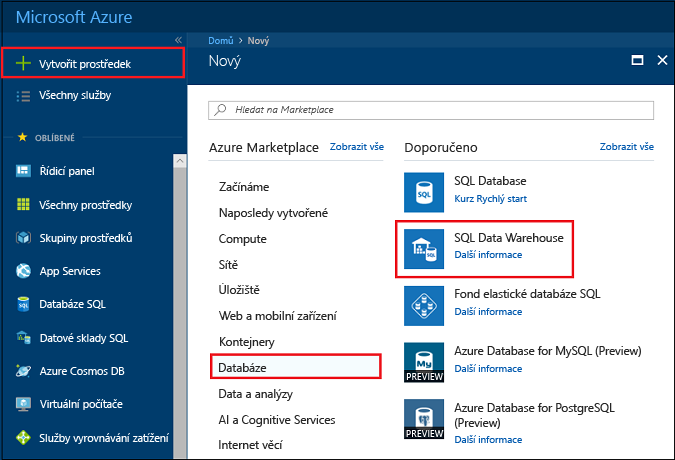

# <a name="quickstart-create-and-query-an-azure-sql-data-warehouse-in-the-azure-portal"></a>Rychlý start: Vytvoření a dotazování Azure SQL Data Warehouse v Azure Portal

Rychlé vytvoření a dotazování Azure SQL Data Warehouse pomocí Azure Portal.

Pokud ještě nemáte předplatné Azure, vytvořte si [bezplatný účet](https://azure.microsoft.com/free/) před tím, než začnete.

> [!NOTE]
> Vytvoření služby SQL Data Warehouse může znamenat, že se vám začne fakturovat nová služba. Další informace najdete v tématu [SQL Data Warehouse – ceny](https://azure.microsoft.com/pricing/details/sql-data-warehouse/).

## <a name="before-you-begin"></a>Před zahájením

Stáhněte a nainstalujte nejnovější verzi aplikace [SQL Server Management Studio](/sql/ssms/download-sql-server-management-studio-ssms) (SSMS).

## <a name="sign-in-to-the-azure-portal"></a>Přihlášení k webu Azure Portal

Přihlaste se k webu [Azure Portal](https://portal.azure.com/).

## <a name="create-a-data-warehouse"></a>Vytvoření datového skladu

Vytvoří se Azure SQL Data Warehouse s definovanou sadou [výpočetních prostředků](memory-and-concurrency-limits.md). Databáze se vytvoří v rámci [skupiny prostředků Azure](../azure-resource-manager/resource-group-overview.md) a na [logickém serveru SQL Azure](../sql-database/sql-database-logical-servers.md). 

Pomocí těchto kroků vytvořte SQL Data Warehouse obsahující ukázková data AdventureWorksDW. 

1. Klikněte na **Vytvořit prostředek** v levém horním rohu webu Azure Portal.

2. Na stránce **Nový** vyberte **Databáze** a v části **Doporučené** na stránce **Nový** vyberte **SQL Data Warehouse**.

    

3. Do formuláře služby SQL Data Warehouse zadejte následující informace:

    | Nastavení | Navrhovaná hodnota | Popis |
    | :------ | :-------------- | :---------- |
    | **Název databáze** | mySampleDataWarehouse | Platné názvy databází najdete v tématu [Identifikátory databází](/sql/relational-databases/databases/database-identifiers). Poznámka: datový sklad je typem databáze.|
    | **Předplatné** | Vaše předplatné | Podrobnosti o vašich předplatných najdete v tématu [Předplatná](https://account.windowsazure.com/Subscriptions). |
    | **Skupina prostředků** | myResourceGroup | Platné názvy skupin prostředků najdete v tématu [Pravidla a omezení pojmenování](https://docs.microsoft.com/azure/architecture/best-practices/naming-conventions). |
    | **Výběr zdroje** | Ukázka | Určuje, že se má načíst ukázková databáze. Poznámka: datový sklad je jedním z typů databáze. |
    | **Výběr ukázky** | AdventureWorksDW | Určuje, že se má načíst ukázková databáze AdventureWorksDW. |
    ||||

    

4. Klikněte na **Server** a vytvořte a nakonfigurujte nový server pro novou databázi. Do **formuláře Nový server** zadejte následující informace: 

    | Nastavení | Navrhovaná hodnota | Popis |
    | :------ | :-------------- | :---------- |
    | **Název serveru** | Libovolný globálně jedinečný název | Platné názvy serverů najdete v tématu [Pravidla a omezení pojmenování](https://docs.microsoft.com/azure/architecture/best-practices/naming-conventions). |
    | **Přihlašovací jméno správce serveru** | Libovolné platné jméno | Platná přihlašovací jména najdete v tématu [Identifikátory databází](https://docs.microsoft.com/sql/relational-databases/databases/database-identifiers).|
    | **Heslo** | Libovolné platné heslo | Heslo musí mít alespoň osm znaků a musí obsahovat znaky ze tří z následujících kategorií: velká písmena, malá písmena, číslice a jiné než alfanumerické znaky. |
    | **Location** | Libovolné platné umístění | Informace o oblastech najdete v tématu [Oblasti služeb Azure](https://azure.microsoft.com/regions/). |
    ||||

    

5. Klikněte na tlačítko **vyberte**.

6. Kliknutím na **úroveň výkonu** určete konfiguraci výkonu pro datový sklad.

7. Pro tento kurz vyberte **Gen2**. Ve výchozím nastavení je posuvník nastaven na **DW1000c**. Zkuste jeho posouváním hodnotu zvýšit a snížit a podívejte se, jak funguje. 

    

8. Klikněte na tlačítko **Použít**.

9. Teď, když jste dokončili formulář SQL Data Warehouse, klikněte na **vytvořit** a zřiďte databázi. Zřizování trvá několik minut.

    

10. Na panelu nástrojů klikněte na **Oznámení** a sledujte proces nasazení.
    
     

## <a name="create-a-server-level-firewall-rule"></a>Vytvoření pravidla brány firewall na úrovni serveru

Služba SQL Data Warehouse vytvoří bránu firewall na úrovni serveru. Tato brána firewall zabraňuje externím aplikacím a nástrojům v připojení k serveru nebo jakékoli databázi na serveru. Pokud chcete umožnit připojení, můžete přidat pravidla brány firewall, která povolí připojení z konkrétních IP adres. Postupujte podle těchto pokynů a vytvořte [pravidlo brány firewall na úrovni serveru](../sql-database/sql-database-firewall-configure.md) pro IP adresu vašeho klienta.

> [!NOTE]
> SQL Data Warehouse komunikuje přes port 1433. Pokud se pokoušíte připojit z podnikové sítě, nemusí být odchozí provoz přes port 1433 bránou firewall vaší sítě povolený. Pokud je to tak, nebudete se moct připojit k serveru služby Azure SQL Database, dokud vaše IT oddělení neotevře port 1433.

1. Po dokončení nasazení vyberte v nabídce na levé straně **všechny služby** . Vyberte **databáze**. Pokud chcete přidat datové sklady SQL do oblíbených položek, vyberte hvězdičku vedle **SQL Data Warehouse** .
1. V nabídce na levé straně vyberte **SQL Data Warehouse** a pak na stránce **SQL Data Warehouse** klikněte na **mySampleDataWarehouse** . Otevře se stránka s přehledem pro vaši databázi, na které se zobrazí plně kvalifikovaný název serveru (například **MyNewServer-20180430.Database.Windows.NET**), který poskytuje možnosti pro další konfiguraci.
1. Zkopírujte tento plně kvalifikovaný název serveru, abyste ho mohli použít pro připojení k serveru a jeho databázím v tomto a dalším rychlém startu. Pokud chcete otevřít nastavení serveru, klikněte na název serveru.

   

1. Klikněte na **Zobrazit nastavení brány firewall**.

   

1. Otevře se stránka **Nastavení brány firewall** pro server služby SQL Database.

   

1. Pokud chcete do nového pravidla brány firewall přidat svou aktuální IP adresu, klikněte na **Přidat IP adresu klienta** na panelu nástrojů. Pravidlo brány firewall může otevřít port 1433 pro jednu IP adresu nebo rozsah IP adres.

1. Klikněte na **Uložit**. Vytvoří se pravidlo brány firewall na úrovni serveru pro vaši aktuální IP adresu, které otevře port 1433 na logickém serveru.

1. Klikněte na **OK** a pak zavřete stránku **Nastavení brány firewall**.

Pomocí této IP adresy se teď můžete připojit k serveru SQL a jeho datovým skladům. Připojení funguje z aplikace SQL Server Management Studio nebo jiného nástroje podle vašeho výběru. Při připojování použijte účet správce serveru, který jste předtím vytvořili.

> [!IMPORTANT]
> Standardně je přístup přes bránu firewall služby SQL Database povolený pro všechny služby Azure. Pokud chcete bránu firewall zakázat pro všechny služby Azure, klikněte na této stránce na **VYPNUTO** pak klikněte na **Uložit**.

## <a name="get-the-fully-qualified-server-name"></a>Získání plně kvalifikovaného názvu serveru

Na webu Azure Portal získejte plně kvalifikovaný název vašeho serveru SQL. Tento plně kvalifikovaný název použijete později při připojování k serveru.

1. Přihlaste se k webu [Azure Portal](https://portal.azure.com/).
2. V nabídce na levé straně vyberte **SQL Data Warehouse** a klikněte na svůj datový sklad na stránce **SQL Data Warehouse** .
3. V podokně **Základy** na stránce webu Azure Portal pro vaši databázi vyhledejte a potom zkopírujte **Název serveru**. V tomto příkladu je plně kvalifikovaný název mynewserver-20180430.database.windows.net.

    

## <a name="connect-to-the-server-as-server-admin"></a>Připojení k serveru jako správce serveru

V této části se pomocí aplikace [SQL Server Management Studio](/sql/ssms/download-sql-server-management-studio-ssms) (SSMS) naváže připojení k serveru SQL Azure.

1. Spusťte aplikaci SQL Server Management Studio.

2. V dialogovém okně **Připojení k serveru** zadejte následující informace:

   | Nastavení | Navrhovaná hodnota | Popis |
   | :------ | :-------------- | :---------- |
   | Typ serveru | Databázový stroj | Tato hodnota se vyžaduje. |
   | Název serveru | Plně kvalifikovaný název serveru | Tady je příklad: **MyNewServer-20180430.Database.Windows.NET**. |
   | Ověřování | Ověřování SQL Serveru | Ověřování SQL je jediný typ ověřování, který se v tomto kurzu konfiguruje. |
   | Přihlásit se | Účet správce serveru | Účet, který jste zadali při vytváření serveru. |
   | Heslo | Heslo pro účet správce serveru | Heslo, které jste zadali při vytváření serveru. |
   ||||

    

3. Klikněte na **Připojit**. V aplikaci SSMS se otevře okno Průzkumníka objektů. 

4. V Průzkumníku objektů rozbalte **Databáze**. Pak rozbalte **mySampleDatabase** a zobrazte objekty v nové databázi.

     

## <a name="run-some-queries"></a>Spuštění nějakých dotazů

SQL Data Warehouse jako dotazovací jazyk používá T-SQL. Pokud chcete otevřít okno dotazu a spustit nějaké dotazy T-SQL, použijte následující postup:

1. Klikněte pravým tlačítkem na **mySampleDataWarehouse** a vyberte **Nový dotaz**. Otevře se nové okno dotazu.
2. V okně dotazu zadejte následující příkaz, který zobrazí seznam databází.

    ```sql
    SELECT * FROM sys.databases
    ```

3. Klikněte na tlačítko **Spustit**. Výsledky dotazu ukazují dvě databáze: **master** a **mySampleDataWarehouse**.

    

4. Pokud se chcete podívat na nějaká data, pomocí následujícího příkazu zobrazte počet zákazníků s příjmením Adams, kteří mají tři děti. Seznam výsledků obsahuje šest zákazníků. 

    ```sql
    SELECT LastName, FirstName FROM dbo.dimCustomer
    WHERE LastName = 'Adams' AND NumberChildrenAtHome = 3;
    ```

    

## <a name="clean-up-resources"></a>Vyčištění prostředků

Účtují se vám poplatky za jednotky datového skladu a data uložená v datovém skladu. Výpočetní prostředky a prostředky úložiště se účtují odděleně.

- Pokud chcete zachovat data v úložišti, můžete pozastavit výpočetní prostředky v době, kdy datový sklad nepoužíváte. Když pozastavíte výpočetní prostředky, bude se vám účtovat jenom úložiště dat. Můžete pokračovat v výpočtůch, kdykoli budete připraveni na práci s daty.
- Pokud chcete zamezit budoucím poplatkům, můžete datový sklad odstranit.

Pomocí těchto kroků vyčistěte prostředky, které už nepotřebujete.

1. Přihlaste se k webu [Azure Portal](https://portal.azure.com) a klikněte na váš datový sklad.

    

2. Pokud chcete pozastavit výpočetní prostředky, klikněte na tlačítko **Pozastavit**. Když je datový sklad pozastavený, zobrazí se tlačítko pro **obnovení** . Chcete-li obnovit výpočetní výkon, klikněte na tlačítko **obnovit**.

3. Pokud chcete odebrat datový sklad, aby se vám neúčtovaly výpočetní výkon nebo úložiště, klikněte na **Odstranit**.

4. Pokud chcete odebrat vytvořený SQL Server, klikněte na **MyNewServer-20180430.Database.Windows.NET** na předchozím obrázku a pak klikněte na **Odstranit**. S tímto odstraněním buďte opatrní, protože odstraněním serveru se odstraní také všechny databáze k tomuto serveru přiřazené.

5. Pokud chcete odebrat skupinu prostředků, klikněte na **myResourceGroup** a pak klikněte na **Odstranit skupinu prostředků**.

## <a name="next-steps"></a>Další kroky

Nyní jste vytvořili datový sklad, vytvořili jste pravidlo brány firewall připojené k vašemu datovému skladu a spustili několik dotazů. Další informace o službě Azure SQL Data Warehouse najdete v kurzu načítání dat.

> [!div class="nextstepaction"]
> [Načtení dat do SQL Data Warehouse](load-data-from-azure-blob-storage-using-polybase.md)
