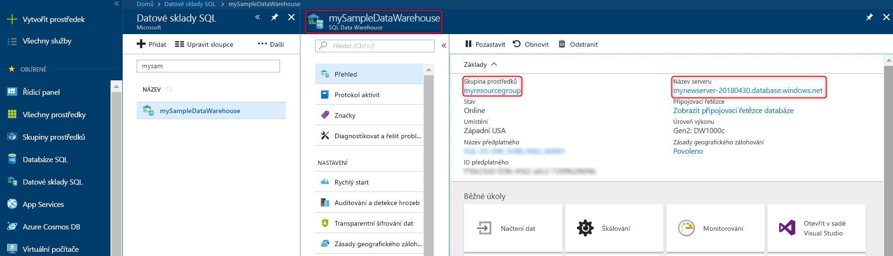

# <a name="quickstart-pause-and-resume-compute-in-azure-sql-data-warehouse-with-powershell"></a>Rychlý start: Pozastavení a obnovení výpočetních prostředků ve službě Azure SQL Data Warehouse pomocí prostředí PowerShell

Použití Powershellu k pozastavení výpočetních prostředků ve službě Azure SQL Data Warehouse vám ušetří náklady. [Obnovit výpočty](sql-data-warehouse-manage-compute-overview.md) až budete připravení použít datový sklad.

Pokud ještě nemáte předplatné Azure, vytvořte si [bezplatný účet](https://azure.microsoft.com/free/) před tím, než začnete.

## <a name="before-you-begin"></a>Před zahájením

[!INCLUDE [updated-for-az](../../includes/updated-for-az.md)]

V tomto rychlém startu se předpokládá, že už máte datový sklad SQL, který lze pozastavit a obnovit. Pokud je potřeba ho vytvořit, můžete použít [vytvoření a připojení – portál](create-data-warehouse-portal.md) vytvořit datový sklad s názvem **mySampleDataWarehouse**.

## <a name="log-in-to-azure"></a>Přihlášení k Azure

Přihlaste se k předplatnému Azure pomocí [připojit AzAccount](/powershell/module/az.accounts/connect-azaccount) příkaz a postupujte podle pokynů na obrazovce pokynů.

```powershell
Connect-AzAccount
```

Chcete-li zjistit, které předplatné používáte, spusťte [Get-AzSubscription](/powershell/module/az.accounts/get-azsubscription).

```powershell
Get-AzSubscription
```

Pokud budete muset použít jiné předplatné než výchozí, spusťte [Set-AzContext](/powershell/module/az.accounts/set-azcontext).

```powershell
Set-AzContext -SubscriptionName "MySubscription"
```

## <a name="look-up-data-warehouse-information"></a>Vyhledání informací o datovém skladu

Vyhledejte název databáze, název serveru a skupinu prostředků pro datový sklad, jehož provoz chcete pozastavit a obnovit.

Informace o umístění vašeho datového skladu vyhledáte pomocí následujících kroků.

1. Přihlaste se k webu [Azure Portal](https://portal.azure.com/).
2. Na webu Azure Portal klikněte vlevo na **Databáze SQL**.
3. Na stránce **Databáze SQL** vyberte **mySampleDataWarehouse**. Otevře se datový sklad.

    

4. Poznamenejte si název datového skladu, což je název databáze. Také poznamenejte si název serveru a skupinu prostředků.
6. Pokud využíváte server foo.database.windows.net, v rutinách PowerShellu používejte jako název serveru jen jeho první část. Na předchozím obrázku je úplný název serveru newserver-20171113.database.windows.net. Vyřaďte příponu a použít **newserver-20171113** jako název serveru ve výsledcích rutiny Powershellu.

## <a name="pause-compute"></a>Pozastavit výpočetní prostředky

Abyste dosáhli nižších nákladů, lze pozastavit a obnovit výpočetní prostředky na vyžádání. Například pokud nepoužíváte databáze v noci a o víkendech, můžete pozastavit během těchto obdobích a obnovit během dne. Neplatí žádné poplatky za výpočetní prostředky, zatímco databáze je pozastavená. Můžete ale dál účtovat poplatky za úložiště.

Chcete-li pozastavit databázi, použijte [Suspend-AzSqlDatabase](/powershell/module/az.sql/suspend-azsqldatabase) rutiny. Následující příklad pozastaví datový sklad s názvem **mySampleDataWarehouse** hostovaný na serveru s názvem **newserver-20171113**. Server je ve skupině prostředků Azure s názvem **myResourceGroup**.


```Powershell
Suspend-AzSqlDatabase –ResourceGroupName "myResourceGroup" `
–ServerName "newserver-20171113" –DatabaseName "mySampleDataWarehouse"
```

Varianta, tento další příklad načte do objektu $database databáze. Je následně prostřednictvím kanálu předá objekt, který má [Suspend-AzSqlDatabase](/powershell/module/az.sql/suspend-azsqldatabase). Výsledky jsou uloženy v resultDatabase objektu. Poslední příkaz zobrazí výsledky.

```Powershell
$database = Get-AzSqlDatabase –ResourceGroupName "myResourceGroup" `
–ServerName "newserver-20171113" –DatabaseName "mySampleDataWarehouse"
$resultDatabase = $database | Suspend-AzSqlDatabase
$resultDatabase
```


## <a name="resume-compute"></a>Obnovit výpočetní prostředky

Pokud chcete spustit databázi, použijte [Resume-AzSqlDatabase](/powershell/module/az.sql/resume-azsqldatabase) rutiny. Následující příklad spustí databázi s názvem mySampleDataWarehouse hostovaný na serveru s názvem newserver-20171113. Server je ve skupině prostředků Azure s názvem myResourceGroup.

```Powershell
Resume-AzSqlDatabase –ResourceGroupName "myResourceGroup" `
–ServerName "newserver-20171113" -DatabaseName "mySampleDataWarehouse"
```

Varianta, tento další příklad načte do objektu $database databáze. Je následně prostřednictvím kanálu předá objekt, který má [Resume-AzSqlDatabase](/powershell/module/az.sql/resume-azsqldatabase) a uloží výsledky do $resultDatabase. Poslední příkaz zobrazí výsledky.

```Powershell
$database = Get-AzSqlDatabase –ResourceGroupName "ResourceGroup1" `
–ServerName "Server01" –DatabaseName "Database02"
$resultDatabase = $database | Resume-AzSqlDatabase
$resultDatabase
```

## <a name="check-status-of-your-data-warehouse-operation"></a>Kontrola stavu operace vašeho datového skladu

Chcete-li zkontrolovat stav datového skladu, použijte [Get-AzSqlDatabaseActivity](https://docs.microsoft.com/powershell/module/az.sql/Get-AzSqlDatabaseActivity#description) rutiny.

```
Get-AzSqlDatabaseActivity -ResourceGroupName "ResourceGroup01" -ServerName "Server01" -DatabaseName "Database02"
```

## <a name="clean-up-resources"></a>Vyčištění prostředků

Účtují se vám poplatky za jednotky datového skladu a uložená data v datovém skladu. Výpočetní prostředky a prostředky úložiště se účtují odděleně.

- Pokud chcete zachovat data v úložišti, pozastavte výpočetní operace.
- Pokud chcete zamezit budoucím poplatkům, můžete datový sklad odstranit.

Pomocí tohoto postupu podle potřeby vyčistěte prostředky.

1. Přihlaste se k [webu Azure portal](https://portal.azure.com)a klikněte na datový sklad.

    

2. Pokud chcete pozastavit výpočetní prostředky, klikněte na tlačítko **Pozastavit**. Když je datový sklad pozastavený, zobrazí se tlačítko **Spustit**.  Pokud chcete obnovit výpočetní prostředky, klikněte na **Spustit**.

3. Pokud chcete odebrat datový sklad, aby se vám neúčtovaly výpočetní prostředky ani prostředky úložiště, klikněte na **Odstranit**.

4. Pokud chcete odstranit server SQL, který jste vytvořili, klikněte na tlačítko **mynewserver-20171113.database.windows.net**a potom klikněte na tlačítko **odstranit**.  S tímto odstraněním buďte opatrní, protože odstraněním serveru se odstraní také všechny databáze k tomuto serveru přiřazené.

5. Pokud chcete odebrat skupinu prostředků, klikněte na **myResourceGroup** a pak klikněte na **Odstranit skupinu prostředků**.


## <a name="next-steps"></a>Další postup

Máte teď pozastavená a obnovit výpočetní prostředky pro datový sklad. Další informace o službě Azure SQL Data Warehouse najdete v kurzu načítání dat.

> [!div class="nextstepaction"]
> [Načtení dat do datového skladu SQL](load-data-from-azure-blob-storage-using-polybase.md)
