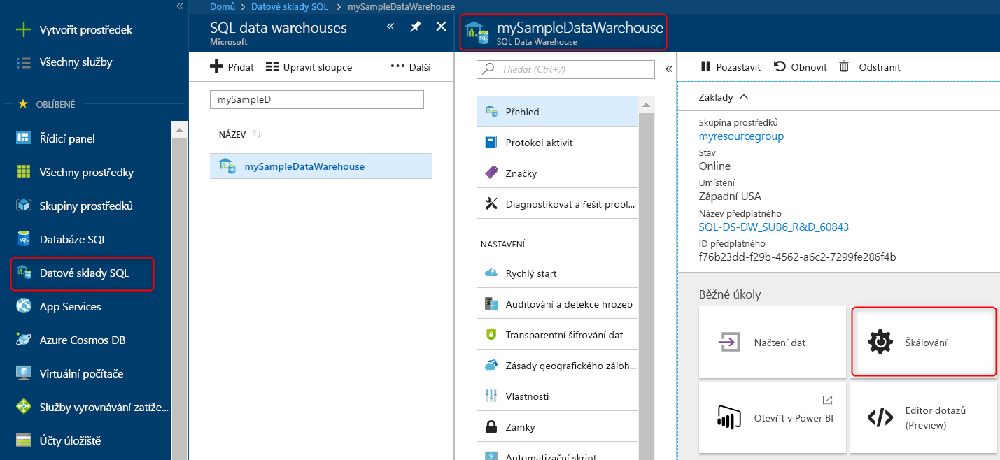

# Rychlý start: Škálujte kapacitu výpočetních prostředků ve službě Azure SQL Data Warehouse na webu Azure Portal

Škálujte kapacitu výpočetních prostředků ve službě Azure SQL Data Warehouse pomocí Azure Portalu. Kapacitu výpočetních prostředků můžete [horizontálně navýšit](sql-data-warehouse-manage-compute-overview.md), abyste získali lepší výkon, nebo snížit, abyste dosáhli nižších nákladů. 

Pokud ještě nemáte předplatné Azure, vytvořte si [bezplatný účet](https://azure.microsoft.com/free/) před tím, než začnete.

## Přihlášení k webu Azure Portal

Přihlaste se k webu [Azure Portal](https://portal.azure.com/).

## Před zahájením

Můžete škálovat datový sklad, který už máte, nebo pomocí postupu v článku [Rychlý start: Vytvoření a připojení – portál](create-data-warehouse-portal.md) vytvořit datový sklad s názvem **mySampleDataWarehouse**.  Tento rychlý start škáluje **mySampleDataWarehouse**.

## Škálování výpočetního výkonu

Ve službě SQL Data Warehouse můžete upravit počet jednotek datového skladu a zvýšit nebo snížit tak množství výpočetních prostředků. Podle postupu v článku [Vytvoření a připojení – portál](create-data-warehouse-portal.md) jste vytvořili **mySampleDataWarehouse** a inicializovali ho se 400 jednotkami datového skladu. V následujícím postupu upravíte jednotky datového skladu pro **mySampleDataWarehouse**.

Změna jednotek datového skladu:

1. Na webu Azure Portal klikněte vlevo na **Datové sklady SQL**.
2. Na stránce **Datové sklady SQLL** vyberte **mySampleDataWarehouse**. Otevře se datový sklad.
3. Klikněte na **Škálovat**.

    

2. Na panelu škálování přesuňte posuvník doleva nebo doprava. Tím změníte nastavení jednotek datového skladu.

    

3. Klikněte na **Uložit**. Zobrazí se potvrzovací zpráva. Kliknutím na **Ano** ji potvrďte nebo ji kliknutím na **Ne** zrušte.

    

## Další postup
Nyní už víte, jak škálovat výpočetní prostředky pro datový sklad. Další informace o službě Azure SQL Data Warehouse najdete v kurzu načítání dat.

> [!div class="nextstepaction"]
>[Načtení dat do datového skladu SQL](load-data-from-azure-blob-storage-using-polybase.md)
