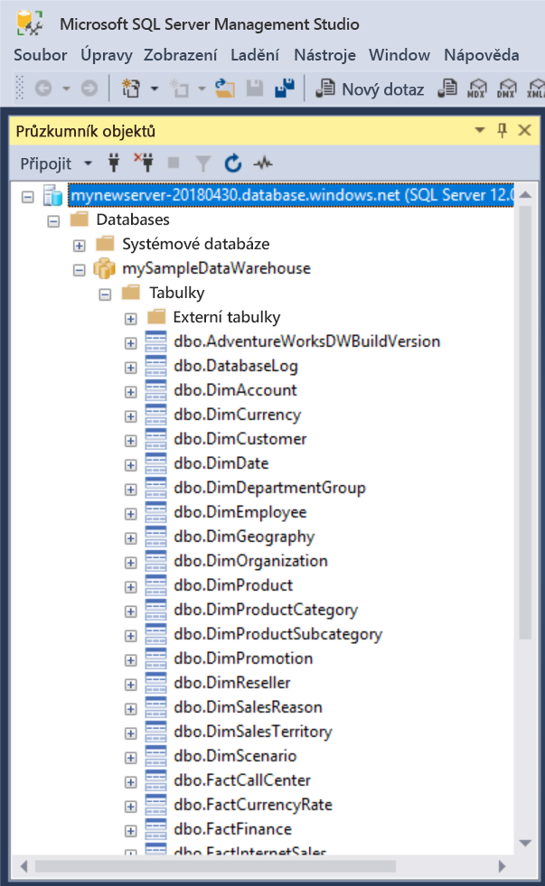
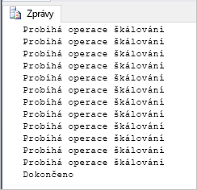

# <a name="quickstart-scale-compute-in-azure-sql-data-warehouse-using-t-sql"></a>Rychlý start: Škálování kapacity výpočetních prostředků ve službě Azure SQL Data Warehouse pomocí T-SQL

Pomocí T-SQL a aplikace SSMS (SQL Server Management Studio) můžete škálovat výpočetní prostředky ve službě Azure SQL Data Warehouse. Kapacitu výpočetních prostředků můžete [horizontálně navýšit](sql-data-warehouse-manage-compute-overview.md), abyste získali lepší výkon, nebo snížit, abyste dosáhli nižších nákladů. 

Pokud ještě nemáte předplatné Azure, vytvořte si [bezplatný účet](https://azure.microsoft.com/free/) před tím, než začnete.

## <a name="before-you-begin"></a>Než začnete

Stáhněte a nainstalujte nejnovější verzi aplikace [SQL Server Management Studio](/sql/ssms/download-sql-server-management-studio-ssms) (SSMS).
 
## <a name="create-a-data-warehouse"></a>Vytvoření datového skladu

Pomocí postupu v článku [Rychlý start: Vytvoření a připojení – portál](create-data-warehouse-portal.md) vytvořte datový sklad s názvem **mySampleDataWarehouse**. Dokončete rychlý start, abyste měli jistotu, že používáte pravidlo brány firewall a že se můžete připojit k datovému skladu z aplikace SQL Server Management Studio.

## <a name="connect-to-the-server-as-server-admin"></a>Připojení k serveru jako správce serveru

V této části se pomocí aplikace [SQL Server Management Studio](/sql/ssms/download-sql-server-management-studio-ssms) (SSMS) naváže připojení k serveru SQL Azure.

1. Otevřete SQL Server Management Studio.

2. V dialogovém okně **Připojení k serveru** zadejte následující informace:

   | Nastavení       | Navrhovaná hodnota | Popis | 
   | ------------ | ------------------ | ------------------------------------------------- | 
   | Typ serveru | Databázový stroj | Tato hodnota se vyžaduje. |
   | Název serveru | Plně kvalifikovaný název serveru | Tady je příklad: **mynewserver-20171113.database.windows.net**. |
   | Authentication | Ověřování SQL Serveru | Ověřování SQL je jediný typ ověřování, který se v tomto kurzu konfiguruje. |
   | Přihlásit | Účet správce serveru | Jedná se o účet, který jste zadali při vytváření serveru. |
   | Heslo | Heslo pro účet správce serveru | Jedná se o heslo, které jste zadali při vytváření serveru. |

    

4. Klikněte na **Připojit**. V aplikaci SSMS se otevře okno Průzkumníka objektů. 

5. V Průzkumníku objektů rozbalte **Databáze**. Pak rozbalte **mySampleDatabase** a zobrazte objekty v nové databázi.

     

## <a name="view-service-objective"></a>Zobrazení cíle služby
Nastavení cíle služby obsahuje množství jednotek datového skladu pro datový sklad. 

Pokud se chcete podívat na aktuální jednotky svého datového skladu, postupujte takto:

1. V části připojení k **mynewserver-20171113.database.windows.net** rozbalte uzel **Systémové databáze**.
2. Klikněte pravým tlačítkem na **hlavní větev** a vyberte **Nový dotaz**. Otevře se nové okno dotazu.
3. Spusťte následující dotaz pro výběr ze zobrazení dynamické správy sys.database_service_objectives. 

    ```sql
    SELECT
        db.name [Database]
    ,   ds.edition [Edition]
    ,   ds.service_objective [Service Objective]
    FROM
        sys.database_service_objectives ds
    JOIN
        sys.databases db ON ds.database_id = db.database_id
    WHERE 
        db.name = 'mySampleDataWarehouse'
    ```

4. Z následujících výsledků je zřejmé, že **mySampleDataWarehouse** má jako cíl služby DW400. 

    


## <a name="scale-compute"></a>Škálování výpočetního výkonu
Ve službě SQL Data Warehouse můžete upravit počet jednotek datového skladu a zvýšit nebo snížit tak množství výpočetních prostředků. Podle postupu v článku [Vytvoření a připojení – portál](create-data-warehouse-portal.md) jste vytvořili **mySampleDataWarehouse** a inicializovali ho se 400 jednotkami datového skladu. V následujícím postupu upravíte jednotky datového skladu pro **mySampleDataWarehouse**.

Změna jednotek datového skladu:

1. Klikněte pravým tlačítkem na **hlavní větev** a vyberte **Nový dotaz**.
2. Ke změně cíle služby použijte příkaz T-SQL [ALTER DATABASE](/sql/t-sql/statements/alter-database-azure-sql-database). Spusťte následující dotaz a změňte cíl služby na DW300. 

    ```Sql
    ALTER DATABASE mySampleDataWarehouse
    MODIFY (SERVICE_OBJECTIVE = 'DW300')
    ;
    ```

## <a name="monitor-scale-change-request"></a>Monitorování žádostí o změnu rozsahu
K zobrazení průběhu předchozí žádosti o změnu můžete použít syntaxi T-SQL `WAITFORDELAY` a dotázat se na stav dynamického zobrazení správy (DMV) sys.dm_operation_status.

Pokud se chcete dotázat na stav změny objektu služby:

1. Klikněte pravým tlačítkem na **hlavní větev** a vyberte **Nový dotaz**.
2. Spuštěním následujícího dotazu se dotážete na stav DMV sys.dm_operation_status.

    ```sql
    WHILE 
    (
        SELECT TOP 1 state_desc
        FROM sys.dm_operation_status
        WHERE 
            1=1
            AND resource_type_desc = 'Database'
            AND major_resource_id = 'MySampleDataWarehouse'
            AND operation = 'ALTER DATABASE'
        ORDER BY
            start_time DESC
    ) = 'IN_PROGRESS'
    BEGIN
        RAISERROR('Scale operation in progress',0,0) WITH NOWAIT;
        WAITFOR DELAY '00:00:05';
    END
    PRINT 'Complete';
    ```
3. Výsledný výstup zobrazuje protokol dotazování stavu.

    

## <a name="check-data-warehouse-state"></a>Kontrola stavu datového skladu

Když je datový sklad pozastavený, nemůžete se k němu připojit pomocí T-SQL. Pokud se chcete podívat na stav datového skladu, můžete použít powershellovou rutinu. Příklad najdete v části [Kontrola stavu datového skladu – PowerShell](quickstart-scale-compute-powershell.md#check-data-warehouse-state). 

## <a name="check-operation-status"></a>Kontrola stavu operace

Informace o různých operacích správy ve službě SQL Data Warehouse získáte po spuštění následujícího dotazu v zobrazení dynamické správy [sys.dm_operation_status](/sql/relational-databases/system-dynamic-management-views/sys-dm-operation-status-azure-sql-database). Vrátí se například operace a její stav, který bude IN_PROGRESS nebo COMPLETED.

```sql
SELECT *
FROM
    sys.dm_operation_status
WHERE
    resource_type_desc = 'Database'
AND 
    major_resource_id = 'MySampleDataWarehouse'
```


## <a name="next-steps"></a>Další kroky
Teď už víte, jak škálovat výpočetní prostředky pro datový sklad. Další informace o službě Azure SQL Data Warehouse najdete v kurzu načítání dat.

> [!div class="nextstepaction"]
>[Načtení dat do datového skladu SQL](load-data-from-azure-blob-storage-using-polybase.md)
