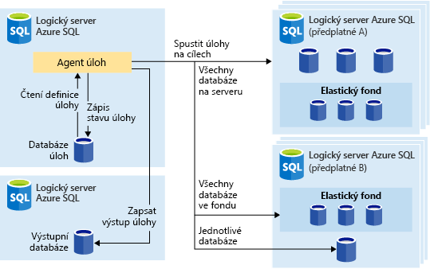
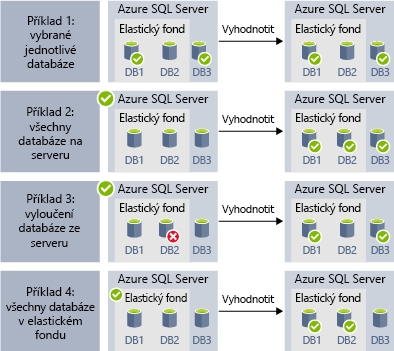
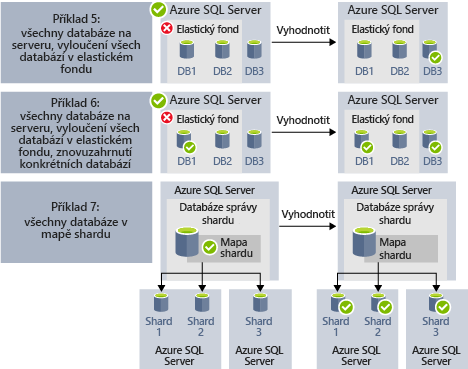
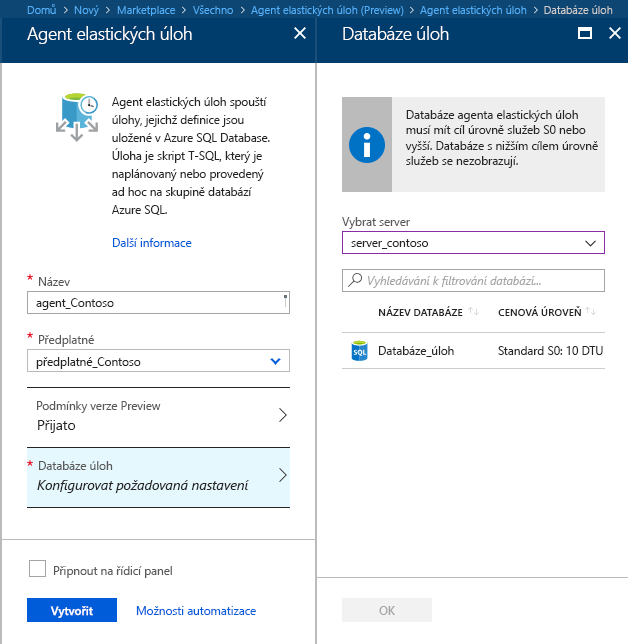
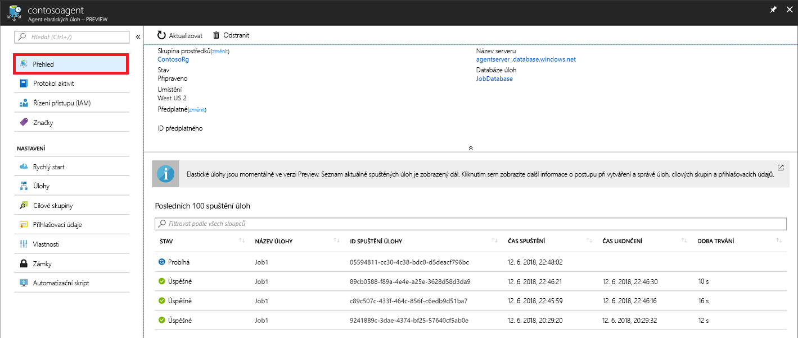
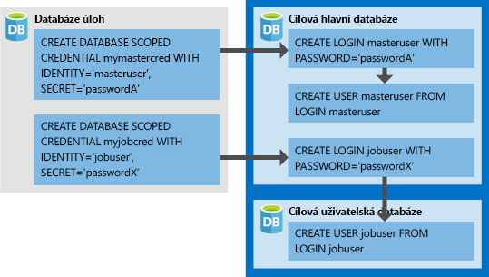

# <a name="manage-groups-of-databases-with-elastic-database-jobs"></a>Správa skupin databází pomocí úloh elastické databáze

**Úlohy elastické databáze** poskytují možnost paralelně spouštět jeden nebo několik skriptů T-SQL nad velkým počtem databází, a to podle plánu nebo na vyžádání.

**Spouštění úloh pro jakoukoli kombinací databází:** jedna nebo několik samostatných databází, všechny databáze na serveru, všechny databáze v elastickém fondu nebo mapa horizontálních oddílů s dodatečnou možností zahrnout nebo vyloučit jakoukoli konkrétní databázi. **Úlohy se můžou spouštět na více serverech, ve více fondech a dokonce i pro databáze v různých předplatných.** Servery a fondy se dynamicky zjišťují za běhu, takže se úlohy spouští pro všechny databáze, které existují v cílové skupině v době spuštění.

Následující obrázek ukazuje agenta úloh, který spouští úlohy napříč různými typy cílových skupin:




## <a name="why-use-elastic-jobs"></a>Proč používat elastické úlohy?

### <a name="manage-many-databases"></a>Správa mnoha databází

- Plánování spouštění úloh správy na každý den v týdnu, mimo pracovní dobu atd.
- Nasazování změn schématu, správa přihlašovacích údajů, shromažďování dat o výkonu nebo shromažďování telemetrických dat tenantů (zákazníků). Aktualizace referenčních dat (společné informace napříč všemi databázemi).
- Vylepšení výkonu dotazů díky opětovnému sestavení indexů. Konfigurace spouštění úloh pro kolekci databází nebo jejich opakovaného spouštění, například v době mimo špičku.
- Průběžné shromažďování výsledků dotazů ze sady databází do centrální tabulky. Výkonové dotazy je možné spouštět průběžně a nakonfigurovat tak, aby aktivovaly další úlohy, které se mají provést.

### <a name="collect-data-for-reporting"></a>Shromažďování dat pro účely generování sestav

- Agregace dat z kolekce databází Azure SQL do jedné cílové tabulky.
- Spouštění dlouhotrvajících dotazů na zpracování dat pro velkou sadu databází, například shromažďování telemetrických dat uživatelů. Výsledky se pro účely další analýzy shromažďují do jedné cílové tabulky.

### <a name="reduce-overhead"></a>Snížení režie

- Pokud chcete spouštět příkazy jazyka Transact-SQL nebo provádět jiné úlohy správy, za normálních okolností se musíte připojit ke každé databázi zvlášť. Úloha zajišťuje přihlášení ke každé databázi v cílové skupině. Můžete také definovat, spravovat a uchovávat skripty Transact-SQL, které se spustí pro skupinu databází Azure SQL.

### <a name="accounting"></a>Účetnictví

- Úlohy pro každou databázi protokolují stav spuštění. Pokud dojde k selhání, provedete se automatické opakování.

### <a name="flexibility"></a>Flexibilita

- Můžete definovat vlastní skupiny databází Azure SQL a plány spouštění úloh.


## <a name="elastic-job-components"></a>Komponenty elastických úloh

|Komponenta  | Popis (další podrobnosti jsou uvedené pod tabulkou) |
|---------|---------|
|[**Agent elastických úloh**](#elastic-job-agent) |  Prostředek Azure, který vytvoříte pro spouštění a správu úloh.   |
|[**Databáze úloh**](#job-database)    |    Databáze Azure SQL, do které agent úloh ukládá data související s úlohami, definice úloh atd.      |
|[**Cílová skupina**](#target-group)      |  Sada serverů, fondu, databází a map horizontálních oddílů, pro které se má úloha spustit.       |
|[**Úloha**](#job)  |  Úloha je pracovní jednotka, která se skládá z jednoho nebo několika [kroků úlohy](#job-step). Kroky úlohy určují skript T-SQL, který se má spustit, a také další podrobnosti potřebné ke spuštění skriptu.  |


### <a name="elastic-job-agent"></a>Agent elastických úloh

Agent elastických úloh je prostředek Azure určený k vytváření, spouštění a správě úloh. Agent elastických úloh je prostředek Azure, který vytvoříte na portálu (podporuje se také [PowerShell](elastic-jobs-powershell.md) a REST). 

K vytvoření **agenta elastických úloh** je potřeba existující databáze SQL. Agent nakonfiguruje tuto existující databázi jako [*databázi úloh*](#job-database).

Agent elastických úloh je bezplatný. Databáze úloh se účtuje stejnou sazbou jako jakákoli jiná databáze SQL.

### <a name="job-database"></a>Databáze úloh

*Databáze úloh* slouží k definování úloh a sledování stavu a historie spouštění úloh. *Databáze úloh* se používá také k ukládání metadat agenta, protokolů, výsledků a definic úloh. Navíc obsahuje řadu užitečných uložených procedur a dalších databázových objektů určených k vytváření, spouštění a správě úloh pomocí T-SQL.

V aktuální verzi Preview je k vytvoření agenta elastických úloh potřeba existující databáze Azure SQL (S0 nebo vyšší).

*Databáze úloh* nemusí být zcela nová, ale měla by být čistá, prázdná a s úrovní služby S0 nebo vyšší. Doporučená úroveň služby pro *databázi úloh* je S1 nebo vyšší, ale opravdu záleží na požadavcích vašich úloh na výkon: na počtu kroků úloh a na počtu a frekvenci spouštění úloh. Databáze S0 například může být dostatečná pro agenta úloh, který spouští několik úloh za hodinu. Při spouštění úlohy každou minutu by však výkon nemusel být dostačující a byla by lepší vyšší úroveň služby.


#### <a name="job-database-permissions"></a>Oprávnění k databázi úloh

Při vytváření agenta úloh se v *databázi úloh* vytvoří schéma, tabulky a role *jobs_reader*. Tato role se vytvoří s následujícími oprávněními a je určená k tomu, aby správcům poskytovala podrobnější řízení přístupu pro účely monitorování úloh:


|Název role  |Oprávnění ke schématu jobs  |Oprávnění ke schématu jobs_internal  |
|---------|---------|---------|
|**jobs_reader**     |    SELECT     |    Žádný     |

> [!IMPORTANT]
> Jako správce databáze zvažte před udělením přístupu k *databázi úloh* všechny bezpečnostní důsledky. Uživatel se zlými úmysly s oprávněními k vytváření nebo úpravě úloh by mohl vytvořit nebo upravit úlohu, která se pomocí uložených přihlašovacích údajů připojí k databázi pod jeho kontrolou a uživatel se zlými úmysly by tak mohl zjistit přihlašovací heslo.


### <a name="target-group"></a>Cílová skupina

*Cílová skupina* definuje sadu databází, pro které se provede určitý krok úlohy. Cílová skupina může obsahovat libovolný počet a kombinaci následujících položek:

- **Server SQL Azure** – pokud je zadaný server, součástí skupiny jsou všechny databáze existující na serveru v době spuštění úlohy. Je potřeba zadat přihlašovací údaje k hlavní databázi, aby se mohla skupina určit a aktualizovat před spuštěním úlohy.
- **Elastický fond** – pokud je zadaný elastický fond, součástí skupiny jsou všechny databáze, které jsou v elastickém fondu v době spuštění úlohy. Stejně jako u serveru je potřeba zadat přihlašovací údaje k hlavní databázi, aby se mohla skupina aktualizovat před spuštěním úlohy.
- **Izolovaná databáze** – zadejte jednu nebo několik samostatných databází, které mají být součástí skupiny.
- **Mapa horizontálních oddílů** – databáze mapy horizontálních oddílů.

> [!TIP]
> V okamžiku spuštění úlohy *dynamický výčet* znovu vyhodnotí sadu databází v cílových skupinách, které zahrnují servery nebo fondy. Dynamický výčet zajišťuje, že se **úlohy spustí pro všechny databáze, které existují na serveru nebo ve fondu v době spuštění úlohy**. Opětovné vyhodnocení seznamu databází za běhu je zejména užitečné pro scénáře, kdy se členství ve fondu nebo na serveru často mění.

Fondy a izolované databáze je možné zahrnout do skupiny nebo je z ní vyloučit. Díky tomu můžete vytvořit cílovou skupinu s jakoukoli kombinací databází. Do cílové skupiny například můžete přidat server, ale vyloučit z ní konkrétní databáze v elastickém fondu (nebo vyloučit celý fond).

Cílová skupina může obsahovat databáze v několika předplatných a v několika oblastech. Mějte na paměti, že spouštění napříč oblastmi má větší latenci než spouštění v rámci jedné oblasti.

Následující příklady ukazují, jak se při spuštění úlohy dynamicky zjišťují různé definice cílových skupin kvůli určení, které databáze úloha spustí:



**Příklad 1** ukazuje cílovou skupinu, která se skládá ze seznamu jednotlivých databází. Když se spustí krok úlohy s použitím této cílové skupiny, akce kroku úlohy se provede ve všech těchto databázích.<br>
**Příklad 2** ukazuje cílovou skupinu, která jako cíl obsahuje Azure SQL Server. Když se spustí krok úlohy s použitím této cílové skupiny, automaticky se zjistí server a určí se seznam databází, které se aktuálně na serveru nacházejí. Akce kroku úlohy se provede ve všech těchto databázích.<br>
**Příklad 3** ukazuje podobnou cílovou skupinu jako *příklad 2*, ale s jednou výslovně vyloučenou databází. Akce kroku úlohy se ve vyloučené databázi *neprovede*.<br>
**Příklad 4** ukazuje cílovou skupinu, která jako cíl obsahuje elastický fond. Podobně jako v *příkladu 2* se fond automaticky zjistí za běhu úlohy a určí se seznam databází ve fondu.
<br><br>




**Příklad 5** a *příklad 6* ukazují pokročilé scénáře, kdy je možné pomocí pravidel zahrnutí a vyloučení kombinovat Azure SQL Servery, elastické fondy a databáze.<br>
**Příklad 7** ukazuje, že za běhu úlohy je možné vyhodnotit také horizontální oddíly v mapě horizontálních oddílů.

### <a name="job"></a>Úloha

*Úloha* je pracovní jednotka, která se spouští podle plánu nebo jako jednorázová úloha. Úloha se skládá z jednoho nebo několika *kroků úlohy*.

#### <a name="job-step"></a>Krok úlohy

Každý krok úlohy určuje skript T-SQL, který se má spustit, jednu nebo několik cílových skupin, pro které se má skript T-SQL spustit, a přihlašovací údaje, které agent úloh potřebuje k připojení k cílové databázi. Každý krok úlohy má přizpůsobitelný časový limit a zásady opakování a volitelně může určovat výstupní parametry.

#### <a name="job-output"></a>Výstup úlohy

Výstupy kroků úloh pro každou cílovou databázi se podrobně zaznamenávají a výstup skriptu je možné zachytávat do určené tabulky. Můžete určit databázi, do které se budou ukládat všechna data vrácená z úlohy.

#### <a name="job-history"></a>Historie úlohy

Historie spouštění úloh se ukládá do *databáze úloh*. Úloha vyčištění systému vyprázdní historii spouštění starší než 45 dnů. Pokud chcete odebrat historii mladší než 45 dnů, zavolejte v *databázi úloh* uloženou proceduru **sp_purge_history**.

## <a name="workflow-to-create-configure-and-manage-jobs"></a>Pracovní postup vytváření, konfigurace a správy úloh

### <a name="create-and-configure-the-agent"></a>Vytvoření a konfigurace agenta

1. Vytvořte nebo určete prázdnou databázi SQL S0 nebo vyšší. Tato databáze se použije jako *databáze úloh* při vytváření agenta elastických úloh.
2. Na [portálu](https://portal.azure.com/#create/Microsoft.SQLElasticJobAgent) nebo pomocí [PowerShellu](elastic-jobs-powershell.md#create-the-elastic-job-agent) vytvořte agenta elastických úloh.

   

### <a name="create-run-and-manage-jobs"></a>Vytváření, spouštění a správa úloh

1. Pomocí [PowerShellu](elastic-jobs-powershell.md#create-job-credentials-so-that-jobs-can-execute-scripts-on-its-targets) nebo [T-SQL](elastic-jobs-tsql.md#create-a-credential-for-job-execution) vytvořte přihlašovací údaje pro spouštění úloh v *databázi úloh*.
2. Pomocí [PowerShellu](elastic-jobs-powershell.md#define-the-target-databases-you-want-to-run-the-job-against) nebo [T-SQL](elastic-jobs-tsql.md#create-a-target-group-servers) definujte cílovou skupinu (databáze, pro které chcete úlohu spouštět).
3. V každé databázi, ve které se bude úloha spouštět, vytvořte přihlašovací údaje agenta úloh [(do každé databáze ve skupině přidejte příslušného uživatele nebo roli)](https://docs.microsoft.com/azure/sql-database/sql-database-control-access). Příklad najdete v [kurzu pro PowerShell](elastic-jobs-powershell.md#create-job-credentials-so-that-jobs-can-execute-scripts-on-its-targets).
4. Pomocí [PowerShellu](elastic-jobs-powershell.md#create-a-job) nebo [T-SQL](elastic-jobs-tsql.md#deploy-new-schema-to-many-databases) vytvořte úlohu.
5. Pomocí [PowerShellu](elastic-jobs-powershell.md#create-a-job-step) nebo [T-SQL](elastic-jobs-tsql.md#deploy-new-schema-to-many-databases) přidejte kroky úlohy.
6. Pomocí [PowerShellu](elastic-jobs-powershell.md#run-the-job) nebo [T-SQL](elastic-jobs-tsql.md#begin-ad-hoc-execution-of-a-job) spusťte úlohu.
7. Pomocí portálu, [PowerShellu](elastic-jobs-powershell.md#monitor-status-of-job-executions) nebo [T-SQL](elastic-jobs-tsql.md#monitor-job-execution-status) monitorujte stav provádění úlohy.

   

## <a name="credentials-for-running-jobs"></a>Přihlašovací údaje pro spouštění úloh

Úlohy se při spuštění připojují k databázím určeným cílovou skupinou pomocí [přihlašovacích údajů v oboru databáze](/sql/t-sql/statements/create-database-scoped-credential-transact-sql). Pokud cílová skupina obsahuje servery nebo fondy, použijí se tyto přihlašovací údaje v oboru databáze k připojení k hlavní databázi a výčtu dostupných databází.

Nastavení správných přihlašovacích údajů pro spuštění úlohy může být trochu matoucí, proto mějte na paměti následující body:

- Přihlašovací údaje v oboru databáze se musí vytvořit v *databázi úloh*.
- **Všechny cílové databáze musí mít přihlašovací účet s [dostatečnými oprávněními](https://docs.microsoft.com/sql/relational-databases/security/permissions-database-engine) pro úspěšné dokončení úlohy** (v následujícím diagramu je to jobuser).
- Předpokládá se, že se přihlašovací údaje budou používat opakovaně v různých úlohách a že jsou přihlašovací hesla šifrovaná a zabezpečená před uživateli, kteří mají k objektům úloh přístup jen pro čtení.

Následující obrázek by vám měl pomoct porozumět přihlašovacím údajům úloh a správně je nastavit. **Nezapomeňte vytvořit příslušného uživatele v každé databázi (ve všech *cílových uživatelských databázích*), ve které se má úloha spouštět**.



## <a name="security-best-practices"></a>Osvědčené postupy zabezpečení

Tady je několik osvědčených postupů, které byste při práci s elastickými úlohami měli brát v úvahu:

- Omezte možnost používat rozhraní API na důvěryhodné osoby.
- Přihlašovací údaje by měly mít nejnižší úroveň oprávnění nezbytnou k provedení daného kroku úlohy. Další informace najdete v tématu [Autorizace a oprávnění v SQL Serveru](https://docs.microsoft.com/dotnet/framework/data/adonet/sql/authorization-and-permissions-in-sql-server).
- Pokud jako člena cílové skupiny používáte server nebo fond, důrazně se doporučuje vytvořit v hlavní databázi samostatné přihlašovací údaje s oprávněními k zobrazení a výpisu databází, které se před spuštěním úlohy použijí k rozbalení seznamů databází serverů nebo fondů.


## <a name="agent-performance-capacity-and-limitations"></a>Výkon, kapacita a omezení agenta

Elastické úlohy při čekání na dokončení dlouhotrvajících úloh využívají minimum výpočetních prostředků.

V závislosti na velikosti cílové skupiny databází a požadované době spuštění úlohy (počet souběžných pracovních procesů) vyžaduje agent pro *databázi úloh* různé úrovně výpočetních prostředků a výkonu (čím je více cílů a úloh, tím je potřeba více výpočetních prostředků).

V současné době je verze Preview omezená na 100 souběžných úloh.

### <a name="prevent-jobs-from-reducing-target-database-performance"></a>Zabránění snižování výkonu cílových databází úlohami

Pokud chcete zajistit, aby při spouštění úloh pro databáze v elastickém fondu SQL nedocházelo k přetížení prostředků, můžete pro úlohy nakonfigurovat omezení počtu databází, pro které se můžou najednou spouštět.

##  <a name="differences-between-elastic-jobs-and-sql-server-agent"></a>Rozdíly mezi elastickými úlohami a agentem SQL Serveru

Je vhodné uvést několik rozdílů mezi agentem SQL Serveru (k dispozici v místním prostředí a jako součást MI) a agentem elastických úloh Azure SQL Database (nyní k dispozici pro služby SQL Database a SQL Data Warehouse).


|  |Elastické úlohy  |Agent SQL Server |
|---------|---------|---------|
|Rozsah     |  Libovolný počet databází Azure SQL nebo datových skladů ve stejném cloudu Azure jako agent úloh. Cíle můžou být na různých logických serverech a v různých oblastech nebo umístěních. <br><br>Cílové skupiny se můžou skládat z jednotlivých databází nebo datových skladů nebo ze všech databází na serveru, ve fondu nebo v mapě horizontálních oddílů (dynamicky se zjišťují za běhu úlohy). | Libovolná izolovaná databáze ve stejné instanci SQL Serveru jako agent SQL. |
|Podporovaná rozhraní API a nástroje     |  Portál, PowerShell, T-SQL, Azure Resource Manager      |   T-SQL, SQL Server Management Studio (SSMS)     |


## <a name="best-practices-for-creating-jobs"></a>Osvědčené postupy pro vytváření úloh

### <a name="idempotent-scripts"></a>Idempotentní skripty
Skripty T-SQL úlohy musí být [idempotentní](https://en.wikipedia.org/wiki/Idempotence). **Idempotentní** znamená, že pokud se skript úspěšně provedete a spustí se znovu, výsledek bude stejný. Skript může selhat kvůli přechodným problémům se sítí. V takovém případě se úloha automaticky pokusí znovu skript spustit tolikrát, kolikrát je uvedeno v předvolbách, a pak přestane. Výsledek idempotentního skriptu je stejný, i když se úspěšně spustí dvakrát (nebo vícekrát).

Jednoduchou taktikou je před vytvořením objektu otestovat, jestli už neexistuje.


```sql
IF NOT EXIST (some_object)
    -- Create the object
    -- If it exists, drop the object before recreating it.
```

Skript se také musí být schopný úspěšně provést. Dosáhne toho tím, že logicky testuje podmínky a reaguje na případné podmínky, které najde.


## <a name="next-steps"></a>Další kroky

- [Vytváření a správa elastických úloh s využitím PowerShellu](elastic-jobs-powershell.md)
- [Vytváření a správa elastických úloh pomocí Transact-SQL (T-SQL)](elastic-jobs-tsql.md)